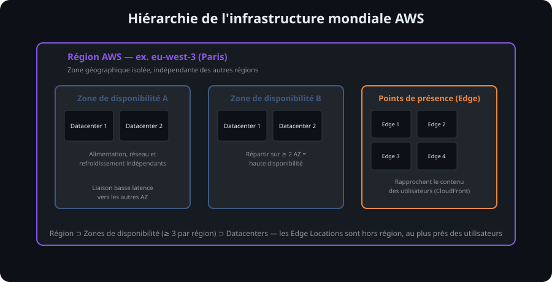

# 6. Présentation d'AWS et de son écosystème

<nav class="page-sequence"><a href="../../cours/chapitre-1/virtualisation-conteneurs">Pr&eacute;c&eacute;dent</a> <a href="../../cours/chapitre-1/">Sommaire</a> <a href="../../cours/chapitre-1/well-architected">Suivant</a></nav>

### 6.1 Vue d'ensemble

**Amazon Web Services (AWS)** est l'un des principaux fournisseurs mondiaux de cloud public.
Lancé en 2006, AWS est une filiale d'Amazon qui propose une **plateforme Cloud complète** couvrant :

- L'infrastructure (serveurs, stockage, réseau),
- Les plateformes de développement et déploiement applicatif,
- Les services managés et serverless,
- L'intelligence artificielle, la data et l'IoT.

AWS est présent dans la quasi-totalité des secteurs d'activité : industrie, banque, administration publique, éducation, santé, etc.

📎 [Site officiel AWS](https://aws.amazon.com/)
📎 [AWS Overview Documentation](https://docs.aws.amazon.com/whitepapers/latest/aws-overview/introduction.html)

### 6.2 Les applications dans les offres Cloud

AWS n'est pas seulement une plateforme d'infrastructure : c'est aussi un **écosystème d'applications et de solutions métiers**.

Quelques exemples typiques :
- **Hébergement web et API** : via Amazon EC2, Elastic Beanstalk ou Lightsail.
- **Stockage et sauvegarde** : avec S3, EBS et Glacier.
- **Analyse de données** : grâce à Redshift et Athena.
- **Sécurité et conformité** : via IAM, CloudTrail et Security Hub.

Ces briques sont interconnectées.
Une **application complète AWS** s'appuie généralement sur plusieurs de ces services, orchestrés ensemble pour offrir disponibilité, sécurité et performance.

### 6.3 Les principaux acteurs du marché du Cloud

Le Cloud Computing est un marché concurrentiel dominé par **trois géants**, avec quelques acteurs spécialisés ou souverains :

#### Panorama comparatif simplifié

Avant de décortiquer AWS, il est utile de comprendre son positionnement face à ses concurrents principaux.

| Fournisseur | Origine | Points forts | Contexte d'utilisation | Position sur le marché |
|-------------|---------|-------------|------------------------|----------------------|
| **AWS** | Amazon (2006) | Catalogue étendu, écosystème, documentation et communauté | Organisations de toutes tailles | Fournisseur de cloud public généraliste |
| **Microsoft Azure** | Microsoft (2010) | Intégration avec l'écosystème Microsoft et services hybrides | Organisations utilisant déjà les technologies Microsoft | Fournisseur de cloud public généraliste |
| **Google Cloud Platform (GCP)** | Google (2008) | Services de données, d'analyse et d'intelligence artificielle | Applications, données et apprentissage automatique | Fournisseur de cloud public généraliste |
| **OpenStack** (Open Source) | Communauté | Infrastructure privée, totale maîtrise, coût réduit | Cloud privé, institutions académiques, hébergeurs | Marché de niche |
| **OVHcloud** (Européen) | OVH (France) | Souveraineté données EU, prix compétitifs | PME EU, données sensibles, RGPD stricte | Marché de niche EU |
| **IBM Cloud, Oracle Cloud** | IBM / Oracle | Spécialisés (IA, bases données massives) | Grandes entreprises, solutions legacy | Marché de niche |

#### Comparatif détaillé : AWS vs Azure vs GCP

| Aspect | AWS | Azure | GCP |
|--------|-----|-------|-----|
| **Étendue du catalogue** | Calcul, réseau, données, sécurité, IA et exploitation | Calcul, réseau, données, sécurité, IA et exploitation | Calcul, réseau, données, sécurité, IA et exploitation |
| **Services de calcul** | EC2, Lambda, Fargate | VMs, App Services, AKS | Compute Engine, Cloud Functions |
| **Bases de données** | RDS, DynamoDB, Aurora | SQL Database, Cosmos DB | Cloud SQL, Firestore |
| **Données et IA** | SageMaker, Glue | Azure ML, Synapse | BigQuery, Vertex AI ⭐ |
| **Implantation** | Infrastructure mondiale organisée en régions et zones | Infrastructure mondiale organisée en régions et zones | Infrastructure mondiale organisée en régions et zones |
| **Matériel propriétaire** | AWS Nitro | Optimisé | Processeurs TPU (IA) |
| **Force communautaire** | Très forte | Forte (corporations) | Croissante (startups) |
| **Apprentissage** | Dépend des services et du rôle étudiés | Facilités possibles pour les équipes Microsoft | Facilités possibles pour les équipes data et Google Cloud |
| **Certifications** | Cloud Practitioner, CloudOps Engineer, Solutions Architect | AZ-900, AZ-104 | Cloud Digital Leader, Associate Cloud Engineer, Professional |

**Ce que signifient les lignes moins évidentes de ce tableau :**

- **Matériel propriétaire** : chaque fournisseur a développé du matériel sur mesure pour ses data centers plutôt que d'utiliser des composants standards du marché. **AWS Nitro** (déjà présenté en section 5.2 de ce chapitre) est un système matériel et logiciel conçu par AWS qui décharge la virtualisation, le réseau et la sécurité du CPU principal du serveur physique — cela signifie que quasiment 100 % de la puissance de la machine physique est disponible pour vos instances EC2, au lieu qu'une partie soit consommée par l'hyperviseur lui-même. Chez GCP, les **TPU (Tensor Processing Units)** sont des puces conçues spécifiquement pour accélérer les calculs de machine learning (entraînement et inférence de modèles d'IA) — un TPU va beaucoup plus vite qu'un CPU classique sur ce type de calcul précis, mais ne sert à rien pour un usage généraliste.
- **Force communautaire** : désigne le volume et l'activité de la communauté d'utilisateurs autour du fournisseur — tutoriels, forums (Stack Overflow, Reddit), projets open source, meetups. Plus cette communauté est active, plus il est facile de trouver de l'aide en cas de blocage. AWS bénéficie ici de son avance historique (premier arrivé en 2006) : davantage de contenus accumulés sur près de 20 ans.
- **Apprentissage** : la courbe d'apprentissage dépend du rôle, des services étudiés et des compétences existantes. Une équipe déjà familière de l'écosystème Microsoft, Google ou AWS peut retrouver plus rapidement certains concepts, sans que cela rende un fournisseur objectivement plus simple dans tous les contextes.
- **Certifications** : chaque fournisseur a son propre parcours de certification, avec des noms et des codes différents mais un principe similaire (un premier niveau généraliste, puis des spécialisations). Côté Azure, **AZ-900** est la certification fondamentale (équivalent du AWS Cloud Practitioner) et **AZ-104** la certification Administrator Associate (gestion quotidienne des ressources Azure, équivalent du AWS SysOps). Les certifications AWS sont détaillées à la section 1.3 de ce chapitre.

#### Pourquoi les organisations comparent-elles plusieurs fournisseurs ?

La comparaison doit partir des contraintes techniques et organisationnelles :

1. services disponibles dans les régions nécessaires ;
2. compétences déjà présentes dans l'organisation ;
3. intégration avec l'identité, le réseau et les outils existants ;
4. conformité, support, réversibilité et structure de coûts ;
5. dépendance acceptable envers des services propriétaires.

Les parts de marché varient selon la source, la période et le périmètre mesuré. Elles ne constituent pas, à elles seules, un critère d'architecture.

#### Solutions open source

Enfin, une mention importante : **OpenStack**.

OpenStack est une plateforme **open source complète** qui permet à toute organisation de **construire son propre cloud privé**, sans dépendre d'un fournisseur unique. Elle est utilisée par :
- Universités et instituts de recherche
- Gouvernements (souveraineté)
- Hébergeurs et fournisseurs de services cloud alternatifs
- Organisations ayant besoin de total contrôle

OpenStack ne joue pas sur le même terrain qu'AWS/Azure/GCP (qui sont des services managés) — c'est une brique technologique que vous installez et maintenez vous-même.

📎 [Gartner Magic Quadrant 2024 – Cloud Infrastructure and Platform Services](https://www.gartner.com/en/documents)

### 6.4 L'infrastructure mondiale d'AWS

**Lecture du schéma.** Une région est le périmètre géographique sélectionné pour de nombreux services. Elle contient plusieurs zones de disponibilité isolées les unes des autres. Un point de présence sert notamment à rapprocher certains services des utilisateurs ; ce n'est ni une région ni une zone dans laquelle on déploie arbitrairement les mêmes ressources.

Le schéma suivant part d'une requête utilisateur et montre pourquoi une région ne suffit pas, à elle seule, à garantir la disponibilité. Le trafic doit être distribué vers plusieurs zones indépendantes et les ressources zonales doivent réellement être dupliquées.

Les trois AZ appartiennent à la même région et communiquent par le réseau régional AWS, mais constituent des domaines de défaillance distincts. Déployer une instance dans `eu-west-3a` et une base uniquement dans cette même AZ reste une architecture mono-AZ, même si la région en propose trois.

L'un des piliers majeurs d'AWS est son **infrastructure mondiale** extrêmement étendue et redondée.
Elle est structurée en trois grandes composantes :

#### 1. Régions AWS (Regions)

- Une *région* est une zone géographique physique (exemple : `eu-west-3` pour Paris).
- Chaque région contient plusieurs datacenters appelés Zones de disponibilité (AZ).
- Les services AWS sont déployés par région et choisis par l'utilisateur.

#### 2. Zones de disponibilité (Availability Zones - AZ)

- Une AZ correspond à un ou plusieurs datacenters indépendants reliés entre eux par des liens à très faible latence.
- Les AZ sont conçues pour **garantir la haute disponibilité** et **la tolérance aux pannes**.

#### 3. Points de présence (Edge Locations)

- Répartis dans le monde entier, ils permettent d'accélérer la diffusion de contenu et d'optimiser les performances réseau via des services comme **Amazon CloudFront** (réseau de diffusion de contenu — CDN).

#### Vidéo explicative : infrastructure AWS

<iframe width="560" height="315" src="https://www.youtube.com/embed/TFxSjn8AHi8?si=jCQPMlT4-X9HT7Ip" title="YouTube video player" frameborder="0" allow="accelerometer; autoplay; clipboard-write; encrypted-media; gyroscope; picture-in-picture; web-share" referrerpolicy="strict-origin-when-cross-origin" allowfullscreen></iframe>

Retenons que le concept de *région* et de *localisation géographique des données* est souvent déterminant pour des raisons légales et de performance.

### 6.5 Principes de tarification AWS

L'un des aspects stratégiques de l'adoption du Cloud est la **tarification à l'usage**.
AWS applique un modèle de facturation souple et transparent basé sur la consommation réelle.

#### Principes clés :

- **Pay-as-you-go** : paiement en fonction de l'utilisation réelle des ressources.
- **Sans engagement initial** : pas de coût d'entrée, contrairement au modèle CAPEX.
- **Économies d'échelle** : les tarifs peuvent diminuer avec l'usage.
- **Facturation par service** : chaque service (EC2, S3, RDS…) est facturé séparément selon ses métriques propres.

Selon le service et l'engagement pris, plusieurs modes de tarification existent — à la demande, instances réservées, Savings Plans, Spot Instances. Le Chapitre 3 détaille chacun de ces modes avec des cas métier chiffrés, au moment où vous configurerez vos premières instances EC2.

📎 [AWS Pricing Overview](https://aws.amazon.com/pricing/)
📎 [AWS Pricing Calculator](https://calculator.aws/)

---

<nav class="page-sequence"><a href="../../cours/chapitre-1/virtualisation-conteneurs">Pr&eacute;c&eacute;dent</a> <a href="../../cours/chapitre-1/">Sommaire</a> <a href="../../cours/chapitre-1/well-architected">Suivant</a></nav>
