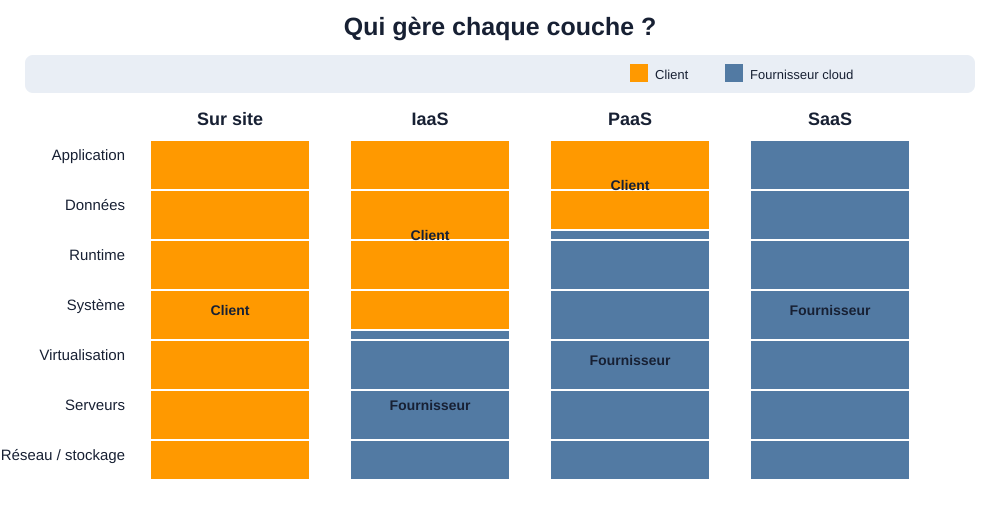

# 3. Modèles de services : IaaS, PaaS et SaaS

<nav class="page-sequence"><a href="../../cours/chapitre-1/fondamentaux-cloud">Pr&eacute;c&eacute;dent</a> <a href="../../cours/chapitre-1/">Sommaire</a> <a href="../../cours/chapitre-1/modeles-deploiement">Suivant</a></nav>

**Lecture du schéma.** De gauche à droite, le fournisseur prend en charge davantage de couches. Le client conserve néanmoins la responsabilité de ses données, de ses identités, de ses configurations et de la manière dont il utilise le service. Le schéma décrit une répartition générale : le contrat précis dépend du service choisi.

Les modèles de services sont essentiels pour comprendre **comment les entreprises consomment le Cloud**.
Ils structurent les **couches techniques** (infrastructure, plateforme, application) et déterminent qui — du client ou du fournisseur — est responsable de chaque couche.

📎 [AWS Cloud Service Models](https://aws.amazon.com/types-of-cloud-computing/)

Ces modèles sont une clé de lecture indispensable pour architecturer correctement une solution Cloud.

### 3.1 Infrastructure as a Service (IaaS)

**Infrastructure as a Service (IaaS)** désigne un modèle dans lequel le fournisseur met à disposition des ressources informatiques de base : **puissance de calcul**, **stockage**, **réseau** et **sécurité**.
Le client gère et configure ces ressources selon ses besoins.

#### Caractéristiques clés :

- Accès à des **machines virtuelles** configurables.
- Gestion des disques, du réseau et de la sécurité.
- Contrôle total sur l'OS et les applications.
- Évolutivité à la demande.

#### Exemples AWS :

- **Amazon EC2 (Elastic Compute Cloud)** : service qui permet de créer et gérer des machines virtuelles dans le Cloud.
- **Amazon EBS (Elastic Block Store)** : stockage en mode bloc attaché aux instances EC2.
- **Amazon VPC (Virtual Private Cloud)** : réseau virtuel isolé et configurable.
- **Elastic Load Balancing (ELB)** : répartition automatique du trafic entre plusieurs ressources.

**Analogie** : L'IaaS est comparable à la location d'un terrain pour construire une maison — le client choisit tout, mais doit aussi tout gérer.

### 3.2 Platform as a Service (PaaS)

**Platform as a Service (PaaS)** décharge le client de la gestion de l'infrastructure et du système d'exploitation.
Le fournisseur gère les couches basses, le client se concentre sur le développement et la mise en production.

#### Caractéristiques clés :

- Pas de gestion des serveurs ni de patching système.
- Environnements prêts à l'emploi pour le déploiement applicatif.
- Scalabilité intégrée.

#### Exemples AWS :

- **AWS Elastic Beanstalk** : service de déploiement et d'orchestration d'applications Web.
- **AWS Lambda** : service serverless qui exécute du code sans gérer de serveur.
- **Amazon RDS (Relational Database Service)** : base de données relationnelle gérée (patchs, sauvegardes, monitoring automatisés).

📎 [Documentation AWS Elastic Beanstalk](https://docs.aws.amazon.com/elasticbeanstalk)

Le PaaS permet de **réduire la charge opérationnelle** et d'accélérer les cycles de développement.

### 3.3 Software as a Service (SaaS)

**Software as a Service (SaaS)** est un modèle dans lequel le fournisseur gère toute la pile technique — infrastructure, plateforme et application — et livre un service clé en main.

#### Caractéristiques clés :

- Aucune gestion technique côté client.
- Accès via un navigateur ou une API.
- Maintenance et sécurité assurées par le fournisseur.

#### Exemples AWS :

- **AWS WorkMail** : service de messagerie hébergée.
- **Salesforce** : CRM en ligne.
- **Microsoft 365**, **Google Workspace** : solutions collaboratives.

📎 [Software as a Service sur AWS](https://aws.amazon.com/saas/)

Retenons les cas d'usage typiques du SaaS — messagerie, CRM, outils de collaboration, ERP.

### 3.4 Comparatif synthétique des modèles

| Élément | IaaS | PaaS | SaaS |
|--------|------|------|------|
| **Flexibilité** | Très élevée | Moyenne | Faible |
| **Temps de déploiement** | Plus long | Rapide | Instantané |
| **Cas d'usage typique** | Migration, environnements complexes | Déploiements rapides, automatisation | Solutions métiers clés en main |

---

<nav class="page-sequence"><a href="../../cours/chapitre-1/fondamentaux-cloud">Pr&eacute;c&eacute;dent</a> <a href="../../cours/chapitre-1/">Sommaire</a> <a href="../../cours/chapitre-1/modeles-deploiement">Suivant</a></nav>
