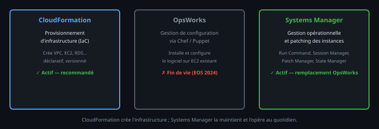

# 4. AWS Systems Manager — Automatisation opérationnelle

<nav class="page-sequence"><a href="cours/chapitre-5/cloudformation">Pr&eacute;c&eacute;dent</a> <a href="cours/chapitre-5/index">Sommaire</a> <a href="cours/chapitre-5/beanstalk">Suivant</a></nav>

### 4.1 Qu'est-ce que Systems Manager ?

**AWS Systems Manager (SSM)** est un service d'**administration centralisée** et d'**automatisation opérationnelle** pour les ressources AWS et hybrides.

Il remplace le service obsolète **OpsWorks** et fournit des outils modernes pour :

- Exécuter des **scripts à distance** sur des instances EC2 (**Run Command**)
- **Patcher** automatiquement les systèmes (**Patch Manager**)
- Stocker des **configurations centralisées** (**Parameter Store**)
- Automatiser des **tâches complexes** (**Automation Documents**)
- Collectionner un **inventaire** de toutes les ressources (**Inventory**)

```text
Analogie : Systems Manager est comme un TABLEAU DE CONTRÔLE À DISTANCE

Avant (sans SSM) :
  Admin doit se connecter à chaque serveur manuellement :
    ssh ubuntu@10.0.1.100
    ssh ubuntu@10.0.1.101
    ssh ubuntu@10.0.1.102
    ... exécuter la même commande 100 fois

Avec Systems Manager Run Command :
  Admin exécute UNE SEULE commande :
    aws ssm send-command --document-name "AWS-RunShellScript" \
                          --parameters commands=["apt-get update"]
  → Appliquée automatiquement à 100 instances simultaneously
```

---

### 4.2 Fonctionnalités clés de Systems Manager

#### Run Command — Exécuter des scripts à distance

**Run Command** permet d'exécuter des scripts sans accès SSH direct.

**Prérequis** :
- Instance EC2 doit avoir le rôle IAM `AmazonSSMManagedInstanceCore`
- L'agent SSM est pré-installé sur les AMI récentes

```bash
# Exemple : Installer Apache HTTP Server sur 5 instances
aws ssm send-command \
  --instance-ids i-12345 i-67890 i-abcde i-fghij i-klmno \
  --document-name "AWS-RunShellScript" \
  --parameters 'commands=[
    "apt-get update",
    "apt-get install -y apache2",
    "systemctl start apache2",
    "systemctl enable apache2"
  ]'

# Résultat : les 5 instances exécutent les commandes EN PARALLÈLE
# Voir les résultats dans CloudWatch Logs ou via CLI :
aws ssm get-command-invocation \
  --command-id <command-id> \
  --instance-id i-12345
```

:::success
**Résultat attendu :**
```json
# send-command :
{
    "Command": {
        "CommandId": "a1b2c3d4-e5f6-7890-abcd-ef1234567890",
        "DocumentName": "AWS-RunShellScript",
        "Status": "Pending",
        "TargetCount": 5,
        "CompletedCount": 0
    }
}

# get-command-invocation (après exécution) :
{
    "CommandId": "a1b2c3d4-e5f6-7890-abcd-ef1234567890",
    "InstanceId": "i-12345",
    "Status": "Success",
    "StatusDetails": "Success",
    "StandardOutputContent": "Reading package lists...\nBuilding dependency tree...\nThe following NEW packages will be installed: apache2\nSetting up apache2 (2.4.52-1ubuntu4)...\n",
    "StandardErrorContent": ""
}
```
:::

> **Résultat attendu :** `send-command` retourne un `CommandId`. `get-command-invocation` affiche le `Status` (`InProgress` → `Success`) et les `StandardOutputContent` avec la sortie de chaque commande exécutée sur l'instance.

---

#### Parameter Store — Stocker des configurations centralisées

**Parameter Store** permet de stocker des variables (secrets, chemins d'accès, configurations) de manière centralisée. L'avantage clé : vos applications lisent leurs secrets via l'API SSM, sans jamais avoir de valeur en clair dans le code ou un fichier `.env`.

```bash
# Stocker un secret (ex. mot de passe database)
aws ssm put-parameter \
  --name /prod/database/password \
  --value '<VALEUR_SECRETE_NON_VERSIONNEE>' \
  --type "SecureString" \
  --description "Mot de passe RDS pour production"

# Récupérer la valeur dans une application
aws ssm get-parameter \
  --name /prod/database/password \
  --with-decryption

# Stocker une configuration simple
aws ssm put-parameter \
  --name /app/api-url \
  --value "https://api.example.com" \
  --type "String"
```

:::success
**Résultat attendu :**
```json
# put-parameter :
{
    "Version": 1,
    "Tier": "Standard"
}

# get-parameter (avec --with-decryption) :
{
    "Parameter": {
        "Name": "/prod/database/password",
        "Type": "SecureString",
        "Value": "<valeur déchiffrée masquée dans le support>",
        "Version": 1,
        "LastModifiedDate": "2026-03-24T10:00:00.000Z",
        "ARN": "arn:aws:ssm:eu-west-3:123456789012:parameter/prod/database/password",
        "DataType": "text"
    }
}
```
:::

> **Résultat attendu :** `put-parameter` retourne un numéro de version (`"Version": 1`). `get-parameter` retourne le JSON avec `"Value"` déchiffré (grâce à `--with-decryption`). Sans ce flag, `SecureString` serait masqué.

---

#### Session Manager — Accès shell sécurisé sans SSH

**Session Manager** permet de se connecter à une instance EC2 **sans port SSH ouvert**, via la console AWS ou CLI. C'est la méthode recommandée pour accéder aux instances en production — zéro clé SSH à gérer, audit complet automatique.

```bash
# Démarrer une session interactive sur une instance
aws ssm start-session \
  --target i-12345

# AWS configure le tunnel securely et vous connecte au shell
```

:::success
**Résultat attendu :**
```text
Starting session with SessionId: stagiaire-demo-0abc123def456789
sh-4.2$
```
Un shell bash s'ouvre directement sur l'instance sans passer par SSH. Toutes les commandes saisies sont journalisées dans CloudTrail. Si la commande échoue avec `TargetNotConnected`, vérifiez que l'agent SSM est actif (`systemctl status amazon-ssm-agent`) et que le rôle IAM `AmazonSSMManagedInstanceCore` est attaché à l'instance.
:::

> **Note :** Un shell s'ouvre sur l'instance (`sh-4.2$`). CloudTrail enregistre les appels d'API liés au démarrage et à l'arrêt de la session, mais pas automatiquement chaque commande saisie dans le shell. Pour conserver les données de session, configurez explicitement la journalisation Session Manager vers CloudWatch Logs ou S3. Si la commande échoue avec `TargetNotConnected`, vérifiez l'état de l'agent SSM, la connectivité vers les endpoints SSM et le rôle IAM de l'instance.

**Avantages** :
- Pas besoin d'ouvrir le port 22 → Sécurité renforcée
- Audit complet des sessions dans CloudTrail
- Gestion centralisée des accès via IAM

---

#### Patch Manager — Appliquer les mises à jour automatiquement

**Patch Manager** scanne les instances et applique les patchs de sécurité/OS. On définit d'abord une **Patch Baseline** (quels patchs approuver et dans quel délai), puis on associe cette baseline aux instances.

```bash
# Scanner les instances pour les mises à jour manquantes
aws ssm describe-instance-patches \
  --instance-id i-12345

# Créer un plan de patch automatique
aws ssm create-patch-baseline \
  --name "MonLieuxPatchLineMonthly" \
  --operating-system "UBUNTU" \
  --approval-rules 'PatchRules=[{PatchFilterGroup={PatchFilters=[{Key=CLASSIFICATION,Values=[SECURITY,BUGFIX]}]},ApproveAfterDays=7}]'
```

:::success
**Résultat attendu :**
```json
# describe-instance-patches :
{
    "Patches": [
        {
            "Title": "linux-aws-headers-5.15.0-1056",
            "KBId": "USN-6819-1",
            "Classification": "SECURITY",
            "Severity": "Important",
            "State": "Missing",
            "InstalledTime": null
        },
        {
            "Title": "libssl3",
            "Classification": "SECURITY",
            "Severity": "Critical",
            "State": "Missing"
        }
    ]
}

# create-patch-baseline :
{
    "BaselineId": "pb-0abc123def456789a",
    "Name": "MonLieuxPatchLineMonthly",
    "OperatingSystem": "UBUNTU",
    "CreatedDate": "2026-03-24T10:00:00.000Z"
}
```
:::

> **Résultat attendu :** `describe-instance-patches` liste les patchs manquants avec leur sévérité (`Critical`, `Important`…). `create-patch-baseline` retourne un `BaselineId` (ex. `pb-0abc123`). Cette baseline s'applique ensuite via une **Maintenance Window** planifiée.

> **Référence** : [AWS Systems Manager Documentation](https://docs.aws.amazon.com/systems-manager/)

---
### 4.3 AWS OpsWorks — Gestion de configuration avec Chef et Puppet (Contexte Historique)

#### 🚫 Important : AWS OpsWorks en fin de vie

**AWS OpsWorks** était un service de **gestion de configuration** basé sur les outils open source **Chef** et **Puppet**. Depuis 2023, AWS recommande **fortement** de migrer vers **AWS Systems Manager** pour les nouvelles infrastructures.

**Statut actuel :**
- ❌ OpsWorks for Chef Automate : **fin de vie et désactivé depuis le 5 mai 2024**
- ❌ OpsWorks for Puppet Enterprise : **fin de vie et désactivé depuis le 5 mai 2024**
- ❌ OpsWorks Stacks : **fin de vie et désactivé depuis le 26 mai 2024**

#### Qu'était AWS OpsWorks ?

OpsWorks permettait de **déployer et configurer des applications** sur des instances EC2 en utilisant des **scripts de configuration déclaratifs** :



**Lecture du schéma.** CloudFormation provisionne l'infrastructure déclarée. Systems Manager agit ensuite sur l'exploitation des nœuds et de leurs configurations. OpsWorks correspond à une génération antérieure de services fondés sur Chef ou Puppet ; il est présenté pour reconnaître les architectures historiques, pas comme choix par défaut pour un nouveau projet.

#### Migration depuis OpsWorks vers Systems Manager

Si vous héritez d'une infrastructure avec OpsWorks :

```bash
# 1. Exporter les recipes Chef / configurations Puppet
#    → Convertir en shell scripts / PowerShell pour Systems Manager

# 2. Utiliser Systems Manager Run Command pour exécuter les scripts
aws ssm send-command \
  --instance-ids i-12345678 \
  --document-name "AWS-RunShellScript" \
  --parameters 'commands=["yum install httpd -y","systemctl start httpd"]'

# 3. Utiliser Patch Manager pour appliquer les correctifs
aws ssm create-patch-baseline \
  --name "MonLignePatchMigree" \
  --operating-system "UBUNTU" \
  --approval-rules ...

# 4. Archiver les ressources OpsWorks
# Archiver les informations nécessaires avant de retirer les dépendances OpsWorks
```

:::success
**Résultat attendu :**
```json
# send-command (migration depuis OpsWorks) :
{
    "Command": {
        "CommandId": "c3d4e5f6-a7b8-9012-cdef-a12345678901",
        "DocumentName": "AWS-RunShellScript",
        "Status": "Pending",
        "TargetCount": 1
    }
}
```
:::

#### Ressources de migration

```text
📎 [AWS OpsWorks → Systems Manager Migration Guide](https://docs.aws.amazon.com/systems-manager/latest/userguide/opsworks-migration.html)
📎 [Pourquoi OpsWorks est obsolète](https://aws.amazon.com/fr/blogs/france/migration-opsworks-systems-manager/)
```

**Conclusion pour les stagiaires :** Vous ne créerez JAMAIS un nouvel OpsWorks stack. Si vous le rencontrez en production, c'est un signal pour moderniser vers Systems Manager.

---

<nav class="page-sequence"><a href="cours/chapitre-5/cloudformation">Pr&eacute;c&eacute;dent</a> <a href="cours/chapitre-5/index">Sommaire</a> <a href="cours/chapitre-5/beanstalk">Suivant</a></nav>
