# AWS — Initiation et approfondissement

Support consolidé des cinq chapitres de cours.

---
# Chapitre 1 — Fondamentaux du Cloud & Présentation AWS

<nav class="chapter-map" aria-label="Sous-sections du chapitre">
  <a href="#1-introduction">01 · Introduction</a>
  <a href="#2-fondamentaux-du-cloud-computing">02 · Fondamentaux du cloud</a>
  <a href="#3-modèles-de-services--iaas-paas-et-saas">03 · Modèles de services</a>
  <a href="#5-fondamentaux-techniques--virtualisation-et-conteneurs">04 · Fondamentaux techniques</a>
  <a href="#6-présentation-daws-et-de-son-écosystème">05 · Écosystème AWS</a>
  <a href="#7-aws-well-architected-framework">06 · Architecture et bonnes pratiques</a>
</nav>


---

:::info
Cette formation débute par les fondations théoriques indispensables avant de manipuler la console AWS : sans comprendre ce qu'est réellement le Cloud Computing, ses modèles économiques et ses responsabilités, il est impossible de faire des choix d'architecture pertinents par la suite.

**Objectifs du chapitre**

À l'issue de ce chapitre, les stagiaires seront capables de :

- **Expliquer** ce qu'est AWS, son historique et son positionnement sur le marché du Cloud
- **Identifier** les cinq caractéristiques fondamentales du Cloud Computing selon le NIST
- **Distinguer** le modèle économique CAPEX du modèle OPEX et en expliquer l'impact sur les entreprises
- **Situer** les responsabilités respectives d'AWS et du client dans le modèle de responsabilité partagée
- **Différencier** les modèles de service IaaS, PaaS et SaaS
- **Comparer** les modèles de déploiement Cloud public, privé et hybride
- **Expliquer** les principes de la virtualisation, de la conteneurisation et des microservices
- **Décrire** l'infrastructure mondiale AWS (régions, zones de disponibilité, edge locations)
- **Appliquer** les six piliers du AWS Well-Architected Framework à un cas simple
- **Naviguer** dans l'AWS Management Console et identifier ses principales fonctionnalités
- **Utiliser** les outils de suivi budgétaire AWS (Billing Dashboard, Budgets, Cost Explorer) pour maîtriser les coûts
:::

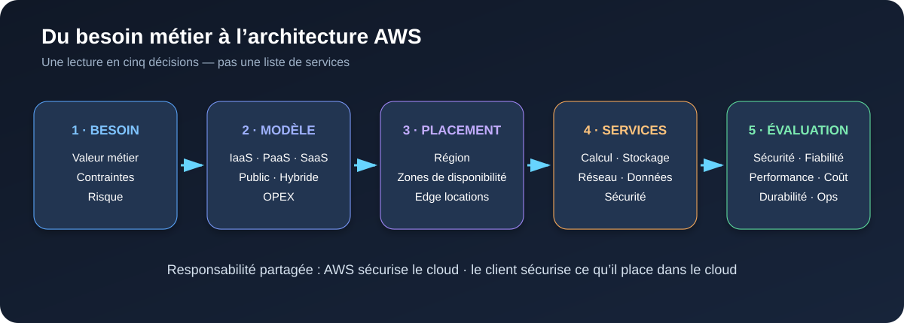

<div class="concept-check">
<strong>Décision d'architecture — avant de poursuivre</strong>
<p>Une application française contient des données sensibles et doit rester disponible lors de la panne d'un datacenter. Quel premier choix faut-il formuler ?</p>
<details><summary>Afficher la réponse raisonnée</summary><p>Choisir une région conforme aux contraintes de localisation, puis répartir les composants sur plusieurs zones de disponibilité. Une région et une AZ ne répondent pas au même niveau de panne.</p></details>
</div>

---

## 1. Introduction

### 1.1 Qu'est-ce qu'AWS et pourquoi le découvrir ?

**Amazon Web Services (AWS)** est une plateforme de cloud computing lancée en 2006. Elle propose plus de 200 services pour le calcul, le stockage, les bases de données, la sécurité, l'IA, le DevOps, et bien plus encore.

Derrière vous, il y a des millions de stagiaires, d'administrateurs et de développeurs qui utilisent AWS chaque jour pour faire fonctionner les sites web, les applications mobiles, les bases de données, les analyses de données et l'intelligence artificielle du monde entier.

**Pourquoi apprendre AWS ?**
- C'est le **leader mondial** du Cloud public (environ 32 % du marché).
- Les compétences AWS sont très recherchées sur le marché de l'emploi.
- C'est une **porte d'entrée** vers l'architecture cloud moderne.
- AWS ne cesse de croître et innover : chaque jour, de nouveaux services apparaissent.

Vous trouverez AWS dans **quasiment tous les secteurs** : startups qui testent une idée en quelques jours, grandes banques qui hébergent leurs systèmes critiques, hôpitaux qui gèrent les données médicales, gouvernements, universités, agences spatiales…

### 1.2 Quelques dates clés

| Année | Événement | Explication pédagogique |
|-------|-----------|------------------------|
| **2006** | Lancement d'AWS avec **S3** et **EC2** | AWS débute avec deux services fondamentaux : **S3** pour le stockage objet (sauvegardes, fichiers, images) et **EC2** pour le calcul (machines virtuelles). Ces deux services incarnent les piliers du cloud : stockage et puissance de calcul à la demande. |
| **2009** | Introduction de **VPC** et **RDS** | AWS ajoute **VPC** (Virtual Private Cloud) pour créer des réseaux privés isolés, et **RDS** (Relational Database Service) pour gérer des bases de données relationnelles sans administrer les serveurs. Cela marque l'arrivée des services réseau et des bases gérées. |
| **2012** | Lancement de **DynamoDB** | AWS introduit **DynamoDB**, une base NoSQL scalable et sans schéma, adaptée aux applications modernes (web, mobile, IoT). C'est le tournant vers les architectures serverless et les microservices. |
| **2014** | Lancement de **AWS Lambda** | AWS révolutionne le cloud avec **Lambda**, qui permet d'exécuter du code sans serveur. C'est le début du **serverless computing**, où l'infrastructure disparaît derrière la logique métier. |
| **2025** | Plus de **200 services**, leader mondial | AWS devient le fournisseur cloud le plus complet, couvrant tous les domaines : calcul, stockage, IA, sécurité, DevOps, IoT, bases de données, etc. Il est utilisé par des millions d'entreprises dans le monde entier. |

Ces dates montrent comment AWS a évolué d'un simple fournisseur de serveurs et de stockage vers une **plateforme cloud complète**, capable de répondre à tous les besoins informatiques : hébergement, sécurité, automatisation, intelligence artificielle, etc.

### 1.3 Certifications AWS

AWS structure son parcours de certification en quatre niveaux, pensés pour accompagner une montée en compétence progressive plutôt que pour classer les candidats par mérite. Chaque niveau valide un périmètre de responsabilités différent en entreprise, et il est tout à fait normal — recommandé, même — de les passer dans l'ordre.

Le niveau **Fondamental** (Cloud Practitioner) s'adresse à toute personne qui doit comprendre le vocabulaire et les grands principes du cloud AWS sans nécessairement configurer quoi que ce soit elle-même : commerciaux, chefs de projet, décideurs, ou stagiaires qui découvrent AWS pour la première fois. L'examen porte sur les concepts (modèles de tarification, responsabilité partagée, services principaux) plutôt que sur la mise en œuvre technique.

Le niveau **Associate** cible les professionnels qui déploient et opèrent concrètement des infrastructures AWS au quotidien. Il se décline selon le métier visé : **Solutions Architect – Associate** pour la conception d'architectures, **CloudOps Engineer – Associate (SOA-C03)** pour l'exploitation et la supervision — ce nom remplace SysOps Administrator depuis 2025 — et **Developer – Associate** pour l'intégration d'applications avec les API et services AWS. Le catalogue comprend également des certifications Associate orientées données et machine learning.

Le niveau **Professional** approfondit les deux certifications Architecte et DevOps du niveau Associate avec des scénarios de complexité réelle : migrations à grande échelle, architectures multi-comptes, optimisation fine des coûts et de la résilience. Ces examens supposent une expérience pratique significative — AWS les recommande après plusieurs années d'usage professionnel du cloud.

Le niveau **Spécialité** (Specialty) valide une expertise pointue plutôt qu'une vision généraliste. Le catalogue évolue régulièrement : Database Specialty et plusieurs autres examens ont été retirés en 2024, puis Machine Learning Specialty le 31 mars 2026. Il faut donc consulter le catalogue officiel avant de présenter une liste d'examens comme actuelle. Security Specialty et Advanced Networking Specialty restent des repères pertinents pour les domaines abordés ici.

Pour cette formation, le niveau visé est le **Solutions Architect Associate (SAA-C03)** : c'est la certification la plus demandée sur le marché de l'emploi et celle qui couvre le plus largement les services abordés dans les chapitres suivants (EC2, S3, VPC, RDS, IAM, CloudFormation). Le Chapitre 5 détaillera la pondération exacte des domaines de l'examen une fois tous les services vus.

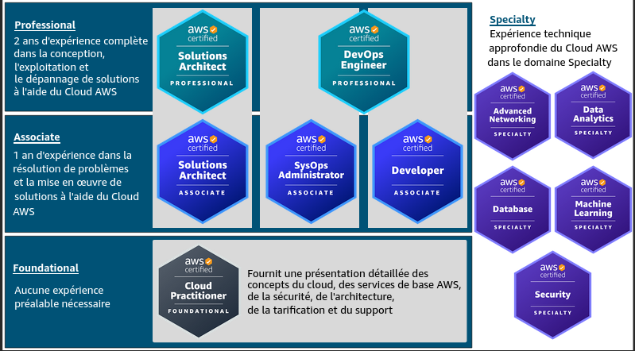

📎 [Certifications AWS](https://aws.amazon.com/certification/)

---

## 2. Fondamentaux du Cloud Computing

### 2.1 Qu'est-ce que le Cloud Computing ?

Le **Cloud Computing** est une évolution majeure dans la manière dont les systèmes d'information sont conçus, déployés et exploités.

Pendant des décennies, les entreprises ont investi massivement dans leurs propres infrastructures : datacenters internes, salles machines, serveurs physiques, systèmes de climatisation, sécurité, licences logicielles, équipes d'exploitation dédiées.

Ce modèle repose sur des investissements lourds (**CAPEX**) et des cycles de décision longs.

Le Cloud vient bouleverser cette logique en offrant un modèle **flexible**, **scalable** et **orienté services** : les ressources sont **louées à la demande** et **payées à l'usage**.

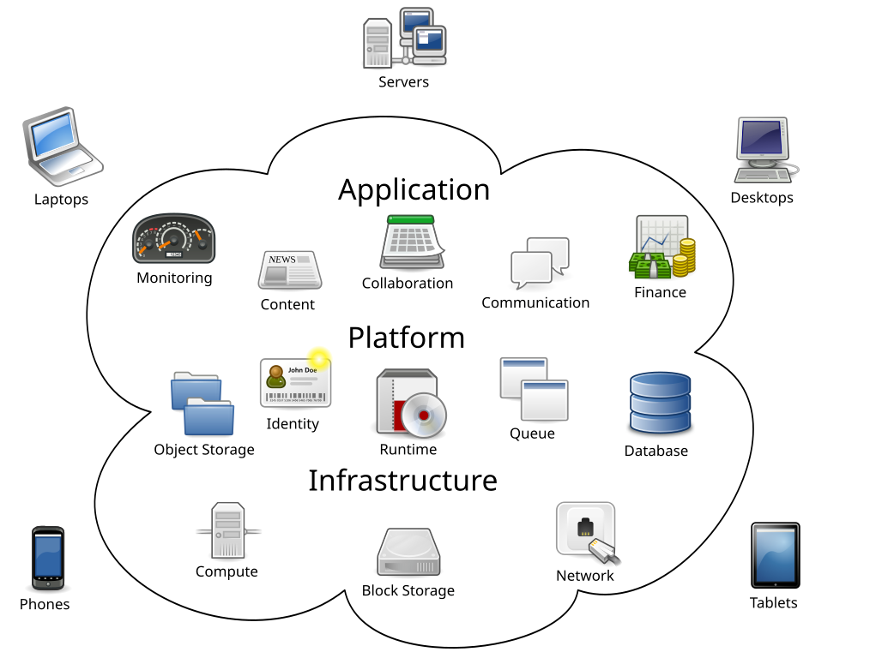

📎 [Documentation officielle AWS — What is Cloud Computing](https://aws.amazon.com/what-is-cloud-computing/)

### 2.2 Les cinq caractéristiques fondamentales du Cloud (NIST)

Le **NIST (National Institute of Standards and Technology)** a défini cinq caractéristiques fondamentales du Cloud Computing. Ces critères permettent de distinguer une véritable solution Cloud d'une simple externalisation :

#### 1. Libre-service à la demande (On-demand self-service)

Un utilisateur peut provisionner des ressources informatiques (par exemple, une machine virtuelle) sans intervention humaine du fournisseur.

**En pratique avec AWS** : Vous cliquez sur « Lancer une instance EC2 », configurez les paramètres, et en quelques secondes, votre serveur est actif et prêt à l'emploi.

#### 2. Mise en commun des ressources (Resource pooling)

Les ressources physiques (serveurs, stockage, réseau) sont partagées entre plusieurs clients mais restent isolées logiquement.

**En pratique avec AWS** : Vos instances EC2 exécutent sur du matériel physique partagé avec d'autres clients, mais AWS garantit une isolation complète — vos données restent vos données.

#### 3. Élasticité et scalabilité (Rapid elasticity)

Les ressources peuvent être augmentées ou réduites dynamiquement en fonction de la demande.

**En pratique avec AWS** : Votre application reçoit soudain 10 fois plus de visiteurs. AWS augmente automatiquement la capacité de calcul, puis la réduit quand le trafic baisse.

#### 4. Mesurabilité et facturation à l'usage (Measured service)

Chaque ressource est mesurée et facturée selon la consommation réelle : CPU, mémoire, bande passante, stockage, etc.

**En pratique avec AWS** : Vous payez par heure pour une instance EC2, par Go stocké sur S3, par requête sur Lambda. Pas de frais fixes, pas de ressources inutilisées payées « pour rien ».

#### 5. Accès étendu au réseau (Broad network access)

Les utilisateurs gèrent leurs ressources via une console Web, des API ou des outils en ligne de commande (CLI).

**En pratique avec AWS** : Vous ne contactez pas AWS pour dire « besoin d'un serveur ». Vous vous connectez à la console, créez ce que vous voulez, et c'est instantané.

📎 [NIST — The NIST Definition of Cloud Computing](https://csrc.nist.gov/publications/detail/sp/800-145/final)

### 2.3 CAPEX vs OPEX — Comprendre le changement de modèle économique

Historiquement, les entreprises ont fonctionné sur un modèle **CAPEX** (*Capital Expenditures*) : elles achetaient leurs équipements, les installaient dans leurs propres locaux et les exploitaient pendant plusieurs années.

Avec le Cloud, elles passent à un modèle **OPEX** (*Operational Expenditures*) : elles louent des ressources à la demande et paient uniquement pour leur consommation réelle.

| Modèle | Définition | Exemple typique | Gestion |
|--------|-----------|-----------------|---------|
| **CAPEX** | Investissement initial important amorti sur plusieurs années | Achat de serveurs physiques | Budget fixe |
| **OPEX** | Dépenses variables basées sur l'usage | Paiement horaire d'une instance EC2 | Budget flexible |

**Exemple concret :**

**CAPEX (Avant le Cloud)** : Une entreprise achète 10 serveurs physiques pour héberger une application interne. Coût initial : 50 000 €. Ils fonctionnent en permanence, même en période creuse, avec des coûts d'entretien et de maintenance élevés (climatisation, électricité, renouvellement matériel tous les 5-7 ans).

**OPEX (Avec AWS)** : La même entreprise utilise **Amazon EC2 (Elastic Compute Cloud)**, un service AWS permettant de lancer et gérer des **machines virtuelles**. Elle ne paie que les heures réellement consommées (ex. 100 € par mois en moyenne) et peut arrêter les instances lorsqu'elles ne sont pas nécessaires.

La différence ? Flexibilité, prévisibilité des coûts, et liberté d'adapter l'infrastructure en temps réel.

:::warning
**Attention aux coûts AWS — le modèle OPEX peut surprendre :**
Une instance EC2 laissée tournante 24h/7j sans utilisation reste facturée. Contrairement à un investissement CAPEX amorti sur plusieurs années, les coûts OPEX s'accumulent en temps réel. Activez toujours des **alertes de budget (AWS Budgets)** dès le premier jour.
:::

📎 [AWS Economics Center](https://aws.amazon.com/economics/)

### 2.4 La rupture culturelle du libre-service

Dans les environnements informatiques traditionnels, **les équipes métiers et techniques** devaient **passer par des processus centralisés** pour obtenir des ressources :

* Demande de serveurs à l'équipe IT
* Validation budgétaire et technique
* Commande physique, installation, configuration…
  👉 Résultat : **des délais de plusieurs semaines** avant de pouvoir simplement démarrer un projet.

Avec **le Cloud AWS**, ce modèle est **complètement bouleversé**.

#### 1. Libre-service immédiat

* Les équipes peuvent **provisionner elles-mêmes** des ressources (VM, bases de données, stockage…) **en quelques clics ou via des API**.
* Plus besoin d'attendre une autre équipe pour « débloquer » les moyens techniques.
* Cela change profondément la manière de travailler : les développeurs deviennent **autonomes**.

#### 2. Responsabilisation et gouvernance

* Le libre-service ne signifie pas « anarchie » : cela s'accompagne de **règles**, **quotas**, **politiques IAM**, **budgets**, etc.
* Les organisations doivent mettre en place une **gouvernance cloud** qui encadre cette autonomie.

#### 3. Accélération de l'innovation

* Cette autonomie permet de tester une idée en quelques heures plutôt qu'en plusieurs semaines.
* Les équipes peuvent **échouer vite et pas cher**, puis pivoter ou étendre si le projet fonctionne.

#### 4. Une vraie rupture culturelle

* Le passage au cloud AWS **n'est pas qu'une question de technologie**.
* Il faut **changer les mentalités** :
  * Déléguer le pouvoir de créer des ressources.
  * Accepter la rapidité et parfois le désordre initial.
  * Former et responsabiliser les équipes pour qu'elles deviennent **consommatrices actives** du cloud.

« Avant, il fallait une demande, une validation, une livraison. Aujourd'hui, on clique — ou on lance une commande API — et on a une infrastructure prête en quelques secondes. Cette autonomie est la clé du Cloud, mais elle exige une nouvelle culture : celle de la confiance, de la responsabilisation et de la gouvernance bien pensée. »

### 2.5 Les limites et contraintes du Cloud

Aucun modèle n'est parfait. Le Cloud introduit aussi plusieurs défis importants :

* **Dépendance au fournisseur (vendor lock-in)** : migrer entre AWS, Azure ou GCP peut nécessiter une réarchitecture importante.
* **Connexion Internet critique** : sans réseau, pas d'accès aux ressources hébergées dans le cloud.
* **Sécurité partagée** : certaines responsabilités ne sont **pas déléguées** au fournisseur.
* **Maîtrise des coûts** : une mauvaise configuration peut générer des dépenses importantes et rapides.

Nous allons détailler **la contrainte liée à la sécurité partagée**, car elle est souvent **mal comprise** par les entreprises débutant dans le cloud.

### 2.6 Le modèle de responsabilité partagée AWS

Avant d'étudier le tableau, utilisez le [simulateur interactif de responsabilité partagée](../07-annexes/simulateur-responsabilite-partagee.html). Comparez EC2, RDS et Lambda : plus le service est managé, plus AWS prend en charge de couches techniques, sans jamais devenir responsable de la classification des données ni des autorisations décidées par le client.

Le modèle de responsabilité partagée AWS répartit la sécurité entre deux parties, et confondre les deux moitiés est l'une des erreurs les plus fréquentes chez les entreprises qui découvrent le cloud.

AWS porte la responsabilité de la **sécurité du cloud**, c'est-à-dire de tout ce qui constitue l'infrastructure sous-jacente sur laquelle les clients construisent leurs services. Cela couvre la sécurité physique des data centers — accès contrôlé, vidéosurveillance, alimentation redondante — que le client n'a jamais à gérer lui-même. Cela couvre aussi le matériel et la couche de virtualisation qui isole chaque client des autres sur un même serveur physique, ainsi que la disponibilité globale de la plateforme, avec ses multiples régions et zones de disponibilité conçues pour survivre à la panne d'un data center entier.

Le **client**, de son côté, porte la responsabilité de la **sécurité dans le cloud** : tout ce qu'il configure et déploie au-dessus de cette infrastructure reste de son ressort. Il doit gérer les accès et les identités via IAM — qui a le droit de faire quoi sur son compte — et sécuriser ses données par le chiffrement et la rotation régulière des clés. Il doit configurer correctement son réseau (VPC, Security Groups, NACL) pour éviter d'exposer par erreur des ressources sensibles sur Internet. Et lorsqu'il utilise un service de type IaaS comme EC2, où AWS fournit la machine virtuelle mais pas ce qui tourne dessus, il reste responsable des sauvegardes, des correctifs de sécurité et des mises à jour du système d'exploitation.

Cela signifie que même si AWS est hautement sécurisé, **une mauvaise configuration côté client peut compromettre la sécurité** (par ex. un bucket S3 public par erreur).

:::danger
**Responsabilité client — erreurs fréquentes en production :**
- Un bucket S3 configuré en **accès public par erreur** expose toutes vos données sur Internet.
- L'utilisation du **compte root** pour les opérations quotidiennes est une faille de sécurité majeure.
- Un **Security Group ouvert sur 0.0.0.0/0 port 22** expose vos instances SSH au monde entier.
- L'absence de **MFA** sur le compte root est la première cause de compromission de compte AWS.

AWS ne peut pas vous protéger de vos propres erreurs de configuration — c'est votre responsabilité.
:::

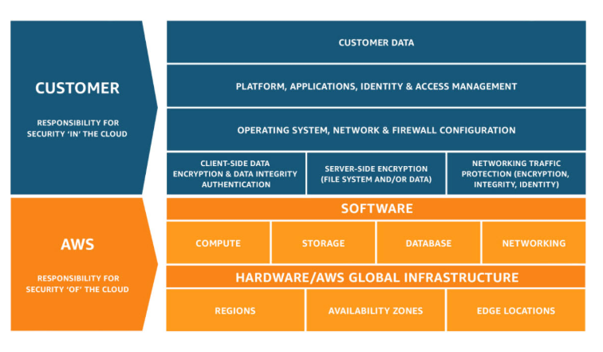

📎 [Shared Responsibility Model – AWS](https://aws.amazon.com/fr/compliance/shared-responsibility-model/)

### 2.7 Sécurité de l'information dans le Cloud

La **sécurité de l'information** repose sur trois piliers fondamentaux (**CID**) :

| Pilier | Définition | Exemple AWS |
|--------|-----------|-------------|
| **Confidentialité** | Seules les personnes autorisées doivent accéder aux données. | IAM, KMS, Bucket Policies |
| **Intégrité** | Les données ne doivent pas être altérées ou corrompues. | Checksums, versioning S3 |
| **Disponibilité** | Les systèmes doivent être accessibles à tout moment. | Multi-AZ, Load Balancer, snapshots |

Ce tableau cite trois exemples AWS dont vous ne verrez le détail que plus tard dans la formation — c'est normal à ce stade : **IAM** (gestion des identités et des accès) est le sujet entier du Chapitre 2, **KMS** (Key Management Service, le service de gestion des clés de chiffrement) et les **Bucket Policies** (règles d'accès attachées à un bucket S3) seront présentés respectivement en section 6 de ce chapitre et au Chapitre 3. Retenez pour l'instant seulement le principe : chaque pilier CID s'appuie sur des outils AWS concrets que vous manipulerez au fil de la formation.

AWS fournit des outils et des certifications (ISO 27001, SOC 2, PCI-DSS…), mais **l'entreprise reste responsable de son usage**.

**Exemples concrets de responsabilités du client :**

* Un bucket S3 mal configuré (public par erreur) = **fuite de données** → responsabilité **du client**.
* Un mot de passe faible ou MFA non activée = **intrusion possible** → responsabilité **du client**.
* Absence de sauvegarde / réplication = **perte de disponibilité** → responsabilité **du client**.
* Firewall mal ouvert (0.0.0.0/0 sur SSH) = exposition à Internet → responsabilité **du client**.

C'est pourquoi **les bonnes pratiques de configuration** sont **aussi importantes que les services AWS eux-mêmes**.

**En résumé :**

| Sécurité du cloud (AWS) | Sécurité dans le cloud (Client) |
|-------------------------|--------------------------------|
| Data centers, matériel | Gestion des accès et des rôles (IAM) |
| Virtualisation et réseau global | Sécurisation des données et des flux |
| Résilience physique | Mise à jour, chiffrement, surveillance |
| Conformité et certifications | Respect des politiques internes et réglementations sectorielles |

### 2.8 Externalisation du Système d'Information (SI)

#### Pourquoi externaliser ?

Externaliser le SI vers le Cloud permet de :
- **Réduire les coûts** d'infrastructure et de maintenance.
- **Accéder à une expertise** et à des technologies de pointe.
- **Améliorer la disponibilité et la continuité d'activité.**

Mais cela implique aussi une **réévaluation des risques** :
- Dépendance contractuelle envers le fournisseur.
- Nécessité de revoir les politiques de sauvegarde et d'accès.
- Conformité légale (RGPD, hébergement des données, localisation géographique).

**Conseil :**
Avant toute migration, réalisez une **analyse d'impact** (juridique, technique et organisationnelle).
AWS met à disposition un outil appelé **AWS Migration Readiness Assessment (MRA)**.

📎 [AWS Migration Hub](https://aws.amazon.com/fr/migration-hub/)

---

## 3. Modèles de services : IaaS, PaaS et SaaS

Les modèles de services sont essentiels pour comprendre **comment les entreprises consomment le Cloud**.
Ils structurent les **couches techniques** (infrastructure, plateforme, application) et déterminent qui — du client ou du fournisseur — est responsable de chaque couche.

📎 [AWS Cloud Service Models](https://aws.amazon.com/types-of-cloud-computing/)

Ces modèles sont une clé de lecture indispensable pour architecturer correctement une solution Cloud.

### 3.1 Infrastructure as a Service (IaaS)

**Infrastructure as a Service (IaaS)** désigne un modèle dans lequel le fournisseur met à disposition des ressources informatiques de base : **puissance de calcul**, **stockage**, **réseau** et **sécurité**.
Le client gère et configure ces ressources selon ses besoins.

#### Caractéristiques clés :

- Accès à des **machines virtuelles** configurables.
- Gestion des disques, du réseau et de la sécurité.
- Contrôle total sur l'OS et les applications.
- Évolutivité à la demande.

#### Exemples AWS :

- **Amazon EC2 (Elastic Compute Cloud)** : service qui permet de créer et gérer des machines virtuelles dans le Cloud.
- **Amazon EBS (Elastic Block Store)** : stockage en mode bloc attaché aux instances EC2.
- **Amazon VPC (Virtual Private Cloud)** : réseau virtuel isolé et configurable.
- **Elastic Load Balancing (ELB)** : répartition automatique du trafic entre plusieurs ressources.

**Analogie** : L'IaaS est comparable à la location d'un terrain pour construire une maison — le client choisit tout, mais doit aussi tout gérer.

### 3.2 Platform as a Service (PaaS)

**Platform as a Service (PaaS)** décharge le client de la gestion de l'infrastructure et du système d'exploitation.
Le fournisseur gère les couches basses, le client se concentre sur le développement et la mise en production.

#### Caractéristiques clés :

- Pas de gestion des serveurs ni de patching système.
- Environnements prêts à l'emploi pour le déploiement applicatif.
- Scalabilité intégrée.

#### Exemples AWS :

- **AWS Elastic Beanstalk** : service de déploiement et d'orchestration d'applications Web.
- **AWS Lambda** : service serverless qui exécute du code sans gérer de serveur.
- **Amazon RDS (Relational Database Service)** : base de données relationnelle gérée (patchs, sauvegardes, monitoring automatisés).

📎 [Documentation AWS Elastic Beanstalk](https://docs.aws.amazon.com/elasticbeanstalk)

Le PaaS permet de **réduire la charge opérationnelle** et d'accélérer les cycles de développement.

### 3.3 Software as a Service (SaaS)

**Software as a Service (SaaS)** est un modèle dans lequel le fournisseur gère toute la pile technique — infrastructure, plateforme et application — et livre un service clé en main.

#### Caractéristiques clés :

- Aucune gestion technique côté client.
- Accès via un navigateur ou une API.
- Maintenance et sécurité assurées par le fournisseur.

#### Exemples AWS :

- **AWS WorkMail** : service de messagerie hébergée.
- **Salesforce** : CRM en ligne.
- **Microsoft 365**, **Google Workspace** : solutions collaboratives.

📎 [AWS SaaS Factory](https://aws.amazon.com/saas-factory/)

Retenons les cas d'usage typiques du SaaS — messagerie, CRM, outils de collaboration, ERP.

### 3.4 Comparatif synthétique des modèles

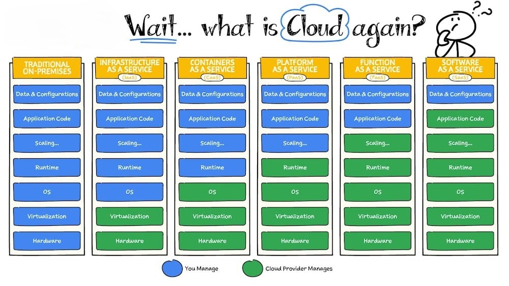

| Élément | IaaS | PaaS | SaaS |
|--------|------|------|------|
| **Flexibilité** | Très élevée | Moyenne | Faible |
| **Temps de déploiement** | Plus long | Rapide | Instantané |
| **Cas d'usage typique** | Migration, environnements complexes | Déploiements rapides, automatisation | Solutions métiers clés en main |

---

## 4. Modèles de déploiement : Public, Privé et Hybride

Les **modèles de déploiement** définissent *où* sont hébergées les ressources Cloud et *qui* les gère.
Ce choix a un impact direct sur la **gouvernance**, la **sécurité**, la **performance** et le **coût global** d'une solution Cloud.

Il existe trois grands modèles de déploiement reconnus par le NIST et adoptés par la majorité des entreprises : **Cloud Public**, **Cloud Privé** et **Cloud Hybride**.

Le modèle de déploiement choisi dépend souvent d'un compromis entre agilité, sécurité, conformité et maîtrise de l'environnement technique.

### 4.1 Le Cloud Public

Le **Cloud Public** est un modèle dans lequel les ressources sont hébergées dans les **datacenters du fournisseur Cloud** et partagées entre plusieurs clients.
Les infrastructures sont **mutualisées**, mais chaque client bénéficie d'un environnement isolé logiquement.

#### Caractéristiques :

- Hébergement sur l'infrastructure du fournisseur.
- Mutualisation des ressources physiques.
- Facturation à l'usage.
- Évolutivité quasi illimitée.
- Accès global via Internet sécurisé.

#### Avantages :

- Pas de gestion matérielle.
- Déploiement rapide.
- Coût réduit grâce à la mutualisation.
- Accès à un large éventail de services.

#### Inconvénients :

- Moins de contrôle sur l'infrastructure physique.
- Dépendance au fournisseur.
- Besoins accrus en gouvernance et sécurité.

#### Exemple AWS :

**AWS Public Cloud** repose sur l'infrastructure mondiale d'**Amazon Web Services (AWS)**, composée de **régions** (Regions), **zones de disponibilité** (Availability Zones, AZ) et **points de présence** (Edge Locations).

- Une *région* est une zone géographique (par exemple *eu-west-3* pour Paris).
- Une *zone de disponibilité (AZ)* est un datacenter isolé dans cette région, assurant redondance et tolérance aux pannes.
- Les *points de présence* servent principalement aux services de diffusion de contenu comme Amazon CloudFront.

**Services AWS typiques dans le Cloud public :**

- **Amazon EC2** : instances de calcul à la demande
- **Amazon S3** : stockage objet scalable
- **AWS Lambda** : exécution de code sans serveur
- **Amazon RDS** : bases de données relationnelles gérées
- **Amazon CloudFront** : CDN mondial pour accélérer les contenus

📎 [AWS Global Infrastructure](https://aws.amazon.com/about-aws/global-infrastructure/)

### 4.2 Le Cloud Privé

Le **Cloud Privé** est un modèle dans lequel l'entreprise déploie ses propres ressources Cloud sur une **infrastructure dédiée**, souvent hébergée dans ses propres locaux ou dans un datacenter tiers, mais **non mutualisée** avec d'autres clients.

#### Caractéristiques :

- Infrastructure dédiée à une seule organisation.
- Contrôle complet sur l'environnement.
- Peut utiliser des technologies de virtualisation similaires à celles du Cloud public.
- Peut être automatisé et orchestré comme un Cloud public.

#### Avantages :

- Meilleure maîtrise de la sécurité et de la conformité.
- Contrôle total sur les configurations.
- Plus de personnalisation possible.

#### Inconvénients :

- Coût d'investissement plus élevé (proche d'un modèle CAPEX).
- Moins de flexibilité et de scalabilité.
- Nécessite des équipes internes pour la gestion.

#### Pourquoi le Cloud Privé existe-t-il encore ?

Avec la transformation digitale — certaines entreprises conservent des charges sensibles en interne pour des raisons réglementaires.

**Exemple : le RGPD (Règlement Général sur la Protection des Données)**

Le **RGPD** impose aux entreprises européennes une **maîtrise stricte** de la localisation, de la protection et de la gouvernance des données personnelles. De ce fait, certaines entreprises — notamment dans les secteurs **banque**, **santé** ou **secteur public** — choisissent de **conserver certaines données ou systèmes sensibles en interne** ou sur des infrastructures "souveraines" pour :

- Garantir que les données ne quittent pas l'Espace Économique Européen,
- Mieux contrôler les accès et traitements,
- Répondre aux obligations de **traçabilité** et de **confidentialité**.

**Exemples concrets :**

- **Système bancaire français** hébergeant les données de ses clients sur une infrastructure locale ou un cloud "de confiance" pour respecter :
    - L'article 44 du RGPD (transferts hors UE),
    - Les obligations de minimisation et de limitation de traitement (articles 5 et 6),
    - Les recommandations de la CNIL sur l'hébergement de données sensibles.

- **Code de la santé publique** → données de santé hébergées uniquement chez un **Hébergeur de Données de Santé (HDS)** agréé en France. Les hôpitaux et laboratoires doivent conserver certaines données sur site ou dans un cloud certifié HDS.

- **Secteur de la Défense** → obligations de **souveraineté et de sécurité** imposées par l'ANSSI (ex. SecNumCloud), qui limitent l'externalisation à des fournisseurs labellisés.

**En résumé :**

| Législation / Réglementation | Secteur impacté | Conséquence sur l'hébergement |
|---|---|---|
| RGPD | Tous secteurs manipulant des données personnelles | Contrôle de localisation, transferts restreints |
| HDS | Santé | Hébergement uniquement chez des prestataires certifiés |
| ANSSI / SecNumCloud | Secteurs sensibles / OIV | Cloud souverain ou on-prem obligatoire pour certaines charges |

Ce type de réglementation **explique pourquoi certaines entreprises gardent encore des charges sensibles "on-premise"** ou sur des **infrastructures dédiées** plutôt que dans le cloud public pur.

:::warning
**RGPD et localisation des données AWS :**
Par défaut, AWS peut stocker vos données dans n'importe quelle zone de disponibilité de la région choisie. Pour les données personnelles de citoyens européens, vous devez impérativement choisir une **région européenne** (ex. `eu-west-3` Paris, `eu-central-1` Francfort) et vérifier que les services utilisés ne transfèrent pas les données hors UE sans votre accord explicite.
:::

#### AWS s'est adapté :

- Un groupe bancaire peut déployer un **Cloud privé** sur sa propre infrastructure virtualisée avec VMware ou OpenStack, tout en automatisant les déploiements comme dans AWS.

📎 [VMware Cloud Foundation](https://www.vmware.com/products/cloud-foundation.html)
📎 [OpenStack](https://www.openstack.org/)

**Services AWS typiques pour le Cloud privé :**

- **AWS Outposts** : infrastructure AWS déployée dans le datacenter du client
- **VMware Cloud on AWS** : environnement VMware géré dans AWS
- **Amazon VPC** : réseau virtuel isolé
- **AWS Direct Connect** : liaison réseau privée entre le client et AWS

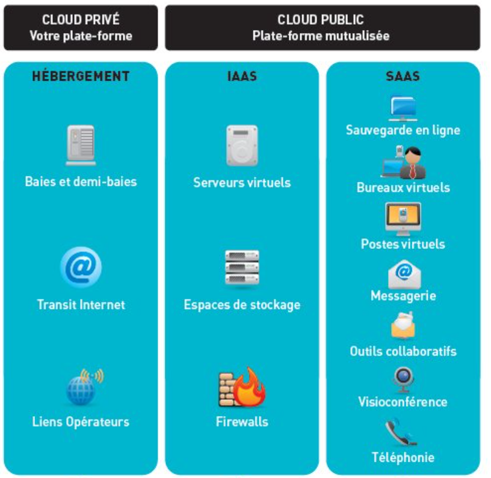

### 4.3 Le Cloud Hybride

Le **Cloud Hybride** combine le **Cloud Privé** et le **Cloud Public**, en permettant aux applications et données de circuler entre les deux environnements.
C'est aujourd'hui le modèle **le plus répandu** dans les grandes organisations.

#### Caractéristiques :

- Combinaison de ressources internes et publiques.
- Interopérabilité entre les environnements.
- Optimisation des coûts et de la sécurité.
- Support de scénarios de migration progressive.

#### Avantages :

- Flexibilité maximale.
- Répartition intelligente des charges de travail.
- Sécurité renforcée pour les données sensibles.
- Possibilité d'exploiter le meilleur des deux mondes.

#### Inconvénients :

- Gestion plus complexe.
- Nécessite des compétences solides en architecture et interconnexion.
- Risque de dépendances multiples.

#### Exemple AWS :

**AWS Direct Connect** est un service AWS qui permet de **créer une liaison réseau privée dédiée** entre l'infrastructure interne d'une entreprise et AWS.
Cela permet de combiner la sécurité d'un Cloud privé avec la puissance d'un Cloud public.

**Services AWS typiques pour le Cloud hybride :**

- **AWS Storage Gateway** : intégration du stockage local avec S3
- **AWS Transit Gateway** : interconnexion de VPC et réseaux sur site
- **AWS Systems Manager** : gestion centralisée des ressources hybrides
- **AWS Backup** : sauvegarde unifiée pour ressources cloud et sur site

📎 [AWS Direct Connect](https://aws.amazon.com/directconnect/)

Le Cloud hybride est souvent une **étape transitoire** vers une adoption plus large du Cloud public.

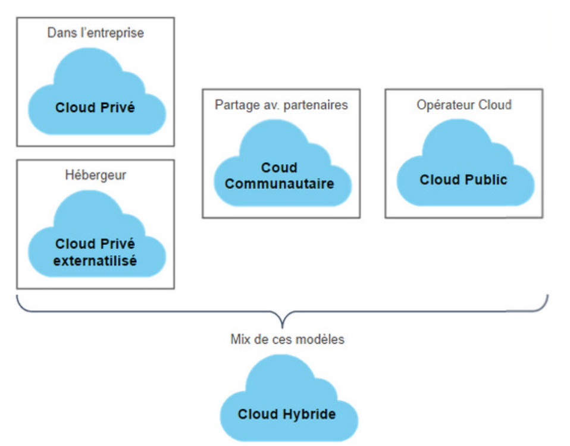

### 4.4 Comparatif synthétique

| Élément | Public Cloud | Private Cloud | Hybrid Cloud |
|--------|--------------|---------------|--------------|
| **Propriété de l'infrastructure** | Fournisseur (ex. AWS) | Entreprise | Mixte |
| **Isolation** | Mutualisée, logique | Dédiée, physique | Mixte |
| **Coûts** | OPEX, à la demande | CAPEX, investissement initial | Mixte |
| **Sécurité** | Standardisée, contrôlée par fournisseur | Complète, contrôlée par l'entreprise | Partagée |
| **Scalabilité** | Très élevée | Limitée | Élevée |
| **Gouvernance** | Fournisseur | Entreprise | Mixte |

### 4.5 Recommandations par contexte

| **Modèle** | **Recommandé pour…** | **Explication simplifiée** |
|-----------|-------|---|
| **Cloud public** | Startups, PME, environnements Dev/Test, charges variables | AWS gère toute l'infrastructure. Vous utilisez les services à la demande, sans rien installer ni maintenir. Idéal pour démarrer vite, tester, ou adapter les ressources selon le trafic. |
| **Cloud privé** | Organisations réglementées, données sensibles, applications critiques | L'environnement est dédié à une seule entreprise. Plus de contrôle, plus de sécurité, mais aussi plus de configuration. Utilisé quand les données ne doivent pas sortir d'un périmètre défini (ex : santé, finance). |
| **Cloud hybride** | Entreprises en transition, contraintes réglementaires, intégration avec systèmes existants | Combine les deux : une partie des ressources reste sur site ou en cloud privé, l'autre est dans le cloud public. Permet de migrer progressivement, tout en respectant les contraintes métier ou techniques. |

AWS permet aux entreprises de choisir le **modèle le plus adapté à leur contexte** :

- Le **cloud public** est parfait pour démarrer rapidement, tester des idées, ou gérer des pics de trafic.
- Le **cloud privé** offre un **contrôle maximal** pour les secteurs sensibles ou réglementés.
- Le **cloud hybride** est une **solution intermédiaire** qui permet de **connecter l'ancien et le nouveau**, en douceur.

Cette flexibilité est l'un des grands atouts d'AWS : vous pouvez commencer petit, évoluer progressivement, et adapter votre architecture à vos besoins métier, techniques et réglementaires.

---

## 5. Fondamentaux techniques : Virtualisation et Conteneurs

Derrière le Cloud se cachent des **technologies fondamentales** qui le rendent possible.
Deux piliers en particulier ont permis l'essor massif des infrastructures à la demande :

- La **virtualisation**, qui permet de découper une machine physique en plusieurs machines virtuelles indépendantes.
- La **conteneurisation**, qui permet d'isoler et d'exécuter des applications de manière légère et flexible.

Comprendre ces concepts est essentiel pour appréhender le fonctionnement d'**Amazon Web Services (AWS)** et de nombreux autres fournisseurs Cloud.

📎 [AWS Compute Documentation](https://docs.aws.amazon.com/compute/)
📎 [Introduction to Virtualization — VMware](https://www.vmware.com/topics/glossary/content/virtualization.html)
📎 [Docker Documentation](https://docs.docker.com/get-started/)

Insistons ici sur la **différence entre virtualisation et conteneurisation**, car cette distinction conditionne la compréhension des services comme Amazon EC2, ECS ou EKS.

### 5.1 Virtualisation — Principe et rôle dans le Cloud

#### Définition

La **virtualisation** est une technologie qui permet d'exécuter plusieurs **machines virtuelles (VM)** sur un seul serveur physique.
Chaque VM fonctionne comme une machine indépendante avec son propre système d'exploitation et ses ressources allouées (CPU, mémoire, stockage, réseau).

La virtualisation est gérée par une couche logicielle appelée **hyperviseur**.

#### Types d'hyperviseurs

- **Type 1 (bare-metal)** : installé directement sur le matériel physique. Exemples : VMware ESXi, Microsoft Hyper-V, KVM.
- **Type 2 (hosted)** : installé au-dessus d'un système d'exploitation. Exemples : VirtualBox, VMware Workstation.

#### Avantages de la virtualisation :

- Meilleure utilisation des ressources matérielles.
- Isolation entre les environnements.
- Déploiement rapide.
- Maintenance simplifiée.

#### Virtualisation et AWS

Sur AWS, la virtualisation est au cœur de nombreux services, en particulier :

- **Amazon EC2 (Elastic Compute Cloud)** : service permettant de créer et gérer des machines virtuelles dans le Cloud AWS.
- **Amazon EBS (Elastic Block Store)** : service de stockage en mode bloc utilisé par les instances EC2.
- **Amazon VPC (Virtual Private Cloud)** : service qui fournit un réseau virtuel isolé dans AWS pour héberger les ressources.

### 5.2 Paravirtualisation et Émulation

Deux modes techniques sont utilisés dans la virtualisation Cloud :

- **Émulation** : le matériel est simulé intégralement par logiciel. Plus flexible mais moins performant.
- **Paravirtualisation** : le système invité est conscient qu'il est virtualisé et interagit directement avec l'hyperviseur, ce qui offre de meilleures performances.

AWS utilise principalement des technologies de **paravirtualisation** et de **virtualisation matérielle assistée** pour offrir des performances quasi natives.

📎 [AWS Nitro System](https://aws.amazon.com/ec2/nitro/) — La plateforme AWS Nitro est une combinaison de matériel dédié et de logiciels légers qui améliore la sécurité et les performances de la virtualisation EC2.

### 5.3 Conteneurisation — Une approche plus légère

#### Définition

La **conteneurisation** est une méthode d'isolation applicative qui permet d'exécuter plusieurs applications sur le même système d'exploitation, dans des environnements isolés appelés **conteneurs**.

Contrairement à une machine virtuelle, un conteneur ne contient pas son propre OS complet — il partage le noyau de l'hôte, ce qui le rend **beaucoup plus léger**.

#### Avantages des conteneurs :

- Démarrage quasi instantané.
- Consommation réduite de ressources.
- Facilité de portabilité et de déploiement.
- Standardisation des environnements.

#### Outils et services associés

- **Docker** : technologie de conteneurisation la plus répandue, permettant de créer, packager et exécuter des conteneurs.
- **Amazon ECS (Elastic Container Service)** : service AWS permettant de déployer et gérer des conteneurs Docker à grande échelle.
- **Amazon EKS (Elastic Kubernetes Service)** : service AWS qui fournit une plateforme Kubernetes managée pour orchestrer des conteneurs.

📎 [Amazon ECS Documentation](https://docs.aws.amazon.com/ecs/)
📎 [Amazon EKS Documentation](https://docs.aws.amazon.com/eks/)

Il est important de comprendre la différence clé — VM = OS complet, Conteneur = application isolée. C'est une **rupture technologique** qui a permis l'essor de l'architecture microservices.

### 5.3 Microservices — Architecture distribuée et scalable

Les **microservices** sont une approche architecturale qui consiste à **découper une application monolithique en petits services indépendants**, chacun responsable d'une fonction métier spécifique.

**Exemple :** Une application de e-commerce ne sera plus UNE grosse application, mais plusieurs petits services :
- Service d'authentification
- Service de gestion de panier
- Service de paiement
- Service de recommandations
- Service de livraison

#### Avantages des microservices

Le monolithe (une application unique de 500k lignes, une seule technologie, un déploiement lent et une scalabilité limitée) s'oppose aux microservices (Auth, Cart, Payment, Reco découpés en services indépendants), qui autorisent des technologies différentes par service, un déploiement rapide et une scalabilité flexible par équipe.

- **Agilité** : chaque équipe développe son service indépendamment.
- **Scalabilité** : seul le service de paiement reçoit beaucoup de trafic ? Scalez juste ce service.
- **Résilience** : si le service de recommandations est down, le reste de l'app fonctionne.
- **Technologie** : chaque service peut utiliser Node.js, Python, Java… selon le besoin.

#### Microservices et conteneurs

Les microservices **sans conteneurs** seraient très compliqués à gérer. C'est pourquoi **Docker + Kubernetes** (ou **AWS ECS**) sont devenus essentiels.

Chaque microservice est empaqueté dans son propre **conteneur Docker**, puis orchestré par un outil qui gère les déploiements, la scalabilité et la résilience.

**Services AWS pour microservices :**

- **Amazon ECS (Elastic Container Service)** : orchestration native AWS, plus simple que Kubernetes.
- **Amazon EKS (Elastic Kubernetes Service)** : Kubernetes managé, si vous avez une flotte massive.
- **AWS Fargate** : exécution serverless de conteneurs (sans gérer les instances EC2).
- **AWS Lambda** : exécution de fonctions sans serveur (cas de microservices très légers).

#### Un exemple en image

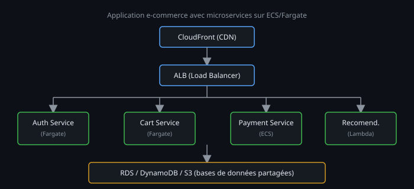

📎 [Microservices Documentation AWS](https://aws.amazon.com/microservices/)

### 5.4 Virtualisation vs conteneurisation — tableau comparatif

| Élément | Virtualisation (VM) | Conteneurisation |
|--------|--------|---------|
| **Système** | OS complet par machine virtuelle | Noyau partagé, application isolée |
| **Démarrage** | Lent (minutes) | Rapide (secondes) |
| **Consommation de ressources** | Élevée | Faible |
| **Portabilité** | Moins flexible | Très flexible |
| **Cas d'usage typiques** | Migration d'applications legacy, serveurs complets | Microservices, CI/CD, déploiements rapides |

Ce tableau permet de bien fixer les différences entre VM et conteneurs.

---

## 6. Présentation d'AWS et de son écosystème

### 6.1 Vue d'ensemble

**Amazon Web Services (AWS)** est aujourd'hui le leader mondial du Cloud public.
Lancé en 2006, AWS est une filiale d'Amazon qui propose une **plateforme Cloud complète** couvrant :

- L'infrastructure (serveurs, stockage, réseau),
- Les plateformes de développement et déploiement applicatif,
- Les services managés et serverless,
- L'intelligence artificielle, la data et l'IoT.

AWS est présent dans la quasi-totalité des secteurs d'activité : industrie, banque, administration publique, éducation, santé, etc.

📎 [Site officiel AWS](https://aws.amazon.com/)
📎 [AWS Overview Documentation](https://docs.aws.amazon.com/whitepapers/latest/aws-overview/introduction.html)

### 6.2 Les applications dans les offres Cloud

AWS n'est pas seulement une plateforme d'infrastructure : c'est aussi un **écosystème d'applications et de solutions métiers**.

Quelques exemples typiques :
- **Hébergement web et API** : via Amazon EC2, Elastic Beanstalk ou Lightsail.
- **Stockage et sauvegarde** : avec S3, EBS et Glacier.
- **Analyse de données** : grâce à Redshift et Athena.
- **Sécurité et conformité** : via IAM, CloudTrail et Security Hub.

Ces briques sont interconnectées.
Une **application complète AWS** s'appuie généralement sur plusieurs de ces services, orchestrés ensemble pour offrir disponibilité, sécurité et performance.

### 6.3 Les principaux acteurs du marché du Cloud

Le Cloud Computing est un marché concurrentiel dominé par **trois géants**, avec quelques acteurs spécialisés ou souverains :

#### Panorama comparatif simplifié

Avant de décortiquer AWS, il est utile de comprendre son positionnement face à ses concurrents principaux.

| Fournisseur | Origine | Points forts | Contexte d'utilisation | Position sur le marché |
|-------------|---------|-------------|------------------------|----------------------|
| **AWS** | Amazon (2006) | Large catalogue (200+ services), maturité, écosystème, documentation, communauté | Startups, PME, grandes entreprises, multinationales | Leader (~32 % du marché) |
| **Microsoft Azure** | Microsoft (2010) | Intégration native Windows/Office 365/AD, modèle hybride fort, support entreprise | Organisations Microsoft existantes, conformité européenne | 2ᵉ position (~23 %) |
| **Google Cloud Platform (GCP)** | Google (2008) | Outils data/ML excellents, BigQuery, Vertex AI, simplicité d'usage | Projets data-driven, IA/ML, startups tech | 3ᵉ position (~10 %) |
| **OpenStack** (Open Source) | Communauté | Infrastructure privée, totale maîtrise, coût réduit | Cloud privé, institutions académiques, hébergeurs | Marché de niche |
| **OVHcloud** (Européen) | OVH (France) | Souveraineté données EU, prix compétitifs | PME EU, données sensibles, RGPD stricte | Marché de niche EU |
| **IBM Cloud, Oracle Cloud** | IBM / Oracle | Spécialisés (IA, bases données massives) | Grandes entreprises, solutions legacy | Marché de niche |

#### Comparatif détaillé : AWS vs Azure vs GCP

| Aspect | AWS | Azure | GCP |
|--------|-----|-------|-----|
| **Nombre de services** | 200+ | 200+ | 100+ |
| **Services de calcul** | EC2, Lambda, Fargate | VMs, App Services, AKS | Compute Engine, Cloud Functions |
| **Bases de données** | RDS, DynamoDB, Aurora | SQL Database, Cosmos DB | Cloud SQL, Firestore |
| **Données et IA** | SageMaker, Glue | Azure ML, Synapse | BigQuery, Vertex AI ⭐ |
| **Points de présence** | 30+ régions | 60+ régions | 40+ régions |
| **Matériel propriétaire** | AWS Nitro | Optimisé | Processeurs TPU (IA) |
| **Force communautaire** | Très forte | Forte (corporations) | Croissante (startups) |
| **Apprentissage** | Longue courbe | Intégré MS, plus facile | Pythoniste-friendly |
| **Certifications** | Cloud Practitioner, CloudOps Engineer, Solutions Architect | AZ-900, AZ-104 | Cloud Digital Leader, Associate Cloud Engineer, Professional |

**Ce que signifient les lignes moins évidentes de ce tableau :**

- **Matériel propriétaire** : chaque fournisseur a développé du matériel sur mesure pour ses data centers plutôt que d'utiliser des composants standards du marché. **AWS Nitro** (déjà présenté en section 5.2 de ce chapitre) est un système matériel et logiciel conçu par AWS qui décharge la virtualisation, le réseau et la sécurité du CPU principal du serveur physique — cela signifie que quasiment 100 % de la puissance de la machine physique est disponible pour vos instances EC2, au lieu qu'une partie soit consommée par l'hyperviseur lui-même. Chez GCP, les **TPU (Tensor Processing Units)** sont des puces conçues spécifiquement pour accélérer les calculs de machine learning (entraînement et inférence de modèles d'IA) — un TPU va beaucoup plus vite qu'un CPU classique sur ce type de calcul précis, mais ne sert à rien pour un usage généraliste.
- **Force communautaire** : désigne le volume et l'activité de la communauté d'utilisateurs autour du fournisseur — tutoriels, forums (Stack Overflow, Reddit), projets open source, meetups. Plus cette communauté est active, plus il est facile de trouver de l'aide en cas de blocage. AWS bénéficie ici de son avance historique (premier arrivé en 2006) : davantage de contenus accumulés sur près de 20 ans.
- **Apprentissage** : la "courbe d'apprentissage" désigne la difficulté et le temps nécessaires pour devenir opérationnel sur la plateforme. AWS a la réputation d'avoir une courbe plus longue du fait de son catalogue de 200+ services parfois redondants (plusieurs façons de faire la même chose). Azure est souvent perçue comme plus accessible pour des équipes déjà habituées à l'écosystème Microsoft (Windows Server, Active Directory, Office 365) — les concepts et l'interface leur sont familiers. "**Pythoniste-friendly**" signifie que GCP a orienté beaucoup de ses outils et de sa documentation autour de Python, le langage dominant en data science — un développeur Python s'y retrouve plus vite, notamment pour les services data/IA (BigQuery, Vertex AI).
- **Certifications** : chaque fournisseur a son propre parcours de certification, avec des noms et des codes différents mais un principe similaire (un premier niveau généraliste, puis des spécialisations). Côté Azure, **AZ-900** est la certification fondamentale (équivalent du AWS Cloud Practitioner) et **AZ-104** la certification Administrator Associate (gestion quotidienne des ressources Azure, équivalent du AWS SysOps). Les certifications AWS sont détaillées à la section 1.3 de ce chapitre.

#### AWS, pourquoi c'est le leader ?

**Les trois raisons principales :**

1. **First-mover advantage** : AWS a lancé la révolution du cloud en 2006. Les équipes AWS ont maturé progressivement, corrigé les bugs, collecté les retours.
2. **Catalogue massif** : Plus de 200 services interconnectés permettent de construire à peu près n'importe quelle architecture.
3. **Écosystème** : Partenaires, formations, documentation, communauté, marketplace. Plus vous apprenez AWS, moins vous avez intérêt à partir.

C'est pourquoi AWS représente environ **32 % du marché cloud**, loin devant Azure (23 %) et GCP (10 %).

#### Solutions open source

Enfin, une mention importante : **OpenStack**.

OpenStack est une plateforme **open source complète** qui permet à toute organisation de **construire son propre cloud privé**, sans dépendre d'un fournisseur unique. Elle est utilisée par :
- Universités et instituts de recherche
- Gouvernements (souveraineté)
- Hébergeurs et fournisseurs de services cloud alternatifs
- Organisations ayant besoin de total contrôle

OpenStack ne joue pas sur le même terrain qu'AWS/Azure/GCP (qui sont des services managés) — c'est une brique technologique que vous installez et maintenez vous-même.

📎 [Gartner Magic Quadrant 2024 – Cloud Infrastructure and Platform Services](https://www.gartner.com/en/documents)

### 6.4 L'infrastructure mondiale d'AWS

Le schéma suivant part d'une requête utilisateur et montre pourquoi une région ne suffit pas, à elle seule, à garantir la disponibilité. Le trafic doit être distribué vers plusieurs zones indépendantes et les ressources zonales doivent réellement être dupliquées.

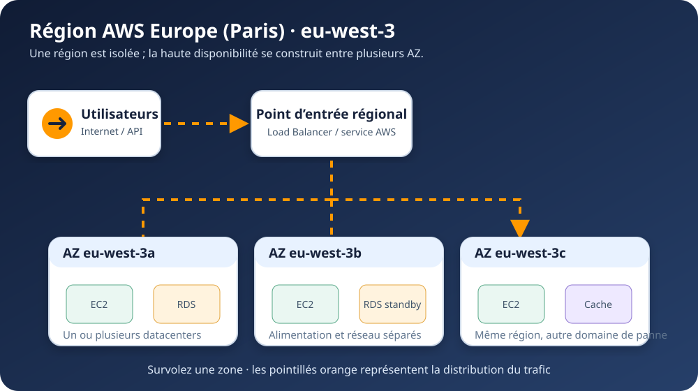

Les trois AZ appartiennent à la même région et communiquent par le réseau régional AWS, mais constituent des domaines de défaillance distincts. Déployer une instance dans `eu-west-3a` et une base uniquement dans cette même AZ reste une architecture mono-AZ, même si la région en propose trois.

L'un des piliers majeurs d'AWS est son **infrastructure mondiale** extrêmement étendue et redondée.
Elle est structurée en trois grandes composantes :

#### 1. Régions AWS (Regions)

- Une *région* est une zone géographique physique (exemple : `eu-west-3` pour Paris).
- Chaque région contient plusieurs datacenters appelés Zones de disponibilité (AZ).
- Les services AWS sont déployés par région et choisis par l'utilisateur.

#### 2. Zones de disponibilité (Availability Zones - AZ)

- Une AZ correspond à un ou plusieurs datacenters indépendants reliés entre eux par des liens à très faible latence.
- Les AZ sont conçues pour **garantir la haute disponibilité** et **la tolérance aux pannes**.

#### 3. Points de présence (Edge Locations)

- Répartis dans le monde entier, ils permettent d'accélérer la diffusion de contenu et d'optimiser les performances réseau via des services comme **Amazon CloudFront** (réseau de diffusion de contenu — CDN).

#### Vidéo explicative : infrastructure AWS

<iframe width="560" height="315" src="https://www.youtube.com/embed/TFxSjn8AHi8?si=jCQPMlT4-X9HT7Ip" title="YouTube video player" frameborder="0" allow="accelerometer; autoplay; clipboard-write; encrypted-media; gyroscope; picture-in-picture; web-share" referrerpolicy="strict-origin-when-cross-origin" allowfullscreen></iframe>

Retenons que le concept de *région* et de *localisation géographique des données* est souvent déterminant pour des raisons légales et de performance.

### 6.5 Principes de tarification AWS

L'un des aspects stratégiques de l'adoption du Cloud est la **tarification à l'usage**.
AWS applique un modèle de facturation souple et transparent basé sur la consommation réelle.

#### Principes clés :

- **Pay-as-you-go** : paiement en fonction de l'utilisation réelle des ressources.
- **Sans engagement initial** : pas de coût d'entrée, contrairement au modèle CAPEX.
- **Économies d'échelle** : les tarifs peuvent diminuer avec l'usage.
- **Facturation par service** : chaque service (EC2, S3, RDS…) est facturé séparément selon ses métriques propres.

Selon le service et l'engagement pris, plusieurs modes de tarification existent — à la demande, instances réservées, Savings Plans, Spot Instances. Le Chapitre 3 détaille chacun de ces modes avec des cas métier chiffrés, au moment où vous configurerez vos premières instances EC2.

📎 [AWS Pricing Overview](https://aws.amazon.com/pricing/)
📎 [AWS Pricing Calculator](https://calculator.aws/)

---

## 7. AWS Well-Architected Framework

Le **Well-Architected Framework** est une méthodologie officielle AWS qui permet de **concevoir des architectures Cloud robustes**, sécurisées, performantes, optimisées en coûts et **durables**.

C'est une **philosophie de design** qui s'applique à chaque projet AWS, du plus petit au plus grand.

Ce framework repose sur **six piliers**, souvent représentés par le sigle **SOPREC** :

- 🏛️ **Security** → Sécurité, IAM, chiffrement
- ⚙️ **Operational Excellence** → Monitoring, automatisation, processus
- 💪 **Reliability** → Résilience, haute disponibilité
- ⚡ **Performance** → Efficacité des ressources
- 💰 **Cost Optimization** → Optimisation des dépenses
- 🌱 **Sustainability** → Impact environnemental, efficacité

:::success
**Vérification AWS CLI — liste des piliers WAF disponibles pour une review :**
```bash
aws wellarchitected list-lenses --lens-type AWS_OFFICIAL
```
```json
{
    "LensSummaries": [
        { "LensAlias": "wellarchitected", "LensName": "AWS Well-Architected Framework",
          "LensVersion": "2023-04-10", "Description": "Six pillars review" },
        { "LensAlias": "serverless", "LensName": "Serverless Lens", "LensVersion": "3.0" },
        { "LensAlias": "saas", "LensName": "SaaS Lens", "LensVersion": "1.0" }
    ]
}
```
Le Framework Well-Architected est disponible depuis la console et via API. Vous pouvez lancer une revue avec **AWS Well-Architected Tool** : les questions sont organisées selon les six piliers. Ce service ne doit pas être confondu avec **AWS WAF**, le pare-feu applicatif web.
:::

#### 1. Security (Sécurité)

Mettre en œuvre des mesures de protection fortes à tous les niveaux — **IAM**, **chiffrement**, **sécurité réseau**, **MFA**, **audit**.

**En pratique :**
- Créer des rôles IAM spécifiques plutôt que d'utiliser le compte root.
- Chiffrer les données au repos et en transit.
- Utiliser des security groups et NACL pour isoler les ressources.
- Activer CloudTrail pour auditer les accès.

#### 2. Operational Excellence (Excellence opérationnelle)

Surveiller et améliorer continuellement les opérations — **mise en place de processus**, **d'automatisation** et de **monitoring**.

**En pratique :**
- Utiliser CloudWatch pour surveiller les ressources.
- Automatiser les déploiements avec CloudFormation ou Terraform.
- Documenter les procédures d'incident.
- Faire des reviews régulières de l'architecture.

#### 3. Reliability (Fiabilité / Résilience)

Assurer la **résilience** et la **tolérance aux pannes** — **redondance**, **sauvegarde**, **failover automatique**.

**En pratique :**
- Déployer les applications dans plusieurs **Availability Zones** pour la haute disponibilité.
- Mettre en place des sauvegardes automatiques (EBS snapshots, RDS backups).
- Utiliser des auto-scaling groups pour ajuster le nombre d'instances en cas de charge.
- Tester régulièrement les scénarios de récupération d'urgence (RTO/RPO).

#### 4. Performance Efficiency (Efficacité des performances)

Utiliser les ressources de manière **efficace et évolutive** — **choix des bonnes instances**, **optimisation des requêtes**.

**En pratique :**
- Choisir le bon type d'instance EC2 selon le workload (t3 pour web, m5 pour applications, c5 pour calcul).
- Utiliser des caches (ElastiCache, CloudFront) pour réduire la latence.
- Optimiser les requêtes de bases de données.
- Utiliser AWS Compute Optimizer pour recommander les bonnes tailles.

#### 5. Cost Optimization (Optimisation des coûts)

Éviter les dépenses inutiles et **ajuster la capacité à la demande** — **monitoring des coûts**, **réservation d'instances**, **suppression des ressources non utilisées**.

**En pratique :**
- Utiliser des **Reserved Instances** ou **Savings Plans** pour réduire les coûts.
- Mettre en place des **budgets d'alerte** dans AWS Billing.
- Arrêter les ressources non utilisées (instances EC2, RDS développement).
- Analyser les logs de coûts avec Cost Explorer ou AWS Cost Anomaly Detection.

#### 6. Sustainability (Durabilité) — **Le pilier le plus récent** ✨

Minimiser l'**impact environnemental** de votre infrastructure Cloud — **efficacité énergétique**, **utilisation optimale des ressources**, **choix des régions**.

**En pratique :**
- Utiliser les régions AWS qui utilisent des énergies renouvelables (ex : `eu-west-1` en Irlande, alimentée à >80% par des renouvelables).
- Éteindre les ressources inutilisées plutôt que de les laisser tourner.
- Utiliser le **Compute Optimizer** pour ajuster les tailles d'instances et réduire la consommation.
- Préférer les architectures **serverless** (Lambda, Fargate) qui consomment moins que les EC2 permanentes.
- Monitorer l'empreinte carbone de vos déploiements via le **AWS Customer Carbon Footprint Tool**.

C'est un enjeu de plus en plus important pour les entreprises souhaitant atteindre leurs **objectifs de développement durable (ODD)** et de **net-zéro** (carbon-neutral).

📎 [AWS Well-Architected Framework](https://aws.amazon.com/architecture/well-architected/)
📎 [AWS Sustainability — Carbon Footprint Tool](https://aws.amazon.com/about-aws/sustainability/)
#### Appliquer le Framework au quotidien

Lors de **chaque conception d'architecture AWS**, on doit se poser ces questions :

- **🔒 Sécurité** : Les données sont-elles protégées ? IAM bien configuré ?
- **⚙️ Opérations** : Comment monitorer et alerter ? Comment déployer sans risque ?
- **💪 Résilience** : Que se passe-t-il si un service tombe ? Avons-nous des sauvegardes ?
- **⚡ Performance** : Les ressources sont-elles bien dimensionnées ? Y a-t-il des goulots ?
- **💰 Coûts** : Payons-nous ce que nous utilisons réellement ? Pouvons-nous optimiser ?
- **🌱 Durabilité** : Quel est notre impact environnemental ? Pouvons-nous le réduire ?

Cette approche sera **reprise au fil des jours**, notamment lors des ateliers EC2, S3, RDS et VPC.

---

## 8. AWS Management Console

La **console AWS** est une interface Web centralisée qui permet de gérer tous les services AWS depuis un seul endroit.

### 8.1 Principales fonctionnalités

La console web regroupe en un seul endroit tout ce dont un administrateur a besoin pour piloter son compte AWS au quotidien, et c'est justement ce qui la rend accessible aux débutants malgré la richesse du catalogue de services.

Elle donne d'abord accès à l'ensemble des services AWS disponibles dans la région sélectionnée : EC2, S3, RDS, Lambda et les centaines d'autres services se retrouvent derrière une barre de recherche unique, sans avoir à mémoriser des noms de commandes ou des endpoints d'API. Elle permet ensuite de visualiser en temps réel l'état des ressources déjà créées — combien d'instances EC2 tournent, quels buckets S3 existent, comment est configuré le VPC — ce qui en fait le point d'entrée naturel pour diagnostiquer un problème avant de creuser en ligne de commande. Elle sert aussi de porte d'entrée vers **AWS IAM (Identity and Access Management)**, où se gèrent les comptes, les utilisateurs et leurs permissions : c'est depuis la console que l'on crée les premiers utilisateurs IAM et qu'on leur attribue des droits, avant même de savoir écrire une policy JSON. Enfin, elle donne un accès direct aux métriques d'usage et à la facturation, ce qui permet de surveiller les coûts sans quitter l'interface — un réflexe indispensable pour éviter les mauvaises surprises en fin de mois.

### 8.2 Structure de la console

| Zone | Rôle |
|------|------|
| **Barre de recherche** | Trouver rapidement un service (ex : EC2, S3, IAM) |
| **Panneau de navigation** | Accéder aux sections : Services, Ressources, Facturation |
| **Région** | Indique la localisation actuelle (ex : Paris `eu-west-3`) |
| **Compte utilisateur** | Informations, factures, connexions IAM |
| **Notifications** | Alertes et mises à jour |
| **Support** | Documentation, centre d'aide, tickets AWS |

📎 [AWS Console](https://aws.amazon.com/console/)
📎 [Guide de l'interface AWS Console](https://docs.aws.amazon.com/awsconsole)

:::success
**Vérification AWS CLI — lister les régions disponibles :**
```bash
aws ec2 describe-regions --output table
```
```
-------------------------------------------------------
|                    DescribeRegions                  |
+-------------------+---------------------------------+
|   RegionName      |   Endpoint                      |
+-------------------+---------------------------------+
|  eu-west-3        |  ec2.eu-west-3.amazonaws.com   |  ← Paris
|  eu-west-1        |  ec2.eu-west-1.amazonaws.com   |  ← Irlande
|  eu-central-1     |  ec2.eu-central-1.amazonaws.com|  ← Francfort
|  us-east-1        |  ec2.us-east-1.amazonaws.com   |  ← Virginie du Nord
|  ap-southeast-1   |  ec2.ap-southeast-1.amazonaws.com| ← Singapour
+-------------------+---------------------------------+
```
La région `eu-west-3` (Paris) est votre région de travail par défaut pour cette formation. Vérifiez toujours que vous êtes bien dans la bonne région avant de créer une ressource — une instance EC2 créée dans `us-east-1` par erreur sera difficile à retrouver.
:::

Rappelons que la console est un moyen parmi d'autres d'interagir avec AWS — il existe également des API, des SDK et la **CLI AWS** pour les automatisations.

### 8.3 Bonnes pratiques de base

- Toujours vérifier la **région active** avant de créer des ressources.
- Fermer les ressources non utilisées pour éviter des coûts inutiles.
- Utiliser **IAM** pour créer des comptes utilisateurs distincts plutôt que d'utiliser le compte root — rappel : voir l'encart sur le compte root en section 2.6 de ce chapitre.
- Activer la **MFA (Multi-Factor Authentication)** pour sécuriser les accès.
- Surveiller les coûts dans **Billing & Cost Management**.

📎 [Best Practices AWS IAM](https://docs.aws.amazon.com/IAM/latest/UserGuide/best-practices.html)

---

### 8.4 Gestion du budget et des coûts AWS

L'un des **risques majeurs** du cloud est la **perte de contrôle des coûts**. Un bucket S3 public par erreur, une instance EC2 oubliée, un transfert de données non optimisé — et la facture peut exploser en quelques jours.

AWS fournit des outils puissants pour **monitorer, budgéter et optimiser** les coûts.

### Principes clés de la tarification AWS

1. **Pay-as-you-go** : payer ce qu'on utilise réellement.
2. **Granularité** : chaque service a ses propres métriques — EC2 facturé par heure (ou seconde), S3 par Go stocké + requêtes, RDS par heure + stockage + transfert.
3. **Réductions possibles** : Reserved Instances (engagement 1 ou 3 ans), Savings Plans (engagement flexible), Spot Instances (capacité excédentaire à -70%).
4. **AWS Free Tier** : pour les comptes créés depuis le 15 juillet 2025, AWS propose un système de crédits — 100 USD à l'inscription et jusqu'à 100 USD supplémentaires via des activités — ainsi qu'un plan gratuit limité à six mois. Les comptes plus anciens restent soumis au régime historique, qui comportait notamment certaines offres gratuites pendant douze mois. Dans tous les cas, un service hors périmètre, un dépassement de crédit ou un dépassement de quota est facturé au tarif normal.

:::success
**Exemple de commande AWS CLI pour vérifier votre consommation du Free Tier :**
```bash
aws ce get-cost-and-usage \
  --time-period Start=2024-01-01,End=2024-01-31 \
  --granularity MONTHLY \
  --metrics BlendedCost \
  --group-by Type=DIMENSION,Key=SERVICE
```
```json
{
    "ResultsByTime": [{
        "TimePeriod": { "Start": "2024-01-01", "End": "2024-01-31" },
        "Groups": [
            { "Keys": ["Amazon EC2"], "Metrics": { "BlendedCost": { "Amount": "0.00", "Unit": "USD" } } },
            { "Keys": ["Amazon S3"], "Metrics": { "BlendedCost": { "Amount": "0.23", "Unit": "USD" } } },
            { "Keys": ["Amazon RDS"], "Metrics": { "BlendedCost": { "Amount": "0.00", "Unit": "USD" } } }
        ]
    }]
}
```
Dans cet exemple fictif, les crédits promotionnels absorbent encore la consommation EC2 et RDS. S3 affiche un coût car l'usage concerné n'est plus entièrement couvert. Le résultat réel dépend de la date de création du compte, du plan choisi, du solde de crédits, de la région et des services utilisés : il faut toujours vérifier la page **Free Tier** et la facturation du compte actif.
:::

### Outils de monitoring des coûts

#### AWS Billing Dashboard

Accessible depuis la console AWS, le **Billing Dashboard** affiche :
- Facture du mois en cours
- Prévisions de coûts (estimé) jusqu'à fin du mois
- Services coûtant le plus

C'est un premier coup d'œil rapide, mais peu détaillé.

#### AWS Cost Explorer

**Cost Explorer** permet une **analyse fine des dépenses** :
- Filtrer par service (EC2, S3, RDS…)
- Filtrer par période (jour, mois, année)
- Filtrer par région
- Voir l'historique et les tendances

**Cas d'usage :** « Pourquoi ma facture a-t-elle explosé en janvier ? Quel service en est responsable ? »

#### AWS Budgets

**AWS Budgets** permet de **définir des seuils d'alerte** :
- Budget mensuel maximum (ex : 500 €/mois)
- Alertes si dépassement imminent
- Alertes si usage atypique détecté

**Cas d'usage :** Recevoir une notification avant d'exploser le budget plutôt qu'une mauvaise surprise à la fin du mois.

#### AWS Cost Anomaly Detection

Utilise l'**apprentissage automatique** pour détecter les **anomalies de dépenses** :
- Si vous dépensez soudain 10x plus que normal dans une région, alerter.
- Si un service coûte étrangement cher, signaler.

C'est très utile pour détecter des ressources oubliées ou des fuites de données.

#### AWS Pricing Calculator

**AWS Pricing Calculator** permet d'**estimer les coûts** avant de déployer :
- Configurez votre architecture (1 instance EC2 t3.micro, 100 Go S3…)
- Voir le coût mensuel/annuel
- Comparer différentes configurations

C'est idéal pour les **POC (Proof of Concept)** et les **RFQ** (appels d'offre).

### Bonnes pratiques pour maîtriser les coûts

| Pratique | Description | Impact |
|----------|-------------|--------|
| **Utiliser des Reserved Instances** | Engagement 1 ou 3 ans pour réduction tarifaire (~30-60%) | Très utile pour charges stables 24/7 |
| **Utiliser Spot Instances** | Capacité excédentaire à -70% (mais peut être interrompue) | Idéal pour tâches batch, tests |
| **Éteindre les ressources non utilisées** | Arrêter EC2 dev/test en fin de journée, supprimer RDS inutilisés | Économies rapides et simples |
| **Auto-scaling** | Adapter le nombre d'instances au trafic | Évite surprovisionnement |
| **Optimiser le stockage** | S3 Standard pour accès fréquent, S3 Glacier pour archive | Différences tarifaires importantes |
| **Utiliser des réductions volantes** | Savings Plans, commitments, consolidated billing | ~30-40% de réduction possible |
| **Monitorer régulièrement** | Cost Explorer, Budgets, anomaly detection | Détection précoce des dérives |

### Exemple concret : budget mal maîtrisé

Imaginons une startup qui lance une application web sur AWS.

**Scénario optimiste :**
- Petite instance EC2 dont la consommation est couverte par le solde de crédits du compte de démonstration
- 50 Go S3 (~1 € / mois)
- **Coût mensuel : ~1 €**

**Scénario problématique (sans monitoring) :**
- Instance EC2 mal fermée le week-end : +50 €
- Bucket S3 avec version history excessive : +100 €
- Transfert de données cross-région oublié : +200 €
- **Coût mensuel : ~350 € !**

**Avec les outils AWS Budgets :**
- Budget défini : 50 €/mois
- Alerte à 40 € : Action rapide
- Découverte de l'instance oubliée → suppression
- Découverte des versions excessives → nettoyage
- **Coût final : 5 €/mois**

:::success
**Résultat attendu — alerte AWS Budgets reçue par email :**
```
De : no-reply@notifications.aws
Objet : [AWS Budgets] Alerte — Mon Budget Mensuel (80% atteint)

Bonjour,

Votre budget "Mon Budget Mensuel" a atteint 80% de votre seuil d'alerte.

Budget : 50,00 USD
Dépensé : 40,23 USD
Prévu ce mois : 52,31 USD

Service le plus coûteux : Amazon EC2 (28,50 USD)
Recommandation : vérifiez les instances EC2 actives dans toutes les régions.

→ Accéder au Cost Explorer : https://console.aws.amazon.com/cost-management/
```
Grâce à cette alerte précoce, vous pouvez arrêter l'instance oubliée avant que la facture n'explose. Sans ce budget configuré, vous n'auriez découvert le problème qu'à la réception de la facture mensuelle.
:::

C'est pourquoi **mettre en place un monitoring budgétaire dès le départ est essentiel**.

📎 [AWS Billing Documentation](https://docs.aws.amazon.com/billing/)
📎 [AWS Cost Explorer Guide](https://docs.aws.amazon.com/cost-management/latest/userguide/ce-what-is.html)
📎 [AWS Cost Optimization Best Practices](https://aws.amazon.com/aws-cost-management/cost-optimization/)

---

## 9. Les services AWS les plus utilisés

AWS (Amazon Web Services) propose **plus de 200 services complets** couvrant le calcul, le stockage, le réseau, les bases de données, l'IA, la sécurité et bien plus encore.
Sa philosophie est simple : offrir à chaque entreprise, quelle que soit sa taille, **la même puissance technologique** qu'Amazon utilise pour ses propres opérations mondiales.

| Domaine | Service | Explication | Cas d'usage | Analogie |
|---------|---------|-------------|-----------|----------|
| **Calcul** | EC2 | Machines virtuelles configurables (CPU, RAM, OS) | Hébergement web, backend, batch | Louer un serveur dans le cloud |
| | Lambda | Exécution de code sans serveur, déclenchée par événements | Microservices, automatisation, API | Interrupteur intelligent : déclenche une action sans infrastructure |
| **Stockage** | S3 | Stockage d'objets scalable et durable | Sauvegardes, fichiers, hébergement statique | Entrepôt numérique : chaque fichier est une boîte |
| | EBS | Stockage bloc attaché à EC2, persistant | Bases de données, stockage système | Disque dur virtuel |
| | EFS | Système de fichiers partagé pour EC2 | Dossiers partagés, applications multi-instances | Dossier réseau partagé |
| **Bases de données** | RDS | Base relationnelle gérée (MySQL, PostgreSQL…) | ERP, CRM, applications transactionnelles | Serveur SQL géré par AWS |
| | DynamoDB | Base NoSQL scalable sans schéma | IoT, mobile, jeux, logs | Carnet de notes sans structure fixe |
| **Réseau** | VPC | Réseau privé isolé avec sous-réseaux et sécurité | Isolation d'environnements, segmentation | Immeuble privé avec étages et portiers |
| | CloudFront | CDN mondial pour accélérer les contenus | Sites web, vidéos, fichiers statiques | Réseau de relais pour livrer plus vite |
| **Sécurité** | IAM | Gestion des identités et des accès | Contrôle des permissions, MFA, rôles | Badge d'accès pour chaque utilisateur |
| | KMS | Gestion des clés de chiffrement | Sécurité des données, RGPD, PCI-DSS | Coffre-fort numérique pour les clés |
| **DevOps** | CloudFormation | Déploiement d'infrastructure via des fichiers YAML/JSON | Automatisation, standardisation | Plan d'architecte pour construire automatiquement |
| | CodePipeline | Orchestration CI/CD pour le déploiement | Intégration continue, tests, livraison | Chaîne de montage automatisée |
| **IA/ML** | SageMaker | Plateforme de machine learning gérée | Modèles prédictifs, classification, NLP | Laboratoire de data science automatisé |
| | Rekognition | Analyse d'images et vidéos par IA | Détection faciale, modération, OCR | Caméra intelligente qui comprend les images |
| **Analyse** | Athena | Requêtes SQL sur des fichiers S3 | Exploration de données, logs, BI | Loupe SQL sur vos fichiers |
| | Redshift | Entrepôt de données pour BI et reporting | Tableaux de bord, KPIs, analytique | Base de données XXL pour l'analyse |

📎 [AWS Products](https://aws.amazon.com/products/)

Nous n'entrons pas ici dans les détails techniques de chaque service — cela sera traité dans les jours suivants (IAM, S3, EC2, RDS, VPC…).

### 9.1 Automatisation et orchestration : Chef, Puppet et OpsWorks

Au-delà des services de base, AWS propose des outils pour **automatiser le déploiement et la gestion de l'infrastructure**.
Ces outils sont essentiels dans une approche **DevOps** et **Infrastructure as Code (IaC)**.

#### AWS OpsWorks — Orchestration managée par AWS

**AWS OpsWorks** était une famille de services AWS destinée au déploiement et à la gestion automatisés d'applications et d'infrastructures.

Il supporte deux moteurs d'automation populaires :
- **Chef** (propriétaire de OpsWorks Chef)
- **Puppet** (partenariat AWS)

:::warning
**Toute la famille OpsWorks est désormais en fin de vie et désactivée.** OpsWorks for Chef Automate et OpsWorks for Puppet Enterprise ont été arrêtés le 5 mai 2024 ; OpsWorks Stacks l'a été le 26 mai 2024. Cette section sert uniquement à reconnaître une infrastructure historique et à comprendre les principes de Chef et Puppet. Pour une nouvelle architecture AWS, privilégiez notamment AWS Systems Manager, les images automatisées, les services de conteneurs ou une solution de gestion de configuration encore maintenue.
:::

**Cas d'usage typiques :**
- Provisionner automatiquement des serveurs EC2 avec une stack applicative complète.
- Gérer les configurations à grande échelle sans intervention manuelle.
- Assurer la conformité des serveurs (tous les serveurs web ont la même configuration).
- Automatiser les déploiements continus (CI/CD).

#### Chef — Automation as Code

**Chef** est un outil d'**automatisation de configuration** très populaire. Il fonctionne sur un modèle de **recettes (recipes)** écrites en Ruby qui décrivent **l'état souhaité** d'une machine.

```ruby
# Exemple simplifié d'une recipe Chef
package 'apache2' do
  action :install
end

service 'apache2' do
  action [:enable, :start]
end

template '/var/www/html/index.html' do
  source 'index.html.erb'
end
```

:::success
**Résultat attendu — exécution de `chef-client` :**
```
[2024-01-15T09:12:34+00:00] INFO: Starting Chef Infra Client Run
[2024-01-15T09:12:35+00:00] INFO: Installing package apache2
[2024-01-15T09:12:42+00:00] INFO: package[apache2] installed version 2.4.57
[2024-01-15T09:12:43+00:00] INFO: service[apache2] enabled and started
[2024-01-15T09:12:43+00:00] INFO: template[/var/www/html/index.html] created file
[2024-01-15T09:12:43+00:00] INFO: Chef Infra Client Run complete in 9.123 seconds.
```
Apache est installé, démarré et la page d'accueil est en place. Si vous relancez `chef-client`, rien ne change — c'est l'idempotence en action.
:::

**Intérêt :** Au lieu de cliquer dans une UI ou d'écrire des scripts bash, vous décrivez le **résultat attendu** (Apache installé, service actif, fichiers à jour).
Chef **idempotent** — si vous exécutez la recipe 10 fois, le résultat sera toujours le même.

📎 [Chef Documentation](https://docs.chef.io/)

#### Puppet — Configuration Management

**Puppet** est un outil comparable à Chef, mais avec une approche **déclarative** différente.
Au lieu de recettes, Puppet utilise un **langage déclaratif** qui décrit l'état souhaité en termes de ressources. Voici le même objectif (Apache installé et actif) exprimé en syntaxe Puppet :

```puppet
# Exemple simplifié de Puppet
package { 'apache2':
  ensure => present,
}

service { 'apache2':
  ensure => running,
  enable => true,
}
```

:::success
**Résultat attendu — exécution de `puppet agent --test` :**
```
Info: Caching catalog for node01.example.com
Info: Applying configuration version '1705312800'
Notice: /Stage[main]/Main/Package[apache2]/ensure: created
Notice: /Stage[main]/Main/Service[apache2]/ensure: ensure changed 'stopped' to 'running'
Notice: Applied catalog in 8.54 seconds
```
Puppet a appliqué l'état souhaité : `apache2` installé et le service actif. Tout est tracé dans les logs Puppet Master.
:::

**Intérêt :** Comme Chef, il permet d'automatiser des déploiements complexes à grande échelle.

📎 [Puppet Documentation](https://puppet.com/docs/)

#### Ansible — Automatisation agentless et modules AWS

**Ansible** est aujourd'hui l'un des outils d'automatisation les plus utilisés dans les environnements Cloud, notamment en **complément de Terraform** pour la gestion de configuration.

Contrairement à Chef ou Puppet, Ansible est **agentless** : il n'installe rien sur les machines cibles — il se connecte via SSH (Linux) ou WinRM (Windows) et exécute les tâches définies dans des **playbooks** YAML. Voici un playbook typique pour configurer un serveur Apache sur une instance EC2 :

```yaml
# Exemple de playbook Ansible — installation Apache sur EC2
---
- name: Configurer un serveur web Apache sur EC2
  hosts: ec2_instances
  become: yes

  tasks:
    - name: Installer Apache
      apt:
        name: apache2
        state: present

    - name: Démarrer et activer le service
      service:
        name: apache2
        state: started
        enabled: yes

    - name: Copier la page d'accueil
      copy:
        src: index.html
        dest: /var/www/html/index.html
```

:::success
**Résultat attendu — `ansible-playbook site.yml -i inventory.ini` :**
```
PLAY [Configurer un serveur web Apache sur EC2] ****************************

TASK [Gathering Facts] *****************************************************
ok: [ec2-18-234-56-78.eu-west-3.compute.amazonaws.com]

TASK [Installer Apache] ****************************************************
changed: [ec2-18-234-56-78.eu-west-3.compute.amazonaws.com]

TASK [Démarrer et activer le service] **************************************
changed: [ec2-18-234-56-78.eu-west-3.compute.amazonaws.com]

TASK [Copier la page d'accueil] ********************************************
changed: [ec2-18-234-56-78.eu-west-3.compute.amazonaws.com]

PLAY RECAP *****************************************************************
ec2-18-234-56-78.eu-west-3.compute.amazonaws.com : ok=4  changed=3  unreachable=0  failed=0
```
Apache est installé et opérationnel sur l'instance EC2. La ligne `changed=3` confirme que les trois tâches ont apporté des modifications. Si vous relancez le playbook, vous verrez `changed=0` — c'est l'idempotence Ansible.
:::

Ansible propose également une **collection dédiée AWS** (`amazon.aws`) permettant de piloter directement les ressources AWS depuis un playbook :

```yaml
# Exemple : créer une instance EC2 avec le module Ansible AWS
- name: Lancer une instance EC2
  amazon.aws.ec2_instance:
    name: "mon-serveur-web"
    instance_type: t3.micro
    image_id: ami-0c55b159cbfafe1f0
    region: eu-west-3
    key_name: ma-cle-ssh
    security_groups:
      - sg-xxxxxxxxxx
    tags:
      Env: production
      Owner: formation
```

:::success
**Résultat attendu — `ansible-playbook create-ec2.yml` :**
```
TASK [Lancer une instance EC2] *********************************************
changed: [localhost]

PLAY RECAP *****************************************************************
localhost : ok=1  changed=1  unreachable=0  failed=0

Instance créée : i-0a1b2c3d4e5f67890
IP publique    : 15.236.142.87
Région         : eu-west-3
Statut         : running
```
L'instance EC2 `mon-serveur-web` est lancée en `eu-west-3`. Elle est tagguée `Env: production` et visible dans la console AWS sous EC2 > Instances. Vous pouvez vous y connecter via SSH : `ssh -i ma-cle-ssh.pem ubuntu@15.236.142.87`.
:::

**Intérêt dans un contexte AWS :**
- Complémentaire à **Terraform** : Terraform crée l'infrastructure (VPC, EC2, RDS…), Ansible configure les instances après leur lancement.
- Pas d'agent à installer sur les instances EC2 — idéal pour les environnements éphémères.
- Intégration native avec les services AWS via la collection `amazon.aws`.
- Utilisé dans les pipelines CI/CD avec CodePipeline ou Jenkins.

📎 [Ansible Documentation officielle](https://docs.ansible.com/)
📎 [Collection Ansible AWS (amazon.aws)](https://docs.ansible.com/ansible/latest/collections/amazon/aws/)

#### CloudFormation — Infrastructure as Code AWS-native

Enfin, il existe **AWS CloudFormation**, l'outil **native AWS** pour déployer l'infrastructure via du code YAML/JSON. Ce template déclare deux ressources : une instance EC2 et un bucket S3. AWS les crée dans le bon ordre, sans commande manuelle :

```yaml
# Exemple CloudFormation : créer une instance EC2 et un bucket S3
AWSTemplateFormatVersion: '2010-09-09'
Resources:
  MyInstance:
    Type: AWS::EC2::Instance
    Properties:
      ImageId: ami-0c55b159cbfafe1f0
      InstanceType: t2.micro

  MyBucket:
    Type: AWS::S3::Bucket
    Properties:
      BucketName: my-app-bucket
```

:::success
**Résultat attendu — après `aws cloudformation deploy --template-file stack.yaml --stack-name ma-stack` :**
```
Waiting for changeset to be created...
Waiting for stack create/update to complete...

Successfully created/updated stack - ma-stack

Stack ID   : arn:aws:cloudformation:eu-west-3:123456789012:stack/ma-stack/abc12345
Status     : CREATE_COMPLETE
Resources  :
  - MyInstance  → i-0abc123def456789  (AWS::EC2::Instance)    CREATE_COMPLETE
  - MyBucket    → my-app-bucket       (AWS::S3::Bucket)        CREATE_COMPLETE
```
Les deux ressources ont été créées par CloudFormation dans le bon ordre. En cas de suppression, `aws cloudformation delete-stack --stack-name ma-stack` supprimera l'EC2 et le bucket ensemble — ce qui garantit qu'il ne reste pas de ressources orphelines.
:::

**Intérêt :** CloudFormation est intégré nativement à AWS. Vous versionnez votre infrastructure comme du code et pouvez la recréer en quelques clics.

#### Comparaison simplifiée

| Outil | Modèle | Langage | Cas d'usage | Intégration AWS |
|-------|--------|---------|-------------|-----------------|
| **Chef** | Impératif (recipes) | Ruby | Configurations complexes ou parc historique | Solution Chef maintenue hors OpsWorks |
| **Puppet** | Déclaratif | Puppet DSL | Gestion de flotte à grande échelle | Solution Puppet maintenue hors OpsWorks |
| **Ansible** | Déclaratif (agentless) | YAML | Config management, post-provisioning | Via collection `amazon.aws` |
| **CloudFormation** | Déclaratif (IaC) | YAML/JSON | Déploiement d'infrastructure AWS | **Native, recommandé** |
| **Terraform** | Déclaratif (IaC) | HCL | Multi-cloud, plus flexible | Via AWS provider |

**Recommandation pratique :**
- Pour **débuter avec AWS**, utiliser **CloudFormation** ou **Terraform**.
- Pour **configurer les instances après déploiement**, utiliser **Ansible** — agentless et très bien intégré à AWS.
- Pour **gérer des configurations** sur des centaines de serveurs, évaluer AWS Systems Manager ou une solution Chef/Puppet maintenue ; ne pas créer de dépendance à OpsWorks.
- Pour **Puppet**, privilégier dans les environnements d'entreprise très structurés.
- En pratique : **Terraform + Ansible** est le duo le plus courant aujourd'hui — Terraform provisionne, Ansible configure.

📎 [AWS CloudFormation Documentation](https://docs.aws.amazon.com/cloudformation/)
📎 [AWS OpsWorks for Chef Automate](https://aws.amazon.com/opsworks/chef-automate/)
📎 [Terraform AWS Provider](https://registry.terraform.io/providers/hashicorp/aws/latest)

---

## 10. Bonnes pratiques de démarrage

:::info
L’environnement temporaire fourni pendant la formation permet de découvrir la console sans créer de compte AWS personnel.
:::

### 10.1 Démarrer et sécuriser une session de lab

Le lab fournit un compte, un rôle et des autorisations temporaires. La séquence de démarrage est la suivante :

1. Ouvrir le lab indiqué par la formatrice.
2. Cliquer sur **Start Lab** et attendre que la console soit disponible.
3. Ouvrir la console avec le bouton **AWS** fourni par le lab.
4. Vérifier le rôle et la **région active** avant toute création de ressource.
5. Utiliser **AWS CloudShell** pour les commandes CLI : aucune installation ni configuration locale n'est requise.

:::success
**Ce que confirme la commande `aws sts get-caller-identity` dans CloudShell :**
```bash
aws sts get-caller-identity
```
```json
{
    "UserId": "AROAEXAMPLE:academy-session",
    "Account": "123456789012",
    "Arn": "arn:aws:sts::123456789012:assumed-role/LabRole/academy-session"
}
```
L'ARN confirme que la session utilise un rôle temporaire du lab. N'exécutez pas `aws configure` et ne copiez jamais d'identifiants sur votre poste.
:::

### 10.2 Repères pour la navigation dans la console AWS

Voici les éléments essentiels à repérer dans la console pendant la démonstration.

**Éléments clés :**

1. **Sélecteur de région** : situé en haut à droite, il permet de choisir la région AWS dans laquelle les ressources seront déployées.
2. **Barre de recherche des services** : permet d'accéder rapidement à n'importe quel service AWS (EC2, S3, VPC, IAM, RDS…).
3. **Tableau de bord (Dashboard)** : affiche les services récemment utilisés et les informations de facturation.
4. **Panneau IAM** : permet de gérer les utilisateurs, groupes, rôles et stratégies de sécurité.
5. **Billing & Cost Management** : donne accès au suivi de la consommation et à la facturation.

📎 [Guide de démarrage AWS Console](https://docs.aws.amazon.com/awsconsole/latest/userguide/)
📎 [AWS Billing Documentation](https://docs.aws.amazon.com/awsaccountbilling/latest/aboutv2/billing-what-is.html)
📎 [IAM Documentation](https://docs.aws.amazon.com/iam/)

Retenons que certaines ressources sont **spécifiques à une région** et que la facturation dépend de cette localisation.

:::warning
**Piège fréquent — mauvaise région active :**
Si vous créez des ressources dans une région autre que celle attendue (ex. `us-east-1` au lieu de `eu-west-3`), vous ne les verrez pas dans votre vue habituelle et continuerez à les payer. Vérifiez toujours le sélecteur de région en haut à droite de la console avant toute création de ressource.
:::

---

## 11. Points importants et pièges fréquents

| Piège | Réalité |
|-------|---------|
| **« AWS, c'est juste des serveurs dans le cloud »** | AWS est une **plateforme complète** couvrant 200+ services — calcul, stockage, réseau, IA, sécurité, DevOps, etc. |
| **« Je suis en sécurité, AWS gère tout »** | **Non.** AWS gère la sécurité *du* cloud, vous gérez la sécurité *dans* le cloud (IAM, chiffrement, configuration). |
| **« Le Cloud public n'est pas conforme RGPD »** | **Faux.** AWS est conforme RGPD. C'est votre **usage** qui doit être conforme — localisation des données, consentement, droit à l'oubli, etc. |
| **« Les coûts AWS sont imprévisibles »** | Avec une **bonne gouvernance** (budgets, alertes, AWS Cost Explorer), les coûts sont très maîtrisables. |
| **« Un conteneur = une VM plus légère »** | **Non.** Un conteneur ne contient pas d'OS complet — il partage le noyau de l'hôte. C'est une architecture radicalement différente. |
| **« Je dois mettre toutes mes données en cloud »** | Non. Certaines données peuvent rester **on-premise** pour des raisons légales, réglementaires ou métier. Le **cloud hybride** existe pour ça. |
| **« IaaS, PaaS, SaaS — pareil pareil »** | Non. Chaque modèle **décale les responsabilités**. En IaaS, vous gérez plus ; en SaaS, AWS gère presque tout. |
| **« Je peux utiliser n'importe quelle région »** | Non. Certaines régions n'ont pas tous les services, et les données sensibles doivent rester dans des zones spécifiques (ex. RGPD en UE). |

---

Comprendre l'infrastructure ne suffit pas — encore faut-il la sécuriser. Le Chapitre 2 est entièrement consacré à la sécurité et à la gestion des identités dans AWS : comment **IAM** structure les droits et les accès, comment appliquer les bonnes pratiques de moindre privilège, et comment mettre en place une gouvernance solide.

## Ressources

### Documentation officielle AWS
- [AWS Documentation](https://docs.aws.amazon.com/fr_fr/)
- [AWS Well-Architected Framework](https://docs.aws.amazon.com/wellarchitected/latest/framework/welcome.html)
- [AWS Free Tier](https://aws.amazon.com/fr/free/)
- [Régions et zones de disponibilité AWS](https://aws.amazon.com/fr/about-aws/global-infrastructure/regions_az/)

---

## Quiz interactif du chapitre

Choisissez une réponse : la correction expliquée apparaît immédiatement. Les propositions changent d’ordre à chaque nouvelle tentative.

<iframe class="quiz-frame" src="../08-quiz-interactifs/quiz-chapitre-1.html" title="Quiz interactif du chapitre 1" loading="lazy"></iframe>

<div style="page-break-before: always"></div>

# Chapitre 2 — Sécurité et gestion des accès — IAM, MFA, SSO

<nav class="chapter-map" aria-label="Sous-sections du chapitre">
  <a href="#1-introduction-à-iam--identity-and-access-management">01 · Fondamentaux IAM</a>
  <a href="#2-sécuriser-les-accès-iam-avec-mfa-et-politiques-conditionnelles">02 · MFA et politiques</a>
  <a href="#3-fédération-didentité-et-sso-avec-iam-identity-center">03 · Fédération et SSO</a>
  <a href="#4-amazon-cognito--gestion-didentités-applicatives">04 · Identités applicatives</a>
  <a href="#5-stratégie-multi-comptes-avec-aws-organizations">05 · Multi-comptes</a>
  <a href="#6-traçabilité-et-surveillance-avec-cloudtrail">06 · Traçabilité</a>
</nav>

---

:::info
Le chapitre précédent a posé les bases théoriques du Cloud Computing et présenté l'écosystème AWS ; ce chapitre entre dans le concret en abordant le premier pilier opérationnel de toute architecture AWS : la sécurité des accès.

**Objectifs du chapitre**

À l'issue de ce chapitre, les stagiaires seront capables de :

- **Expliquer** le rôle stratégique d'IAM et ses concepts fondamentaux (users, groups, roles, policies)
- **Rédiger** une politique IAM au format JSON et comprendre la logique d'évaluation des permissions
- **Appliquer** le modèle de responsabilité partagée AWS au domaine de la sécurité
- **Sécuriser** un compte utilisateur avec le MFA et des politiques conditionnelles
- **Utiliser** AWS STS pour délivrer des identités temporaires (identity broker)
- **Mettre en œuvre** une fédération d'identité avec IAM Identity Center, SAML et AD FS
- **Distinguer** IAM et Amazon Cognito pour la gestion des identités applicatives
- **Concevoir** une stratégie multi-comptes avec AWS Organizations et des Service Control Policies (SCP)
- **Configurer** la traçabilité des activités avec AWS CloudTrail et la comparer à AWS Config
- **Créer** via la CLI des utilisateurs, groupes, rôles et policies IAM, et activer le MFA
:::

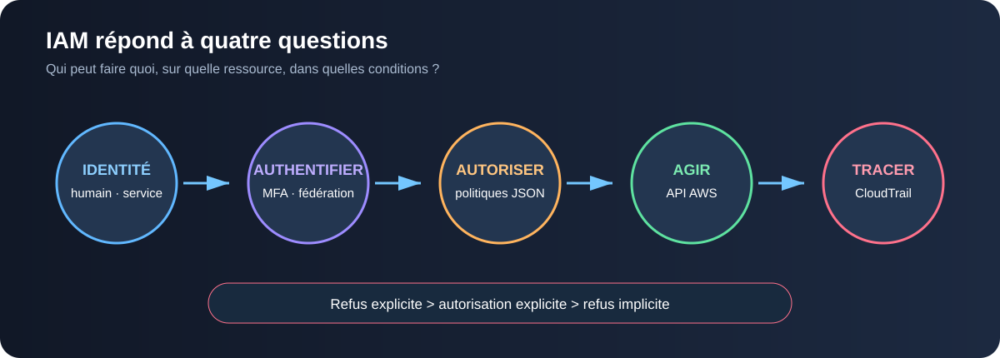

<div class="concept-check">
<strong>Décision de sécurité — avant de poursuivre</strong>
<p>Une application EC2 doit lire un seul bucket S3. Faut-il placer des clés d'accès dans un fichier de configuration ?</p>
<details><summary>Afficher la réponse raisonnée</summary><p>Non. On attache à l'instance un rôle IAM autorisant uniquement les actions nécessaires sur ce bucket. AWS STS fournit ensuite des identifiants temporaires à l'application.</p></details>
</div>

---

## 1. Introduction à IAM : Identity and Access Management

### 1.1 Définition et rôle stratégique

**IAM (Identity and Access Management)** est le service AWS qui permet de **gérer les identités**, **les permissions** et **les politiques d'accès** aux ressources AWS.

IAM est à la sécurité ce que la serrure est à une porte. Il constitue **le cœur de la gouvernance des accès** dans un environnement AWS.

- IAM contrôle **qui** peut faire **quoi** sur **quelle ressource**, et **dans quelles conditions**.
- Il permet de sécuriser les accès au niveau le plus granulaire possible.
- Il est un prérequis à toute architecture bien conçue sur AWS.

IAM fonctionne comme un contrôleur central placé entre deux mondes : d'un côté les **identités** (utilisateurs, groupes, rôles, services AWS), de l'autre les **ressources AWS** qu'elles cherchent à atteindre (S3, EC2, RDS, Lambda…). Chaque requête suit le même chemin : une identité émet un appel API, IAM évalue les **politiques JSON** qui lui sont associées, puis autorise (`Allow`) ou refuse (`Deny`) l'accès à la ressource visée.

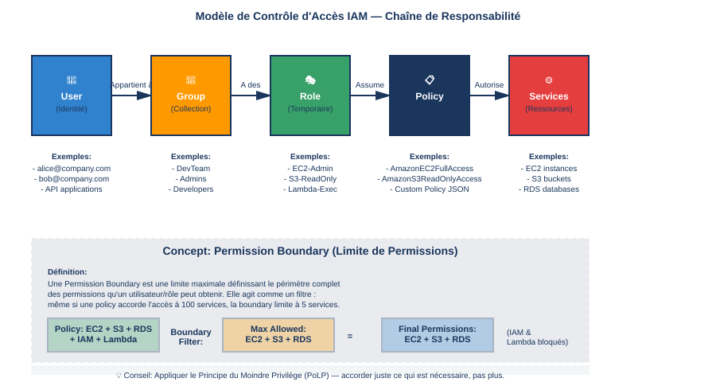

Ce schéma résume le principe : aucune ressource AWS n'est jamais contactée directement par une identité sans passer par cette évaluation IAM — c'est ce mécanisme, invisible mais systématique, qui rend possible le contrôle d'accès au niveau le plus granulaire.

📎 [Documentation officielle AWS IAM](https://docs.aws.amazon.com/IAM/latest/UserGuide/introduction.html)

---

### 1.2 Concepts fondamentaux d'IAM

#### Utilisateur IAM

Un **utilisateur IAM** représente une identité permanente dans AWS, associée à des identifiants (login/mot de passe ou clés d'accès). Il est utilisé pour représenter une personne ou une application qui interagit avec les services AWS.

*C'est comme un badge nominatif d'employé : il donne un accès personnel et identifiable au système.*

---

#### Groupe IAM

Un **groupe IAM** est une collection logique d'utilisateurs qui partagent les mêmes permissions. Il permet d'appliquer des politiques communes à plusieurs utilisateurs, comme les membres d'une équipe Dev, les administrateurs ou les lecteurs.

*C'est comme un département dans une entreprise (ex. IT, Marketing, Finance) : tous les membres ont les mêmes règles d'accès.*

---

#### Rôle IAM

Un **rôle IAM** est une identité temporaire que l'on peut assumer pour accéder à des ressources AWS. Il est utilisé par des services AWS (comme EC2 ou Lambda), ou pour permettre l'accès entre comptes ou via une fédération d'identités.

*C'est comme un badge visiteur temporaire : il donne un accès limité dans le temps à certaines zones.*

---

#### Politique IAM

Une **politique IAM** est un document JSON qui définit précisément les permissions accordées ou refusées. Elle permet de contrôler les actions autorisées sur les ressources AWS.

*C'est comme un règlement intérieur : il définit ce qui est autorisé ou interdit pour chaque profil.*

---

#### MFA (Multi-Factor Authentication)

Le **MFA** ajoute une couche de sécurité en exigeant un second facteur d'authentification, comme un code temporaire ou une clé physique, en plus du mot de passe.

*C'est comme une double serrure : il faut une clé et un code pour ouvrir la porte.*

---

#### STS (Security Token Service)

Le **STS** permet de générer des identifiants temporaires pour accéder à AWS, avec une durée limitée (15 minutes à 12 heures). Il est idéal pour déléguer des accès sans exposer de credentials permanents.

*C'est comme un badge temporaire valable quelques heures : il expire automatiquement après usage.*

Sans STS, chaque utilisateur devrait avoir des identifiants IAM permanents dans chaque compte AWS, avec des permissions fixes. Cela rendrait la gestion des accès lourde, risquée, et peu compatible avec les standards modernes d'authentification.

:::danger
**Ne jamais utiliser le compte root pour les opérations courantes.** Le compte root AWS dispose de tous les droits sans restriction — il n'est pas soumis aux politiques IAM. Toute compromission du root expose l'intégralité du compte. Créez immédiatement un utilisateur IAM administrateur, activez MFA sur le root, puis verrouillez les credentials root.
:::

---

### 1.3 Modèle de responsabilité partagée appliqué à la sécurité

Observons le modèle de responsabilité partagée appliqué à la sécurité.

| Élément | Responsabilité AWS | Responsabilité Client |
|---------|-------|------|
| Infrastructure physique | ✅ | ❌ |
| Réseau global | ✅ | ❌ |
| Contrôle d'accès utilisateur | ❌ | ✅ |
| Stratégies IAM | ❌ | ✅ |
| Configuration du chiffrement | ❌ | ✅ |
| Gestion des identités externes | ❌ | ✅ |

Ce tableau résume la philosophie d'AWS :
> « AWS sécurise le cloud, vous sécurisez ce que vous y déployez ».

Il est important de rappeler qu'IAM ne se limite pas à la gestion d'utilisateurs. Il s'agit d'un **système d'autorisation distribué** qui s'applique aussi aux services AWS eux-mêmes, aux rôles inter-comptes et aux identités fédérées.

---

### 1.4 Exemple concret d'organisation des accès

Un administrateur met en place une **stratégie de sécurité structurée** :

- Groupe `Admins` → droits complets sur le compte AWS.
- Groupe `Developers` → accès restreint à **EC2** et **S3**.
- Groupe `Comptabilité` → lecture seule sur la facturation (Billing).

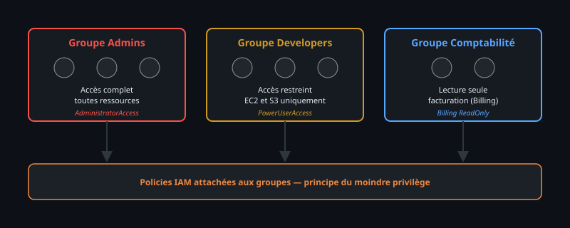

Chaque groupe reçoit une **policy JSON adaptée**, garantissant le **principe du moindre privilège** — le détail de la syntaxe JSON de ces policies est développé juste après, en §1.5.

---

### 1.5 Structure d'une politique IAM — Exemple concret

#### Policy : Lecture seule sur S3

Cette politique illustre la syntaxe de base d'une policy IAM. Notez les quatre champs obligatoires : `Version`, `Statement`, `Effect`, `Action`, et `Resource`.

```json
{
  "Version": "2012-10-17",
  "Statement": [
    {
      "Effect": "Allow",
      "Action": [
        "s3:GetObject",
        "s3:ListBucket"
      ],
      "Resource": "*"
    }
  ]
}
```

Cette policy donne aux membres du groupe uniquement la possibilité de **lister et lire les objets S3**.

---

#### Policy : Accès restreint à un bucket spécifique

Pour restreindre l'accès à **un bucket précis** (et non à tout S3), on remplace `"Resource": "*"` par l'ARN du bucket cible.

```json
{
  "Version": "2012-10-17",
  "Statement": [
    {
      "Effect": "Allow",
      "Action": [
        "s3:GetObject",
        "s3:ListBucket"
      ],
      "Resource": [
        "arn:aws:s3:::mon-bucket-secret",
        "arn:aws:s3:::mon-bucket-secret/*"
      ]
    }
  ]
}
```

Cette policy autorise la lecture d'objets S3 dans le bucket `mon-bucket-secret`, **mais uniquement si l'utilisateur est connecté depuis une IP comprise dans `203.0.113.0/24`**.

---

### 1.6 IAM Policy Evaluation Logic

Le **IAM Policy Evaluation Logic** est le **mécanisme interne d'AWS** qui détermine **si une action est autorisée ou refusée** lorsqu'un utilisateur ou un rôle tente d'accéder à une ressource AWS (ex : S3, EC2, RDS…).

> En d'autres termes : **c'est la logique de décision** qu'AWS applique pour savoir si une requête doit être acceptée ou rejetée.

Il est utilisé **à chaque fois qu'un utilisateur, un rôle ou un service** tente d'effectuer une action sur une ressource AWS.

Exemples :
- Un utilisateur veut lire un fichier dans S3 → AWS vérifie les politiques IAM
- Un rôle Lambda veut écrire dans DynamoDB → AWS vérifie les politiques IAM
- Un service EC2 veut accéder à un secret → AWS vérifie les politiques IAM

AWS suit **trois règles fondamentales**, dans cet ordre :

1. **Deny explicite** → priorité absolue

   Si une politique dit **"Effect": "Deny"**, l'accès est **refusé**, même si une autre politique dit "Allow".

2. **Allow explicite** → si aucun Deny

   Si une politique dit **"Effect": "Allow"**, et qu'il n'y a pas de Deny, l'accès est **autorisé**.

3. **Pas de politique = refus implicite**

   Si aucune politique ne couvre l'action demandée, l'accès est **refusé par défaut**.

📎 [Policy Evaluation Logic](https://docs.aws.amazon.com/IAM/latest/UserGuide/reference_policies_evaluation-logic.html)

📎 [Policy Simulator](https://policysim.aws.amazon.com/home/index.jsp)

:::warning
**Principe du moindre privilège (Least Privilege).** Ne jamais attribuer `"Action": "*"` ou `"Resource": "*"` en production. Accordez uniquement les permissions strictement nécessaires à la tâche. En cas de doute, commencez par un accès minimal et élargissez progressivement selon les besoins réels.
:::

---

### 1.7 Services IAM complémentaires

|Service|Rôle|
|---|---|
|**AWS Organizations**|Gestion centralisée de plusieurs comptes AWS (OU, SCP, facturation consolidée).|
|**AWS STS (Security Token Service)**|Génère des identifiants temporaires sécurisés.|
|**Amazon Cognito**|Gestion d'utilisateurs finaux (authentification applicative).|
|**IAM Identity Center (ex-SSO)**|Authentification unique (SSO) sur plusieurs comptes et applications.|

📎 [AWS Organizations](https://docs.aws.amazon.com/organizations/)

📎 [STS Documentation](https://docs.aws.amazon.com/STS/latest/APIReference/welcome.html)

📎 [Amazon Cognito](https://docs.aws.amazon.com/cognito/)

📎 [IAM Identity Center](https://docs.aws.amazon.com/singlesignon/)

---

## 2. Sécuriser les accès IAM avec MFA et politiques conditionnelles

### 2.1 Pourquoi MFA et politiques conditionnelles ?

Dans tout système d'information, la sécurité ne repose pas seulement sur **qui est connecté**, mais aussi sur **comment** cette connexion est sécurisée.

Sur AWS, **l'authentification multifacteur (MFA)** est une mesure essentielle pour réduire les risques liés aux accès non autorisés — en particulier sur les comptes disposant de privilèges élevés (root, admin, DevOps…).

L'activation de MFA fait partie des **bonnes pratiques fondamentales** recommandées par AWS dès la création d'un compte.

Mais MFA n'est pas seulement un bouton à cocher : combinée aux **politiques conditionnelles IAM**, elle permet de mettre en place une **sécurité contextuelle et granulaire**.

📎 [AWS MFA - Documentation](https://docs.aws.amazon.com/IAM/latest/UserGuide/id_credentials_mfa.html)

---

### 2.2 Comprendre MFA

#### Définition

**MFA (Multi-Factor Authentication)** est un mécanisme de sécurité qui nécessite **au moins deux méthodes d'authentification indépendantes** :

1. **Quelque chose que vous savez** → mot de passe, clé d'accès.
2. **Quelque chose que vous possédez** → application MFA (ex : Authenticator) ou clé physique (YubiKey).
3. (Optionnel) **Quelque chose que vous êtes** → biométrie.

Dans AWS, la MFA s'applique :
- au compte **root**,
- aux **utilisateurs IAM**,
- aux **rôles** via AWS CLI ou API,
- aux **accès fédérés**.

---

#### Types de MFA supportés

| Type | Description | Exemples |
|------|-------------|-----------|
| MFA virtuelle | Application mobile (TOTP) | Google Authenticator, Authy, Microsoft Authenticator |
| MFA matérielle | Clé physique dédiée | YubiKey, Gemalto |
| Passkey / FIDO2 | Authentification sans mot de passe | Clé biométrique ou physique compatible FIDO |

**Gemalto** est un fabricant (aujourd'hui filiale de Thales) de clés de sécurité physiques concurrentes de YubiKey — les deux fonctionnent selon le même principe : un petit boîtier USB ou NFC à brancher/approcher pour valider la connexion, sans code à recopier. **FIDO2** (Fast IDentity Online 2) est le standard ouvert sur lequel reposent ces clés biométriques ou physiques : il définit comment le navigateur, l'appareil et le service en ligne dialoguent pour vérifier votre identité sans jamais transmettre de mot de passe — c'est la même technologie qui permet de se connecter avec son empreinte digitale ou Face ID sur un site compatible.

---

### 2.3 Bonnes pratiques AWS sur MFA

- Toujours activer MFA sur le **compte root** (obligatoire en production).
- Exiger MFA pour tous les utilisateurs **ayant des privilèges élevés**.
- Automatiser la vérification de MFA via **AWS Config** ou **Security Hub**.
- Interdire les actions sensibles (ex : suppression d'instances, modification de policies) sans MFA.

📎 [AWS Security Best Practices](https://docs.aws.amazon.com/IAM/latest/UserGuide/best-practices.html)

:::danger
**MFA obligatoire sur le compte root et tous les comptes administrateurs.** Une connexion sans MFA sur un compte à privilèges élevés est la principale cause de compromission de comptes AWS. AWS Security Hub et IAM Access Analyzer peuvent détecter automatiquement les comptes sans MFA et générer des alertes.
:::

---

### 2.4 Audit de MFA avec AWS Config

AWS Config permet de vérifier automatiquement que les utilisateurs IAM ont bien activé MFA.

Exemple de règle : `iam-user-mfa-enabled`

📎 [AWS Config Rules](https://docs.aws.amazon.com/config/latest/developerguide/iam-user-mfa-enabled.html)

---

### 2.5 Politiques conditionnelles IAM

Une **policy conditionnelle** permet d'ajouter des **règles contextuelles** à une politique IAM classique.

Cela permet d'aller **au-delà des permissions statiques** en intégrant des critères comme :
- la présence ou non de MFA,
- l'adresse IP source,
- la région AWS,
- l'heure,
- le VPC Endpoint utilisé.

La clé `Condition` dans une policy JSON contrôle ces règles.

---

### 2.6 Exemples de politiques conditionnelles

#### Exiger MFA pour les actions sensibles

La clé `Condition` permet d'ajouter des critères supplémentaires à une policy. Voici comment bloquer **toutes les actions** si l'utilisateur n'a pas activé MFA pour sa session en cours :

```json
{
  "Version": "2012-10-17",
  "Statement": [
    {
      "Effect": "Deny",
      "Action": "*",
      "Resource": "*",
      "Condition": {
        "BoolIfExists": {
          "aws:MultiFactorAuthPresent": "false"
        }
      }
    }
  ]
}
```

Cette policy **refuse toute action** si MFA n'est pas activée pour la session.

Elle peut être attachée à :
* un groupe d'administrateurs,
* un utilisateur,
* un rôle IAM.

Remarque : cette approche est **préférée** à un simple "Allow MFA" car elle couvre tous les cas par défaut.

---

#### Restreindre les accès à une IP spécifique

Pour n'autoriser les connexions que depuis un réseau d'entreprise (VPN ou bureau), on utilise la condition `aws:SourceIp`. Ici, `NotIpAddress` signifie "si l'IP n'est PAS dans cette plage, refuser" :

```json
{
  "Version": "2012-10-17",
  "Statement": [
    {
      "Effect": "Deny",
      "Action": "*",
      "Resource": "*",
      "Condition": {
        "NotIpAddress": {
          "aws:SourceIp": "203.0.113.0/24"
        }
      }
    }
  ]
}
```

Cette policy **refuse toute action** si la connexion ne provient pas de l'adresse IP autorisée.

Combinée à MFA, elle renforce la **sécurité d'accès des administrateurs**.

---

#### Politique combinée IP + MFA

Les conditions se combinent avec un **ET logique** : toutes doivent être vraies pour que l'accès soit autorisé. C'est la politique la plus stricte — idéale pour les comptes administrateurs :

```json
{
  "Version": "2012-10-17",
  "Statement": [
    {
      "Effect": "Deny",
      "Action": "*",
      "Resource": "*",
      "Condition": {
        "BoolIfExists": {
          "aws:MultiFactorAuthPresent": "false"
        },
        "NotIpAddress": {
          "aws:SourceIp": "203.0.113.0/24"
        }
      }
    }
  ]
}
```

Ici, l'accès n'est autorisé que si :

* l'utilisateur se connecte **depuis l'IP autorisée**
  ET
* **MFA est activée**.

📎 [IAM Policy Elements - Condition](https://docs.aws.amazon.com/IAM/latest/UserGuide/reference_policies_elements_condition.html)

---

### 2.7 Bonnes pratiques et points d'attention

* MFA ne remplace pas les bonnes politiques IAM, elle **les renforce**.
* Toujours combiner MFA avec une politique conditionnelle.
* Documenter les exceptions éventuelles (services automatisés, CI/CD).
* Tester systématiquement les policies dans **Policy Simulator** avant déploiement.


---

### 2.8 STS (Security Token Service) — Identity Broker en détail

### Qu'est-ce qu'une identité temporaire ?

Jusqu'à présent, nous avons parlé d'**identités permanentes** :
- Un utilisateur IAM a un **login/mot de passe** et des **clés d'accès** permanents.
- Un rôle IAM reçoit des permissions via une policy.

Mais dans une architecture moderne, il est souvent risqué de **distribuer des credentials permanents**. C'est où intervient **AWS STS (Security Token Service)**.

**STS génère des identifiants temporaires** (valides quelques minutes à quelques heures), qui expirent automatiquement sans intervention manuelle.

*C'est comme un badge visiteur qui se détruit après 24 heures : il n'y a rien à récupérer après son expiration.*

### Comment fonctionne STS ?

Le processus est simple :
1. Un utilisateur ou service demande un token STS.
2. STS valide la demande (qui êtes-vous ? avez-vous le droit ?).
3. STS émet **un set de credentials temporaires** : AccessKeyId, SecretAccessKey, et SessionToken.
4. Ces credentials permettent d'accéder à AWS pendant leur durée de validité.
5. À l'expiration, les credentials deviennent inutilisables.

### STS Identity Broker — Cas d'usage concret

Un **Identity Broker** est un système qui :
1. Authentifie un utilisateur via un système externe (AD, LDAP, SSO, application custom).
2. Contacte STS pour obtenir des credentials AWS temporaires.
3. Retourne ces credentials à l'utilisateur.

Cela permet aux utilisateurs d'accéder à AWS **sans avoir de compte IAM permanent**, et sans exposer d'accès clés stockés durablement.

### Exemple : Intégration avec un système LDAP corporate

Une entreprise utilise **LDAP interne** pour gérer ses employés. Elle souhaite que ces employés accèdent à AWS **sans créer de comptes IAM**.

**Approche sans STS (mauvaise)** :
- Créer un compte IAM pour chaque employé.
- Distribuer des clés d'accès à chacun.
- Gérer les mots de passe dans deux systèmes (LDAP + IAM).
- Déploiement manuel, complexe, peu sécurisé.

**Approche avec STS Identity Broker (correcte)** :
1. L'employé se connecte à un **portail interne** avec ses identifiants LDAP.
2. Le portail authentifie l'utilisateur contre LDAP.
3. Le portail contacte STS via une API : *« Cet utilisateur veut un token AWS »*.
4. STS retourne des credentials temporaires.
5. Le portail affiche à l'employé un **lien direct vers la console AWS** avec ces credentials.
6. L'employé clique, se connecte à AWS, et accède aux ressources autorisées.
7. **Aucun compte IAM permanent n'a été créé**.

### Flux technique de STS

```
Utilisateur (LDAP)
    ↓
    [Se connecte au portail interne]
    ↓
Portail / Broker
    ↓
    [Appel API STS : sts:GetCallerIdentity ou sts:AssumeRole]
    ↓
AWS STS
    ↓
    [Retourne : AccessKeyId, SecretAccessKey, SessionToken, Expiration]
    ↓
Portail (reçoit les credentials)
    ↓
    [Génère un lien de connexion AWS Manager Console]
    ↓
Utilisateur accède à AWS Console (valide 1 heure, puis expiration)
```

### Types de requêtes STS courantes

| Opération STS | Cas d'usage | Durée de validité |
|---|---|---|
| **GetCallerIdentity** | Vérifier qui vous êtes | N/A (détection) |
| **AssumeRole** | Un utilisateur IAM/fédéré assume un rôle | 1 heure (configurable) |
| **GetSessionToken** | Obtenir des credentials temporaires pour l'utilisateur courant | 1 heure à 36 heures |
| **AssumeRoleWithSAML** | Assumer un rôle via assertion SAML (fédération) | 1 heure |
| **AssumeRoleWithWebIdentity** | Assumer un rôle via token JWT (OAuth/OIDC) | Configurable |

### Avantages de STS Identity Broker

- **Zéro compte IAM permanent** pour les utilisateurs fédérés.
- **Credentials automatiquement révoquées** à l'expiration.
- **Audit centralisé** via CloudTrail (qui a demandé un token, quand, d'où).
- **Intégration facile** avec les systèmes legacy (LDAP, SAP, Salesforce…).
- **MFA possible** au niveau du broker.

### Exemple de code (Python) — Simple Identity Broker

```python
import boto3
import sys

# Client STS
sts_client = boto3.client('sts')

# 1. Un utilisateur LDAP s'authentifie (simulé ici)
user = "alice"
role_arn = "arn:aws:iam::123456789012:role/FederatedUserRole"

try:
    # 2. Appel STS pour obtenir credentials temporaires
    response = sts_client.assume_role(
        RoleArn=role_arn,
        RoleSessionName=f"{user}-session",
        DurationSeconds=3600  # 1 heure
    )

    # 3. Extraire les credentials
    credentials = response['Credentials']

    print(f"AccessKeyId: {credentials['AccessKeyId']}")
    print("SecretAccessKey: <masquée volontairement>")
    print(f"SessionToken: {credentials['SessionToken']}")
    print(f"Expiration: {credentials['Expiration']}")

except Exception as e:
    print(f"Erreur STS : {e}")
```

:::success
**Résultat attendu — exécution du script Python STS :**
```
AccessKeyId: ASIA4EXAMPLESTSTEMP
SecretAccessKey: <masquée volontairement>
SessionToken: AQoDYXdzEJr//////////wEaoAK...Hgc=
Expiration: 2024-01-15 11:40:00+00:00
```
Les credentials temporaires STS se distinguent par leur `AccessKeyId` commençant par **`ASIA`** (vs `AKIA` pour les clés permanentes). Ils expirent automatiquement à l'heure indiquée — aucune révocation manuelle nécessaire.
:::

Ce code illustre comment un **broker** peut obtenir et distribuer des credentials temporaires.


📎 [AssumeRole API](https://docs.aws.amazon.com/STS/latest/APIReference/API_AssumeRole.html)

📎 [Building a custom identity broker](https://docs.aws.amazon.com/IAM/latest/UserGuide/id_roles_common-scenarios_externalid.html)

---

## 3. Fédération d'identité et SSO avec IAM Identity Center

### 3.1 Introduction à la fédération d'identité

Lorsque les entreprises grandissent, elles disposent souvent **de systèmes d'authentification déjà en place** : annuaire Active Directory, LDAP, IdP externe comme Okta ou Azure AD…

Dans ce contexte, **créer des comptes IAM manuellement pour chaque utilisateur n'est ni scalable ni sécurisé**.

C'est là qu'intervient la **fédération d'identité**, un mécanisme permettant de déléguer l'authentification à un fournisseur d'identité existant.

Sur AWS, cette fédération est gérée via **IAM Identity Center** (anciennement AWS SSO) ou via des **rôles fédérés SAML**.

Grâce à cette approche :
- les utilisateurs conservent **leurs identifiants d'entreprise**,
- aucune **gestion manuelle des mots de passe** dans AWS,
- les administrateurs appliquent des **règles centralisées de sécurité**.

📎 [Documentation IAM Identity Center](https://docs.aws.amazon.com/singlesignon/latest/userguide/what-is.html)

---

### 3.2 IAM Identity Center vs IAM classique — Clarification pour débutant

Beaucoup de stagiaires confondent ces deux concepts. Voici la différence **essentielle** :

| Critère | IAM classique | IAM Identity Center |
|---------|---------------|-------------------|
| **Pour qui ?** | Comptes AWS individuels (admins, DevOps locaux) | Organisations / Entreprises avec plusieurs comptes AWS |
| **Authentification** | Login/mot de passe IAM natif | Fédération (AD, Azure AD, Okta…) ou gestion d'utilisateurs centralisée |
| **Gestion centralisée** | Non — chaque compte gère ses propres utilisateurs | Oui — un seul endroit pour gérer tous les accès |
| **Multi-comptes** | Difficile à gérer manuellement | Natif — accès simple entre comptes |
| **MFA** | À configurer par utilisateur | Automatisé, appliqué par l'IdP |
| **Cas d'usage** | Petit équipe, POC, environnement de test | Production, conformité, grande entreprise |
| **Exemple** | Un développeur solo crée un compte IAM pour lui | Une PME avec 5 comptes AWS (Prod, Dev, Finance, etc.) |

**En pratique** :
- Petite équipe ? → IAM classique suffit.
- Entreprise avec AD ? → IAM Identity Center connecté à l'AD.
- Application web avec utilisateurs finaux ? → Cognito (section 5).

---

### 3.3 Définitions clés

| Terme | Définition |
|-------|-----------|
| **Fédération d'identité** | Mécanisme qui permet à des utilisateurs authentifiés par un fournisseur d'identité externe d'accéder à AWS sans compte IAM natif. |
| **IdP (Identity Provider)** | Service qui authentifie les utilisateurs (AD FS, Azure AD, Okta, PingIdentity…). |
| **SP (Service Provider)** | Service AWS qui consomme l'identité validée par l'IdP. |
| **SAML (Security Assertion Markup Language)** | Protocole standard pour la fédération d'identité entre systèmes d'entreprise et cloud. |
| **OAuth / OIDC (OpenID Connect)** | Protocole moderne de délégation d'accès, souvent utilisé pour les applications web et mobiles. |
| **IAM Identity Center** | Service AWS permettant de gérer l'accès fédéré et le Single Sign-On (SSO). |

---

### 3.4 Architecture de la fédération d'identité avec AWS

1. L'utilisateur s'authentifie via l'IdP de l'entreprise (par exemple, Active Directory).
2. L'IdP émet une **assertion SAML** ou un **token OIDC**.
3. AWS IAM Identity Center valide cette assertion.
4. Un **rôle IAM fédéré** est attribué à l'utilisateur.
5. L'utilisateur accède à la console ou à l'API AWS selon ses permissions.

Le schéma détaillé de ce flux, avec l'implémentation concrète AD FS, est présenté juste après en §3.5.

---

### 3.5 Active Directory Federation Services (AD FS) et SAML — Implémentation pratique

**AD FS** est un service **Microsoft** qui joue le rôle d'**Identity Provider (IdP)** pour les entreprises utilisant **Windows Server Active Directory**.

Pour une entreprise ayant un **AD local** ou **Azure AD**, AD FS permet de créer un **pont de confiance** vers AWS via le protocole **SAML**.

#### Architecture générale : AD FS → AWS IAM

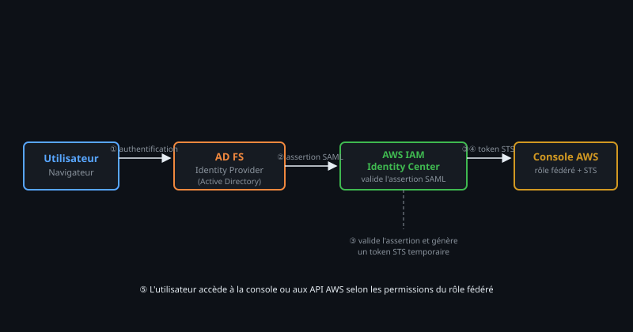

#### Étapes de mise en place (Vue d'ensemble pour débutant)

1. **Configurer AD FS comme provider SAML**
   - En entreprise, l'administrateur AD crée une "application cloud" dans AD FS.
   - Cette application est configurée pour accepter les demandes de connexion AWS.

2. **Créer un fournisseur d'identité SAML dans AWS IAM**
   - Console AWS → IAM → Identity Providers → Create Provider.
   - Type : SAML.
   - Télécharger les **métadonnées SAML** d'AD FS (fichier XML).

3. **Créer un rôle IAM fédéré**
   - Console AWS → IAM → Roles → Create Role.
   - Type de confiance : **Federated Provider** (SAML).
   - Sélectionner le provider créé à l'étape 2.
   - Attacher des policies (ex. : `AmazonS3ReadOnlyAccess` pour les développeurs).

4. **Mapper les groupes AD aux rôles IAM**
   - Les groupes AD (ex. `AWS-Developers`, `AWS-Admins`) sont mappés à des rôles IAM.
   - Quand un employé du groupe `AWS-Developers` se connecte, il reçoit automatiquement le rôle associé.

5. **Distribuer le lien SSO aux utilisateurs**
   - Les utilisateurs reçoivent un **lien unique** (ex. : `https://monentreprise.com/adfs/ls/idpinitiatedsignon.aspx`).
   - En cliquant, ils sont authentifiés contre l'AD et automatiquement connectés à AWS.

#### Exemple de Trust Policy SAML (pour IAM Role)

```json
{
  "Version": "2012-10-17",
  "Statement": [
    {
      "Effect": "Allow",
      "Principal": {
        "Federated": "arn:aws:iam::123456789012:saml-provider/ADFS"
      },
      "Action": "sts:AssumeRoleWithSAML",
      "Condition": {
        "StringEquals": {
          "SAML:aud": "https://signin.aws.amazon.com/saml"
        }
      }
    }
  ]
}
```

Explication :
- `Principal` : indique qui peut assumer ce rôle (ici, le provider SAML `ADFS`).
- `Action` : l'action autorisée (`AssumeRoleWithSAML` pour les assertions SAML).
- `Condition` : vérification que la demande vient réellement d'AWS (protection).

#### Avantages de cette approche

- Les utilisateurs **n'ont aucun compte IAM** (zéro gestion manuelle).
- L'authentification reste **centralisée** en AD (changement de mot de passe une seule fois).
- **MFA en AD** s'applique automatiquement à AWS.
- Impossible de partager des credentials IAM (car ils n'existent pas).
- **Audit centralisé** : CloudTrail enregistre qui s'est connecté, quand, et depuis où.

#### Points de vigilance

- Les **métadonnées SAML** (certificats) ont une date d'expiration. Il faut les renouveler régulièrement.
- La **confiance de certificat** doit être validée côté AWS.
- Si AD FS tombe, les utilisateurs **ne peuvent plus accéder à AWS** (prévoir un backup ou un accès d'urgence).

:::warning
**Single Point of Failure SAML.** Si l'IdP (AD FS, Azure AD, Okta) devient indisponible, tous les accès fédérés AWS sont coupés. Prévoyez toujours un compte IAM d'urgence ("break-glass account") avec MFA, stocké en lieu sûr, pour récupérer l'accès en cas de panne de l'IdP.
:::

📎 [Configuring AD FS as SAML Provider](https://docs.aws.amazon.com/singlesignon/latest/userguide/adfs.html)

📎 [SAML Provider in IAM](https://docs.aws.amazon.com/IAM/latest/UserGuide/id_roles_providers_saml.html)

📎 [AssumeRoleWithSAML API](https://docs.aws.amazon.com/STS/latest/APIReference/API_AssumeRoleWithSAML.html)

---

### 3.6 Pourquoi utiliser la fédération d'identité ?

La fédération d'identité résout un problème très concret : dans une entreprise qui possède déjà un annuaire (Active Directory, LDAP, ou un fournisseur SSO cloud), créer un compte IAM distinct pour chaque employé signifie gérer deux systèmes d'identité en parallèle, avec le risque de désynchronisation que cela implique.

La gestion des identités et des mots de passe devient **centralisée** : c'est l'annuaire d'entreprise qui reste la source de vérité, et AWS ne fait que consommer les assertions d'authentification qu'il produit. Les politiques de sécurité déjà en place dans l'entreprise — complexité des mots de passe, durée de vie des sessions, restrictions d'accès — s'appliquent automatiquement à AWS sans duplication de configuration. Le nombre de comptes IAM permanents diminue fortement, puisque chaque connexion fédérée génère des identifiants temporaires plutôt qu'un compte durable : moins de comptes permanents, c'est mécaniquement moins de surface d'attaque en cas de fuite de identifiants. La traçabilité et la conformité s'en trouvent également améliorées, car chaque accès fédéré peut être rattaché à l'identité réelle de l'employé dans l'annuaire d'entreprise, plutôt qu'à un compte IAM générique partagé. Enfin, l'activation du MFA et des règles conditionnelles se fait souvent plus simplement au niveau de l'IdP (Identity Provider) qu'en la répétant pour chaque compte IAM individuel.

📎 [AWS Best Practices for SSO](https://docs.aws.amazon.com/singlesignon/latest/userguide/best-practices.html)

---

### 3.7 Exemple de scénario concret

Une entreprise dispose déjà d'un Active Directory local.

Elle souhaite que ses développeurs se connectent à la console AWS **avec leurs identifiants Windows**.

- Mise en place d'un **AD Connector** ou AWS Directory Service.
- Configuration d'AD FS comme IdP SAML.
- IAM Identity Center est configuré pour accepter les assertions SAML d'AD FS.
- Un rôle IAM fédéré "DeveloperRole" est mappé sur un groupe AD "AWS-Dev".
- Les développeurs accèdent à AWS en cliquant sur une URL SSO interne.

Résultat :
- Pas de création de comptes IAM individuels,
- Permissions gérées via AD,
- Accès tracé et sécurisé.


---

### 3.8 Intégration avec Azure AD et Okta

IAM Identity Center permet une intégration native avec :

- **Azure AD** via SAML ou SCIM
- **Okta** via SAML ou OIDC

Cela permet de synchroniser les groupes et utilisateurs automatiquement.

📎 [Azure AD Integration](https://docs.aws.amazon.com/singlesignon/latest/userguide/integrating-azure-ad.html)

📎 [Okta Integration](https://docs.aws.amazon.com/singlesignon/latest/userguide/okta.html)

---

### 3.9 Points de vigilance et bonnes pratiques

* Préférer la fédération d'identité à la multiplication des comptes IAM.
* Activer MFA au niveau de l'IdP.
* Bien cartographier les groupes AD vers les rôles IAM.
* Tenir à jour les métadonnées SAML (certificats, endpoints).
* Surveiller les connexions via CloudTrail.

📹 [AWS IAM : comment gérer les permissions de ses équipes ?](https://www.youtube.com/watch?v=ZMHlBza1l1A)

---

## 4. Amazon Cognito : gestion d'identités applicatives

### 4.1 Différence : IAM vs Cognito

Souvent, les stagiaires confondent IAM et Cognito. C'est normal — ce sont tous les deux des services d'identité. Mais ils n'ont **pas le même public** :

- **IAM** = gestion des identités **administratives** (accès AWS pour l'équipe IT/DevOps).
- **Amazon Cognito** = gestion des identités **applicatives** (accès à une application web ou mobile pour les utilisateurs finaux).

**Amazon Cognito** est un service AWS qui permet de gérer l'authentification et l'autorisation des utilisateurs dans les applications web et mobiles. Il permet de créer des **pools d'utilisateurs** (User Pools) et de connecter des **fournisseurs d'identité externes** (Google, Facebook, SAML, etc.).

---

### 4.2 Cas d'usage typique

Une application web souhaite permettre à ses utilisateurs de se connecter avec leur compte Google ou via un login/mot de passe.

L'application utilise Cognito pour gérer les sessions, les jetons d'accès, et les droits d'accès aux ressources AWS.

---

### 4.3 Concepts clés

- **User Pool** : base d'utilisateurs gérée par Cognito (inscription, mot de passe, MFA, etc.).
- **Identity Pool** : permet d'obtenir des **credentials AWS temporaires** pour accéder à des services comme S3 ou DynamoDB.
- **Fédération d'identité** : possibilité de déléguer l'authentification à un fournisseur externe (SAML, OAuth2).

Cognito est souvent utilisé dans les architectures serverless ou mobiles. Il permet de sécuriser l'accès aux ressources AWS sans exposer de credentials statiques.

📎 [Amazon Cognito — Guide officiel](https://docs.aws.amazon.com/cognito/latest/developerguide/cognito-user-identity-pools.html)

---

## 5. Stratégie multi-comptes avec AWS Organizations

### 5.1 Problématique

Lorsqu'une entreprise évolue et déploie de plus en plus de workloads dans AWS, **gérer toutes les ressources dans un seul compte devient vite risqué et ingérable** :

- Risques de sécurité accrus (trop de permissions dans un même périmètre).
- Facturation difficile à segmenter.
- Difficile d'appliquer des politiques globales cohérentes.
- Problèmes de conformité et de cloisonnement des environnements.

---

### 5.2 Introduction à AWS Organizations

Pour répondre à ces enjeux, AWS propose **AWS Organizations**, un service qui permet de **centraliser la gouvernance de plusieurs comptes AWS** tout en conservant une séparation stricte des environnements.

La structure hiérarchique complète — Management Account, OU et SCP associées — est illustrée en §5.8 avec un exemple concret à 4 comptes.

📎 [Documentation officielle AWS Organizations](https://docs.aws.amazon.com/organizations/latest/userguide/orgs_introduction.html)

---

### 5.3 Définition

> **AWS Organizations** est un service qui permet de créer et de gérer plusieurs comptes AWS depuis une seule organisation centrale, d'appliquer des politiques globales et d'unifier la facturation.

Il facilite :
- la **structuration logique** des environnements (prod, dev, test…),
- l'application **de politiques de sécurité globales**,
- la **centralisation de la facturation**,
- la **gestion simplifiée des identités et des accès** à grande échelle.

---

### 5.4 Concepts clés d'AWS Organizations

| Élément | Définition |
|---------|-----------|
| **Organisation** | Ensemble de comptes AWS sous une gouvernance centralisée. |
| **Management Account** | Compte maître utilisé pour créer et gérer l'organisation. |
| **Member Accounts** | Comptes membres, rattachés et gérés via l'organisation. |
| **OU (Organizational Unit)** | Groupe logique de comptes AWS (par fonction ou par environnement). |
| **SCP (Service Control Policy)** | Politique globale qui définit les actions maximales autorisées dans les comptes membres. |

📎 [AWS Organizations Concepts](https://docs.aws.amazon.com/organizations/latest/userguide/orgs_getting-started_concepts.html)

---

### 5.5 Exemple d'architecture multi-comptes

Une entreprise met en place une **stratégie à 4 comptes** :

- `Management` → Compte central de gouvernance et facturation.
- `Production` → Applications critiques.
- `Développement` → Tests et intégrations.
- `Sandbox` → Environnement libre pour expérimenter.

Ces comptes sont regroupés dans des OU distinctes et **sécurisés par des SCP** adaptées :

- SCP sur `Sandbox` → Interdire la suppression de budgets et d'alertes.
- SCP sur `Production` → Interdire toute modification réseau sans validation.
- SCP globale → Interdire l'utilisation de certaines régions AWS.

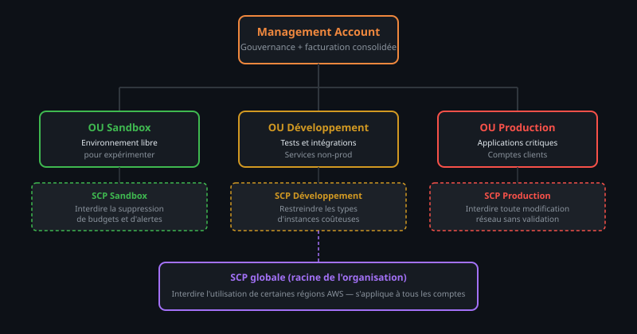

Ce schéma illustre la hiérarchie complète : le **Management Account** en racine centralise la gouvernance et la facturation consolidée de l'ensemble des comptes ; chaque OU porte sa propre SCP adaptée à son niveau de risque (Sandbox très restreinte sur la suppression de ressources de suivi budgétaire, Production verrouillée sur toute modification réseau) ; et une SCP globale attachée à la racine s'applique uniformément à tous les comptes, quelle que soit leur OU — c'est le niveau approprié pour une contrainte transverse comme l'interdiction de régions AWS non autorisées.

---

### 5.6 Service Control Policies (SCP) — Clarification

Les **SCP** sont des politiques qui **définissent la limite supérieure** des permissions dans un compte membre.

Elles **ne donnent pas de permissions** directement mais **restreignent** ce que les policies IAM peuvent autoriser.

#### SCP vs IAM Policy — Différence essentielle

Beaucoup de stagiaires confondent **SCP** et **IAM Policy**. Voici la différence cruciale :

| Aspect | IAM Policy | SCP |
|--------|-----------|-----|
| **Fonction** | DONNE les permissions | LIMITE les permissions (plafond) |
| **Niveau** | S'applique à un utilisateur, groupe ou rôle IAM | S'applique à tout un compte ou OU |
| **Évaluation** | "Puis-je faire cela ?" | "Le compte autorise-t-il cela ?" |
| **Exemples** | `Allow s3:GetObject`, `Deny ec2:RunInstances` | `Deny iam:CreateUser`, `Deny *:* (sauf S3)` |
| **Cas bloqué** | Un utilisateur sans policy = accès refusé | Un utilisateur avec Allow, mais SCP refuse = accès refusé |

#### Analogie : Restaurant avec zones interdites

- **IAM Policy** = "Alice peut commander des plats du menu".
- **SCP** = "Personne dans le restaurant ne peut avoir d'alcool" (limite absolue).

Même si Alice a l'autorisation IAM, la SCP l'empêche de commander de l'alcool.

#### Ordre d'évaluation des permissions

```
1. SCP évalue : "Est-ce que le compte autorise cela ?"
   - Si Deny → Accès refusé (STOP)
   - Si Allow ou neutre → Continue

2. IAM Policy évalue : "Est-ce que l'utilisateur a la permission ?"
   - Si Deny explicite → Accès refusé (STOP)
   - Si Allow explicite → Accès autorisé
   - Si rien → Accès refusé (par défaut)

Résultat final = SCP AND IAM Policy
```

**Exemple concret** :
- Un utilisateur a une IAM Policy : `Allow ec2:*` (tous les droits EC2).
- Mais l'OU a une SCP : `Deny ec2:RunInstances` (interdire lancer des instances).
- **Résultat** : L'utilisateur peut faire presque tout avec EC2 **sauf lancer des instances**.

---

### 5.7 Exemples SCP : Cas courants en entreprise

#### Exemple 1 : Interdire la création de ressources en dehors de `eu-west-3`

**Contexte** : L'entreprise doit rester conforme au RGPD (données en Europe).

```json
{
  "Version": "2012-10-17",
  "Statement": [
    {
      "Effect": "Deny",
      "Action": "*",
      "Resource": "*",
      "Condition": {
        "StringNotEquals": {
          "aws:RequestedRegion": "eu-west-3"
        }
      }
    }
  ]
}
```

**Effet** : Les développeurs peuvent utiliser AWS, mais **toutes les ressources doivent être en région Paris** (`eu-west-3`). Les régions US/Asie sont bloquées.

#### Exemple 2 : Interdire la suppression de certaines ressources critiques

**Contexte** : Les stagiaires ne doivent pas pouvoir supprimer les RDS ou les VPC de production.

```json
{
  "Version": "2012-10-17",
  "Statement": [
    {
      "Effect": "Deny",
      "Action": [
        "rds:DeleteDBInstance",
        "rds:DeleteDBCluster",
        "ec2:DeleteVpc",
        "ec2:DeleteSubnet"
      ],
      "Resource": "*"
    }
  ]
}
```

**Effet** : Même un administrateur IAM du compte ne peut pas supprimer ces ressources (la SCP bloque).

#### Exemple 3 : Interdire les services coûteux (ex. Production only)

**Contexte** : Sur le compte Sandbox, on veut éviter les ressources chères (SageMaker, Redshift).

```json
{
  "Version": "2012-10-17",
  "Statement": [
    {
      "Effect": "Deny",
      "Action": [
        "sagemaker:*",
        "redshift:*",
        "elasticmapreduce:*",
        "mediaconvert:*"
      ],
      "Resource": "*"
    }
  ]
}
```

**Effet** : Sur le compte Sandbox, ces services ne peuvent pas être utilisés. Idéal pour limiter les coûts d'expérimentation.

#### Exemple 4 : Interdire les actions sans MFA (Politique conditionnelle)

**Contexte** : Les administrateurs ne peuvent utiliser la console AWS que s'ils ont MFA activée.

```json
{
  "Version": "2012-10-17",
  "Statement": [
    {
      "Effect": "Deny",
      "NotAction": [
        "iam:CreateVirtualMFADevice",
        "iam:EnableMFADevice",
        "sts:GetSessionToken"
      ],
      "Resource": "*",
      "Condition": {
        "BoolIfExists": {
          "aws:MultiFactorAuthPresent": "false"
        }
      }
    }
  ]
}
```

**Effet** : Tout est bloqué sauf création et activation du MFA, à moins que MFA ne soit déjà présente. Oblige à configurer MFA en premier.

---

### 5.8 Où attacher les SCP ? — OU vs Comptes

Les SCP peuvent s'appliquer à différents niveaux :

1. **À une OU** : Affecte tous les comptes de l'OU et leurs enfants.
2. **À un compte individuel** : Affecte uniquement ce compte.
3. **À la racine** : Affecte l'organisation entière.

**Bonne pratique** : Préférer les OU plutôt que les comptes individuels, pour une gestion centralisée.

Exemple de structure :
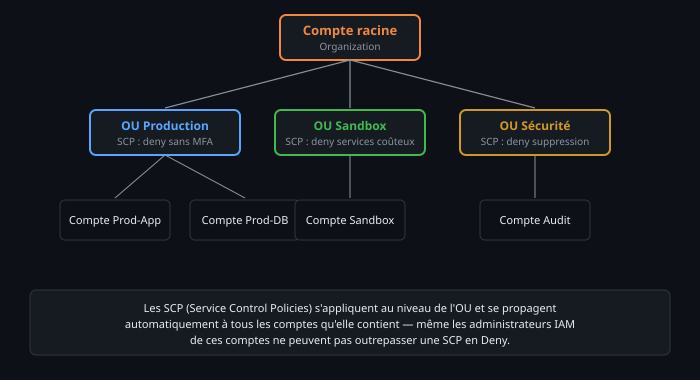

---

### 5.9 Test et validation des SCP

**IMPORTANT** : Toujours tester les SCP dans un **compte non critique** avant de les appliquer globalement.

Utiliser le **IAM Policy Simulator** :
1. Console AWS → IAM → Policy Simulator.
2. Simuler une action (ex : `ec2:RunInstances`) avec un utilisateur.
3. Vérifier si elle est bloquée par SCP ou policy.

Cela évite les surprises en production.

📎 [Service Control Policies](https://docs.aws.amazon.com/organizations/latest/userguide/orgs_manage_policies_scps.html)

📎 [SCP Examples](https://docs.aws.amazon.com/organizations/latest/userguide/orgs_manage_policies_scps_examples.html)

---

### 5.10 Avantages d'une stratégie multi-comptes

* Séparation claire des environnements (Prod, Dev, Test).
* Meilleure sécurité grâce au cloisonnement.
* Gestion fine des coûts par compte.
* Application de politiques globales cohérentes.
* Simplification de l'audit et de la conformité.

---

### 5.11 Budgets et alertes multi-comptes

AWS Budgets peut être configuré au niveau de l'organisation pour :

- Suivre les dépenses par compte ou OU
- Déclencher des alertes par email ou SNS

📎 [AWS Budgets](https://docs.aws.amazon.com/cost-management/latest/userguide/budgets-managing-costs.html)

---

### 5.12 Bonnes pratiques recommandées par AWS

* Créer un **compte de management** dédié, jamais utilisé pour déployer des ressources.
* Utiliser **des OU logiques** (par environnement ou par métier).
* Appliquer les SCP **par OU** plutôt que par compte individuel.
* Restreindre les régions et services non utilisés pour limiter les risques.
* Intégrer AWS Organizations avec **IAM Identity Center** pour la gestion des accès à grande échelle.

📎 [AWS Multi-Account Strategy](https://docs.aws.amazon.com/whitepapers/latest/organizing-your-aws-environment/organizing-your-aws-environment.html)

---

### 5.13 Points de vigilance

* Les SCP n'annulent pas les politiques IAM, elles les **limitent**.
* L'ordre d'évaluation est : SCP → IAM → Permissions effectives.
* Toujours tester les SCP dans un **compte non critique** avant de les déployer globalement.
* Ne pas donner trop de privilèges au compte Management.

:::danger
**Le Management Account ne doit jamais héberger de workloads applicatifs.** Ce compte dispose de droits sur tous les comptes membres via les SCP. Une compromission du Management Account compromet l'ensemble de l'organisation. Restreignez l'accès au strict minimum, activez MFA, et surveillez-le via CloudTrail au niveau organisationnel.
:::

---

## 6. Traçabilité et surveillance avec CloudTrail

### 6.1 Pourquoi surveiller les activités dans AWS ?

En environnement cloud, les utilisateurs peuvent créer, modifier ou supprimer des ressources **en quelques secondes**, sans passer par un processus de validation centralisé comme dans un datacenter traditionnel. Cette vitesse est un atout pour l'agilité, mais elle transforme aussi n'importe quelle erreur de configuration ou action malveillante en un risque qui se matérialise presque instantanément — d'où la nécessité de tout tracer.

L'enjeu de **sécurité** est le plus évident : sur un compte AWS, il faut pouvoir répondre à tout moment à la question *qui* a fait *quoi*, *quand* et *depuis où*, faute de quoi une compromission de compte peut passer inaperçue pendant des semaines. Vient ensuite l'enjeu de **conformité** : de nombreux référentiels réglementaires (ISO 27001, RGPD, PCI-DSS) exigent explicitement une traçabilité des accès et des modifications, et l'absence de journal d'audit peut à elle seule faire échouer une certification. L'**audit interne** dépend lui aussi directement de cette traçabilité : en cas d'incident (suppression accidentelle d'une base de données, fuite de données), c'est l'historique des actions qui permet de reconstituer la chronologie et d'identifier l'origine du problème en quelques minutes plutôt qu'en plusieurs jours. Enfin, cette même traçabilité sert à l'**optimisation** de la gouvernance cloud : en observant qui utilise réellement quels services, une équipe peut ajuster ses permissions IAM au principe du moindre privilège plutôt que de les laisser trop larges par précaution.

Pour cela, AWS fournit **CloudTrail**, un service de **traçabilité des actions** dans un compte ou une organisation.

---

### 6.2 AWS CloudTrail — Définition

> **CloudTrail est le service AWS qui enregistre toutes les actions réalisées via la console, les API et la CLI.**

Chaque événement contient :

* Date et heure de l'action
* Identité de l'utilisateur (ou rôle IAM)
* Adresse IP d'origine
* Service AWS concerné
* Action exécutée (ex. `ConsoleLogin`, `RunInstances`, `DeleteBucket`)

CloudTrail permet ainsi :

* de **visualiser l'historique des actions** dans la console,
* de **stocker les logs dans S3**,
* et de les **exploiter dans CloudWatch ou EventBridge** pour créer des alertes.

---

### 6.3 CloudTrail et AWS Organizations

Lorsque vous utilisez **AWS Organizations**, vous pouvez :

* Activer **un seul trail au niveau du compte de management**
* Appliquer ce trail à **tous les comptes enfants** (OU ou organisation complète)
* Centraliser les logs dans un **seul bucket S3**.

Cela permet de suivre les activités de tous les comptes de votre organisation depuis un **point unique**.

---

### 6.4 Exemples d'événements courants enregistrés

| Événement CloudTrail | Description | Cas d'usage |
|---|---|---|
| `ConsoleLogin` | Connexion à la console AWS | Détecter les connexions non MFA |
| `RunInstances` | Création d'une instance EC2 | Suivi de consommation / sécurité |
| `CreateBucket` | Création d'un bucket S3 | Audit stockage |
| `PutUserPolicy` | Modification d'une policy IAM | Traçabilité sécurité IAM |
| `DeleteTrail` | Suppression du trail CloudTrail | Détection activité critique |

---

### 6.5 CloudTrail vs CloudWatch

| CloudTrail | CloudWatch |
|---|---|
| Enregistre les événements historiques | Surveille les métriques et ressources |
| Trace les actions utilisateurs/API | Crée des alertes sur seuils ou logs |
| Stocke les logs dans S3 | Affiche en temps réel |
| Focus "qui a fait quoi" | Focus "ce qui se passe" |

Les deux sont complémentaires :
- CloudTrail = audit et traçabilité
- CloudWatch = surveillance opérationnelle

---

### 6.6 Exploiter les journaux CloudTrail : de la traçabilité à l'analyse

CloudTrail ne se limite pas à enregistrer les actions : il permet aussi de les **analyser**, de les **interroger**, et de **restreindre leur accès** selon les rôles. Pour cela, AWS propose une chaîne d'outils complémentaires, chacun jouant un rôle précis dans le traitement des logs.

#### Étapes d'intégration : de CloudTrail à Lake Formation

1. **Stockage dans S3**

   Les événements CloudTrail sont automatiquement archivés dans un bucket S3, sous forme de fichiers JSON. Ce stockage est durable, centralisé, et interrogeable.

2. **Catalogage avec AWS Glue**

   Glue agit comme un annuaire technique : il décrit la structure des fichiers (colonnes, types, formats) et les rend accessibles aux outils d'analyse comme Athena. Sans Glue, Athena ne saurait pas comment lire les logs.

3. **Analyse avec Amazon Athena**

   Athena permet d'exécuter des requêtes SQL directement sur les fichiers CloudTrail dans S3. C'est un moteur d'analyse serverless, sans base de données à déployer. On peut par exemple extraire tous les événements `DeleteBucket` du mois ou filtrer par utilisateur IAM.

4. **Gouvernance avec AWS Lake Formation**

   Lake Formation ajoute une couche de sécurité fine : il permet de contrôler **qui peut accéder à quelles données**, jusqu'au niveau colonne. Cela garantit que seuls les rôles autorisés peuvent interroger les logs sensibles.

📎 [Analyser CloudTrail avec Athena](https://docs.aws.amazon.com/athena/latest/ug/cloudtrail-logs.html)

---

### 6.7 AWS Config vs CloudTrail

Si CloudTrail trace les **actions**, AWS Config trace les **états**. Ensemble, ils offrent une vision complète du comportement et de la conformité des ressources AWS.

| Fonction | AWS Config | AWS CloudTrail |
|----------|------------|----------|
| Ce qui est suivi | État des ressources | Actions API des utilisateurs |
| Exemple | "Ce bucket est-il toujours privé ?" | "Qui a modifié ce bucket ?" |
| Type de données | Historique de configuration | Journal d'activité |
| Objectif | Conformité, détection de dérive | Audit, traçabilité |
| Intégration | Conformance Packs, remédiation automatique | EventBridge, Athena, SIEM |

📎 [AWS Config Documentation](https://docs.aws.amazon.com/config/latest/developerguide/)

---

### 6.8 Cas d'usage

> *Un administrateur souhaite identifier tous les appels `PutUserPolicy` effectués par des utilisateurs non autorisés. Il utilise CloudTrail pour collecter les événements, Glue pour cataloguer les logs, Athena pour interroger les données, et Lake Formation pour restreindre l'accès aux résultats.*

---

### 6.9 Bonnes pratiques CloudTrail

* Activer CloudTrail **au niveau de l'organisation**.
* Centraliser les logs dans un **bucket S3 sécurisé**.
* Activer la **chiffrement SSE-S3 ou SSE-KMS**.
* Mettre en place des **alertes EventBridge** sur les événements sensibles :
  * Connexion root
  * Connexion sans MFA
  * Suppression de logs
  * Création de ressources critiques
* Définir une **politique de rétention** et un plan d'audit régulier.

📎 [AWS CloudTrail Console](https://console.aws.amazon.com/cloudtrail/)

📎 [Documentation CloudTrail](https://docs.aws.amazon.com/awscloudtrail/latest/userguide/cloudtrail-user-guide.html)

📎 [ConsoleLogin event](https://docs.aws.amazon.com/awscloudtrail/latest/userguide/cloudtrail-event-reference-aws-console-sign-in-events.html)

📎 [CloudTrail + Organizations](https://docs.aws.amazon.com/organizations/latest/userguide/services-that-can-integrate-cloudtrail.html)

:::warning
**Ne jamais désactiver CloudTrail en production.** La suppression ou la désactivation d'un trail est elle-même un événement critique enregistré. Configurez des alertes EventBridge sur l'événement `DeleteTrail` et `StopLogging`. En conformité ISO 27001 ou PCI-DSS, les logs CloudTrail doivent être conservés au minimum 1 an et être immuables (activer S3 Object Lock).
:::

### 6.10 Combien coûtent CloudTrail et Config ?

Ces deux services ne sont **pas gratuits au-delà d'un premier niveau minimal** — un point souvent ignoré, car "activer l'audit" semble aller de soi sans qu'on en vérifie le coût.

| Service | Gratuit | Facturé |
|---|---|---|
| **CloudTrail** | 1 trail de gestion (événements de gestion) par région, journalisé automatiquement, consultable 90 jours dans l'historique des événements | Trails supplémentaires : 2,00 $ par 100 000 événements de gestion. Événements de données (S3 objet par objet, invocations Lambda) : 0,10 $ par 100 000 événements — peut grimper vite sur un bucket S3 à fort trafic |
| **AWS Config** | — (pas de niveau gratuit) | 0,003 $ par élément de configuration enregistré, plus 0,001 à 0,0012 $ par évaluation de règle de conformité |

**Exemple concret** : un compte avec 500 ressources suivies par Config, réévaluées 4 fois par jour (2 000 évaluations/jour ≈ 60 000/mois) sur 10 règles de conformité coûte environ 500 × 0,003 $ (enregistrement) + 60 000 × 10 × 0,001 $ (évaluations) = 1,50 $ + 600 $ — **le coût des évaluations de règles domine largement**, pas l'enregistrement des ressources elles-mêmes. Limiter le nombre de règles actives et leur fréquence de déclenchement est le principal levier d'optimisation.

**CloudTrail avec événements de données** : ces événements ne sont pas activés par défaut et entraînent toujours des frais. Par exemple, avec un tarif hypothétique de 0,10 USD pour 100 000 événements, dix millions d'événements représenteraient 10 USD avant les autres coûts. Ce calcul sert à comprendre l'ordre de grandeur ; vérifiez le tarif de la région et la fonctionnalité choisie sur la page officielle CloudTrail Pricing avant toute estimation. Utilisez des sélecteurs d'événements précis plutôt qu'une collecte exhaustive sans objectif d'audit.

📎 [AWS CloudTrail Pricing](https://aws.amazon.com/cloudtrail/pricing/)
📎 [AWS Config Pricing](https://aws.amazon.com/config/pricing/)

---

## 7. Gestion pratique d'IAM avec la CLI

:::info
Une activité pratique permet d’approfondir la gestion des utilisateurs, groupes et rôles IAM en CLI.
:::

### 7.1 Créer un utilisateur IAM

La commande crée l'utilisateur `alice`, puis une seconde commande vérifie immédiatement qu'il a bien été enregistré dans IAM — confirmer la création après chaque commande est toujours une bonne pratique.

```bash
# Créer un nouvel utilisateur nommé "alice"
aws iam create-user --user-name alice

# Vérifier que l'utilisateur a été créé
aws iam get-user --user-name alice
```

:::success
**Résultat attendu — `aws iam get-user --user-name alice` :**
```json
{
    "User": {
        "Path": "/",
        "UserName": "alice",
        "UserId": "AIDA4EXAMPLE7EXAMPLE",
        "Arn": "arn:aws:iam::123456789012:user/alice",
        "CreateDate": "2024-01-15T10:30:00+00:00"
    }
}
```
L'utilisateur `alice` est créé. Son `UserId` commence toujours par `AIDA` pour les utilisateurs IAM. La commande `create-user` ne retourne aucun output si elle réussit.
:::

---

### 7.2 Créer un groupe et ajouter l'utilisateur

Les groupes sont le cœur de la gestion IAM : plutôt qu'attribuer des permissions utilisateur par utilisateur, on les attache au groupe et tous les membres en héritent automatiquement.

```bash
# Créer un groupe "Developers"
aws iam create-group --group-name Developers

# Ajouter alice au groupe
aws iam add-user-to-group --group-name Developers --user-name alice

# Vérifier
aws iam get-group --group-name Developers
```

:::success
**Résultat attendu — `aws iam get-group --group-name Developers` :**
```json
{
    "Group": {
        "Path": "/",
        "GroupName": "Developers",
        "GroupId": "AGPA4EXAMPLEGROUP",
        "Arn": "arn:aws:iam::123456789012:group/Developers",
        "CreateDate": "2024-01-15T10:31:00+00:00"
    },
    "Users": [
        {
            "UserName": "alice",
            "UserId": "AIDA4EXAMPLE7EXAMPLE",
            "Arn": "arn:aws:iam::123456789012:user/alice"
        }
    ],
    "IsTruncated": false
}
```
Le groupe `Developers` est créé et `alice` apparaît bien dans le tableau `Users`.
:::

---

### 7.3 Attacher une policy au groupe

On attache une policy AWS gérée au groupe `Developers`. Tous les membres actuels et futurs du groupe hériteront automatiquement de ces permissions, sans aucune action supplémentaire.

```bash
# Attacher la policy AWS gérée "AmazonS3ReadOnlyAccess" au groupe
aws iam attach-group-policy \
  --group-name Developers \
  --policy-arn arn:aws:iam::aws:policy/AmazonS3ReadOnlyAccess

# Vérifier
aws iam list-attached-group-policies --group-name Developers
```

:::success
**Résultat attendu — `aws iam list-attached-group-policies --group-name Developers` :**
```json
{
    "AttachedPolicies": [
        {
            "PolicyName": "AmazonS3ReadOnlyAccess",
            "PolicyArn": "arn:aws:iam::aws:policy/AmazonS3ReadOnlyAccess"
        }
    ],
    "IsTruncated": false
}
```
La policy `AmazonS3ReadOnlyAccess` est bien attachée au groupe `Developers`. Tous les membres actuels et futurs du groupe en héritent automatiquement.
:::

---

### 7.4 Créer des clés d'accès pour un utilisateur

Les clés d'accès (`AccessKeyId` + `SecretAccessKey`) permettent d'appeler l'API AWS depuis la CLI ou un script. Elles sont générées **une seule fois** et le `SecretAccessKey` ne peut jamais être récupéré ensuite — AWS ne le stocke pas.

```bash
# Générer une paire de clés d'accès pour alice
aws iam create-access-key --user-name alice

# Le résultat contient AccessKeyId et SecretAccessKey
# Attention : SAUVEGARDEZ CES CLÉS EN LIEU SÛR
```

:::success
**Résultat attendu — `aws iam create-access-key --user-name alice` :**
```json
{
    "AccessKey": {
        "UserName": "alice",
        "AccessKeyId": "AKIA4EXAMPLEKEYID12",
        "Status": "Active",
        "SecretAccessKey": "<SECRET_TEMPORAIRE_MASQUE>",
        "CreateDate": "2024-01-15T10:35:00+00:00"
    }
}
```
Un `AccessKeyId` permanent utilise généralement le préfixe `AKIA`, tandis qu'un identifiant temporaire STS utilise `ASIA`. Le `SecretAccessKey` d'une nouvelle clé permanente ne s'affiche qu'une seule fois : ne le copiez jamais dans un support, un ticket ou un dépôt. Stockez-le dans un gestionnaire de secrets, puis préférez les rôles et identifiants temporaires dès que le cas d'usage le permet.
:::

:::danger
**Ne jamais stocker ces clés en clair dans le code source, les fichiers `.env` versionnés ou les dépôts Git.** Utilisez AWS Secrets Manager ou un coffre-fort (Vault, 1Password) pour les conserver. En cas de fuite, révoquez immédiatement la clé dans IAM et générez-en une nouvelle.
:::

---

### 7.5 Créer une policy JSON personnalisée

Quand aucune policy AWS gérée ne correspond exactement à vos besoins, vous créez une policy inline. Ici, on génère d'abord le fichier JSON localement, puis on l'attache à l'utilisateur.

```bash
# Créer une policy pour accès limité à S3
cat > s3-readonly-policy.json << 'EOF'
{
  "Version": "2012-10-17",
  "Statement": [
    {
      "Effect": "Allow",
      "Action": ["s3:GetObject", "s3:ListBucket"],
      "Resource": ["arn:aws:s3:::mon-bucket", "arn:aws:s3:::mon-bucket/*"]
    }
  ]
}
EOF

# Attacher cette policy à alice
aws iam put-user-policy \
  --user-name alice \
  --policy-name S3-Readonly \
  --policy-document file://s3-readonly-policy.json
```

:::success
**Résultat attendu — `aws iam list-user-policies --user-name alice` (commande de vérification) :**
```json
{
    "PolicyNames": [
        "S3-Readonly"
    ],
    "IsTruncated": false
}
```
La policy inline `S3-Readonly` est bien attachée directement à l'utilisateur `alice`. Une policy inline est stockée directement sur l'entité (user/group/role) et ne peut pas être réutilisée ailleurs.
:::

---

### 7.6 Vérifier les permissions d'un utilisateur

Avant toute intervention sur un compte, il est utile de dresser l'inventaire complet des permissions effectives d'un utilisateur : policies directes ET celles héritées via les groupes.

```bash
# Lister les policies attachées à alice
aws iam list-user-policies --user-name alice

# Lister les policies de groupe pour alice
aws iam list-groups-for-user --user-name alice
```

:::success
**Résultat attendu — `aws iam list-groups-for-user --user-name alice` :**
```json
{
    "Groups": [
        {
            "Path": "/",
            "GroupName": "Developers",
            "GroupId": "AGPA4EXAMPLEGROUP",
            "Arn": "arn:aws:iam::123456789012:group/Developers",
            "CreateDate": "2024-01-15T10:31:00+00:00"
        }
    ],
    "IsTruncated": false
}
```
`alice` appartient au groupe `Developers`. Ses permissions effectives = ses policies directes + les policies de tous ses groupes d'appartenance.
:::

---

### 7.7 Créer un rôle IAM

Un rôle n'a pas de credentials permanents : il est **assumé temporairement** par un service ou un utilisateur. Le fichier `trust-policy.json` (appelé "trust policy" ou "politique de confiance") définit **qui** a le droit d'assumer ce rôle — ici, le service EC2.

```bash
# Créer un rôle pour EC2
aws iam create-role \
  --role-name EC2-S3-Access \
  --assume-role-policy-document file://trust-policy.json

# Contenu de trust-policy.json :
# {
#   "Version": "2012-10-17",
#   "Statement": [{
#     "Effect": "Allow",
#     "Principal": {"Service": "ec2.amazonaws.com"},
#     "Action": "sts:AssumeRole"
#   }]
# }
```

:::success
**Résultat attendu — `aws iam create-role --role-name EC2-S3-Access ...` :**
```json
{
    "Role": {
        "Path": "/",
        "RoleName": "EC2-S3-Access",
        "RoleId": "AROA4EXAMPLEROLEID1",
        "Arn": "arn:aws:iam::123456789012:role/EC2-S3-Access",
        "CreateDate": "2024-01-15T10:40:00+00:00",
        "AssumeRolePolicyDocument": {
            "Version": "2012-10-17",
            "Statement": [{
                "Effect": "Allow",
                "Principal": {"Service": "ec2.amazonaws.com"},
                "Action": "sts:AssumeRole"
            }]
        },
        "MaxSessionDuration": 3600
    }
}
```
Le rôle `EC2-S3-Access` est créé. Son `RoleId` commence par `AROA`. La trust policy indique que seul le service EC2 (`ec2.amazonaws.com`) peut assumer ce rôle.
:::

---

### 7.8 Attacher une policy à un rôle

Une fois le rôle créé avec sa trust policy (qui définit qui peut l'assumer), on lui attache des permissions (ce qu'il peut faire). Toute instance EC2 qui assumera ce rôle pourra lire S3 **sans credentials statiques**.

```bash
# Attacher AmazonS3ReadOnlyAccess au rôle
aws iam attach-role-policy \
  --role-name EC2-S3-Access \
  --policy-arn arn:aws:iam::aws:policy/AmazonS3ReadOnlyAccess
```

:::success
**Résultat attendu — `aws iam list-attached-role-policies --role-name EC2-S3-Access` :**
```json
{
    "AttachedPolicies": [
        {
            "PolicyName": "AmazonS3ReadOnlyAccess",
            "PolicyArn": "arn:aws:iam::aws:policy/AmazonS3ReadOnlyAccess"
        }
    ],
    "IsTruncated": false
}
```
La commande `attach-role-policy` ne retourne aucun output si elle réussit. La vérification confirme que `AmazonS3ReadOnlyAccess` est bien attachée au rôle `EC2-S3-Access`.
:::

---

### 7.9 Activer MFA pour un utilisateur

L'activation du MFA lie un appareil virtuel (application TOTP type Google Authenticator ou Authy) à l'utilisateur. Les deux codes consécutifs (`authentication-code1` et `authentication-code2`) sont nécessaires pour synchroniser l'horloge de l'appareil avec AWS.

```bash
# Créer un appareil MFA virtuel
aws iam enable-mfa-device \
  --user-name alice \
  --serial-number arn:aws:iam::123456789012:mfa/alice-mfa \
  --authentication-code1 123456 \
  --authentication-code2 654321
```

:::success
**Résultat attendu — `aws iam list-mfa-devices --user-name alice` :**
```json
{
    "MFADevices": [
        {
            "UserName": "alice",
            "SerialNumber": "arn:aws:iam::123456789012:mfa/alice-mfa",
            "EnableDate": "2024-01-15T10:45:00+00:00"
        }
    ],
    "IsTruncated": false
}
```
La commande `enable-mfa-device` ne retourne aucun output si elle réussit. La vérification confirme que le périphérique MFA virtuel est bien enregistré pour `alice`.
:::

---

### 7.10 Politique conditionnelle : exiger MFA

Cette démo crée une policy qui bloque **absolument toutes les actions AWS** si l'utilisateur n'a pas activé MFA pour sa session. C'est une protection forte recommandée pour les comptes administrateurs — sans MFA active, même `aws s3 ls` sera refusé.

```bash
# Créer une policy refusant tout si MFA n'est pas présente
cat > mfa-required.json << 'EOF'
{
  "Version": "2012-10-17",
  "Statement": [{
    "Effect": "Deny",
    "Action": "*",
    "Resource": "*",
    "Condition": {
      "BoolIfExists": {
        "aws:MultiFactorAuthPresent": "false"
      }
    }
  }]
}
EOF

# Attacher au groupe Admins
aws iam put-group-policy \
  --group-name Admins \
  --policy-name MFA-Required \
  --policy-document file://mfa-required.json
```

:::success
**Résultat attendu — `aws iam list-group-policies --group-name Admins` :**
```json
{
    "PolicyNames": [
        "MFA-Required"
    ],
    "IsTruncated": false
}
```
La commande `put-group-policy` ne retourne aucun output si elle réussit. Pour tester : connectez-vous à la console AWS sans MFA — toutes les actions retourneront `AccessDenied`. Activez MFA, reconnectez-vous, et les accès sont rétablis.
:::

---

## 8. Points importants et pièges fréquents

| Piège courant | Réalité | Solution |
|---|---|---|
| "Les SCP donnent des permissions" | Les SCP **limitent** les permissions, elles ne les donnent pas. | Toujours combiner SCP + policies IAM. |
| "Un Deny peut être contourné par un Allow" | Un Deny **explicite** est prioritaire. Toujours. | Reconnaître que Deny > Allow dans l'évaluation. |
| "IAM et Cognito, c'est pareil" | IAM = accès AWS administratif. Cognito = accès application. | Utiliser IAM pour IT, Cognito pour utilisateurs finaux. |
| "MFA, c'est juste un code SMS" | MFA peut être TOTP, YubiKey, passkey, biométrie. | Proposer plusieurs types selon la sensibilité. |
| "Pas besoin de fédération si on a IAM" | La fédération centralise la gestion et réduit les comptes statiques. | Préférer la fédération en environnement d'entreprise. |
| "CloudTrail ralentit AWS" | CloudTrail est activé implicitement et n'impacte pas les perfs. | L'activer sans crainte pour l'audit. |
| "Un utilisateur sans policy n'a aucun accès" | Correct : le moindre privilège s'applique par défaut. | Toujours attacher une policy minimale. |
| "On peut récupérer une clé d'accès perdue" | Non. Les clés ne s'affichent qu'à la création. | Conserver les clés en lieu sûr, utiliser AWS Secrets Manager. |

---

## 9. Choisir la bonne solution d'authentification AWS

AWS propose de nombreux services d'authentification. Voici une carte complète pour savoir lequel choisir.

Trois profils d'authentification distincts se dégagent : les développeurs/services AWS/applications internes s'appuient sur IAM Users, IAM Roles et STS ; les employés de l'entreprise (B2E) passent par IAM Identity Center (SSO), SAML 2.0 ou Directory Service ; les utilisateurs du grand public (B2C) utilisent Cognito User Pools.

### Tableau comparatif complet

| Solution | Pour qui | Credentials | Durée | MFA | Coût |
|----------|----------|-------------|-------|-----|------|
| **IAM User + Access Key** | Développeurs internes, CI/CD | Permanents | Jusqu'à révocation | Oui | Gratuit |
| **IAM Role + STS** | Services AWS, scripts, cross-account | Temporaires | 15 min – 36 h | Non (délégué) | Gratuit |
| **Cognito User Pool** | Utilisateurs B2C (app web/mobile) | JWT Token | Configurable | Oui (SMS, TOTP) | 50 000 MAU gratuits |
| **Cognito Identity Pool** | App mobile/web → accès AWS | Credentials STS | 1 h par défaut | Via User Pool | Gratuit |
| **IAM Identity Center** | Employés → multi-comptes AWS | Session token | Configurable | Oui | Gratuit |
| **SAML 2.0** | Fédération entreprise (AD, Okta) | Assertion SAML → STS | Configurable | Via IdP | Gratuit |
| **Directory Service — Simple AD** | Annuaire LDAP léger | Login AD | N/A | Non | ~73 $/mois |
| **Directory Service — Managed AD** | Active Directory Microsoft complet | Login AD | N/A | Oui | ~288 $/mois |
| **Directory Service — AD Connector** | Pont vers un AD on-premises | Login AD on-prem | N/A | Via AD | ~100 $/mois |

**MAU** (Monthly Active Users, utilisateurs actifs mensuels) est l'unité de facturation de Cognito User Pool : AWS compte un utilisateur comme "actif" dès qu'il s'authentifie au moins une fois dans le mois, et facture au-delà des 50 000 premiers MAU gratuits — une application avec 200 000 utilisateurs connectés dans le mois ne paiera donc que sur les 150 000 dépassant le seuil gratuit.

### Arbre de décision

```
Qui s'authentifie ?
 
- Un service AWS (EC2, Lambda, ECS...)
    - → IAM Role (attaché à l'instance/fonction) + STS automatique
 
- Un développeur / script / CI-CD
    - Accès court terme  → STS AssumeRole + profil CLI
    - Accès long terme   → IAM User + Access Key (à limiter !)
 
- Un employé de l'entreprise
    - Accès à un seul compte AWS  → IAM User (acceptable)
    - Accès à plusieurs comptes   → IAM Identity Center (SSO) ✅ recommandé
    - Active Directory existant   → SAML 2.0 ou AD Connector
 
- Un utilisateur externe (client, partenaire)
    - Authentification pure (login/mot de passe app)  → Cognito User Pool
    - Authentification + accès aux services AWS       → Cognito User Pool
                                                          + Identity Pool
```

### Focus : Cognito User Pool vs Identity Pool

La confusion la plus fréquente en formation :

```
Cognito USER POOL                     Cognito IDENTITY POOL
─────────────────────────────────     ─────────────────────────────────────
"Qui es-tu ?"                         "Qu'as-tu le droit de faire dans AWS ?"

Gère l'annuaire d'utilisateurs        Échange un token externe contre des
(login, mot de passe, attributs,      credentials AWS temporaires (STS)
MFA, réinitialisation de mdp)

Émet des JWT :                        Accepte en entrée :
  • Access Token                        • Token Cognito User Pool
  • ID Token                            • Token Google / Facebook / Apple
  • Refresh Token                       • Token SAML
                                        • Accès anonyme

Utilisé par :                         Utilisé pour :
  • Frontend (login page)               • Appeler S3, DynamoDB, etc.
  • API Gateway (autoriser)               depuis une app mobile
  • Tout service vérifiant un JWT       • Accès AWS sans backend
```

### Focus : IAM Identity Center vs SAML 2.0

| | IAM Identity Center | SAML 2.0 direct |
|--|--------------------|-----------------|
| **Configuration** | Quelques clics dans la console | Configuration manuelle complexe (métadonnées XML) |
| **Multi-comptes** | ✅ Natif (une entrée = tous les comptes) | ❌ Un trust par compte |
| **IdP supportés** | Azure AD, Okta, Ping, SCIM | Tout IdP SAML 2.0 |
| **Portail web** | ✅ Inclus (aws.amazon.com/sso) | ❌ À construire |
| **Recommandé pour** | Nouvelles organisations AWS | Besoins très spécifiques |

📎 [Choisir la bonne solution d'authentification AWS](https://docs.aws.amazon.com/IAM/latest/UserGuide/id_overview.html)

---

## Ressources

### Documentation officielle AWS
- [AWS IAM Documentation](https://docs.aws.amazon.com/iam/)
- [IAM Best Practices](https://docs.aws.amazon.com/IAM/latest/UserGuide/best-practices.html)
- [AWS IAM Identity Center](https://docs.aws.amazon.com/singlesignon/latest/userguide/what-is.html)
- [Amazon Cognito Documentation](https://docs.aws.amazon.com/cognito/)
- [AWS CloudTrail Documentation](https://docs.aws.amazon.com/cloudtrail/)

---

## Quiz interactif du chapitre

Choisissez une réponse : la correction expliquée apparaît immédiatement. Les propositions changent d’ordre à chaque nouvelle tentative.

<iframe class="quiz-frame" src="../08-quiz-interactifs/quiz-chapitre-2.html" title="Quiz interactif du chapitre 2" loading="lazy"></iframe>

<div style="page-break-before: always"></div>

# Chapitre 3 — Stockage et Calcul — Amazon S3 & Amazon EC2

<nav class="chapter-map" aria-label="Sous-sections du chapitre">
  <a href="#1-introduction-aux-services-de-stockage-aws">01 · Choisir un stockage</a>
  <a href="#2-amazon-s3--le-stockage-objet-scalable">02 · Amazon S3</a>
  <a href="#5-amazon-ec2--la-couche-de-calcul-aws">03 · Amazon EC2</a>
  <a href="#8-options-de-tarification-aws-ec2">04 · Tarification EC2</a>
  <a href="#10-elastic-load-balancing-elb--répartition-du-trafic">05 · Élasticité et répartition</a>
  <a href="#12-aws-lambda--le-calcul-sans-serveur">06 · Serverless</a>
</nav>

---

:::info
Après avoir sécurisé les accès avec IAM au chapitre précédent, les stagiaires disposent des bases nécessaires pour créer et protéger de vraies ressources AWS : ce chapitre aborde les deux briques les plus utilisées du Cloud AWS, le stockage objet S3 et le calcul EC2.

**Objectifs du chapitre**

À l'issue de ce chapitre, les stagiaires seront capables de :

- **Créer** et configurer un bucket Amazon S3 (chiffrement, versioning, politiques d'accès)
- **Mettre en œuvre** des règles de lifecycle S3 pour optimiser le coût du stockage
- **Manipuler** S3 via la CLI (upload, download, synchronisation, gestion des permissions)
- **Choisir** un type d'instance EC2, une AMI et un mode de stockage adaptés à un besoin donné
- **Configurer** des Security Groups pour contrôler le trafic réseau d'une instance EC2
- **Utiliser** AWS Compute Optimizer pour dimensionner correctement une instance
- **Comparer** les modèles de tarification EC2 (On-Demand, Reserved, Spot, Savings Plans)
- **Lancer et administrer** une instance EC2 via la CLI
- **Déployer** un Elastic Load Balancer pour répartir le trafic entre plusieurs instances
- **Configurer** un groupe Auto Scaling pour adapter dynamiquement la capacité aux besoins
- **Concevoir** une architecture haute disponibilité combinant S3, EC2, ELB et Auto Scaling
:::

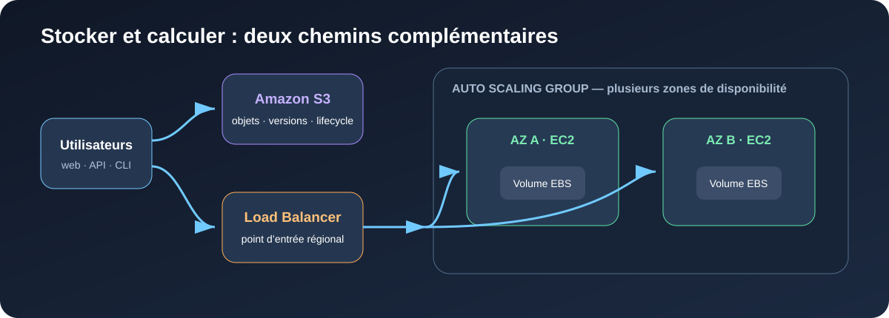

<div class="concept-check">
<strong>Choix de service — avant de poursuivre</strong>
<p>Où placer des images partagées par plusieurs instances EC2 et accessibles par URL ?</p>
<details><summary>Afficher la réponse raisonnée</summary><p>Dans Amazon S3 : les images sont des objets indépendants des instances. EBS est un stockage bloc attaché dans une zone de disponibilité et ne constitue pas ici le bon niveau de partage.</p></details>
</div>

---

## 1. Introduction aux services de stockage AWS

📹 **Vidéo** : [Introduction to Amazon S3](https://www.youtube.com/watch?v=4RI3pDKpx38)

### 1.1 Pourquoi plusieurs services de stockage ?

Le stockage est au cœur de toute infrastructure cloud. AWS propose plusieurs types de stockage, mais **Amazon Simple Storage Service (S3)** est le service le plus emblématique : fiable, scalable et économique.

Créé en 2006, S3 a révolutionné la façon dont les entreprises stockent leurs données en passant d'un modèle de serveur à un modèle **d'espace de stockage à la demande**.

Avant de plonger dans les services techniques, il est essentiel de comprendre **pourquoi AWS propose plusieurs modèles de stockage** et dans quels contextes les utiliser.

Dans une entreprise traditionnelle, le stockage repose sur :
- des **disques durs internes** (pour les postes ou serveurs locaux),
- des **baies NAS/SAN** (pour le stockage partagé),
- parfois des sauvegardes sur bande ou sur site distant.

AWS transpose ces modèles dans le Cloud et les **rend flexibles, évolutifs et disponibles à la demande**.

### 1.2 Les trois modèles de stockage AWS

| Type de stockage | Service AWS        | Cas d'usage typique                              | Analogie utilisateur                 |
|-------------------|--------------------|--------------------------------------------------|---------------------------------------|
| **Objet**         | **Amazon S3**      | Sauvegarde, site statique, logs, Data Lake       | Dropbox / Google Drive               |
| **Bloc**          | **Amazon EBS**     | Disque de VM, base de données, stockage persistant | Disque dur local                     |
| **Fichier**       | **Amazon EFS/FSx** | Partage réseau, systèmes distribués              | NAS / Partage Windows                |

**À retenir** : Chaque type de stockage a ses propres performances, coûts et scénarios d'usage. Nous allons détailler S3 et EBS en priorité, car ce sont les services les plus utilisés par les administrateurs AWS en début de carrière.

📎 [Documentation Amazon S3](https://docs.aws.amazon.com/s3/)

---

## 2. Amazon S3 : Le stockage objet scalable

### 2.1 Qu'est-ce qu'Amazon S3 ?

**Amazon S3 (Simple Storage Service)** est le service de stockage le plus utilisé sur AWS. Il permet de stocker des fichiers (appelés **objets**) dans le cloud, avec une capacité quasiment illimitée, une très haute disponibilité (accès garanti) et une durabilité exceptionnelle (les données ne sont pas perdues).

Mais attention : **S3 ne fonctionne pas comme un disque dur classique**. C'est un système de **stockage objet**, ce qui signifie que chaque fichier est stocké avec des informations supplémentaires (appelées **métadonnées**) dans un conteneur appelé **bucket**.

### 2.2 L'armoire de rangement : analogie avec S3

Imaginez une **armoire de rangement** :

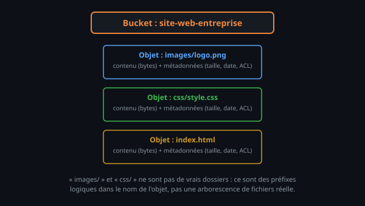

- L'armoire, c'est le **bucket** : un conteneur dans lequel vous rangez vos fichiers.
- Chaque fichier est un **objet** : il contient le contenu (ex. une image) + des étiquettes (métadonnées) comme son nom, sa date, ses droits d'accès.
- Les "dossiers" que vous voyez dans S3 ne sont pas réels : ce sont juste des **préfixes logiques** dans le nom du fichier (ex. `images/logo.png`).

### 2.3 Exemple concret

Vous créez un bucket nommé `site-web-entreprise`. Vous y déposez :

- `images/logo.png`
- `css/style.css`
- `js/app.js`

Ces fichiers peuvent ensuite être **consultés via Internet**, sans serveur web, si vous configurez le bucket en mode **site statique**.

📎 [S3 Static Website Hosting](https://docs.aws.amazon.com/AmazonS3/latest/dev/WebsiteHosting.html)

### 2.4 Structure interne de S3

| Élément | Description |
|--------|-------------|
| **Bucket** | Conteneur global (nom unique dans AWS), lié à une région |
| **Objet** | Fichier + métadonnées (nom, taille, type, permissions) |
| **Préfixe** | Partie du nom qui simule un dossier (ex. `images/`) |
| **Key** | Identifiant unique de l'objet au sein du bucket |
| **Métadonnées** | Informations sur l'objet (format, date, ACL, tags) |

### 2.5 Caractéristiques clés de S3

| Caractéristique | Description |
|------------------|-------------|
| **Durabilité** | 99,999999999% (11 neuf) grâce à la réplication automatique sur plusieurs zones. |
| **Disponibilité** | Haute disponibilité (jusqu'à 99,99% selon la classe). |
| **Évolutivité** | Pas de limite pratique en nombre d'objets. |
| **Sécurité** | Contrôle fin via IAM, ACL, policies de bucket et chiffrement. |
| **Coût à l'usage** | Payez uniquement pour le stockage et les requêtes. |

📎 [S3 Storage Classes](https://docs.aws.amazon.com/AmazonS3/latest/userguide/storage-class-intro.html)

### 2.6 Console S3 — Création d'un bucket

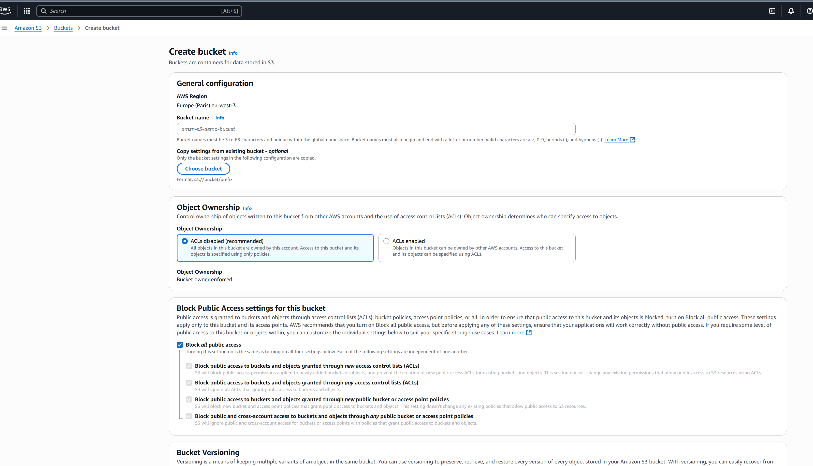

---

## 3. Protéger et optimiser les données S3

Amazon S3 propose plusieurs mécanismes pour **sécuriser vos fichiers**, **préserver leur historique**, et **réduire les coûts de stockage**. Ces options sont souvent méconnues, mais elles sont essentielles pour bien gérer vos données dans le cloud.

### 3.1 Chiffrement : protéger les fichiers contre les accès non autorisés

Quand vous stockez un fichier dans S3, vous pouvez demander à AWS de le **chiffrer automatiquement**. Cela signifie que même si quelqu'un accède physiquement au disque, il ne pourra pas lire le contenu sans la clé.

#### Types de chiffrement et gestion des clés

| Acronyme | Signification complète | Description pédagogique |
|---|---|---|
| **SSE-S3** | _Server-Side Encryption with Amazon S3-managed keys_ | Le chiffrement est géré **automatiquement par AWS S3**. Vous n'avez rien à configurer. |
| **SSE-KMS** | _Server-Side Encryption with AWS Key Management Service_ | Le chiffrement utilise **AWS KMS**, un service de gestion de clés. Vous définissez et contrôlez les clés. |
| **HTTPS/TLS** | _HyperText Transfer Protocol Secure / Transport Layer Security_ | Ce protocole **sécurise les échanges** entre votre navigateur ou application et AWS. |

### 3.2 Détails des types de chiffrement

#### SSE (Server-Side Encryption)

> Chiffrement effectué **côté serveur**, c'est-à-dire par AWS une fois que les données sont reçues.

**SSE-S3** : AWS chiffre les objets S3 avec une clé gérée par le service S3 lui-même.
- **Avantage** : aucune configuration requise.
- **Niveau de sécurité** : standard, suffisant pour de nombreux cas d'usage.

**SSE-KMS** : AWS chiffre les objets S3 avec une clé gérée par **AWS KMS**, que vous pouvez créer, activer/désactiver, auditer.
- **Avantage** : contrôle granulaire sur les clés.
- **Complexité** : nécessite configuration, permissions IAM, et gestion des quotas KMS.

#### KMS (Key Management Service)

> Service AWS permettant de **créer, stocker et gérer** des clés de chiffrement.

- Utilisé dans **SSE-KMS**, mais aussi pour chiffrer des volumes EBS, des secrets, etc.
- Permet la **rotation automatique**, l'audit via CloudTrail, et l'intégration avec IAM.

#### HTTPS / TLS

> Protocole de **sécurisation des communications réseau**.

- **HTTPS** est HTTP + TLS.
- **TLS (Transport Layer Security)** : protocole de chiffrement qui protège les données en transit.
- Activé **par défaut** dans la console AWS et les SDK/API.

### 3.3 À retenir sur le chiffrement

- **SSE-S3** : simple, automatique, suffisant pour les données non sensibles.
- **SSE-KMS** : recommandé pour les données sensibles ou les environnements réglementés.
- **HTTPS/TLS** : toujours activé pour sécuriser les échanges réseau.

:::info
**SSE-KMS et coûts KMS** — Chaque requête de chiffrement/déchiffrement via KMS est facturée (environ 0,03 $ pour 10 000 requêtes). Pour un bucket avec de nombreuses petites opérations, cela peut s'accumuler. Activez le **Bucket Key** (option KMS) pour réduire le nombre d'appels KMS jusqu'à 99% en utilisant une clé de données par bucket plutôt que par objet.
:::

### 3.4 Versioning : garder l'historique des fichiers

Le **versioning** permet de conserver toutes les versions d'un fichier, même si vous le modifiez ou le supprimez par erreur.

#### Exemple :
- Vous téléversez `rapport.pdf`
- Vous le modifiez et téléversez une nouvelle version
- Vous pouvez toujours revenir à la version précédente

C'est utile pour :
- Éviter les pertes accidentelles
- Respecter des exigences réglementaires
- Tracer les modifications

📎 [S3 Versioning Guide](https://docs.aws.amazon.com/AmazonS3/latest/dev/Versioning.html)

### 3.5 Lifecycle Policies : automatiser le nettoyage et l'archivage

Les **politiques de cycle de vie** permettent de définir des règles pour :

- Supprimer automatiquement les fichiers après X jours
- Déplacer les fichiers vers une classe de stockage moins coûteuse
- Archiver dans Glacier pour la conformité

>  Cela vous aide à **réduire les coûts** sans perdre vos données.

**Exemple concret** : Un fichier log commence en **Standard** (accès rapide), est déplacé en **Standard-IA** après 30 jours (moins accédé, moins cher), puis archivé en **Glacier** après 90 jours (rarement consulté).

📎 [S3 Lifecycle Rules](https://docs.aws.amazon.com/AmazonS3/latest/dev/object-lifecycle-mgmt.html)

### 3.6 Classes de stockage : choisir le bon niveau selon l'usage

Amazon S3 propose plusieurs **classes de stockage**, selon la fréquence d'accès et le niveau de disponibilité souhaité.

| Classe | Disponibilité | Coût | Temps d'accès | Cas d'usage |
|--------|---------------|------|---------------|-------------|
| **Standard** | Multi-AZ | 💰💰 | Millisecondes | Fichiers actifs, souvent consultés |
| **Standard-IA** | Multi-AZ | 💰 | Millisecondes | Sauvegardes, fichiers rarement lus |
| **One Zone-IA** | Mono-AZ | 💰 | Millisecondes | Données non critiques |
| **Intelligent-Tiering** | Automatique | 💰 | Variable | Accès imprévisible |
| **Glacier / Deep Archive** | Multi-AZ | 💰 très bas | Minutes à heures | Archivage long terme, conformité |

> Moins une donnée est accessible rapidement, moins elle coûte. C'est un **levier puissant pour optimiser votre budget**.

#### S3 Intelligent-Tiering : Optimisation automatique

**S3 Intelligent-Tiering** est une classe de stockage qui déplace automatiquement les objets entre quatre niveaux d'accès selon votre modèle de consultation réel.

| Niveau | Délai avant bascule | Économie |
|---|---|---|
| Frequent Access | 0-30 jours | coût = Standard |
| Infrequent Access | 30-90 jours | ~40% |
| Archive Instant | 90-180 jours | ~70% |
| Deep Archive | 180+ jours | ~95% |

**Avantages** :
- Aucune configuration manuelle requise.
- Frais de gestion faibles (0,0025 $ par objet par mois).
- Idéal pour les données dont la fréquence d'accès est **imprévisible**.

**Cas d'usage** :
- Logs d'applications avec accès sporadique.
- Archives de données sans schéma d'accès défini.
- Données de machine learning exploratoires.

**Différence avec Lifecycle** :
- Lifecycle : vous définissez les règles (ex. "après 90 jours, archiver en Glacier").
- Intelligent-Tiering : AWS observe votre accès réel et adapte automatiquement.

#### S3 Transfer Acceleration : Optimisation des uploads volumineux

**S3 Transfer Acceleration** améliore les **vitesses d'upload** vers S3 en utilisant le réseau CloudFront d'AWS.

**Fonctionnement** :
```
Upload standard (lent)
Votre ordinateur ──────────────────► AWS S3 Région distant
                      ❌ Slow, high latency

Avec Transfer Acceleration
Votre ordinateur ──► CloudFront Edge Location (près de vous)
                         
                          Optimisé (route accélérée AWS)
                        ▼
                     AWS S3 Région distant
                      ✅ Rapide
```

**Activation** :
```bash
# Activer Transfer Acceleration
aws s3api put-bucket-accelerate-configuration \
    --bucket mon-bucket \
    --accelerate-configuration Status=Enabled

# Upload avec accélération
aws s3 cp mon-fichier-gros.zip \
    s3://mon-bucket/uploads/ \
    --region eu-west-1
```

:::success
**Résultat attendu :**
```
# put-bucket-accelerate-configuration : aucun output si succès

# s3 cp retourne la progression :
upload: ./mon-fichier-gros.zip to s3://mon-bucket/uploads/mon-fichier-gros.zip
```
Transfer Acceleration est activé sur le bucket. Les uploads utilisent désormais les Edge Locations CloudFront pour rejoindre le bucket S3, ce qui réduit la latence depuis les clients distants.
:::

**Coûts** :
- Frais supplémentaires par Go transféré (environ $0.04/Go).
- À justifier uniquement pour uploads volumineux ou latence critique.

#### S3 comme origine CloudFront — distribuer du contenu statique à grande échelle

Transfer Acceleration optimise l'**upload** vers S3. Le cas d'usage inverse — beaucoup plus fréquent en production — est de distribuer efficacement du contenu **depuis** S3 vers des millions de visiteurs : c'est le rôle de **CloudFront** utilisé comme CDN devant un bucket S3.

```
Sans CloudFront (chaque visiteur télécharge depuis S3 directement) :
  Visiteur Tokyo    ──► S3 eu-west-3 (Paris)   ❌ Latence élevée, coût egress à chaque fois
  Visiteur New York ──► S3 eu-west-3 (Paris)   ❌ Latence élevée, coût egress à chaque fois
  Visiteur Paris     ──► S3 eu-west-3 (Paris)   ✅ Rapide (mais N requêtes = N factures egress)

Avec CloudFront devant S3 :
  Visiteur Tokyo    ──► Edge Location Tokyo    (cache HIT après 1er accès, < 50 ms)
  Visiteur New York ──► Edge Location New York (cache HIT après 1er accès, < 50 ms)
  Visiteur Paris     ──► Edge Location Paris    (cache HIT après 1er accès, < 20 ms)
                              │
                              ▼ (uniquement au premier accès, cache MISS)
                         S3 eu-west-3 (Paris) — origine unique
```

**Pourquoi c'est la bonne pratique, pas juste une option :**
- **Coût réduit** : le trafic sortant de S3 vers CloudFront est gratuit (les deux services AWS communiquent via le réseau interne). Seul le trafic CloudFront → visiteur final est facturé, à un tarif généralement inférieur à l'egress S3 direct.
- **Bucket privé possible** : avec une **Origin Access Control (OAC)**, le bucket S3 n'a besoin d'aucun accès public — seul CloudFront peut le lire. Les visiteurs ne touchent jamais directement S3.
- **Cache réduit la charge S3** : un fichier consulté 100 000 fois par jour ne génère qu'une poignée de requêtes S3 réelles (une par Edge Location, tant que le cache est valide), le reste est servi depuis le cache CloudFront.

**Configuration minimale (CLI) :**
```bash
# Créer la distribution CloudFront avec S3 comme origine et OAC
aws cloudfront create-distribution \
  --origin-domain-name mon-bucket.s3.eu-west-3.amazonaws.com \
  --default-root-object index.html
```

:::success
**Résultat attendu (extrait) :**
```json
{
  "Distribution": {
    "Id": "E1A2B3C4D5E6F7",
    "DomainName": "d111111abcdef8.cloudfront.net",
    "Status": "InProgress"
  }
}
```
La distribution devient `Deployed` après quelques minutes de propagation sur le réseau mondial CloudFront. Le bucket S3 reste privé — seule cette distribution CloudFront (via son OAC) est autorisée à le lire, configuré automatiquement dans la bucket policy.
:::

📎 [Amazon CloudFront — Restricting access to S3](https://docs.aws.amazon.com/AmazonCloudFront/latest/DeveloperGuide/private-content-restricting-access-to-s3.html)

:::warning
**Coûts Transfer Acceleration** : Cette fonctionnalité engendre des frais supplémentaires (~0,04 $/Go pour les transferts vers des Edge Locations). N'activez Transfer Acceleration que si vous uploadez régulièrement des fichiers volumineux (> 100 Mo) depuis des clients géographiquement éloignés de la région S3. Pour les petits fichiers ou les accès locaux, le gain est négligeable et le surcoût inutile.
:::

**Cas d'usage** :
- Uploads de fichiers vidéo ou binaires depuis un client distant.
- Synchronisations multi-sites hautes performances.
- Distributions de fichiers volumineux vers plusieurs régions AWS.

### 3.7 Stratégies de compartiment (Bucket Policies) : Contrôle d'accès granulaire

Les **bucket policies** sont des documents JSON qui définissent **qui** peut accéder **à quoi** dans un bucket S3.

#### Structure d'une bucket policy

Une bucket policy est un document JSON attaché directement au bucket (et non à un utilisateur IAM). Elle contrôle qui peut accéder à quoi, y compris des accès publics ou inter-comptes AWS.

```json
{
  "Version": "2012-10-17",
  "Statement": [
    {
      "Sid": "AllowPublicRead",
      "Effect": "Allow",
      "Principal": "*",
      "Action": "s3:GetObject",
      "Resource": "arn:aws:s3:::mon-bucket/*"
    },
    {
      "Sid": "DenyEncryptedUploads",
      "Effect": "Deny",
      "Principal": "*",
      "Action": "s3:PutObject",
      "Resource": "arn:aws:s3:::mon-bucket/*",
      "Condition": {
        "StringNotEquals": {
          "s3:x-amz-server-side-encryption": "AES256"
        }
      }
    }
  ]
}
```

**Éléments clés** :
- **Sid** : identifiant lisible de la règle (ex. "AllowPublicRead")
- **Effect** : `Allow` ou `Deny`
- **Principal** : qui a l'accès (`*` = tout le monde, ou un ARN spécifique)
- **Action** : quelle opération S3 (`s3:GetObject`, `s3:PutObject`, `s3:DeleteObject`, etc.)
- **Resource** : sur quel objet (ARN format)
- **Condition** : contextes additionnels (IP, SSL, chiffrement, etc.)

#### Cas d'usage 1 : Site web statique public

Pour héberger un site web HTML/CSS sur S3, le bucket doit autoriser la lecture publique. Voici la policy à appliquer — notez `"Principal": "*"` qui signifie "tout le monde sans authentification" :

```json
{
  "Version": "2012-10-17",
  "Statement": [
    {
      "Sid": "PublicReadGetObject",
      "Effect": "Allow",
      "Principal": "*",
      "Action": "s3:GetObject",
      "Resource": "arn:aws:s3:::mon-site-web/*"
    }
  ]
}
```

**Effet** : Tous les utilisateurs peuvent **lire** les fichiers du bucket (parfait pour un site statique).

:::danger
**Bucket public : risque de fuite de données** — L'utilisation de `"Principal": "*"` rend l'ensemble des objets du bucket accessibles sur Internet **sans authentification**. Ne l'appliquez **jamais** à un bucket contenant des données sensibles (fichiers clients, logs internes, clés, backups). Depuis 2023, AWS bloque par défaut les accès publics sur les nouveaux buckets — cette policy nécessite de désactiver explicitement ce blocage.
:::

#### Cas d'usage 2 : Restreindre à une adresse IP spécifique

Pour un bucket contenant des données sensibles, on limite l'accès au réseau de l'entreprise via la condition `aws:SourceIp`. Tout accès depuis une IP extérieure sera refusé, même avec des credentials IAM valides.

```json
{
  "Version": "2012-10-17",
  "Statement": [
    {
      "Sid": "RestrictToCompanyIP",
      "Effect": "Allow",
      "Principal": "*",
      "Action": ["s3:GetObject", "s3:PutObject"],
      "Resource": "arn:aws:s3:::mon-bucket-prive/*",
      "Condition": {
        "IpAddress": {
          "aws:SourceIp": "203.0.113.0/24"
        }
      }
    }
  ]
}
```

**Effet** : Seules les IPs du réseau 203.0.113.0/24 peuvent accéder au bucket.

#### Cas d'usage 3 : Forcer le chiffrement pour tous les uploads

Cette policy est une protection anti-erreur : elle refuse tout upload qui ne spécifie pas le chiffrement côté serveur (SSE-S3). Même si un développeur oublie de configurer le chiffrement dans son code, AWS rejette la requête.

```json
{
  "Version": "2012-10-17",
  "Statement": [
    {
      "Sid": "DenyUnencryptedObjectUploads",
      "Effect": "Deny",
      "Principal": "*",
      "Action": "s3:PutObject",
      "Resource": "arn:aws:s3:::mon-bucket-sensible/*",
      "Condition": {
        "StringNotEquals": {
          "s3:x-amz-server-side-encryption": "AES256"
        }
      }
    }
  ]
}
```

**Effet** : Toute tentative d'upload sans chiffrement SSE-S3 sera **rejetée**.

#### Appliquer une bucket policy via CLI

Une fois le fichier JSON rédigé, voici comment l'appliquer, le vérifier, et le supprimer si nécessaire :

```bash
# Créer un fichier policy.json (voir ci-dessus)
# Appliquer la policy
aws s3api put-bucket-policy \
    --bucket mon-bucket \
    --policy file://policy.json

# Vérifier la policy
aws s3api get-bucket-policy --bucket mon-bucket

# Supprimer la policy
aws s3api delete-bucket-policy --bucket mon-bucket
```

:::success
**Résultat attendu :**
```
# put-bucket-policy : aucun output si succès

# get-bucket-policy retourne :
{
    "Policy": "{\"Version\":\"2012-10-17\",\"Statement\":[{\"Sid\":\"AllowPublicRead\",\"Effect\":\"Allow\",\"Principal\":\"*\",\"Action\":\"s3:GetObject\",\"Resource\":\"arn:aws:s3:::mon-bucket/*\"}]}"
}

# delete-bucket-policy : aucun output si succès
```
:::

**Point important** : Les bucket policies s'ajoutent aux **ACL (Access Control Lists)**, il faut les deux pour une sécurité complète.

### 3.8 Bonnes pratiques S3

- Activez le **versioning** dès que vous stockez des fichiers importants.
- Utilisez **SSE-S3** pour un chiffrement simple et automatique.
- Créez des **règles de cycle de vie** pour archiver ou supprimer les fichiers inutilisés.
- Choisissez la **classe de stockage** adaptée à chaque type de données.
- Appliquez des **bucket policies** pour restreindre l'accès selon le principe du moindre privilège.
- Utilisez **Intelligent-Tiering** si l'accès est imprévisible.
- Activez **Transfer Acceleration** pour les uploads volumineux critiques.

---

## 4. Gestion de S3 en CLI

:::info
Une activité pratique permet d’approfondir la manipulation de S3 en CLI.
:::

### 4.1 Créer un bucket S3

Le nom d'un bucket S3 doit être **unique à l'échelle mondiale** (personne d'autre dans le monde ne peut avoir le même nom). La syntaxe utilise `$(date +%s)` pour ajouter un timestamp et éviter les conflits.

```bash
# Créer un bucket (le nom doit être unique à l'échelle mondiale AWS)
aws s3api create-bucket \
    --bucket mon-bucket-formation-$(date +%s) \
    --region eu-west-1

# Vérifier la création
aws s3api list-buckets \
    --query 'Buckets[].Name' \
    --output table
```

**Explications** :
- `create-bucket` : commande pour créer un nouveau bucket
- `--bucket` : nom du bucket (doit respecter les règles : minuscules, pas d'espaces)
- `--region` : région AWS cible
- `--query` : filtre la réponse pour n'afficher que les noms
- `--output table` : affiche le résultat sous forme de tableau

:::success
**Résultat attendu :**
```
# create-bucket retourne :
{
    "Location": "/mon-bucket-formation-1715936400"
}

# list-buckets --output table affiche :
-----------------------------------------
|              ListBuckets              |
+---------------------------------------+
|  mon-bucket-formation-1715936400      |
|  autre-bucket-existant                |
+---------------------------------------+
```
:::

### 4.2 Télécharger un fichier dans S3

On crée d'abord un fichier local de test, puis on le pousse dans S3. La commande `s3 cp` fonctionne dans les deux sens : local → S3 ou S3 → local.

```bash
# Créer un fichier d'exemple
echo "Ceci est un contenu test pour S3" > test.txt

# Télécharger le fichier
aws s3 cp test.txt s3://mon-bucket-formation/documents/test.txt

# Vérifier le téléchargement
aws s3 ls s3://mon-bucket-formation/documents/ --recursive
```

**Explications** :
- `s3 cp` : copie un fichier local vers S3
- `s3://` : préfixe pour les chemins S3
- `s3 ls` : liste les contenus d'un bucket S3
- `--recursive` : affiche les fichiers dans les sous-dossiers aussi

:::success
**Résultat attendu :**
```
upload: ./test.txt to s3://mon-bucket-formation/documents/test.txt

# s3 ls retourne :
2024-05-17 14:23:05         34 test.txt
```
:::

:::warning
**Coûts S3 : requêtes et transfert** — Chaque opération `s3 cp` ou `s3 ls` génère des requêtes facturées (PUT, GET, LIST). Le tarif standard est ~0,005 $ pour 1 000 requêtes PUT et ~0,004 $ pour 1 000 requêtes GET. Les transferts de données **sortants d'AWS vers Internet** sont facturés (~0,09 $/Go). Préférez regrouper les petits fichiers et minimisez les téléchargements hors AWS pour maîtriser les coûts.
:::

### 4.3 Activer le versioning sur un bucket

Le versioning conserve toutes les versions d'un fichier. Si on écrase `test.txt`, l'ancienne version reste accessible. Une fois activé, le versioning **ne peut pas être désactivé** (seulement suspendu).

```bash
# Activer le versioning
aws s3api put-bucket-versioning \
    --bucket mon-bucket-formation \
    --versioning-configuration Status=Enabled

# Vérifier le versioning
aws s3api get-bucket-versioning \
    --bucket mon-bucket-formation
```

:::success
**Résultat attendu :**
```
# put-bucket-versioning : aucun output si succès

# get-bucket-versioning retourne :
{
    "Status": "Enabled"
}
```
:::

:::warning
**Versioning et coûts de stockage** — Une fois activé, le versioning conserve **toutes les versions** de chaque objet — y compris celles écrasées ou supprimées. Si vous modifiez fréquemment des fichiers volumineux, le stockage total peut rapidement multiplier les coûts. Combinez toujours le versioning avec une **lifecycle policy** qui expire les anciennes versions (ex. : supprimer les versions antérieures à 90 jours).
:::

### 4.4 Créer une politique de cycle de vie

Automatiser le déplacement des données vers des classes de stockage moins chères est une bonne pratique FinOps. Ici, on définit deux règles : les logs passent en STANDARD_IA à 30 jours, puis en GLACIER à 90 jours ; les fichiers temporaires sont supprimés après 1 an.

```bash
# Créer un fichier JSON pour la politique
cat > lifecycle-policy.json << 'EOF'
{
  "Rules": [
    {
      "Id": "ArchiveAfter30Days",
      "Status": "Enabled",
      "Prefix": "logs/",
      "Transitions": [
        {
          "Days": 30,
          "StorageClass": "STANDARD_IA"
        },
        {
          "Days": 90,
          "StorageClass": "GLACIER"
        }
      ]
    },
    {
      "Id": "DeleteAfter365Days",
      "Status": "Enabled",
      "Prefix": "temp/",
      "Expiration": {
        "Days": 365
      }
    }
  ]
}
EOF

# Appliquer la politique
aws s3api put-bucket-lifecycle-configuration \
    --bucket mon-bucket-formation \
    --lifecycle-configuration file://lifecycle-policy.json
```

**Explications** :
- `put-bucket-lifecycle-configuration` : applique une politique de cycle de vie
- `Transitions` : changement automatique de classe de stockage selon l'âge
- `Expiration` : suppression automatique après X jours
- `Prefix` : la règle s'applique uniquement aux fichiers commençant par ce préfixe

:::success
**Résultat attendu :**
```
# put-bucket-lifecycle-configuration : aucun output si succès

# get-bucket-lifecycle-configuration retourne :
{
    "Rules": [
        {
            "ID": "ArchiveAfter30Days",
            "Status": "Enabled",
            "Prefix": "logs/",
            "Transitions": [
                { "Days": 30, "StorageClass": "STANDARD_IA" },
                { "Days": 90, "StorageClass": "GLACIER" }
            ]
        },
        {
            "ID": "DeleteAfter365Days",
            "Status": "Enabled",
            "Prefix": "temp/",
            "Expiration": { "Days": 365 }
        }
    ]
}
```
:::

### 4.5 Activer le chiffrement par défaut

Le chiffrement par défaut garantit que **tout objet** ajouté au bucket est automatiquement chiffré, sans que le développeur ait à y penser. C'est une exigence fréquente en entreprise pour la conformité.

```bash
# Créer une configuration de chiffrement
cat > encryption-config.json << 'EOF'
{
  "Rules": [
    {
      "ApplyServerSideEncryptionByDefault": {
        "SSEAlgorithm": "AES256"
      }
    }
  ]
}
EOF

# Appliquer le chiffrement
aws s3api put-bucket-encryption \
    --bucket mon-bucket-formation \
    --server-side-encryption-configuration file://encryption-config.json
```

**Explications** :
- `put-bucket-encryption` : active le chiffrement automatique
- `AES256` : chiffrement SSE-S3 (clés gérées par AWS)
- Toute nouvelle donnée sera automatiquement chiffrée

:::success
**Résultat attendu :**
```
# put-bucket-encryption : aucun output si succès

# get-bucket-encryption retourne :
{
    "ServerSideEncryptionConfiguration": {
        "Rules": [
            {
                "ApplyServerSideEncryptionByDefault": {
                    "SSEAlgorithm": "AES256"
                },
                "BucketKeyEnabled": false
            }
        ]
    }
}
```
:::

### 4.6 Bloquer l'accès public au bucket

Par défaut depuis 2023, AWS bloque l'accès public sur les nouveaux buckets. Cette commande permet de le confirmer explicitement — et de le vérifier sur des buckets existants qui pourraient être mal configurés.

```bash
# Bloquer tout accès public (meilleure pratique pour les données sensibles)
aws s3api put-public-access-block \
    --bucket mon-bucket-formation \
    --public-access-block-configuration \
        "BlockPublicAcls=true,IgnorePublicAcls=true,BlockPublicPolicy=true,RestrictPublicBuckets=true"

# Vérifier la configuration
aws s3api get-public-access-block \
    --bucket mon-bucket-formation
```

**Explications** :
- `put-public-access-block` : active les protections contre l'accès accidentellement public
- `BlockPublicAcls=true` : empêche d'ajouter des ACL publiques
- `IgnorePublicAcls=true` : ignore les ACL publiques existantes
- `BlockPublicPolicy=true` : empêche les policies publiques
- `RestrictPublicBuckets=true` : restreint tous les accès publics

:::success
**Résultat attendu :**
```
# put-public-access-block : aucun output si succès

# get-public-access-block retourne :
{
    "PublicAccessBlockConfiguration": {
        "BlockPublicAcls": true,
        "IgnorePublicAcls": true,
        "BlockPublicPolicy": true,
        "RestrictPublicBuckets": true
    }
}
```
:::

:::danger
**Bucket accessible publiquement** — Si l'un des quatre paramètres est à `false`, le bucket peut être exposé publiquement. Des milliers de fuites de données AWS ont été causées par des buckets S3 mal configurés. Vérifiez systématiquement cette configuration sur vos buckets de production, en particulier ceux créés avant 2023 ou migrés depuis un autre compte AWS.
:::

### 4.7 Télécharger un fichier depuis S3

La commande `s3 sync` est particulièrement utile pour les sauvegardes : elle compare le contenu local et S3, et ne transfère que les fichiers qui ont changé (plus rapide et économique qu'un `cp` complet).

```bash
# Télécharger un fichier spécifique
aws s3 cp s3://mon-bucket-formation/documents/test.txt ./test-local.txt

# Télécharger un dossier entier en récursif
aws s3 cp s3://mon-bucket-formation/documents/ ./documents/ --recursive

# Synchroniser un bucket avec un dossier local (bidirectionnel)
aws s3 sync s3://mon-bucket-formation/ ./backup-local/

# Afficher la taille d'un objet
aws s3api head-object \
    --bucket mon-bucket-formation \
    --key documents/test.txt \
    --query 'ContentLength' \
    --output text
```

**Explications** :
- `s3 cp` : copie des fichiers depuis S3 vers local
- `--recursive` : copie tous les fichiers d'un "dossier"
- `s3 sync` : synchronise des répertoires (idéal pour sauvegarde)
- `head-object` : récupère les métadonnées sans télécharger le fichier

:::success
**Résultat attendu :**
```
# s3 cp retourne :
download: s3://mon-bucket-formation/documents/test.txt to ./test-local.txt

# s3 sync retourne :
download: s3://mon-bucket-formation/images/logo.png to ./backup-local/images/logo.png
download: s3://mon-bucket-formation/css/style.css to ./backup-local/css/style.css
download: s3://mon-bucket-formation/documents/test.txt to ./backup-local/documents/test.txt

# head-object retourne (taille en octets) :
34
```
:::

:::warning
**Coûts de transfert sortant (egress)** — Le téléchargement de données depuis S3 vers Internet est facturé (~0,09 $/Go pour les premiers 10 To). Les transferts entre services AWS dans la même région sont gratuits. Si vous synchronisez régulièrement des données volumineuses vers des machines hors AWS (postes développeurs, serveurs on-premise), anticipez ce coût dans votre budget.
:::

---

## 5. Amazon EC2 : La couche de calcul AWS

### 5.1 Introduction à EC2

📹 **Vidéo** : [Lancer sa première machine virtuelle Windows avec EC2](https://www.youtube.com/watch?v=aARcLxcGJaU)

Après avoir stocké nos données avec Amazon S3, nous allons voir comment **les traiter, les héberger ou les exécuter** grâce à **Amazon Elastic Compute Cloud (EC2)**.

EC2 est l'un des premiers services historiques d'AWS (2006). Il permet de **louer de la puissance de calcul à la demande**, avec une flexibilité inégalée par rapport aux serveurs physiques traditionnels.

📎 [Documentation officielle Amazon EC2](https://docs.aws.amazon.com/ec2/)

**Amazon EC2 (Elastic Compute Cloud)** est le service AWS qui permet de créer des **machines virtuelles** dans le cloud, appelées **instances EC2**.

### 5.2 Pourquoi utiliser EC2 ?

EC2 reprend le principe familier d'un serveur physique — un système d'exploitation, du CPU, de la RAM, du stockage, une carte réseau — mais en supprime toutes les contraintes matérielles, ce qui explique son adoption massive comme brique de calcul de base sur AWS.

Le **lancement est rapide** : là où commander, recevoir et configurer un serveur physique prenait des semaines, une instance EC2 est prête à l'emploi en quelques clics ou quelques lignes de CLI, avec un système d'exploitation déjà installé. Le service est aussi **flexible** : vous choisissez la puissance de calcul, le système d'exploitation, le type de stockage attaché et la configuration réseau, et vous pouvez faire évoluer ces choix a posteriori si les besoins changent — un projet peut commencer sur une petite instance et migrer vers une plus puissante sans réinstallation. Le modèle est **économique** parce que la facturation suit la consommation réelle plutôt qu'un investissement matériel figé : vous payez à l'heure ou à la seconde pour ce qui tourne, et vous pouvez arrêter une instance dès qu'elle n'est plus utile pour cesser d'être facturé. Enfin, EC2 est nativement **connecté** au reste de l'écosystème AWS : une instance peut lire et écrire dans un bucket S3, s'authentifier via un rôle IAM sans stocker de clé d'accès, et vivre dans un VPC dont vous contrôlez entièrement le découpage réseau — cette intégration native évite d'avoir à recoller manuellement des briques hétérogènes comme sur une infrastructure on-premise.

### 5.3 Les composants essentiels d'une instance EC2

| Composant | Rôle dans l'architecture EC2 |
|---|---|
| **Instance EC2** | Machine virtuelle hébergée chez AWS |
| **AMI** | Image système (Linux, Windows, etc.) utilisée comme modèle |
| **Type d'instance** | Détermine la puissance (CPU, RAM, réseau) |
| **Security Group** | Pare-feu virtuel qui contrôle les accès réseau |
| **EBS** | Disque dur virtuel attaché à l'instance |
| **EFS** | Système de fichiers partagé entre plusieurs instances |
| **Key Pair** | Clé SSH utilisée pour se connecter à l'instance en toute sécurité |

_Lors du lancement d'une instance, vous devez choisir chacun de ces éléments._

---

## 6. Choisir le bon type d'instance, AMI, stockage et sécurité

### 6.1 Types d'instances EC2

AWS propose plusieurs familles d'instances, selon le type de charge à traiter :

| Famille | Usage recommandé | Exemple d'application |
|---|---|---|
| **t / t4g** | Usage général, burst occasionnel | Serveur web, environnement de test |
| **m** | Charges équilibrées CPU/Mémoire | Application métier, ERP |
| **c** | Calcul intensif | Simulation scientifique, traitement d'image |
| **r** | Mémoire importante | Base de données en mémoire, Redis |
| **g / p** | GPU (accélération graphique/IA) | Intelligence artificielle, machine learning |
| **d / h** | Stockage rapide SSD | Big Data, traitement de logs volumineux |

_Pour un TP ou un test, on utilise souvent `t3.micro` (gratuit dans le Free Tier AWS)._

:::warning
**Types d'instances coûteux** — Les familles `g`, `p` (GPU) et `x` (mémoire très haute) peuvent coûter plusieurs dizaines de dollars **par heure**. Par exemple, une instance `p3.16xlarge` (GPU ML) dépasse 24 $/h. Ne lancez ces types que si votre workload le justifie, et pensez à les **arrêter immédiatement** après utilisation. En formation ou développement, restez sur des types `t3.micro` ou `t3.small`.
:::

**Explication des suffixes de type** :
- `t3` : type t (général), génération 3
- `micro`, `small`, `medium` : taille croissante
- `xlarge` ou `2xlarge` : très puissants, pour les charges importantes
- le **`g`** que l'on trouve dans `t4g`, `m6g`, `c6g`, etc. signale que l'instance tourne sur un processeur **Graviton**, la puce ARM conçue par AWS elle-même (au lieu d'un processeur x86 classique Intel/AMD). Les instances Graviton offrent généralement un meilleur rapport performance/prix (jusqu'à 20-40 % moins cher à performance équivalente), mais nécessitent que votre application soit compilée pour l'architecture ARM — la plupart des langages interprétés (Python, Node.js, Java) et des images Docker officielles la supportent nativement, mais un vieux binaire compilé spécifiquement pour x86 ne fonctionnera pas dessus sans recompilation.

### 6.2 AMI (Amazon Machine Image)

L'AMI est le **système d'exploitation** de votre machine EC2.

📹 **Vidéo** : [AMI — Amazon Machine Images](https://www.youtube.com/watch?v=xjZx37dsVRw)

#### Types d'AMI

- **Public AMI** : proposées par AWS (Linux, Windows, Ubuntu, etc.)
- **Custom AMI** : créées par vous (ex. avec des logiciels préinstallés)
- **Marketplace AMI** : proposées par des éditeurs tiers (ex. WordPress, SAP)

_L'AMI détermine ce que contient votre machine au démarrage._

#### Classification des AMI

Les AMI peuvent être classifiées dans les grandes catégories suivantes :

**AMI persistantes (basées sur EBS)**
- L'ensemble du filesystem est stocké sur EBS (Elastic Block Store).
- EBS fonctionne de manière similaire à un **NAS (Network Attached Storage)** et permet le partage des données sur le réseau.
- Ces volumes ne sont associés à aucun type de matériel spécifique, ce qui les rend très pratiques pour transférer des données entre zones ou d'une région à une autre.
- Les AMI persistantes sont configurées avec un ou plusieurs volumes EBS.

**AMI volatiles (basées sur S3)**
- Contrairement aux AMI persistantes, les AMI volatiles stockent leurs données via le service AWS S3 (Simple Storage Service).
- Ces AMI **ne peuvent pas être transférées** depuis une zone de disponibilité ou région vers une autre.

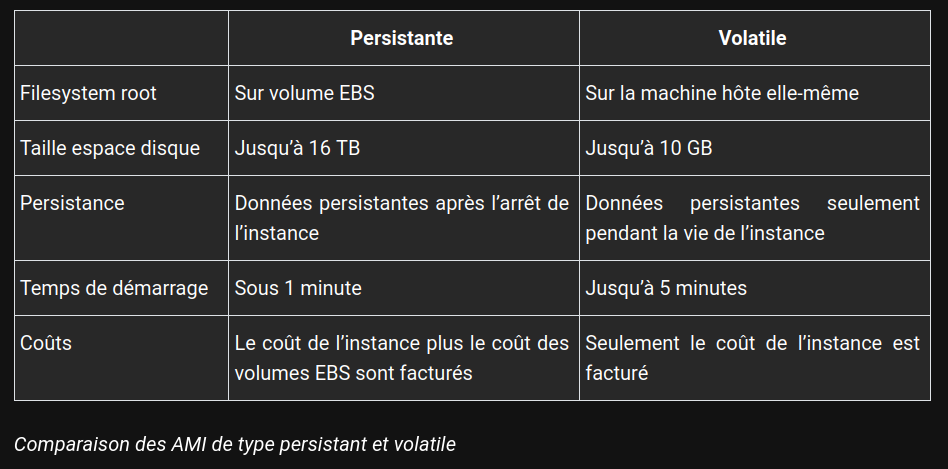

> Il est souvent utile en entreprise de créer ses propres AMI afin de pouvoir déployer plus rapidement des instances EC2 correspondant aux besoins spécifiques. Vous pouvez enregistrer le disque contenant cette AMI après lancement de la machine EC2 et après avoir ajouté les spécificités de l'ensemble de vos machines.

### 6.3 Stockage associé à EC2

#### EBS — Elastic Block Store

- **Disque attaché** à une instance EC2.
- **Persiste** même si l'instance est arrêtée.
- Permet les **snapshots** (sauvegardes incrémentales).
- Idéal pour le stockage de données d'application.
- Peut être attaché/détaché dynamiquement.

**Cas d'usage** : serveur web avec base de données, ERP, systèmes de fichiers importants.

#### EFS — Elastic File System

- **Système de fichiers partagé** entre plusieurs instances.
- Montable sur **plusieurs instances EC2 simultanément**.
- Idéal pour les architectures distribuées.
- Escalabilité automatique sans gestion de capacité.
- Compatible avec NFS (Network File System).

**Cas d'usage** : cluster d'applications, déploiement multi-serveurs, stockage partagé.

**Avantages** :
- Haute disponibilité multi-AZ.
- Performance prédictible et constante.
- Paiement à l'usage (pas de provisionnement anticipé).

#### FSx — Managed File Systems

**Amazon FSx** propose des systèmes de fichiers managés, avec deux options principales :

**FSx for Windows File Server** :
- Compatible **Active Directory** et **SMB** (partages Windows).
- Idéal pour les environnements Windows d'entreprise.
- Partages de fichiers compatibles avec les domaines Windows.

**SMB** (Server Message Block) est le protocole de partage de fichiers natif de Windows — c'est exactement ce que vous utilisez quand vous accédez à un dossier partagé via `\\serveur\dossier` sur un réseau d'entreprise. FSx for Windows reproduit ce protocole nativement dans AWS, ce qui permet à des applications Windows existantes de continuer à fonctionner sans modification.

**FSx for Lustre** :
- Optimisé pour le **high-performance computing (HPC)** et machine learning.
- Très haute performance pour les grandes quantités de données.

**Lustre** est un système de fichiers distribué open source conçu à l'origine pour les supercalculateurs : il répartit un même fichier sur plusieurs serveurs de stockage pour permettre à des milliers de machines de le lire et l'écrire simultanément à très haut débit. C'est ce qui en fait le choix de référence pour l'entraînement de modèles de machine learning sur de gros volumes de données ou les simulations scientifiques (météo, génomique, calcul financier).

**Comparatif EFS vs FSx** :

| Critère | EFS | FSx (Windows) | FSx (Lustre) |
|---------|-----|---------------|-------------|
| **Protocole** | NFS (Linux/Unix) | SMB (Windows) | Lustre (HPC) |
| **OS Support** | Linux/Unix | Windows | Linux/HPC |
| **Active Directory** | Non | ✅ Oui | Non |
| **Performance** | Modérée, extensible | Haute | Très haute (HPC) |
| **Coût** | Bas à moyen | Moyen-élevé | Élevé |
| **Idéal pour** | Linux distribué | Partages Windows d'entreprise | Calcul scientifique/IA |

**Conseil pratique** :
- **EFS** : première option pour Linux si pas besoin de domaine.
- **FSx for Windows** : environnement Windows avec Active Directory.
- **FSx for Lustre** : uniquement si performance HPC requise.

📎 [EBS Documentation](https://docs.aws.amazon.com/AWSEC2/latest/UserGuide/AmazonEBS.html)
📎 [EFS Documentation](https://docs.aws.amazon.com/efs/latest/ug/whatisefs.html)
📎 [FSx Documentation](https://aws.amazon.com/fr/fsx/)

### 6.4 Sécurité EC2

#### Security Groups : pare-feu virtuel

Les **Security Groups** sont des pare-feux virtuels qui :
- Autorisent ou bloquent le trafic,
- Sont **stateful** (les réponses sont automatiquement autorisées),
- Peuvent être appliqués à plusieurs instances.

##### Exemple de règles

| Direction | Port | Source/Destination |
|---|---|---|
| Inbound | 22 (SSH) | `192.168.1.100/32` |
| Inbound | 80 (HTTP) | `0.0.0.0/0` |
| Inbound | 443 (HTTPS) | `0.0.0.0/0` |
| Outbound | Tout | par défaut |

**Règle entrante exemple** :
- Autoriser le port **22 (SSH)** uniquement depuis une IP précise.
- Autoriser les ports **80 et 443 (HTTP/HTTPS)** depuis n'importe où.

**Règle sortante (par défaut)** :
- Autoriser tout trafic sortant.

📎 [Security Groups](https://docs.aws.amazon.com/AWSEC2/latest/UserGuide/ec2-security-groups.html)

#### Key Pairs : accès SSH sécurisé

Les **Key Pairs** servent à sécuriser l'accès SSH :
- **Clé publique** enregistrée dans AWS et stockée dans l'instance au démarrage.
- **Clé privée** conservée localement par l'administrateur.

**Flux de connexion** :
1. Vous lancez une instance EC2 et sélectionnez une Key Pair.
2. AWS injecte la clé publique dans `~/.ssh/authorized_keys` de l'instance.
3. Depuis votre ordinateur, vous utilisez votre clé privée pour vous connecter en SSH.
4. L'authentification par clé est plus sécurisée qu'un mot de passe (impossible à craquer par brute force).

### 6.5 Options de conformité EC2

Les environnements réglementés (santé, finance, RGPD) ont besoin de **garanties de conformité**. AWS fournit plusieurs mécanismes :

#### Dedicated Instances

- Instance EC2 qui s'exécute sur **matériel physique dédié**.
- Pas de partage avec d'autres clients AWS.
- Idéal pour les **exigences légales** ou de conformité.
- Coût plus élevé que le partage de matériel.

#### Dedicated Hosts

- **Serveur physique entier** réservé pour votre compte.
- Contrôle total : vous décidez quelles instances y tournent.
- Utile pour les **licences logicielles** (ex. Windows, SQL Server avec licensing par socket/processeur).
- Exigences réglementaires très strictes.

#### Instance Store (éphémère)

- Stockage **très rapide** mais **temporaire** sur l'hyperviseur physique.
- **Attention** : données perdues à l'arrêt/redémarrage de l'instance.
- Idéal pour cache, données temporaires, haute performance.
- À éviter pour données persistantes.

:::danger
**Instance Store : perte de données garantie à l'arrêt** — Contrairement à EBS, le stockage instance store **n'est pas persistant**. Toutes les données écrites dessus sont définitivement perdues si l'instance est arrêtée, terminée ou si l'hôte physique tombe en panne. Ne stockez jamais de données de production, de bases de données ou de fichiers importants sur instance store sans sauvegarde préalable vers S3 ou EBS.
:::

#### Encrypted EBS Volumes

- Les volumes EBS peuvent être chiffrés avec **AWS KMS**.
- Le chiffrement est **transparent** pour l'application.
- Utile pour la conformité HIPAA, PCI-DSS, ISO 27001.

**Cas d'usage conformité** :
- Données médicales → Dedicated Instance + EBS chiffré + Audit CloudTrail.
- Données financières → Dedicated Host + KMS + VPC isolé.
- Données RGPD → Région EU + Versioning S3 + Chiffrement.

---

## 7. AWS Compute Optimizer — Dimensionnement optimal

### 7.1 Qu'est-ce que AWS Compute Optimizer ?

**AWS Compute Optimizer** est un service qui **analyse vos patterns d'utilisation** des instances EC2 et recommande des types plus optimisés en coût et performance.

| | Instance actuelle | Recommandation |
|---|---|---|
| Type | t3.large (trop puissante) | t3.small (plus économique) |
| CPU utilisation | 5% | — |
| Mémoire | 12% | — |
| Coût mensuel | 80 $ | ~48 $ (économie 60%) |
| Performance | — | identique |
| Risque | — | très faible (marges CPU) |

Compute Optimizer applique cette analyse automatiquement à partir des métriques CloudWatch collectées.

### 7.2 Fonctionnement

1. **Collecte** : Compute Optimizer récupère les métriques CloudWatch (CPU, mémoire, réseau) sur **14 jours minimum**.
2. **Analyse** : Machine Learning compare votre utilisation réelle avec les capabilities des autres types.
3. **Recommandation** : Propose des types économiquement viables.
4. **Confiance** : Indique un score de confiance (low, medium, high).

### 7.3 Types de recommandations

| Recommandation | Bénéfice | Risque | Exemple |
|---|---|---|---|
| **Downsizer** | Économies importantes | Risque d'augmenter le CPU > 100% | t3.large → t3.small |
| **Upgrade** | Meilleure performance | Légère augmentation de coût | m5.large → m5.xlarge |
| **Switch Family** | Meilleure performance/$ | Changement d'architecture | t3.large → m6i.large |
| **Aucune recommandation** | Instance bien dimensionnée | N/A | ✅ Garder tel quel |

### 7.4 Activation et utilisation

Compute Optimizer analyse l'utilisation réelle de vos instances (CPU, mémoire, réseau) sur 14 jours et suggère le type le mieux adapté. La commande suivante affiche ces recommandations sous forme de tableau comparatif.

```bash
# Vérifier les recommandations Compute Optimizer
aws compute-optimizer get-ec2-instance-recommendations \
    --region eu-west-1 \
    --query 'instanceRecommendations[].{
        Instance:instanceArn,
        Current:currentInstanceType,
        Recommended:recommendationOptions[0].instanceType,
        Savings:recommendationOptions[0].savingsOpportunity.estimatedMonthlySavings.value,
        ConfidenceLevel:currentInstanceType
    }' \
    --output table
```

:::success
**Résultat attendu :**
```
-------------------------------------------------------------------------------------------
|                         GetEc2InstanceRecommendations                                   |
+-------------------------------------+----------+------------+---------+------------------+
|              Instance               | Current  | Recommended| Savings | ConfidenceLevel  |
+-------------------------------------+----------+------------+---------+------------------+
|  arn:aws:ec2:eu-west-1:123:instance | t3.large | t3.small   |  47.82  |  t3.large        |
|  arn:aws:ec2:eu-west-1:123:instance | m5.xlarge| m5.large   |  62.40  |  m5.xlarge       |
+-------------------------------------+----------+------------+---------+------------------+
```
Si aucune recommandation n'apparaît, Compute Optimizer manque encore de données (il lui faut au minimum 30h d'activité sur les instances).
:::

### 7.5 Cas d'usage

- **Optimisation de coûts** : identifier toutes les instances surdimensionnées.
- **Gouvernance cloud** : politiques de rightsizing automatisées.
- **Migration** : recommandations pour basculer vers une architecture nouvelle.
- **Audit FinOps** : justification des dépenses EC2.

**Avantage clé** : Compute Optimizer s'appuie sur **12-14 jours de données réelles**, pas sur des hypothèses théoriques.

---

## 8. Options de tarification AWS EC2

AWS propose plusieurs modèles de tarification pour s'adapter aux besoins techniques et budgétaires des entreprises. Le choix dépend du niveau de prévisibilité des workloads, du budget disponible, et de la tolérance aux interruptions.

### 8.1 On-Demand (À la demande)

- **Paiement à l'heure** ou à la seconde pour la capacité de calcul utilisée, sans engagement à long terme.
- **Idéal pour** les charges de travail à court terme, les tests et le développement.
- **Pas de paiement anticipé** ni d'engagement minimum.
- **Prix plus élevé** que les autres options mais offre une flexibilité maximale.
- **Recommandé pour** les applications ne pouvant pas être interrompues et ayant des charges de travail imprévisibles.

**Exemple** : Vous avez un pic de trafic imprévu. Vous lancez des instances On-Demand pour répondre à la demande, puis les arrêtez après le pic.

### 8.2 Savings Plans

- **Engagement de consommation horaire en dollars** ($/heure) sur une période de 1 ou 3 ans.
- **Réductions** pouvant atteindre **72%** par rapport au tarif à la demande.
- **Deux types principaux** :
  - **Compute Savings Plans** : Flexibilité maximale couvrant EC2, Fargate et Lambda, avec support multi-familles d'instances, tailles et régions.
  - **EC2 Instance Savings Plans** : Réductions plus importantes mais limité à une famille d'instances dans une région spécifique.
- **Options de paiement** flexibles impactant le taux de réduction :
  - **No Upfront** : Aucun paiement initial.
  - **Partial Upfront** : Paiement partiel initial.
  - **Full Upfront** : Paiement total initial offrant les meilleures réductions.

### 8.3 Instances Spot (À prix réduit)

- **Utilisation de la capacité EC2 inutilisée** d'AWS.
- **Réductions jusqu'à 90%** par rapport au prix à la demande.
- **Les instances peuvent être interrompues** avec un préavis de 2 minutes si AWS a besoin de la capacité.
- **Idéal pour** :
  - Les charges de travail tolérantes aux interruptions.
  - Le calcul haute performance (HPC).
  - Les jobs batch (traitement par lots).
  - Les workloads flexibles en termes de début et de fin.

**Best practices pour la résilience** :
- Utiliser les **groupes d'auto-scaling** pour gérer les interruptions automatiquement.
- Implémenter via **EC2 Spot Fleet** ou **EC2 Spot Instances Requests**.
- Concevoir l'application pour tolérer les interruptions.

:::warning
**Instances Spot : interruption en 2 minutes** — AWS peut récupérer vos instances Spot avec seulement **2 minutes de préavis** lorsque la capacité est nécessaire. Ne jamais utiliser des instances Spot pour des workloads critiques sans tolérance aux interruptions (bases de données de production, serveurs web sans état de session externalisé). Toujours prévoir un mécanisme de sauvegarde ou de checkpoint des données en cours de traitement.
:::

### 8.4 Reserved Instances (RI)

- **Engagement** sur une instance spécifique pour **1 ou 3 ans**.
- **Réductions jusqu'à 75%** par rapport au prix à la demande.
- **Différences principales** avec les Savings Plans :
  - Les RI sont liées à une instance spécifique (type, taille, région, zone).
  - Les Savings Plans sont basés sur un engagement de consommation en dollars (plus flexibles).
  - Les RI peuvent être vendues sur le **AWS RI Marketplace**, pas les Savings Plans.

### 8.5 Comparatif synthétique

| Critère | On-Demand | Reserved | Spot | Savings Plans |
|---------|-----------|----------|------|----------------|
| **Engagement** | Aucun | 1 ou 3 ans | Aucun | 1 ou 3 ans |
| **Réduction potentielle** | ❌ | ✅ (75%) | ✅✅✅ (90%) | ✅✅ (72%) |
| **Flexibilité** | ✅✅✅ | ❌ | ✅✅ | ✅✅ |
| **Risque d'interruption** | ❌ | ❌ | ✅✅✅ | ❌ |
| **Idéal pour** | Dev/Test | Prod stable | Batch/CI | Prod optimisée |

**Recommandation** : Pour la plupart des entreprises, **Savings Plans** offre le meilleur compromis entre réduction (72%) et flexibilité.

### 8.6 Cas métier : Choisir la meilleure option tarifaire

#### Cas 1 : Site e-commerce avec trafic prévisible

- **Charge** : trafic stable, pics prévisibles en fin d'année.
- **Infrastructure** : 10 instances t3.large en continu, +20 during soldes.
- **Recommandation** : **Savings Plans (Compute)** pour les 10 instances permanentes + **Spot** pour les 20 supplémentaires pendant les soldes.
- **Économie** : ~72% sur la base, ~90% sur les renforts = **78% global**.

```
Coût mensuel sans optimisation (tout On-Demand) :
  10 × 730h × 0,096$ (t3.large) = 699 $

Coût optimisé (Savings Plans + Spot) :
  10 × (0,096$ × 0,28) + 20 × (0,096$ × 0,10) = 26,88 $ + 19,2 $ = 46,08 $

Économie : 652,92 $ / mois = 7,835 $ / an
```

#### Cas 2 : Environnement de développement/test

- **Charge** : variable, utilisation heures de travail uniquement.
- **Infrastructure** : 2-4 instances selon le sprint en cours.
- **Recommandation** : **On-Demand** uniquement (pas d'engagement, flexibilité totale).
- **Économie** : aucune, mais coûts minimaux et liberté maximale.

#### Cas 3 : Job batch nocturne de traitement

- **Charge** : lance chaque nuit des instances pour 4h, puis arrêt.
- **Infrastructure** : 50 instances c5.2xlarge pour le parallélisme.
- **Recommandation** : **Spot instances** avec **Spot Fleet** (demande auto-scaling de remplacement).
- **Économie** : ~90% vs On-Demand = **81$/j au lieu de 810$**, soit 8,100$/mois.

```bash
# Configuration Spot Fleet pour job batch
aws ec2 request-spot-fleet \
    --spot-fleet-request-config '{
        "IamFleetRole": "arn:aws:iam::xxxxx:role/fleet",
        "SpotPrice": "0.10",
        "TargetCapacity": 50,
        "LaunchSpecifications": [{
            "ImageId": "ami-xxxxx",
            "InstanceType": "c5.2xlarge",
            "KeyName": "ma-cle"
        }]
    }'
```

:::success
**Résultat attendu :**
```
{
    "SpotFleetRequestId": "sfr-0a1b2c3d4e5f6789a",
    "SpotFleetRequestState": "submitted"
}
```
:::

#### Cas 4 : Application critiques 24/7 avec charge non prévisible

- **Charge** : pas de pattern clair, augmentations soudaines.
- **Infrastructure** : 4-30 instances selon la demande.
- **Recommandation** : **Savings Plans (mélange)** pour la charge de base + **On-Demand** pour les pics.
- **Avantage** : si charge explose au-delà des prévisions, On-Demand absorbe sans coupure.

### 8.7 Outil : AWS Pricing Calculator

```
URL : https://calculator.aws/
1. Sélectionner la région
2. Ajouter EC2 : type, nombre, durée
3. Sélectionner option (On-Demand, Reserved, Spot)
4. Voir l'estimation mensuelle/annuelle
5. Exporter en PDF pour justifier budgets
```

📎 [EC2 Pricing](https://aws.amazon.com/ec2/pricing/)

---

## 9. Lancer une instance EC2 en CLI

:::info
Une activité pratique permet d’approfondir le lancement d’instances EC2 en CLI.
:::

### 9.1 Créer une Key Pair

La Key Pair est l'équivalent d'une clé SSH. AWS génère la paire (privée + publique), conserve la clé publique, et vous remet la clé privée **une seule fois**. Le `chmod 600` est obligatoire — SSH refuse de se connecter si la clé est trop permissive.

```bash
# Créer une nouvelle paire de clés
aws ec2 create-key-pair \
    --key-name ma-cle-formation \
    --query 'KeyMaterial' \
    --output text > ~/.ssh/ma-cle-formation.pem

# Définir les permissions correctes (très important pour SSH)
chmod 600 ~/.ssh/ma-cle-formation.pem

# Vérifier les clés existantes
aws ec2 describe-key-pairs \
    --query 'KeyPairs[].KeyName' \
    --output table
```

**Explications** :
- `create-key-pair` : génère une nouvelle paire de clés
- `--key-name` : identifiant de la clé
- `--output text` : affiche juste le contenu privé
- `chmod 600` : permissions restrictives (propriétaire seul peut lire)

:::success
**Résultat attendu :**
```
# La clé privée est écrite dans ~/.ssh/ma-cle-formation.pem (aucun output CLI)

# describe-key-pairs --output table affiche :
------------------------------------
|        DescribeKeyPairs          |
+----------------------------------+
|       ma-cle-formation           |
+----------------------------------+
```
:::

:::warning
**Clé privée : une seule chance de la télécharger** — AWS ne conserve jamais la clé privée. Si vous perdez le fichier `.pem`, vous devrez créer une nouvelle Key Pair et relancer une instance — il est impossible de récupérer l'accès SSH autrement. Sauvegardez systématiquement votre clé dans un gestionnaire de secrets (AWS Secrets Manager, HashiCorp Vault) ou dans un endroit sécurisé.
:::

### 9.2 Lancer une instance EC2 simple

On récupère d'abord l'ID de la dernière AMI Ubuntu 20.04 disponible, puis on lance une instance `t3.micro` (éligible au Free Tier). La variable `$AMI_ID` évite de copier-coller un ID d'image qui change régulièrement.

```bash
# Récupérer l'AMI Ubuntu la plus récente
AMI_ID=$(aws ec2 describe-images \
    --owners 099720109477 \
    --filters "Name=name,Values=ubuntu/images/hvm-ssd/ubuntu-focal-20.04-amd64-server-*" \
    --query 'sort_by(Images, &CreationDate)[-1].[ImageId]' \
    --output text)

# Lancer l'instance
aws ec2 run-instances \
    --image-id $AMI_ID \
    --instance-type t3.micro \
    --key-name ma-cle-formation \
    --security-groups sg-formation \
    --region eu-west-1 \
    --query 'Instances[0].[InstanceId,PublicIpAddress,State.Name]' \
    --output table
```

**Explications** :
- `describe-images` : recherche d'une AMI Ubuntu récente
- `--image-id` : l'AMI à utiliser (système d'exploitation)
- `--instance-type t3.micro` : type d'instance (gratuit dans Free Tier)
- `--key-name` : la clé SSH pour se connecter
- `--security-groups` : pare-feu assigné à l'instance

:::success
**Résultat attendu :**
```
---------------------------------------------------
|               RunInstances                      |
+---------------------+---------------+-----------+
|     InstanceId      | PublicIpAddr  |   State   |
+---------------------+---------------+-----------+
|  i-0abc123def45678  |  None         |  pending  |
+---------------------+---------------+-----------+

# Après ~30 secondes, l'état passe à "running" :
+---------------------+---------------+-----------+
|  i-0abc123def45678  |  54.171.23.45 |  running  |
+---------------------+---------------+-----------+
```
:::

### 9.3 Se connecter à l'instance

La première commande récupère l'IP publique de l'instance via CLI (plutôt que de la copier depuis la console), la seconde s'y connecte en SSH avec la clé créée précédemment.

```bash
# Obtenir l'adresse IP publique
INSTANCE_ID="i-xxxxx"
IP=$(aws ec2 describe-instances \
    --instance-ids $INSTANCE_ID \
    --query 'Reservations[0].Instances[0].PublicIpAddress' \
    --output text)

# Se connecter en SSH
ssh -i ~/.ssh/ma-cle-formation.pem ubuntu@$IP

# Une fois connecté, les commandes Linux habituelles s'exécutent normalement
```

**Explications** :
- `describe-instances` : récupère les infos de l'instance
- `PublicIpAddress` : adresse IP pour accès depuis Internet
- `-i ~/.ssh/ma-cle-formation.pem` : utilise votre clé privée
- `ubuntu` : utilisateur par défaut dans les AMI Ubuntu

:::success
**Résultat attendu :**
```
# describe-instances retourne l'IP :
54.171.23.45

# Connexion SSH réussie :
Warning: Permanently added '54.171.23.45' (ED25519) to the list of known hosts.
Welcome to Ubuntu 20.04.6 LTS (GNU/Linux 5.15.0-1053-aws x86_64)

 * Documentation:  https://help.ubuntu.com
 * Management:     https://landscape.canonical.com
 * Support:        https://ubuntu.com/advantage

ubuntu@ip-10-0-1-45:~$
```
:::

:::warning
**Sécurité SSH : limitez l'accès au port 22** — Ouvrir le port 22 à `0.0.0.0/0` (toutes les IPs) expose votre instance aux scanners automatisés et tentatives de brute force. Dans votre Security Group, restreignez toujours l'accès SSH à votre adresse IP publique uniquement (`monip/32`). Utilisez `curl ifconfig.me` pour connaître votre IP courante.
:::

### 9.4 Créer une image (AMI) à partir d'une instance

Créer une AMI depuis une instance configurée permet de la **cloner** rapidement : toutes vos installations et configurations sont préservées. C'est la base du déploiement automatisé avec Auto Scaling.

```bash
# Créer une AMI personnalisée
aws ec2 create-image \
    --instance-id i-xxxxx \
    --name "Ma-Formation-AMI" \
    --description "AMI avec mes configurations de formation" \
    --no-reboot \
    --output table

# Vérifier la création
aws ec2 describe-images \
    --owners self \
    --query 'Images[].[ImageId,Name,State]' \
    --output table
```

**Explications** :
- `create-image` : crée une nouvelle AMI à partir d'une instance
- `--no-reboot` : ne redémarre pas l'instance (accélère le processus)
- `--owners self` : affiche uniquement vos AMI personnalisées

:::success
**Résultat attendu :**
```
# create-image retourne :
{
    "ImageId": "ami-0a1b2c3d4e5f67890"
}

# describe-images --output table affiche :
---------------------------------------------------------
|                   DescribeImages                      |
+---------------------+------------------+--------------+
|       ImageId       |       Name       |    State     |
+---------------------+------------------+--------------+
|  ami-0a1b2c3d4e5f6  |  Ma-Formation-AMI|   pending    |
+---------------------+------------------+--------------+

# Après quelques minutes :
|  ami-0a1b2c3d4e5f6  |  Ma-Formation-AMI|  available   |
```
:::

### 9.5 Créer un snapshot EBS

Un snapshot EBS est une sauvegarde du disque d'une instance. Contrairement à une AMI (qui inclut le système complet), le snapshot est juste le contenu du volume — utile pour restaurer des données sans recréer toute une instance.

```bash
# Lister les volumes EBS attachés
aws ec2 describe-volumes \
    --filters "Name=attachment.instance-id,Values=i-xxxxx" \
    --query 'Volumes[].[VolumeId,Size,State]' \
    --output table

# Créer un snapshot d'un volume
aws ec2 create-snapshot \
    --volume-id vol-xxxxx \
    --description "Snapshot de sauvegarde formation" \
    --tag-specifications 'ResourceType=snapshot,Tags=[{Key=Name,Value=backup-formation}]' \
    --output table

# Vérifier l'état du snapshot
aws ec2 describe-snapshots \
    --owner-ids self \
    --query 'Snapshots[].[SnapshotId,VolumeSize,State,Progress]' \
    --output table
```

**Explications** :
- `describe-volumes` : liste les disques EBS attachés à une instance
- `create-snapshot` : crée une sauvegarde du disque
- `--tag-specifications` : ajoute des étiquettes pour l'organiser
- Le snapshot est **incrémental** : seuls les changements sont sauvegardés

:::success
**Résultat attendu :**
```
# describe-volumes --output table :
-------------------------------------------
|          DescribeVolumes                |
+------------------+------+---------------+
|    VolumeId      | Size |     State     |
+------------------+------+---------------+
|  vol-0a1b2c3d4e  |  20  |   in-use      |
+------------------+------+---------------+

# create-snapshot retourne :
{
    "SnapshotId": "snap-0a1b2c3d4e5f67890",
    "VolumeId": "vol-0a1b2c3d4e",
    "State": "pending",
    "Progress": ""
}

# describe-snapshots après quelques minutes :
--------------------------------------------------------------
|                   DescribeSnapshots                        |
+---------------------+------+-----------+---------+--------+
|     SnapshotId      | Size |   State   |Progress |        |
+---------------------+------+-----------+---------+--------+
|  snap-0a1b2c3d4e5  |  20  |  completed|  100%   |        |
+---------------------+------+-----------+---------+--------+
```
:::

:::warning
**Coûts des snapshots EBS** — Les snapshots sont stockés dans S3 (managé par AWS) et facturés ~0,05 $/Go-mois. Un snapshot de 100 Go coûte ~5 $/mois. Les snapshots sont **incrémentiels** (seules les modifications depuis le dernier snapshot sont stockées), mais les premiers snapshots peuvent être volumineux. Planifiez une politique de rétention et supprimez les snapshots obsolètes pour maîtriser les coûts.
:::

---

## 10. Elastic Load Balancing (ELB) — Répartition du trafic

### 10.1 Pourquoi un Load Balancer ?

Un **Load Balancer** agit comme un répartiteur de trafic. Il reçoit les requêtes des clients et les distribue vers les instances EC2 disponibles, selon des règles de routage et de santé (**health checks**).

#### Architecture simple

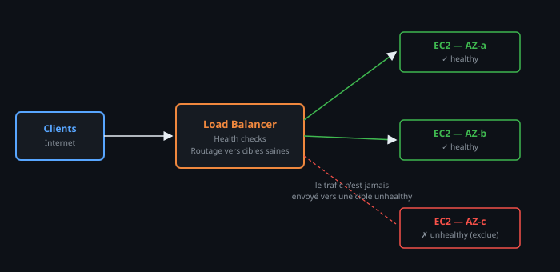

### 10.2 Types de Load Balancer AWS

| Type | Cas d'usage typique | Protocole | Niveau OSI |
|---|---|---|---|
| **ALB (Application Load Balancer)** | Applications web, microservices | HTTP/HTTPS | Couche 7 (Application) |
| **NLB (Network Load Balancer)** | Faible latence, TCP | TCP/UDP | Couche 4 (Transport) |
| **GLB (Gateway Load Balancer)** | Appliances réseau (firewall, inspection) | IP | Couche 3 (Réseau) |

**ALB (Application Load Balancer)** : conçu pour les applications web. Il fonctionne au niveau **HTTP/HTTPS** (couche 7 du modèle OSI) et permet un **routage avancé** (par URL, en-tête, hostname, etc.).

**NLB (Network Load Balancer)** : adapté aux applications nécessitant une **faible latence**. Il fonctionne au niveau **TCP** (couche 4), idéal pour les bases de données ou les services temps réel.

**GLB (Gateway Load Balancer)** : utilisé pour intégrer des **appliances réseau** comme des pare-feu ou des outils d'inspection. Il fonctionne au niveau **IP**.

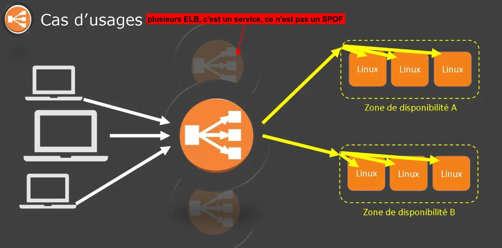

### 10.3 Fonctionnement du Load Balancer

- Le Load Balancer **vérifie l'état** des instances via des **health checks** (tests de disponibilité).
- Il **répartit les requêtes** vers les instances **saines** uniquement.
- Il s'**adapte automatiquement** à l'ajout ou la suppression d'instances via **Auto Scaling**.

**Health Check - Exemple** :
```
Chaque 30 secondes :
1. LB envoie requête GET http://instance:80/health
2. Instance répond HTTP 200 OK
3. Instance est marquée "saine"

Si pas de réponse ou erreur 5xx :
1. Instance marquée "défaillante"
2. Pas plus de trafic envoyé vers elle
```

📎 [Elastic Load Balancing Documentation](https://docs.aws.amazon.com/elasticloadbalancing/)

---

## 11. Auto Scaling — Adaptation dynamique des ressources

### 11.1 Qu'est-ce qu'Auto Scaling ?

Un **Auto Scaling Group (ASG)** est un groupe d'instances EC2 géré automatiquement. Il peut être associé à un Load Balancer pour garantir que :

- Les nouvelles instances sont automatiquement **enregistrées** auprès du Load Balancer.
- Les instances défaillantes sont **retirées** du pool.
- Le trafic est toujours dirigé vers les **ressources disponibles**.

### 11.2 Politiques de scaling — Fondamentaux

Les politiques définissent **quand et comment** ajouter ou retirer des instances.

#### Scale-out (Agrandissement)

```
Charge CPU dépasse 70% pendant 5 min
                 ▼
Ajouter 2 instances supplémentaires
                 ▼
Attendre que les instances démarrent
                 ▼
Health check OK : instances intégrées au LB
```

#### Scale-in (Réduction)

```
Charge CPU chute à 30% pendant 10 min
                 ▼
Retirer 1 instance
                 ▼
Attendre que les requêtes actuelles finissent
                 ▼
Fermer l'instance, libérer les ressources
```

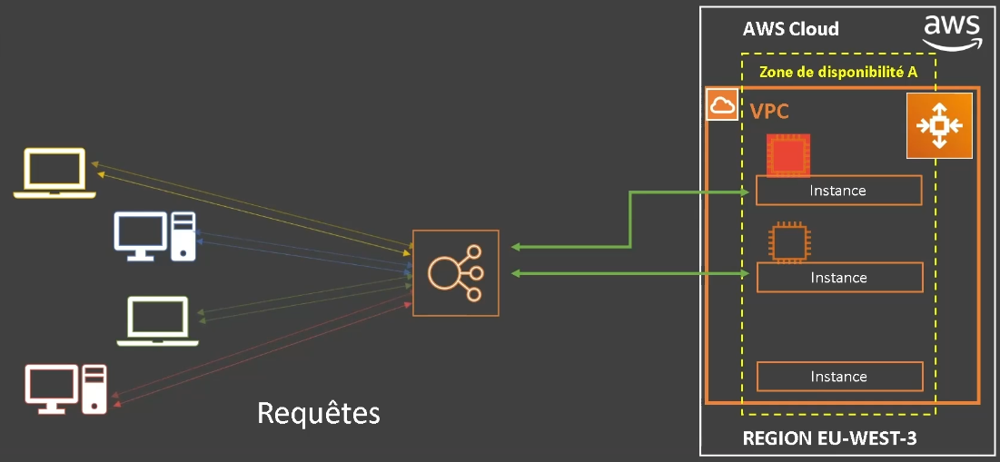

### 11.3 Configuration d'Auto Scaling

Un ASG typique comporte :

Min Size : 2 instances · Max Size : 10 instances · Desired Capacity : 4 instances
Launch Template : my-ami-config · Load Balancer : my-alb

Scaling Policies : Target CPU 70% · Scale out +2 instances/5 min · Scale in -1 instance/10 min

**Paramètres clés** :
- **Min Size** : minimum d'instances (au moins 2 pour la haute disponibilité)
- **Max Size** : limite supérieure pour éviter les coûts explosifs
- **Desired Capacity** : nombre d'instances cible en ce moment
- **Launch Template** : modèle (AMI, type, security group, etc.) pour les nouvelles instances

### 11.4 Métriques CloudWatch et politiques de scaling avancées

Auto Scaling peut se baser sur **plusieurs métriques CloudWatch**, pas seulement CPU.

#### Métriques disponibles

| Métrique | Source | Cas d'usage typique |
|----------|--------|-------------------|
| **CPU Utilization** | CloudWatch | Charge générale, serverless |
| **NetworkIn / NetworkOut** | CloudWatch | Applications réseau intensives |
| **ALB Target Count** | CloudWatch + ELB | Nombre de requêtes traitées |
| **Request Count Per Target** | CloudWatch + ELB | Répartition de charge par instance |
| **Target Response Time** | CloudWatch + ELB | Dégradation de performance |
| **Memory Utilization** | CloudWatch Agent | Applications mémoire-intensives |
| **Queue Depth** (SQS) | SQS | Traitement asynchrone |

#### Exemple de politique de scaling multi-métriques

On crée ici deux politiques indépendantes sur le même ASG : l'une réagit au CPU, l'autre au débit réseau. AWS les évalue en parallèle et déclenche le scaling dès que l'une d'elles est satisfaite.

```bash
# Politique 1 : Scale out si CPU > 75% pendant 2 minutes
aws autoscaling put-scaling-policy \
    --auto-scaling-group-name mon-asg \
    --policy-name cpu-scale-out \
    --policy-type TargetTrackingScaling \
    --target-tracking-configuration '{
        "TargetValue": 75.0,
        "PredefinedMetricSpecification": {
            "PredefinedMetricType": "ASGAverageCPUUtilization"
        },
        "ScaleOutCooldown": 120,
        "ScaleInCooldown": 300
    }'

# Politique 2 : Scale out si Network > 1 Gbps
aws autoscaling put-scaling-policy \
    --auto-scaling-group-name mon-asg \
    --policy-name network-scale-out \
    --policy-type TargetTrackingScaling \
    --target-tracking-configuration '{
        "TargetValue": 70.0,
        "CustomizedMetricSpecification": {
            "MetricName": "NetworkOut",
            "Namespace": "AWS/EC2",
            "Statistic": "Average"
        }
    }'
```

:::success
**Résultat attendu :**
```
# put-scaling-policy (cpu-scale-out) retourne :
{
    "PolicyARN": "arn:aws:autoscaling:eu-west-1:123456789012:scalingPolicy:a1b2c3d4:autoScalingGroupName/mon-asg:policyName/cpu-scale-out",
    "Alarms": [
        {
            "AlarmName": "TargetTracking-mon-asg-AlarmHigh-cpu-scale-out",
            "AlarmARN": "arn:aws:cloudwatch:eu-west-1:123456789012:alarm:TargetTracking-mon-asg-AlarmHigh"
        }
    ]
}

# put-scaling-policy (network-scale-out) retourne de même avec un ARN différent
```
:::

#### Cooldown Periods (délais entre actions)

- **ScaleOutCooldown** (120-300s) : attend avant la prochaine augmentation.
  - Évite les oscillations rapides (scaling de "ping-pong").
  - Laisse le temps aux instances de démarrer.

- **ScaleInCooldown** (300-900s) : plus long que scale-out.
  - Garantit l'équilibre avant réduction.
  - Préserve la performance en cas de pics rapides.

**Exemple réaliste** :
```
T=0s    CPU = 80% → Déclenche scale-out (+2 instances)
T=120s  Instances démarrent (cool-down scale-out)
T=180s  CPU = 60% → Pourrait déclencher scale-in MAIS...
T=240s  Attendre le cooldown scale-in
T=540s  CPU toujours < 30% → Scale-in (-1 instance)
```

**Conseil** : Définir des cooldowns asymétriques (court pour scale-out, long pour scale-in) pour favorer la disponibilité.

📎 [Auto Scaling EC2](https://docs.aws.amazon.com/autoscaling/ec2/)

### 11.5 Avantages combinés Load Balancer + Auto Scaling

- **Résilience** : les instances défaillantes sont automatiquement **remplacées**.
- **Scalabilité** : le nombre d'instances s'adapte à la **charge** en temps réel.
- **Performance** : le trafic est réparti de manière **optimale** entre les ressources disponibles.
- **Économie** : vous payez uniquement pour les ressources utilisées.
- **Sécurité** : le Load Balancer peut gérer les **certificats SSL/TLS** pour sécuriser les communications.

---

## 12. AWS Lambda — Le calcul sans serveur

### 12.1 Pourquoi Lambda, quand on a déjà EC2 et Auto Scaling ?

Vous venez de voir comment EC2 et Auto Scaling permettent d'adapter dynamiquement une flotte de serveurs à la charge. Mais même avec Auto Scaling, une instance EC2 minimale **tourne en permanence** — vous la payez même quand elle ne traite aucune requête.

**AWS Lambda** pousse le modèle serverless plus loin : au lieu de faire tourner un serveur en continu, vous déployez une **fonction** — un bloc de code — qu'AWS exécute uniquement quand un événement le déclenche (requête HTTP, fichier déposé sur S3, message dans une file, tâche planifiée...). Entre deux exécutions, **aucune ressource ne tourne, donc rien n'est facturé**.

| | EC2 (même avec Auto Scaling) | Lambda |
|---|---|---|
| **Ce que vous gérez** | OS, runtime, mises à jour, capacité | Uniquement votre code |
| **Facturation** | À l'heure/seconde tant que l'instance tourne | À l'exécution (durée × mémoire allouée) |
| **Charge nulle** | Coût minimal non nul (au moins 1 instance) | **0 $** — aucune exécution, aucun coût |
| **Démarrage** | Minutes (boot instance) ou secondes (déjà démarrée) | Millisecondes à quelques secondes (cold start) |
| **Durée d'exécution max** | Illimitée | **15 minutes** par exécution |

### 12.2 Fonctionnement d'une fonction Lambda

Une fonction Lambda est un paquet de code (Python, Node.js, Java, Go, etc.) associé à une configuration : mémoire allouée (128 Mo à 10 Go), timeout maximal, et un ou plusieurs **triggers** — les événements qui la déclenchent.

```
Événement déclencheur                    Fonction Lambda                Résultat
─────────────────────                    ────────────────                ────────
Requête HTTP (API Gateway)      ──►    Exécute le code       ──►    Réponse HTTP
Fichier déposé sur S3            ──►    (runtime + mémoire     ──►    Traitement du fichier
Message dans une file SQS        ──►     alloués à la demande) ──►    Traitement du message
Planification (EventBridge)      ──►                            ──►    Tâche exécutée
```

Le CPU alloué est proportionnel à la mémoire configurée — une fonction à 1 769 Mo de RAM obtient l'équivalent d'un vCPU complet. AWS gère entièrement l'infrastructure sous-jacente : vous ne choisissez ni AMI, ni type d'instance, ni Security Group pour la fonction elle-même.

### 12.3 Créer et invoquer une fonction Lambda en CLI

:::info
Une activité pratique permet d’approfondir la création et l’invocation de fonctions Lambda.
:::

Cette séquence crée une fonction Lambda Python minimale, l'invoque manuellement, puis vérifie les logs d'exécution dans CloudWatch.

```bash
# 1. Écrire le code de la fonction (fichier local)
cat > lambda_function.py << 'EOF'
def lambda_handler(event, context):
    nom = event.get('nom', 'monde')
    return {
        'statusCode': 200,
        'body': f'Bonjour, {nom} ! Fonction exécutée avec succès.'
    }
EOF

# 2. Empaqueter le code en ZIP (format attendu par Lambda)
zip function.zip lambda_function.py

# 3. Créer le rôle IAM que la fonction va assumer (permissions d'exécution)
aws iam create-role \
  --role-name formation-lambda-role \
  --assume-role-policy-document '{
    "Version": "2012-10-17",
    "Statement": [{
      "Effect": "Allow",
      "Principal": {"Service": "lambda.amazonaws.com"},
      "Action": "sts:AssumeRole"
    }]
  }'

# 4. Attacher la policy minimale pour écrire les logs CloudWatch
aws iam attach-role-policy \
  --role-name formation-lambda-role \
  --policy-arn arn:aws:iam::aws:policy/service-role/AWSLambdaBasicExecutionRole

# 5. Créer la fonction Lambda
aws lambda create-function \
  --function-name formation-bonjour \
  --runtime python3.12 \
  --role arn:aws:iam::123456789012:role/formation-lambda-role \
  --handler lambda_function.lambda_handler \
  --zip-file fileb://function.zip \
  --memory-size 128 \
  --timeout 10

# 6. Invoquer la fonction avec un événement de test
aws lambda invoke \
  --function-name formation-bonjour \
  --payload '{"nom": "Formation AWS"}' \
  --cli-binary-format raw-in-base64-out \
  reponse.json

cat reponse.json
```

:::success
**Résultat attendu :**
```json
{
  "StatusCode": 200,
  "ExecutedVersion": "$LATEST"
}
```
Contenu de `reponse.json` :
```json
{"statusCode": 200, "body": "Bonjour, Formation AWS ! Fonction exécutée avec succès."}
```
La fonction s'est exécutée en quelques centaines de millisecondes. Aucune instance EC2 n'a été provisionnée — Lambda a alloué l'environnement d'exécution le temps de traiter cette seule invocation, puis l'a libéré.
:::

```bash
# 7. Consulter les logs d'exécution (CloudWatch Logs, créés automatiquement)
aws logs tail /aws/lambda/formation-bonjour --follow
```

:::info
**Le rôle IAM est la seule "sécurité réseau" de Lambda par défaut.** Contrairement à EC2, une fonction Lambda n'a pas de Security Group tant qu'elle n'est pas explicitement rattachée à un VPC (`--vpc-config`). Une Lambda simple qui n'a besoin que d'appeler d'autres services AWS (S3, DynamoDB) via leurs API n'a généralement pas besoin d'être dans un VPC — le rôle IAM suffit à contrôler ce qu'elle a le droit de faire.
:::

### 12.4 Combien coûte Lambda ?

Lambda facture deux choses : le **nombre d'invocations** et la **durée × mémoire** consommée.

| Élément | Tarif (région Paris) | Free Tier mensuel |
|---|---|---|
| Invocations | 0,20 $ par million | 1 million gratuit |
| Durée de calcul | 0,0000166667 $ par Go-seconde | 400 000 Go-secondes gratuites |

**Exemple concret** : une fonction à 512 Mo (0,5 Go) qui s'exécute 200 ms, appelée 2 millions de fois par mois :
```
Invocations : 2 000 000 × 0,20 $ / 1 000 000        = 0,40 $
Durée       : 2 000 000 × 0,2 s × 0,5 Go × 0,0000166667 $ = 3,33 $
                                                    TOTAL ≈ 3,73 $/mois
```

À comparer à une instance EC2 t3.micro tournant en continu pour traiter le même trafic (~12 $/mois de base, même si elle est idle 80 % du temps) : Lambda devient très avantageux dès que la charge est **intermittente** plutôt que constante. À l'inverse, pour un service qui reçoit du trafic 24h/24 à haut volume, une instance EC2 dimensionnée correctement (ou plusieurs derrière un ELB) redevient souvent moins chère que des millions d'invocations Lambda.

📎 [AWS Lambda Pricing](https://aws.amazon.com/lambda/pricing/)
📎 [AWS Lambda Documentation](https://docs.aws.amazon.com/lambda/)

---

## 13. Architecture complète : Illustration e-commerce

Scénario réaliste — montée en charge pendant les soldes, puis retour à la normale :

### 13.1 Avant les soldes (charge normale)

Les clients normaux passent par l'Application Load Balancer, qui répartit le trafic sur trois instances EC2 (EC2-1, EC2-2, EC2-3). L'Auto Scaling Group est configuré avec Min=2, Max=10, Desired=3.

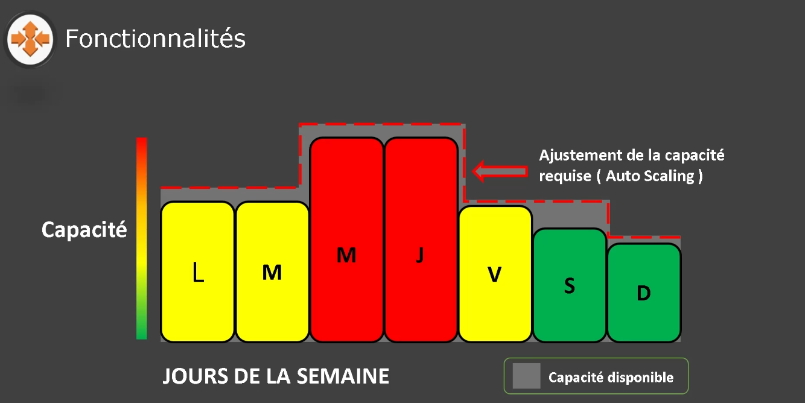

### 13.2 Pendant les soldes (pic de trafic)

Le trafic est multiplié par 5, le CPU moyen passe à 85% — cela déclenche le scale-out : 4 instances supplémentaires sont ajoutées derrière l'Application Load Balancer, portant le total à 7 instances actives (Desired Capacity = 7).


### 13.3 Après les soldes (retour à la normale)

```
Trafic revient à la normale
          
    CPU chute à 40%
          
    Déclenchement du scale-in
          
    Retirer 4 instances
          
    Desired Capacity = 3
    Coûts réduits
```

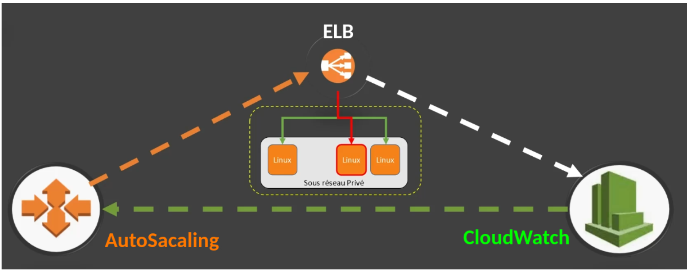

---

## 14. Bonnes pratiques — Architecture hautement disponible

### 14.1 Architecture résiliente S3

**Multi-région** :
- S3 est déjà multi-AZ au sein d'une région.
- Pour une résilience maximale, activer la **réplication cross-région** (CRR).
- Utile pour respecter des exigences de conformité (RGPD, etc.).

**Versioning + Lifecycle** :
- Toujours activer le versioning sur les buckets de production.
- Combiner avec des règles de cycle de vie pour éviter les coûts exponentiels.
- Exemple : garder 30 versions actives, archiver le reste en Glacier.

**Monitoring et alertes** :
- CloudWatch pour surveiller les métriques S3.
- CloudTrail pour auditer les accès et modifications.
- S3 Access Analyzer pour vérifier les politiques d'accès.

### 14.2 Architecture résiliente EC2

**Load Balancer + Auto Scaling minimum** :
- Toujours au minimum 2 instances (haute disponibilité).
- Répartir sur **plusieurs zones de disponibilité (AZ)**.
- Configurer les health checks correctement.

**Sécurité en couches** :
- Security Groups : bloquer les ports inutiles.
- IAM Roles : donner uniquement les permissions nécessaires.
- Subnets privés pour les instances sans accès Internet.

**Sauvegardes** :
- Snapshots EBS réguliers (quotidiens ou hebdomadaires).
- Externaliser les sauvegardes sur S3.
- Tester la restauration régulièrement !

### 14.3 Optimisation des coûts

**S3 Coûts** :
- Utiliser **Intelligent-Tiering** si l'accès est imprévisible.
- Activer les **lifecycle policies** agressives pour archiver.
- Monitorer la bande passante (les téléchargements hors AWS coûtent cher).

:::warning
**Attention aux coûts cachés S3** — Le prix du stockage S3 Standard (~0,023 $/Go-mois) est souvent bien inférieur aux coûts de **transfert sortant** (~0,09 $/Go) et aux **frais de requêtes** (PUT, COPY, LIST, GET). Pour un Data Lake avec des millions d'objets, les requêtes LIST peuvent représenter une part significative de la facture. Activez **Cost Explorer** avec les tags S3 pour identifier les sources de dépenses.
:::

**EC2 Coûts** :
- Utiliser **Savings Plans** pour les workloads stables (72% d'économie).
- **Spot** pour les job batch ou CI/CD tolérants aux interruptions.
- AWS Compute Optimizer pour dimensionner correctement.
- Éteindre les ressources de dev/test en fin de journée.

**Estimateur AWS** :
- Utiliser le **Pricing Calculator** pour estimer les coûts futurs.
- Vérifier les coûts inattendus via la **Cost Explorer**.

### 14.4 Performance et scalabilité

**S3 Performance** :
- Utiliser des **préfixes intelligents** pour éviter les goulots d'étranglement (ex. `2024/03/24/log-xxxxx`).
- Activer **S3 Transfer Acceleration** pour les uploads volumineux (MultiPart Upload).
- CloudFront comme CDN pour la distribution worldwide.

**EC2 Performance** :
- **Monitoring continu** : CPU, mémoire, réseau, disque.
- **Auto Scaling** sur **multiple métriques** : CPU, mémoire, débit réseau.
- Usar **Read Replicas** pour les bases de données.
- **Connexion pooling** pour les applications critiques.

---

## 15. Conformité et sécurité pour les données sensibles

Les environnements soumis à des réglementations (RGPD, HIPAA, PCI-DSS) nécessitent des garanties strictes.

### 15.1 Frameworks de conformité AWS

| Framework | Objectif | Services AWS applicables |
|-----------|----------|-------------------------|
| **RGPD** | Protection des données personnelles UE | Encryption, Data Residency, CloudTrail |
| **HIPAA** | Confidentialité des données santé | Dedicated Instance, Encrypted EBS, Audit logs |
| **PCI-DSS** | Sécurité des données cartes bancaires | VPC isolé, Encryption, Firewall |
| **ISO 27001** | Gestion de la sécurité informatique | IAM, KMS, CloudTrail, Monitoring |

### 15.2 Bonnes pratiques de conformité pour S3

- ✅ Chiffrement : SSE-KMS (clés maîtrisées)
- ✅ Versioning : actif (trace des modifications)
- ✅ Bucket Policy : restreint à IP/domaine
- ✅ Logging : S3 Access Logs dans un bucket séparé
- ✅ CloudTrail : audit API dans le compte AWS
- ✅ MFA Delete : protection contre la suppression
- ✅ Block Public : tous les accès publics bloqués
- ✅ Lifecycle : archivage des données obsolètes
- ✅ Réplication CRR : backup multi-région

### 15.3 Bonnes pratiques de conformité pour EC2

- ✅ Dedicated Instance : pas de partage d'hôte physique
- ✅ EBS chiffré : SSE-KMS pour tous les volumes
- ✅ Security Group : minimaliste (moindre privilège)
- ✅ IAM Role : permissions spécifiques au rôle
- ✅ CloudWatch Agent : logs applicatifs
- ✅ VPC privé : pas d'accès Internet direct
- ✅ Snapshots EBS : conservés X années
- ✅ Patch Management : système à jour
- ✅ Monitoring : alertes sur anomalies

### 15.4 Exemple : Architecture RGPD multi-région

```
Région EU (Ireland)
- VPC Privé
   - Subnets privés (applications)
   - Subnet public (NAT Gateway seulement)
   - Security Group très restrictif
- S3 Bucket
   - Versioning activé
   - SSE-KMS (clé EU managée)
   - Bucket Policy : IP/IAM restrictifs
   - CloudTrail logging
- EC2 Instances
   - Dedicated Instance
   - EBS chiffré KMS
   - Snapshots quotidiens → S3
   - CloudWatch + CloudTrail

Région EU (Frankfurt) — Backup
- S3 Réplication CRR du bucket EU-Ireland
   - Préservé 7 ans (conformité)
```

### 15.5 Audit et certification

**AWS Artifact** : plateforme d'AWS pour les certifications de conformité. Les rapports téléchargés (SOC 2, ISO 27001) servent à prouver à vos clients ou auditeurs qu'AWS respecte les normes de sécurité.

```bash
# Dans la console AWS → Security, Identity & Compliance → Artifact
# Télécharger :
# - AWS Compliance Summary
# - SOC 2 Type II reports
# - ISO 27001 certificates
# Utile pour les audits externes
```

**CloudTrail** pour l'audit — ces commandes permettent de lister les trails actifs et de rechercher les actions effectuées sur une ressource précise (ici, un bucket S3) :
```bash
aws cloudtrail describe-trails --region eu-west-1
aws cloudtrail list-events \
    --region eu-west-1 \
    --max-results 50 \
    --lookup-attributes AttributeKey=ResourceName,AttributeValue=mon-bucket
```

:::success
**Résultat attendu :**
```
# describe-trails retourne :
{
    "trailList": [
        {
            "Name": "management-events-trail",
            "S3BucketName": "my-cloudtrail-logs-bucket",
            "IncludeGlobalServiceEvents": true,
            "IsMultiRegionTrail": true,
            "HomeRegion": "eu-west-1",
            "TrailARN": "arn:aws:cloudtrail:eu-west-1:123456789012:trail/management-events-trail",
            "LogFileValidationEnabled": true
        }
    ]
}

# list-events retourne des événements du type :
{
    "Events": [
        {
            "EventId": "a1b2c3d4-e5f6-7890-abcd-ef1234567890",
            "EventName": "PutObject",
            "ReadOnly": "false",
            "EventTime": "2024-05-17T14:23:05+00:00",
            "Username": "stagiaire-demo",
            "Resources": [
                {
                    "ResourceType": "AWS::S3::Object",
                    "ResourceName": "mon-bucket/documents/rapport.pdf"
                }
            ]
        }
    ]
}
```
:::

---

## 16. Points importants et pièges fréquents

| Piège | Réalité | Conséquence |
|-------|---------|------------|
| **S3 a une structure de dossiers** | Non ! C'est du stockage objet, les "dossiers" sont juste des préfixes dans les noms | Impossible de renommer les dossiers, penser en clés, pas en hiérarchies |
| **Versioning S3 ne prend pas de place supplémentaire** | Faux ! Chaque version est stockée complètement | Les coûts explosent vite si vous versionnez des fichiers volumineux |
| **Les instances EC2 garderont leurs données après arrêt** | Seulement si vous utilisez EBS persistant | Les données en instance store (stockage éphémère) sont perdues à l'arrêt |
| **On-Demand est la meilleure option tarifaire** | Non, c'est la plus chère | Reserved / Spot / Savings Plans peuvent économiser 70-90% |
| **Auto Scaling remplace les instances défaillantes instantanément** | Non, il faut le temps de démarrage (2-5 min) | Configurer les health checks correctement et accepter un délai |
| **Toute IP EC2 est durable** | Non, les IPs publiques changent à l'arrêt/redémarrage | Utiliser Elastic IP pour les IPs stables ou les DNS |
| **Un Security Group "ouvert" (0.0.0.0/0) sur tous les ports est OK si la machine n'a rien à cacher** | Non ! C'est une faille de sécurité | Les scanners de ports peuvent découvrir la machine, minimiser l'exposition |
| **EBS et S3 sont interchangeables** | Non ! EBS est un disque (bloc), S3 est du stockage objet | Choisir le bon service selon le cas d'usage |

---

## 17. Ressources

### Documentation officielle AWS
- [AWS Compute Optimizer](https://docs.aws.amazon.com/compute-optimizer/)
- [CloudTrail Documentation](https://docs.aws.amazon.com/cloudtrail/)
- [AWS Compliance](https://aws.amazon.com/compliance/)
- [Artifact Console](https://console.aws.amazon.com/artifact)
- [S3 Intelligent-Tiering](https://docs.aws.amazon.com/AmazonS3/latest/userguide/intelligent-tiering-overview.html)
- [S3 Transfer Acceleration](https://docs.aws.amazon.com/AmazonS3/latest/userguide/transfer-acceleration.html)
- [Bucket Policies Guide](https://docs.aws.amazon.com/AmazonS3/latest/userguide/bucket-policies.html)
- [AWS Lambda Documentation](https://docs.aws.amazon.com/lambda/)


---

## Quiz interactif du chapitre

Choisissez une réponse : la correction expliquée apparaît immédiatement. Les propositions changent d’ordre à chaque nouvelle tentative.

<iframe class="quiz-frame" src="../08-quiz-interactifs/quiz-chapitre-3.html" title="Quiz interactif du chapitre 3" loading="lazy"></iframe>

<div style="page-break-before: always"></div>

# Chapitre 4 — Réseaux et Bases de données — VPC, RDS, DynamoDB, Route 53

<nav class="chapter-map" aria-label="Sous-sections du chapitre">
  <a href="#1-bases-de-données-dans-aws--du-service-géré-à-la-scalabilité">01 · Bases de données</a>
  <a href="#2-amazon-vpc--concevoir-un-réseau-privé-sécurisé">02 · Amazon VPC</a>
  <a href="#3-amazon-route-53--dns-intelligent">03 · Route 53</a>
  <a href="#4-amazon-elasticache--mise-en-cache-distribuée">04 · ElastiCache</a>
  <a href="#5-points-importants-et-pièges-fréquents">05 · Pièges fréquents</a>
  <a href="#6-construire-une-vpc-en-cli">06 · VPC en CLI</a>
</nav>

---

:::info
Les instances EC2 et les buckets S3 déployés au chapitre précédent doivent maintenant s'intégrer dans un réseau maîtrisé et s'appuyer sur des bases de données managées : ce chapitre couvre les deux piliers d'une architecture AWS mature, le réseau (VPC) et la donnée persistante (RDS, Aurora, DynamoDB).

**Objectifs du chapitre**

À l'issue de ce chapitre, les stagiaires seront capables de :

- **Expliquer** l'intérêt des bases de données managées face à une base auto-administrée
- **Déployer** une base Amazon RDS en haute disponibilité (Multi-AZ) et en sécuriser l'accès
- **Différencier** Amazon Aurora d'une base RDS classique en termes de performance et de résilience
- **Utiliser** Amazon DynamoDB pour un cas d'usage NoSQL à forte scalabilité
- **Planifier** une migration de base de données avec AWS DMS
- **Concevoir** une VPC avec subnets publics et privés, table de routage et passerelle Internet/NAT
- **Sécuriser** le trafic réseau avec des Security Groups et des Network ACLs
- **Interconnecter** plusieurs VPC avec le VPC Peering et AWS Transit Gateway
- **Utiliser** un VPC Endpoint pour accéder à un service AWS sans transiter par Internet
- **Configurer** une zone DNS et des enregistrements avec Amazon Route 53, dont des politiques de routage avancées
- **Mettre en place** un cluster ElastiCache (Redis) pour accélérer l'accès aux données fréquemment lues
:::

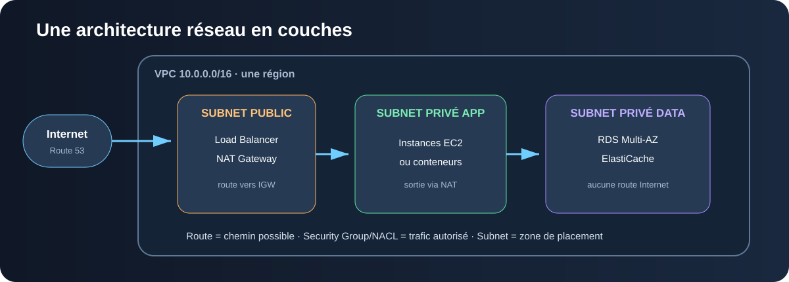

<div class="concept-check">
<strong>Diagnostic réseau — avant de poursuivre</strong>
<p>Une instance possède une IP publique et un Security Group autorisant HTTPS, mais reste inaccessible depuis Internet. Que faut-il encore vérifier ?</p>
<details><summary>Afficher la réponse raisonnée</summary><p>La table de routage du subnet doit contenir une route vers une Internet Gateway attachée au VPC. Une adresse et une règle de sécurité ne créent pas à elles seules le chemin réseau.</p></details>
</div>

---

## 1. Bases de données dans AWS — Du service géré à la scalabilité

### 1.1 La révolution des bases managées

📹 **Vidéo** : [AWS Database Services Overview](https://www.youtube.com/watch?v=adB--KhJ95w)

Quand on parle de **bases de données dans le Cloud**, la question centrale n'est plus « Où vais-je installer un serveur ? » mais plutôt « Quel type de données vais-je stocker, et quel accès dois-je offrir ? ».

Dans un environnement traditionnel (**on-premise**), administrer une base de données impliquait :

- **Installation manuelle** du moteur (MySQL, PostgreSQL, Oracle...)
- **Configuration** des paramètres (mémoire, cache, compression...)
- **Sauvegardes régulières** et tests de restauration
- **Maintenance** des patchs de sécurité
- **Réplication** pour la haute disponibilité
- **Surveillance** 24h/24 (CPU, mémoire, disque, connexions)
- **Escalade** : augmenter la taille du disque, du CPU, de la mémoire
- **Gestion des droits** d'accès pour chaque application

Autant de tâches qui détournent les équipes de leur **valeur métier réelle** : créer des applications performantes et sécurisées.

Avec **Amazon RDS** et les services managés AWS, ce paradigme s'inverse : **AWS administre l'infrastructure, vous administrez vos données**.

#### L'abstraction du matériel

Imaginez une **maison en location** vs. une **maison en propriété** :

- **En propriété** (on-prem) : vous gérez tout — le toit, la plomberie, l'électricité, les réparations. Si la toiture fuit, c'est à vos frais et vos équipes doivent intervenir.
- **En location** (RDS) : le propriétaire assure la structure, le toit, les murs. Vous ne vous occupez que du décor intérieur (vos données).

Avec RDS :
- Vous définissez simplement : quel moteur ? (MySQL, PostgreSQL, Oracle, SQL Server, Aurora) — quelle taille ? (t3.small, m5.xlarge...) — combien de stockage ? (100 Go, 5 To...)
- AWS crée l'instance, configure le stockage EBS, met en place le monitoring, gère les snapshots, applique les patches.
- Vous accédez à votre base via un endpoint standard (`mondb.xxxxx.eu-west-1.rds.amazonaws.com:3306`).

---

### 1.2 Amazon RDS — Bases relationnelles managées

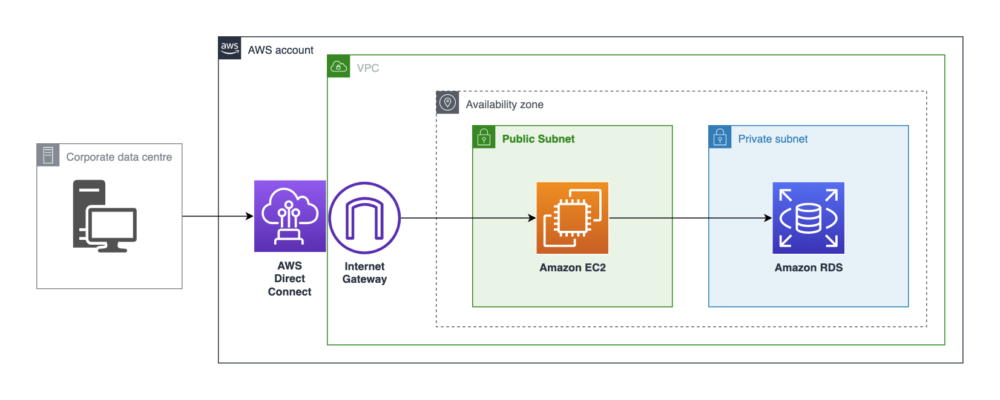

**Amazon RDS (Relational Database Service)** est le service managé AWS pour les **bases de données structurées** (SQL). Il supporte plusieurs moteurs :

| Moteur | Compatibilité | Cas d'usage |
|--------|--------------|-----------|
| **MySQL** | Open source, très répandu | Applications web classiques |
| **PostgreSQL** | Open source, très avancé | Applications critiques, PostGIS, données complexes |
| **MariaDB** | Fork MySQL, meilleure performance | Alternative MySQL |
| **Oracle** | Propriétaire, très coûteux en on-prem | Migrations legacy, applications critiques |
| **SQL Server** | Windows, intégration Active Directory | Environnements Microsoft |
| **Amazon Aurora** | Natif AWS, ultra-performant | Haute disponibilité, haute scalabilité |

#### Caractéristiques clés

| Fonctionnalité | Description |
|---|---|
| **Haute disponibilité** | Multi-AZ : réplication synchrone sur une autre zone de disponibilité avec basculement automatique |
| **Sauvegardes automatisées** | Sauvegardes quotidiennes, conservées jusqu'à 35 jours, restauration à un instant T |
| **Sécurité intégrée** | Chiffrement au repos (AWS KMS) et en transit (SSL/TLS), isolation réseau (VPC, Security Groups), audit (CloudTrail) |
| **Scalabilité verticale** | Augmenter CPU/RAM sans interruption (dans certains cas) |
| **Read Replicas** | Jusqu'à 5 réplicas de lecture asynchrones pour répartir les lectures |
| **Maintenance automatisée** | Patches et mises à jour sans intervention manuelle |

#### Types de stockage EBS pour RDS

RDS s'appuie sur **Amazon EBS** pour son stockage sous-jacent. Vous choisissez le type de disque selon vos besoins :

| Type | Performance | Coût | Cas d'usage |
|------|---|---|---|
| **General Purpose (gp3)** | 3 000 à 16 000 IOPS | Modéré | Production standards, dev/test |
| **Provisioned IOPS (io1/io2)** | Jusqu'à 64 000 IOPS | Élevé | Bases critiques à fort volume transactionnel |
| **Magnetic (standard)** | 100-200 IOPS | Bas | Archivage, données froides (déprécié) |

**IOPS (Input/Output Operations Per Second)** = nombre d'opérations de lecture/écriture par seconde. Un IOPS élevé garantit des temps de réponse courts pour les transactions.

#### Exemple concret — Plateforme de vidéo à la demande (VOD)

Supposons une plateforme qui stocke **les métadonnées** de ses contenus : titres, descriptions, dates de diffusion, catégories, droits d'accès. Les **requêtes sont complexes** (jointures sur plusieurs tables), les données sont structurées, et la **cohérence** est critique.

**Avec on-prem** (avant cloud) :
```
- Installation MySQL manuelle (4h)
- Scripts de sauvegarde réseau + test restauration (8h)
- Monitoring 24h/24 avec alertes (contrat SLA)
- Augmentation disque lors des pics → risque de downtime
- Réplication vers DataCenter secondaire (investissement)
→ Coût total 5 ans : ~100 000 €, équipe IT 2 personnes
```

**Avec RDS AWS** :
```
- Déploiement en 3 minutes via console AWS
- Multi-AZ automatique (zéro downtime en panne)
- Snapshots automatiques (jusqu'à 35 jours)
- Augmentation CPU/stockage sans interruption
- Read Replicas pour diffuser les lectures (reports analytiques)
→ Coût annuel : ~1 500 $, gestion minimal (0,1 FTE)
```

---

### 1.3 Haute disponibilité et résilience dans RDS

#### Multi-AZ (Availability Zones) — Résilience automatique

**Multi-AZ** signifie que votre base est automatiquement répliquée **de manière synchrone** sur une autre zone de disponibilité (AZ) de la **même région**.

**Avant failover** : `AZ 1a` héberge le RDS Primary (Master), qui accepte lectures et écritures sur `mysql.xxxxx.rds.amazonaws.com`. Il réplique de façon synchrone vers un RDS Standby en lecture seule dans `AZ 1b`, sur un stockage EBS séparé.

**Pendant le failover** (~30 secondes), une fois la panne d'`AZ 1a` détectée :
1. CloudWatch déclenche une alarme de détection de panne.
2. Route 53 bascule le DNS : l'endpoint redirige vers le Standby.
3. Le Standby est promu Master dans `AZ 1b`.
4. Les nouvelles écritures sont acceptées en `AZ 1b`.
5. Perte de données = 0 (réplication synchrone).
6. Downtime réseau ≈ 30-60 secondes (le temps de la reconnexion).

**Après failover** : `AZ 1a` est en panne. `AZ 1b` héberge désormais le RDS Primary (ex-Standby), qui accepte lectures et écritures sur le **même endpoint** `mysql.xxxxx.rds.amazonaws.com` — aucune reconfiguration applicative n'est nécessaire. Un nouveau Standby est recréé et répliqué depuis ce nouveau Primary, ce qui résorbe la panne en environ 5 minutes.

**Bénéfice** : zéro downtime applicatif (reconnexion auto après failover), zéro perte données.
**Coût** : +50 % sur la facture RDS.
**À savoir** : L'endpoint DNS ne change pas → applications se reconnectent automatiquement.

:::warning
**Coût Multi-AZ RDS — Attention au budget**

Activer Multi-AZ **double le coût de l'instance** RDS : AWS provisionne silencieusement une instance Standby dans une autre AZ. Cette instance n'est pas accessible en lecture (contrairement aux Read Replicas) — elle sert uniquement au failover automatique.

- db.t3.micro RDS MySQL : ~12 $/mois → **~24 $/mois** avec Multi-AZ
- db.r6g.large RDS MySQL : ~175 $/mois → **~350 $/mois** avec Multi-AZ

**Règle** : activez Multi-AZ uniquement en production. Pour dev/test, une instance simple suffit.
:::

#### Read Replicas — Répartition de la charge de lecture

Un **Read Replica** est une **copie asynchrone** de votre base, destinée à répartir les **lectures** (SELECT) sans surcharger la Primary.

Cas d'usage : Reporting, Analytics, Exports.

Le RDS Primary (`eu-west-1a`) gère les écritures OLTP (500 SELECT/s + 100 INSERT/s) sur son endpoint `mysql.xxxx.rds...`. Il réplique de façon asynchrone (~100ms, avec un lag possible de quelques secondes) vers trois Read Replicas en lecture seule, chacun dédié à un usage distinct :

| Replica | Zone | Charge | Usage |
|---|---|---|---|
| Read Replica 1 | AZ 1b | 1000 GET/s | Reporting DB |
| Read Replica 2 | AZ 1c | 1000 GET/s | Analytics DB |
| Read Replica 3 | Region 2 | 1000 GET/s | Disaster recovery |

**Limite** : jusqu'à **5 Read Replicas** par base MySQL/PostgreSQL (15 sur Aurora).

**Différence clé Read Replica vs Multi-AZ** :
- **Multi-AZ** : synchrone, failover automatique, latence identique
- **Read Replica** : asynchrone, pas failover, peut avoir lag de 1-30s, endpoint séparé

**Commande AWS CLI** :
```bash
# Créer un Read Replica pour reportings
aws rds create-db-instance-read-replica \
  --db-instance-identifier formation-db-analytics \
  --source-db-instance-identifier formation-db \
  --db-instance-class db.t3.small \
  --availability-zone eu-west-1b

# Créer un Replica inter-région (DR)
aws rds create-db-instance-read-replica \
  --db-instance-identifier formation-db-dr \
  --source-db-instance-identifier formation-db \
  --source-region eu-west-1 \
  --region us-east-1 \
  --db-instance-class db.t3.small
```

:::success
**Résultat attendu :**
```json
{
    "DBInstance": {
        "DBInstanceIdentifier": "formation-db-analytics",
        "DBInstanceClass": "db.t3.small",
        "Engine": "mysql",
        "DBInstanceStatus": "creating",
        "ReadReplicaSourceDBInstanceIdentifier": "formation-db",
        "AvailabilityZone": "eu-west-1b",
        "MultiAZ": false,
        "StorageType": "gp3",
        "Endpoint": {
            "Address": "formation-db-analytics.abc123.eu-west-1.rds.amazonaws.com",
            "Port": 3306
        }
    }
}
```
:::

---

### 1.4 Sécurité et supervision RDS

#### Chiffrement

| Type | Description |
|------|---|
| **Au repos** | Les données sur disque EBS sont chiffrées via AWS KMS |
| **En transit** | SSL/TLS obligatoire entre client et base |

⚠️ **Important** : le chiffrement **doit être activé à la création** de l'instance.

#### Supervision et alertes

| Outil | Rôle |
|---|---|
| **CloudWatch** | Métriques de base (CPU, RAM, connexions, IOPS) |
| **Performance Insights** | Requêtes coûteuses, sessions actives |
| **CloudTrail** | Audit : qui a modifié la configuration |
| **Enhanced Monitoring** | Metrics granulaires de l'OS |

---

### 1.5 Amazon Aurora — Performance et résilience supérieures

**Amazon Aurora** est le **moteur de base de données propriétaire AWS**, conçu d'emblée pour le Cloud. Compatible avec **MySQL** et **PostgreSQL** mais offre des performances bien supérieures.

#### Architecture distribuée

Aurora découple le **calcul** (instances) du **stockage** (volume distribué). Les écritures sont répliquées **4 fois** sur 3 AZ.

#### Performances

| Métrique | vs MySQL | vs PostgreSQL |
|----------|----------|---|
| Throughput max | **5×** | **3×** |
| Basculement automatique | 30 sec | 30 sec |
| Réplicas de lecture | 15 (vs 5) | 15 (vs 5) |

#### Comparaison détaillée : RDS MySQL/PostgreSQL vs Aurora

| Aspect | RDS MySQL/PostgreSQL | Aurora |
|--------|---|---|
| **Architecture** | Stockage EBS couplé à l'instance | Calcul découplé du stockage distribué |
| **Réplication** | Synchrone (Multi-AZ) / Asynchrone (Replicas) | 4 copies sur 3 AZ (natif) |
| **Failover automatique** | 30 sec si Multi-AZ activé | 30 sec (inclus, pas surcoût) |
| **Réplicas de lecture** | 5 max | 15 max |
| **Coût Multi-AZ** | +50 % sur l'instance | 0 € (inclus) |
| **Scaling en écriture** | Impossible (Master unique) | Impossible (Master unique) |
| **Scaling en lecture** | Avec Replicas (asynchrones) | Avec Replicas (synchrones, <1ms latence) |
| **Serverless** | Non (ne s'adapte pas) | Oui (Aurora Serverless v2) |
| **Performance requêtes complexes** | Bonne | Excellente (optimisation native AWS) |
| **Coût stockage** | Paiement par Go allocué | Paiement à l'utilisation (auto-scaling) |
| **Certification AWS** | Sujet SAA-C03 | Sujet SAA-C03 (fortement recommandé) |

**SAA-C03** est le code de l'examen AWS Certified Solutions Architect – Associate, la certification détaillée au Chapitre 1 (section 1.3) et reprise au Chapitre 5 (section 9) — le comparatif RDS/Aurora ci-dessus fait partie des sujets fréquemment évalués dans cet examen.

#### Mode Serverless et Provisioned

Aurora offre **deux modèles de déploiement** :

| Modèle | Principe | Avantages | Cas d'usage |
|---|---|---|---|
| **Provisioned** (classique) | Vous choisissez la taille (ex. `db.r6g.xlarge`) | Coût fixe, performance prévisible | Application de reporting critique, charge stable (12h/jour) |
| **Serverless V2** (moderne) | Scaling auto de 0.5 à 1000+ ACU (Aurora Compute Units) | Paiement à l'utilisation, scaling en ≈5 sec | API imprévisible, pics aléatoires, environnements de développement |

#### Créer un cluster Aurora en CLI

:::info
Une activité pratique permet d’approfondir le déploiement d’un cluster Aurora.
:::

Cette séquence crée un cluster Aurora MySQL complet avec une instance writer, une instance reader, du chiffrement activé et une fenêtre de sauvegarde automatique. Aurora est un cluster — pas une instance unique — ce qui explique les deux commandes distinctes (cluster + instance).

```bash
# 1. Créer un Aurora MySQL Cluster (2 instances : writer + reader)
aws rds create-db-cluster \
  --db-cluster-identifier formation-aurora-cluster \
  --engine aurora-mysql \
  --engine-version 8.0.mysql_aurora.3.02.0 \
  --master-username admin \
  --master-user-password 'SecurePassword123!' \
  --database-name appdb \
  --vpc-security-group-ids sg-12345678 \
  --db-subnet-group-name my-db-subnet-group \
  --storage-encrypted \
  --backup-retention-period 7 \
  --preferred-backup-window "03:00-04:00" \
  --preferred-maintenance-window "mon:04:00-mon:05:00" \
  --tag-specifications 'ResourceType=cluster,Tags=[{Key=Name,Value=FormationAuroraCluster}]'

# 2. Créer les instances Aurora (Writer)
aws rds create-db-instance \
  --db-instance-identifier formation-aurora-writer \
  --db-instance-class db.r6g.large \
  --engine aurora-mysql \
  --db-cluster-identifier formation-aurora-cluster \
  --publicly-accessible false

# 3. Créer instance Reader (lecture seulement)
aws rds create-db-instance \
  --db-instance-identifier formation-aurora-reader \
  --db-instance-class db.r6g.large \
  --engine aurora-mysql \
  --db-cluster-identifier formation-aurora-cluster \
  --promotion-tier 2 \
  --publicly-accessible false

# 4. Créer Aurora Serverless V2 (auto-scaling)
aws rds create-db-cluster \
  --db-cluster-identifier formation-aurora-serverless \
  --engine aurora-postgresql \
  --engine-version 14.6 \
  --engine-mode provisioned \
  --serverlessv2-scaling-configuration 'MinCapacity=0.5,MaxCapacity=16' \
  --master-username admin \
  --master-user-password 'SecurePassword123!' \
  --database-name appdb \
  --vpc-security-group-ids sg-12345678 \
  --db-subnet-group-name my-db-subnet-group

# 5. Attendre disponibilité
aws rds wait db-cluster-available \
  --db-cluster-identifier formation-aurora-cluster

# 6. Récupérer les endpoints
aws rds describe-db-clusters \
  --db-cluster-identifier formation-aurora-cluster \
  --query 'DBClusters[0].[DBClusterEndpoint,ReaderEndpoint]'
# Résultat :
# Writer : formation-aurora-cluster.xxxx.eu-west-1.rds.amazonaws.com (écritures)
# Reader : formation-aurora-cluster-ro.xxxx.eu-west-1.rds.amazonaws.com (lectures)

# 7. Modifier le scaling Serverless (augmenter capacité max)
aws rds modify-db-cluster \
  --db-cluster-identifier formation-aurora-serverless \
  --serverlessv2-scaling-configuration 'MinCapacity=1,MaxCapacity=32' \
  --apply-immediately

# 8. Ajouter un Read Replica dans une autre région
aws rds create-db-cluster \
  --db-cluster-identifier formation-aurora-dr \
  --engine aurora-mysql \
  --source-region eu-west-1 \
  --region us-east-1 \
  --replication-source-identifier arn:aws:rds:eu-west-1:123456789012:cluster:formation-aurora-cluster
```

:::success
**Résultat attendu :**
```json
{
    "DBCluster": {
        "DBClusterIdentifier": "formation-aurora-cluster",
        "Status": "creating",
        "Engine": "aurora-mysql",
        "EngineVersion": "8.0.mysql_aurora.3.02.0",
        "DBClusterEndpoint": "formation-aurora-cluster.cluster-abc123.eu-west-1.rds.amazonaws.com",
        "ReaderEndpoint": "formation-aurora-cluster.cluster-ro-abc123.eu-west-1.rds.amazonaws.com",
        "MultiAZ": true,
        "StorageEncrypted": true,
        "BackupRetentionPeriod": 7
    }
}
```
:::

> **Résultat attendu :** `create-db-cluster` retourne le JSON du cluster (état `creating`). `rds wait db-cluster-available` bloque jusqu'à ce que le cluster soit prêt (peut prendre 5-10 min). `describe-db-clusters` affiche les endpoints writer et reader — deux URLs distinctes.

**À retenir** : Aurora est **le choix standard** pour les productions critiques AWS — meilleur ROI que RDS classique quand on inclut les coûts Multi-AZ.


#### Comparatif de coûts réel — RDS vs Aurora (région Paris, eu-west-3)

> Tarifs indicatifs au 1er avril 2026 — à vérifier sur [https://aws.amazon.com/rds/pricing/](https://aws.amazon.com/rds/pricing/)

##### Instance (calcul)

| Type | RDS MySQL | Aurora MySQL | Écart |
|------|-----------|-------------|-------|
| db.t3.micro | **0,017 $/h** (~12 $/mois) | ❌ Non disponible | — |
| db.t3.small | 0,034 $/h (~25 $/mois) | ❌ Non disponible | — |
| db.t3.medium | 0,068 $/h (~49 $/mois) | **0,073 $/h** (~53 $/mois) | +7 % |
| db.r6g.large | 0,240 $/h (~175 $/mois) | 0,260 $/h (~190 $/mois) | +8 % |
| db.r6g.2xlarge | 0,960 $/h (~700 $/mois) | 1,040 $/h (~760 $/mois) | +8 % |

> ⚠️ **Aurora ne propose pas de t3.micro ou t3.small.** L'entrée de gamme est le t3.medium (~53 $/mois). Pour un usage de formation ou de très petite charge, RDS est **nettement moins cher**.

##### Stockage et I/O

| | RDS (gp3) | Aurora |
|--|-----------|--------|
| Prix stockage | 0,115 $/Go/mois | 0,10 $/Go/mois |
| Minimum | 20 Go (provisionné) | 10 Go (auto-extensible) |
| Maximum | 64 To | 128 To |
| Réplication | 1 copie (Multi-AZ = 2×) | **6 copies dans 3 AZ** (inclus) |
| I/O | Inclus (gp3) | 0,20 $ / million de requêtes (Standard) ou inclus (I/O-Optimized +25%) |

##### Aurora Serverless v2 — facturation à l'utilisation

```
Facturation : ACU-heure (Aurora Capacity Unit)
1 ACU = ~2 Go de RAM + CPU proportionnel

Tarif : 0,12 $ / ACU-heure (Paris)
Minimum : 0,5 ACU  →  0,06 $/h  →  ~43 $/mois au repos
Maximum : 128 ACU  →  15,36 $/h

Avantage : scale automatiquement de 0,5 à 128 ACU en quelques secondes
Cas idéal : applications avec trafic très variable (pics journaliers, saisonnalité)
```

##### Exemple comparatif — Application web standard, 50 Go de données

```
                    RDS MySQL           Aurora MySQL (Serverless v2)
Instance        db.t3.medium            0,5–4 ACU (charge variable)
                49 $/mois               ~65–120 $/mois

Stockage        50 Go × 0,115           50 Go × 0,10
                = 5,75 $/mois           = 5,00 $/mois

I/O             Inclus                  ~5 $/mois (applis légères)

Multi-AZ        +100 % instance         Inclus (6 copies)
                = +49 $/mois            = 0 $

TOTAL Multi-AZ  ~104 $/mois             ~75–125 $/mois
                (coût fixe, prévisible) (variable, mais HA incluse)
```

> 💡 **Conclusion** : Aurora est plus cher à l'instance mais inclut la haute disponibilité sur 6 copies. Pour une charge faible et un budget serré : **RDS**. Pour une charge critique nécessitant de la résilience et de la scalabilité : **Aurora**.

📎 [AWS RDS Pricing](https://aws.amazon.com/rds/pricing/)
📎 [AWS Aurora Pricing](https://aws.amazon.com/rds/aurora/pricing/)


---

### 1.6 Amazon DynamoDB — NoSQL à ultra-haute scalabilité

**DynamoDB** est une **base NoSQL managée** d'AWS. Elle stocke des **documents JSON** ou des **paires clé-valeur** sans schéma figé. Elle garantit des temps de réponse **en millisecondes**, même à l'échelle de millions de requêtes par seconde.

#### Structure d'une table DynamoDB

```
Chaque attribut peut être :
- Chaîne (S)
- Nombre (N)
- Binaire (B)
- Ensemble (SS, NS, BS)
- Map (document imbriqué)
- Liste

Aucune contrainte de schéma : vous pouvez ajouter des attributs par ligne.
```

#### Modèles de tarification

| Modèle | Débit garanti | Facturation | Cas d'usage |
|--------|---|---|---|
| **Provisionné** | À définir (RCU/WCU) | Fixe + dépassement | Charge prédictible |
| **À la demande** | Illimité | Au débit réel | Charge variable |

- **RCU** (Read Capacity Unit) : 1 RCU = une lecture fortement cohérente d'un item ≤ 4 Ko
- **WCU** (Write Capacity Unit) : 1 WCU = une écriture d'un item ≤ 1 Ko

**Exemple chiffré — mode à la demande (région Paris)** : facturé 0,32 $ par million de lectures et 1,60 $ par million d'écritures. Une application avec 500 000 lectures/jour et 50 000 écritures/jour coûte environ (500 000 × 30 × 0,32 / 1 000 000) + (50 000 × 30 × 1,60 / 1 000 000) ≈ 4,80 $ + 2,40 $ = **~7,20 $/mois** rien que pour les requêtes, plus le stockage (0,25 $/Go/mois). Pour une charge stable et prévisible, le mode provisionné revient souvent moins cher — mais il facture même en l'absence de trafic, contrairement au mode à la demande.

📎 [Amazon DynamoDB Pricing](https://aws.amazon.com/dynamodb/pricing/)

#### DynamoDB vs RDS

| Aspect | RDS (SQL) | DynamoDB (NoSQL) |
|--------|-----------|---|
| **Schéma** | Structuré, relationnel | Flexible, semi-structuré |
| **Requêtes** | Complexes (jointures) | Simples (accès par clé) |
| **Scalabilité** | Verticale surtout | Horizontale, ultra-massive |
| **Latence** | ms-s | ms |

:::danger
**Hot Partitions DynamoDB — Erreur de conception fréquente**

DynamoDB distribue vos données sur des partitions selon la **Partition Key**. Si vous choisissez une clé avec peu de valeurs distinctes (ex. : `status = "active"/"inactive"`, ou une date comme `2026-05-17`), toutes les requêtes frappent la **même partition** → throttling, latence explosive.

**Symptômes** : erreurs `ProvisionedThroughputExceededException`, latences P99 > 500ms.

**Solutions** :
- Choisir une Partition Key à **haute cardinalité** (UUID utilisateur, ID produit unique)
- Ajouter un **suffixe aléatoire** (write sharding) : `user_id#1`, `user_id#2`
- Utiliser un **Global Secondary Index** avec une clé mieux distribuée
- Passer en mode **On-Demand** pour absorber les pics sans throttling
:::

---

### 1.7 Migration de bases de données avec AWS DMS

**AWS DMS (Database Migration Service)** permet la **migration sans interruption** d'une base existante vers AWS. C'est un service managé qui gère le transport, la transformation et la synchronisation de données.

#### Scénario réaliste de migration

Imaginez une **entreprise audiovisuelle** avec une **base Oracle on-premise** stockant les **métadonnées de contenus** (titres, droits, calendriers). Actuellement :
- **5 To de données** (10 ans d'historique)
- **Uptime critique** : 24h/24
- **Migration programmée** : 1 week-end

**Sans DMS** : arrêt services, export/import manuel, validation longue, risque perte données.
**Avec DMS** : continuité service, réplication live, bascule maîtrisée.

#### Architecture de migration DMS

La source (Oracle Database on-premise/RDS, 5 To, 50 tables, actif à 1000 txn/s) passe par une tâche DMS (instance `dms.c6i.xlg`) qui exécute d'abord un Full Load (4-6 heures) vers la cible (Aurora/RDS PostgreSQL, 5 To), puis bascule en CDC (Change Data Capture) continu avec un lag inférieur à 1 seconde pour maintenir la cible synchronisée en temps réel.

**Timeline type** :
- J-1 : configuration DMS, full load lancé de nuit.
- J+0 : full load terminé, CDC actif, l'application reste encore on-premise.
- J+0 20h00 : validation des données, préparation du cutover.
- J+0 22h00 : cutover — redirection de l'application vers Aurora.
- J+1 : validation complète, monitoring 24h.

#### Processus de migration par étapes

**Phase 1 — Full Load (copie complète)** : les données transitent de la source vers la cible via un DMS Agent. Tous les types de données, tous les indices et les contraintes PRIMARY sont copiés automatiquement ; en revanche, les triggers et procédures stockées doivent être recréés manuellement.

**Phase 2 — CDC (Change Data Capture)** : DMS lit les logs natifs de la source (redo logs pour Oracle, binary logs pour MySQL, WAL pour PostgreSQL) et les applique sur la cible en quasi temps réel (latence sous la milliseconde).

**Phase 3 — Cutover (basculement applicatif)** :
1. Arrêter l'application (2-5 min).
2. Valider que le lag de réplication est proche de 0.
3. Rediriger les connexions vers la cible.
4. Vérifier les logs applicatifs.
5. Garder un plan de rollback armé.

#### Types de migrations DMS

| Type | Exemple | Complexité | Coût |
|------|---------|---|---|
| **Homogène (même moteur)** | MySQL → RDS MySQL | ⭐ Très facile | Bas |
| **Hétérogène (moteurs diff)** | Oracle → Aurora PostgreSQL | ⭐⭐⭐ Moyen | Moyen |
| **Schéma complexe** | DB2 → PostgreSQL (types custom) | ⭐⭐⭐⭐ Élevé | Élevé |

#### Créer une tâche DMS en CLI

:::info
Une activité pratique permet d’approfondir AWS Database Migration Service.
:::

DMS fonctionne en 3 objets : un **endpoint source** (base existante), un **endpoint cible** (base AWS), et une **instance de réplication** (le moteur qui exécute la migration). On les crée dans cet ordre, puis on démarre la tâche.

```bash
# ═══════════════════════════════════════════════════════════
# 1. Créer les Endpoints source et cible
# ═══════════════════════════════════════════════════════════

# Endpoint SOURCE (Base existante on-prem/RDS)
aws dms create-endpoint \
  --endpoint-identifier oracle-source \
  --endpoint-type source \
  --engine-name oracle \
  --server-name oracle.company.local \
  --port 1521 \
  --database-name PRODDB \
  --username migration_user \
  --password 'SourcePassword123!' \
  --ssl-mode require \
  --extra-connection-attributes 'trustServerCertificate=false'

# Endpoint TARGET (Aurora PostgreSQL)
aws dms create-endpoint \
  --endpoint-identifier aurora-target \
  --endpoint-type target \
  --engine-name aurora-postgresql \
  --server-name formation-aurora.xxxxx.eu-west-1.rds.amazonaws.com \
  --port 5432 \
  --database-name appdb \
  --username migration_user \
  --password 'TargetPassword123!' \
  --ssl-mode require

# ═══════════════════════════════════════════════════════════
# 2. Créer une instance DMS (compute qui exécute la migration)
# ═══════════════════════════════════════════════════════════

aws dms create-replication-instance \
  --replication-instance-identifier formation-dms-instance \
  --replication-instance-class dms.c6i.xlarge \
  --allocated-storage 200 \
  --vpc-security-group-ids sg-12345678 \
  --replication-subnet-group-identifier my-dms-subnet-group \
  --multi-az \
  --engine-version 3.4.7 \
  --publicly-accessible false \
  --tag-specifications 'ResourceType=rep,Tags=[{Key=Name,Value=FormationDMS}]'

# Attendre disponibilité (5-10 min)
aws dms wait replication-instance-available \
  --filters 'Name=replication-instance-id,Values=formation-dms-instance'

# ═══════════════════════════════════════════════════════════
# 3. Valider connexions (test avant migration)
# ═══════════════════════════════════════════════════════════

# Tester accès source
aws dms test-connection \
  --replication-instance-arn arn:aws:dms:eu-west-1:123456789012:rep:formation-dms-instance \
  --endpoint-arn arn:aws:dms:eu-west-1:123456789012:ep:oracle-source

# Tester accès cible
aws dms test-connection \
  --replication-instance-arn arn:aws:dms:eu-west-1:123456789012:rep:formation-dms-instance \
  --endpoint-arn arn:aws:dms:eu-west-1:123456789012:ep:aurora-target

# ═══════════════════════════════════════════════════════════
# 4. Créer tâche DMS (FULL LOAD + CDC)
# ═══════════════════════════════════════════════════════════

aws dms create-replication-task \
  --replication-task-identifier oracle-to-aurora-migration \
  --source-endpoint-arn arn:aws:dms:eu-west-1:123456789012:ep:oracle-source \
  --target-endpoint-arn arn:aws:dms:eu-west-1:123456789012:ep:aurora-target \
  --replication-instance-arn arn:aws:dms:eu-west-1:123456789012:rep:formation-dms-instance \
  --migration-type cdc \
  --table-mappings '{
    "rules": [
      {
        "rule-type": "selection",
        "rule-name": "include-all-tables",
        "object-locator": {
          "schema-name": "%",
          "table-name": "%"
        },
        "rule-action": "include"
      }
    ]
  }' \
  --replication-task-settings '{
    "TargetMetadata": {
      "TargetSchema": "",
      "SupportsCascadeDelete": true,
      "FullLobMode": false,
      "LobChunkSize": 64,
      "LobMaxSize": 32
    },
    "FullLoadSettings": {
      "TargetSchema": "",
      "CreatePkAfterFullLoad": false,
      "StopTaskCachedChangesNotApplied": false,
      "StopTaskCachedChangesApplied": false,
      "MaxFullLoadSubTasks": 8,
      "TransactionConsistencyTimeout": 600,
      "CommitRate": 50000
    },
    "Logging": {
      "EnableLogging": true,
      "LogComponents": [
        {
          "Id": "SOURCE_UNLOAD",
          "Severity": "LOGGER_SEVERITY_DEFAULT"
        }
      ]
    },
    "ChangeProcessingDdlHandlingPolicy": {
      "HandleSourceTableDropped": true,
      "HandleSourceTableTruncated": true,
      "HandleSourceTableAltered": true
    }
  }' \
  --tags Key=Project,Value=Migration Key=Type,Value=Oracle2Aurora

# ═══════════════════════════════════════════════════════════
# 5. Attendre tâche et monitorer statut
# ═══════════════════════════════════════════════════════════

# Status : creating → modifying → ready → running → stopped
aws dms describe-replication-tasks \
  --filters 'Name=replication-task-arn,Values=arn:aws:dms:eu-west-1:123456789012:task:oracle-to-aurora-migration'
```

:::success
**Résultat attendu :**
```json
{
    "ReplicationTasks": [{
        "ReplicationTaskIdentifier": "oracle-to-aurora-migration",
        "Status": "running",
        "MigrationType": "cdc",
        "ReplicationTaskStats": {
            "FullLoadProgressPercent": 100,
            "ElapsedTimeMillis": 18000000,
            "TablesLoaded": 50,
            "TablesQueued": 0,
            "TablesErrored": 0,
            "TablesLoading": 0
        }
    }]
}
```
:::

```bash
# Voir les tables migrées (status, nb rows)
aws dms describe-table-statistics \
  --replication-task-arn arn:aws:dms:eu-west-1:123456789012:task:oracle-to-aurora-migration \
  --query 'TableStatistics[*].[SchemaName,TableName,FullLoadRows,FullLoadErrorRows,Updates,Inserts,Deletes]'
```

:::success
**Résultat attendu :**
```json
[
    ["PRODDB", "CONTENT_META", 2500000, 0, 1250, 340, 12],
    ["PRODDB", "RIGHTS_TABLE", 180000, 0, 45, 8, 1],
    ["PRODDB", "CALENDAR_SLOTS", 95000, 0, 320, 120, 5],
    ["PRODDB", "USERS", 50000, 0, 88, 15, 0]
]
```
:::

```bash
# ═══════════════════════════════════════════════════════════
# 6. Commandes gestion tâche
# ═══════════════════════════════════════════════════════════

# Arrêter tâche (sans supprimer)
aws dms stop-replication-task \
  --replication-task-arn arn:aws:dms:eu-west-1:123456789012:task:oracle-to-aurora-migration

# Relancer tâche
aws dms start-replication-task \
  --replication-task-arn arn:aws:dms:eu-west-1:123456789012:task:oracle-to-aurora-migration \
  --start-replication-task-type resume-processing

# Redémarrer complet (FULL LOAD + CDC)
aws dms start-replication-task \
  --replication-task-arn arn:aws:dms:eu-west-1:123456789012:task:oracle-to-aurora-migration \
  --start-replication-task-type cdc

# Supprimer tâche
aws dms delete-replication-task \
  --replication-task-arn arn:aws:dms:eu-west-1:123456789012:task:oracle-to-aurora-migration
```

#### Pièges et bonnes pratiques DMS

| Piège | Solution |
|-------|----------|
| **Oublier full load avant CDC** | Toujours : `migration-type cdc` (inclut full load) |
| **Schema incomplet après migration** | Procs stockées, triggers = manuels. DMS copie juste data |
| **CDC lag important** | Vérifier capacité DMS instance, réduire `MaxFullLoadSubTasks` |
| **Incompatibilités types données** | Utiliser **Schema Conversion Tool (SCT)** avant DMS pour préparer |
| **Oublier transaction logs source** | Source doit activer binary logs (MySQL) / redo logs (Oracle) |
| **Cutover sans validation données** | Test requêtes applicatives sur cible avant redirection |

---

## 2. Amazon VPC — Concevoir un réseau privé sécurisé

### 2.1 Du réseau on-prem au réseau virtuel

#### Définition — Qu'est-ce qu'une VPC ?

> **Amazon VPC (Virtual Private Cloud)** est un **réseau privé virtuel isolé** que vous créez dans AWS. C'est votre **datacenter logique**, entièrement contrôlé, où vous déployez vos instances EC2, vos bases RDS, vos Load Balancers, etc.

Une VPC vous offre :
- **Isolation logique** : vos ressources ne sont pas visibles aux autres comptes AWS.
- **Contrôle total** : vous définissez les adresses IP, les routes, les pare-feux.
- **Flexibilité** : ajouter ou retirer des subnets, des passerelles à volonté.

---

### 2.2 Composants clés d'une VPC

#### Schéma architectural complet d'une VPC sécurisée

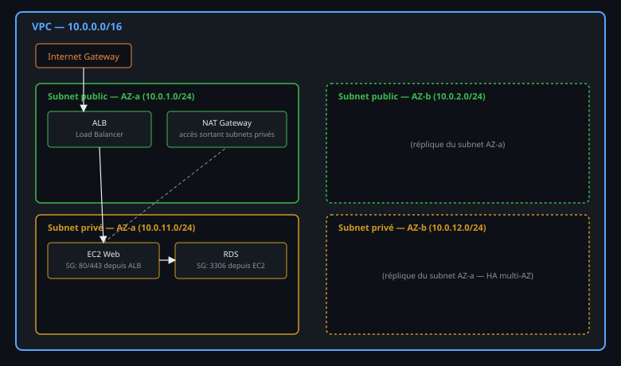

**Flux de trafic :**
1. Internet → ALB (IGW ouvre l'accès)
2. ALB → EC2 Web (Security Group + règles subnet)
3. EC2 → RDS (Security Group DB ouvre port 3306)
4. EC2 → Internet (via NAT Gateway, pour updates)

---

#### 1. CIDR Block (Classless Inter-Domain Routing)

Une VPC commence par une **plage d'adresses IP privées**. Par exemple, `10.0.0.0/16` signifie :

```
10.0.0.0/16 = 65 536 adresses disponibles (10.0.0.0 à 10.0.255.255)

Adresses réservées AWS :
10.0.0.0     = Adresse réseau (réservée)
10.0.0.1     = Gateway AWS (réservée)
10.0.0.2     = DNS AWS (réservé)
10.0.0.3     = Réservé pour l'avenir
10.0.0.4–... = EC2, RDS, ALB, etc.
```

**Plages privées standards (RFC 1918)** :
- `10.0.0.0/8` (la plus courante, 16 M d'adresses)
- `172.16.0.0/12` (1 M d'adresses)
- `192.168.0.0/16` (65 536 adresses)

#### 2. Subnets (Sous-réseaux)

Un subnet est une **subdivision logique** d'une VPC, liée à une **zone de disponibilité (AZ)** spécifique.

**Subnet public** : route vers Internet Gateway → instances accessibles depuis Internet.
**Subnet privé** : route vers NAT Gateway → instances qui accèdent Internet, mais non accessibles de l'extérieur.

#### 3. Internet Gateway (IGW)

L'**Internet Gateway** est la **passerelle de sortie vers Internet**.

**Coût** : 0 € (sauf si vous utilisez des adresses Elastic IP).

#### 4. NAT Gateway

Permet aux instances **privées** d'accéder à Internet **de manière sécurisée** sans être exposées.

**Coût** : $0.032/h + $0.032 par Go transféré.

##### Coût des adresses IPv4 publiques — Point important depuis 2024

Depuis le **1er février 2024**, AWS facture **toutes les adresses IPv4 publiques**, y compris celles attachées à une instance EC2 en cours d'exécution.

**Le tarif :** `$0,005 / heure` par adresse IPv4 publique, soit **~3,65 $ / mois** par IP.

```
Avant février 2024 :
  ✅ IP publique attachée à une instance → GRATUIT
  ❌ Elastic IP non attachée             → 0,005 $/h

Depuis février 2024 :
  ❌ IP publique attachée à EC2          → 0,005 $/h  ← NOUVEAU
  ❌ IP publique sur ELB                 → 0,005 $/h  ← NOUVEAU
  ❌ IP publique sur RDS                 → 0,005 $/h  ← NOUVEAU
  ❌ IP publique sur NAT Gateway         → 0,005 $/h  ← NOUVEAU
  ❌ Elastic IP non attachée            → 0,005 $/h  (inchangé)
```

**Pourquoi cette décision ?**

L'épuisement des adresses IPv4 est un problème mondial. Il ne reste plus d'adresses disponibles dans le registre IANA depuis 2011. AWS détient environ **130 millions d'adresses IPv4**, qu'il doit acheter sur le marché secondaire.

```
Prix de marché d'une adresse IPv4 en 2024 : environ 55 $ l'adresse
AWS facture 0,005 $/h × 8 760 h/an = 43,80 $/an par IP
→ AWS récupère son investissement en ~15 mois par adresse
```

**Impact concret :**

| Scénario | Nombre d'IPs | Coût mensuel |
|----------|-------------|-------------|
| 1 instance EC2 avec IP publique | 1 | ~3,65 $ |
| 10 instances EC2 + 1 ELB | ~12 | ~43,80 $ |
| Architecture 3-tiers standard | ~5–8 | ~18–29 $ |

> 💡 **Bonne pratique** : utiliser IPv6 là où c'est possible (gratuit), réduire le nombre de ressources avec IP publique, et regrouper les accès via un seul Load Balancer ou une NAT Gateway.

📎 [AWS — Annonce facturation IPv4 (2023)](https://aws.amazon.com/blogs/aws/new-aws-public-ipv4-address-charge-public-ip-insights/)

##### AWS = plateforme 100 % API — À quoi servent vraiment les Elastic IPs ?

**Vous n'avez jamais besoin d'une IP publique pour piloter AWS.** Créer une instance EC2, configurer un VPC, déployer une Lambda — tout cela se fait via l'API AWS, que vous passiez par la console web, la CLI ou un SDK.

```
Vous (navigateur / terminal / code)
         
           HTTPS → api.aws.amazon.com
           (pas besoin d'IP publique sur vos ressources)
        ▼
   AWS Control Plane  (infrastructure interne AWS)
         
        ▼
   Votre ressource (EC2, RDS, Lambda...)
   dans votre VPC privé
```

Le **Control Plane** est entièrement géré par AWS et accessible depuis Internet sur ses propres IPs. Vos ressources peuvent très bien vivre dans un subnet privé sans aucune IP publique.

> 💡 Une instance EC2 sans IP publique est tout à fait fonctionnelle si elle n'a pas besoin d'être atteinte depuis Internet. Elle peut appeler des services AWS (S3, DynamoDB, SSM…) via des VPC Endpoints, sans jamais exposer la moindre adresse publique.

**Les cas d'usage légitimes d'une Elastic IP :**

| Cas d'usage | Pourquoi une EIP est nécessaire |
|------------|--------------------------------|
| **Whitelist IP chez un partenaire** | Le firewall du client autorise uniquement votre IP fixe. Si l'instance redémarre avec une nouvelle IP, la connexion est bloquée. |
| **Failover manuel rapide** | En cas de panne, vous réassignez l'EIP de l'instance morte vers une instance de remplacement en quelques secondes — sans changer la DNS ni attendre la propagation. |
| **NAT Gateway** | Obligatoire : le NAT Gateway a toujours besoin d'une EIP pour sortir sur Internet au nom des instances privées. |
| **Serveur mail (SMTP)** | Les serveurs de messagerie tiers filtrent par IP source. Une IP fixe est indispensable pour la réputation mail. |
| **VPN ou tunnel IPsec** | L'extrémité du tunnel doit être connue à l'avance et ne pas changer. |

**Les cas où une EIP n'est PAS la bonne réponse :**

| Mauvais réflexe | Meilleure alternative |
|----------------|----------------------|
| "Je veux accéder à mon serveur web depuis Internet" | → **Load Balancer** avec DNS (pas d'IP fixe nécessaire) |
| "Je veux une URL stable pour mon API" | → **Route 53** + nom de domaine (DNS, pas IP) |
| "Je veux accéder à mon instance en SSH" | → **Session Manager** (SSM) : SSH sans IP publique, sans port 22 ouvert |
| "Je veux que mes Lambda puissent appeler une API externe" | → **NAT Gateway** (une seule EIP pour tout le subnet) |

> ⚠️ **Le réflexe à éviter** : assigner une Elastic IP à chaque instance "au cas où". C'est la première source de surcoût inutile et de surface d'attaque élargie. Préférez toujours un accès via Load Balancer, Route 53, ou SSM Session Manager.

```
Architecture naïve (coûteuse et risquée) :
  EC2-web    ←── EIP  ($3,65/mois, port 80/443 ouvert sur toute l'IP)
  EC2-api    ←── EIP  ($3,65/mois, port 8080 ouvert)
  EC2-admin  ←── EIP  ($3,65/mois, port 22 ouvert)
  Total IPs  : 3 × 3,65 = 10,95 $/mois + surface d'attaque maximale

Architecture correcte (économique et sécurisée) :
  ALB        ←── 1 EIP  ($3,65/mois, ports 80/443 uniquement)
    - EC2-web   (privé, pas d'IP publique)
    - EC2-api   (privé, pas d'IP publique)
  EC2-admin  (privé) ←── SSM Session Manager (0 IP publique, 0 port ouvert)
  Total IPs  : 1 × 3,65 = 3,65 $/mois + sécurité maximale
```

📎 [AWS Systems Manager Session Manager](https://docs.aws.amazon.com/systems-manager/latest/userguide/session-manager.html)
📎 [Elastic IP Addresses — Documentation AWS](https://docs.aws.amazon.com/AWSEC2/latest/UserGuide/elastic-ip-addresses-eip.html)


#### 5. Route Tables (Tables de routage)

Chaque subnet est associé à une **table de routage** qui définit comment le trafic circule.

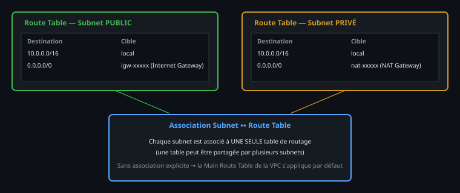

---

### 2.3 Sécurité réseau — Security Groups et Network ACLs

La sécurité dans une VPC repose sur **deux couches** complémentaires.

#### Security Groups — Pare-feu au niveau instance

Un **Security Group** est un ensemble de **règles de filtrage** appliquées à une ou plusieurs instances EC2.

**Caractéristiques** :
- **Stateful** : si vous autorisez les demandes entrantes, les réponses sortantes sont automatiquement autorisées.
- Changements appliqués **immédiatement**.
- Peut être modifié sur une instance en cours d'exécution.

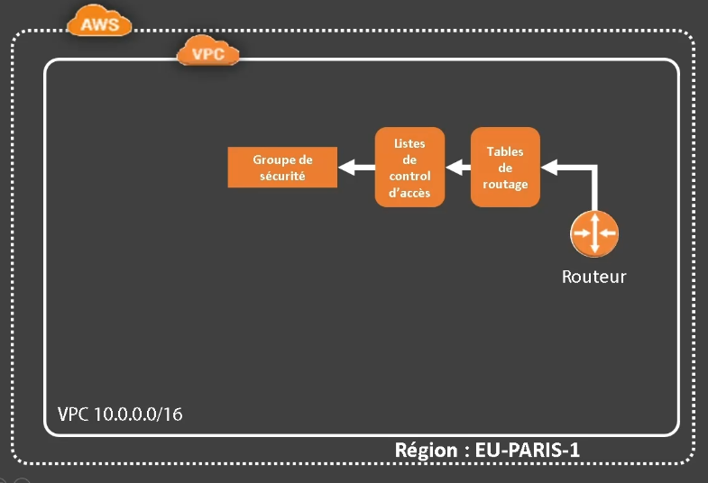

📹 [Groupes de sécurité : pourquoi faire ? Comment ?](https://www.youtube.com/watch?v=QwhexkU2ya4)

#### Network ACLs — Pare-feu au niveau subnet

Un **Network ACL** est un ensemble de règles appliquées à un **subnet entier**.

**Caractéristiques** :
- **Stateless** : vous devez définir EXPLICITEMENT les règles entrantes ET sortantes.
- Numérotées (ordre d'évaluation).
- Application par subnet.

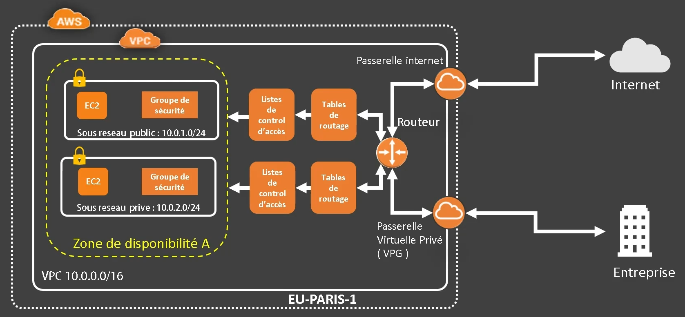


#### Différences clés

| Aspect | Security Group | Network ACL |
|--------|---|---|
| **Portée** | Instance | Subnet |
| **État** | Stateful | Stateless |
| **Défaut** | Tout refusé sauf règles | Tout refusé sauf règles |

**Bonne pratique** : utilisez les **Security Groups** pour les **règles fines** (par instance), et les **ACLs** pour les **règles larges** (par subnet).

#### Comment tout s'imbrique — architecture 3-tiers dans une VPC

Ces briques (subnets, Security Groups, NAT Gateway) ne prennent tout leur sens qu'assemblées avec les ressources RDS/EC2 vues plus haut dans ce chapitre. Voici l'architecture la plus enseignée en SAA-C03 : un serveur web accessible depuis Internet, une base de données qui ne l'est jamais.

```
VPC 10.0.0.0/16
│
├── Subnet PUBLIC (10.0.1.0/24, AZ 1a)
│    ├── Route Table → 0.0.0.0/0 via Internet Gateway
│    ├── Application Load Balancer (ALB)
│    │    Security Group ALB : inbound 443 depuis 0.0.0.0/0
│    └── NAT Gateway (sort vers Internet pour le subnet privé)
│
├── Subnet PRIVÉ — App (10.0.10.0/24, AZ 1a)
│    ├── Route Table → 0.0.0.0/0 via NAT Gateway (pas d'IGW direct)
│    └── Instance EC2 (serveur web)
│         Security Group EC2 : inbound 80 UNIQUEMENT depuis Security Group ALB
│
└── Subnet PRIVÉ — Data (10.0.20.0/24, AZ 1a)
     ├── Route Table → pas de route vers Internet (isolé)
     └── Instance RDS (déployée en section 1 de ce chapitre)
          Security Group RDS : inbound 3306 UNIQUEMENT depuis Security Group EC2
```

**Ce que cette architecture garantit :**
- Seul l'ALB est exposé sur Internet (subnet public, port 443 ouvert à tous).
- L'EC2 n'accepte du trafic que depuis l'ALB — jamais directement depuis Internet, même si son IP était devinée.
- Le RDS n'accepte du trafic que depuis l'EC2 — la base de données n'a **aucune route vers Internet**, donc même une erreur de configuration Security Group ne peut pas l'exposer.
- Chaque Security Group référence un *autre Security Group* comme source (pas une plage d'IP) — c'est la bonne pratique : si l'EC2 change d'adresse IP (redémarrage, remplacement), la règle reste valide.

---

### 2.4 VPC Peering — Connecter plusieurs VPC

> **VPC Peering** établit une **connexion réseau privée** entre deux VPC, permettant aux instances de communiquer comme si elles étaient dans le même réseau.

#### Caractéristiques

| Aspect | Détail |
|--------|--------|
| **Non-transitif** | A ↔ B fonctionne. Mais A ↔ C ne passera pas par B : il faut une peering A-C explicite. |
| **Coût** | $0.01 par million de requêtes |
| **Inter-comptes** | Deux VPC dans deux comptes AWS différents peuvent être peered |
| **Inter-régions** | Deux VPC dans deux régions différentes peuvent être peered |

:::warning
**VPC Peering est non-transitif — Piège architectural classique**

Si vous avez 3 VPCs : **Prod ↔ Shared** et **Dev ↔ Shared**, cela ne signifie PAS que Prod peut parler à Dev via Shared. Le trafic ne transite JAMAIS par un VPC intermédiaire.

Pour interconnecter N VPCs avec transitivité, utilisez **AWS Transit Gateway** (hub centralisé). Avec 4 VPCs, VPC Peering crée 6 connexions à gérer — avec 10 VPCs, c'est 45 connexions. Transit Gateway réduit cela à 1 attachement par VPC.
:::

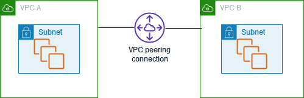

📎 [Documentation VPC Peering](https://docs.aws.amazon.com/vpc/latest/peering/what-is-vpc-peering.html)

---

### 2.5 Modèle Multi-VPC / Multi-Comptes et AWS Transit Gateway

#### Limitation du VPC Peering

Quand vos infrastructures deviennent **complexes** (10+ VPCs, plusieurs comptes AWS), le peering classique crée un problème :

```
AVEC PEERING CLASSIQUE (non-transitif) :
Pour N VPCs : N × (N-1) / 2 peerings = EXPLOSION combinatoire

Exemple 4 VPCs :
VPC-Prod ↔ VPC-Dev        (1)
VPC-Prod ↔ VPC-Staging    (2)
VPC-Prod ↔ VPC-Shared     (3)
VPC-Dev ↔ VPC-Staging     (4)
VPC-Dev ↔ VPC-Shared      (5)
VPC-Staging ↔ VPC-Shared  (6)
             ↓
        6 peerings manuels ! 😰

Problèmes :
- Non-transitif : Prod ↔ Dev ↔ Shared = Prod ne voit pas Shared
- Gestion complexe : chaque nouveau VPC = 3 peerings à créer
- Pas de contrôle centralisé : règles partagées impossibles
```

#### AWS Transit Gateway — La solution

> **AWS Transit Gateway** est un **hub réseau centralisé** qui connecte **toutes vos VPCs, comptes AWS et réseaux on-prem** via une seule interface.

En architecture hub-and-spoke, l'AWS Transit Gateway devient le hub centralisé (policies et routing uniques) auquel se connectent, chacun via un seul attachement : le réseau On-Premise, VPC-Prod (`10.0.0.0/16`), VPC-Dev (`10.1.0.0/16`), VPC-Staging (`10.2.0.0/16`) et VPC-Shared (`10.3.0.0/16`) — une connexion unique par ressource, à l'échelle illimitée.

Attachements possibles :
- ✅ VPC (plusieurs)
- ✅ Comptes AWS (via RAM — Resource Access Manager)
- ✅ On-premise (via VPN ou Direct Connect)
- ✅ Transit Gateway externe (inter-régions)

#### Architecture complète : Multi-Comptes avec Transit Gateway

L'organisation AWS regroupe plusieurs comptes, tous rattachés au même Transit Gateway (`tgw-xxx`, possédé par le Compte Prod) :

| Compte | Ressource | Rattachement |
|---|---|---|
| PROD (123456789012) | VPC-Prod (`10.0.0.0/16`) | Attachement TGW |
| DEV (210987654321) | VPC-Dev (`10.1.0.0/16`) | Attachement TGW |
| SHARED (shared-000) | VPC-Shared (`10.3.0.0/16`) | Attachement TGW |
| ON-PREMISE | Network (`192.168.0.0/16`) | Attachement VPN/Direct Connect |
| MGMT | CloudTrail logs (audit) | — |

Le Transit Gateway maintient des route tables distinctes (Production, Dev, Shared) pour contrôler quel trafic peut transiter entre quels VPC.

#### Avantages Transit Gateway

| Aspect | VPC Peering | Transit Gateway |
|--------|---|---|
| **Connexions N VPCs** | N(N-1)/2 peerings 😱 | 1 attachement par VPC ✅ |
| **Transitif** | Non (A↔B, B↔C ≠ A↔C) | Oui (contrôlé par routing) |
| **Multi-comptes** | Non (même compte seulement) | Oui (via Resource Access Manager) |
| **On-premise** | Non | Oui (VPN + Direct Connect) |
| **Policies centralisées** | Impossible | Oui (Network Policy) |
| **Coût** | $0.01 par million requêtes | $0.05 par attachement/h + data |

#### Configuration AWS CLI — Transit Gateway, principe

Le Transit Gateway est créé une seule fois, puis chaque VPC s'y attache via une **attachment**. La table de routage du TGW détermine quels VPCs peuvent se parler.

```bash
# Créer le Transit Gateway
aws ec2 create-transit-gateway \
  --description "Formation Transit Gateway Hub" \
  --tag-specifications 'ResourceType=transit-gateway,Tags=[{Key=Name,Value=FormationTGW}]'
# Résultat : TransitGatewayId = tgw-0123456789abcdef

# Attacher un VPC au Transit Gateway
aws ec2 create-transit-gateway-vpc-attachment \
  --transit-gateway-id tgw-0123456789abcdef \
  --vpc-id vpc-prod-12345 \
  --subnet-ids subnet-prod-1a subnet-prod-1b
```

:::success
**Résultat attendu :**
```json
{"TransitGatewayVpcAttachment": {"State": "pending", "TransitGatewayId": "tgw-0123456789abcdef", "VpcId": "vpc-prod-12345"}}
```
:::

:::info
**Pour aller plus loin — hors périmètre de cette formation** : partager un Transit Gateway entre plusieurs comptes AWS (via Resource Access Manager) et l'étendre à un réseau on-premise (VPN Site-to-Site) relèvent du niveau Advanced Networking Specialty. Le principe reste le même — un attachement par ressource, une table de routage centralisée — mais la mise en œuvre cross-account est un sujet à part entière.
:::

#### Pièges Transit Gateway

| Piège | Solution |
|-------|----------|
| **TGW par défaut permet tout** | Créer des route tables TGW restrictives par environnement |
| **Coût : $0.05/attachement/h** | Budget pour 20 VPCs = ~$72/mois (0.05 × 20 × 720 h) |
| **Association subnet obligatoire** | Au moins 1 subnet par AZ pour la résilience |
| **CIDR overlap interdit** | VPCs partagés doivent avoir CIDRs différents |

---

### 2.6 VPC Endpoints — Accès privé aux services AWS

#### Définition

> Un **VPC Endpoint** est une **passerelle privée** qui permet à vos ressources d'accéder à des **services AWS sans passer par Internet**.

#### Deux types

| Type | Services | Fonctionnement | Coût |
|------|----------|---|---|
| **Gateway Endpoint** | S3, DynamoDB | Interface simple (ajoute une route) | Gratuit |
| **Interface Endpoint** | EC2, Secrets Manager, Lambda, etc. | Interface élastique privée (ENI) | $0.007/h + transfert |

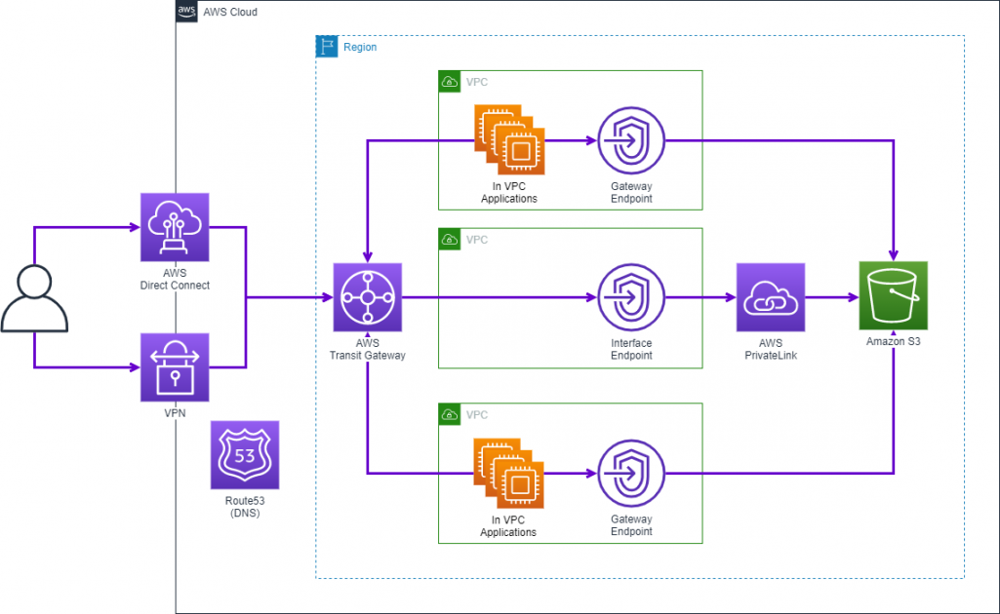

📎 [Documentation VPC Endpoints](https://docs.aws.amazon.com/vpc/latest/privatelink/)

---

### 2.7 ENI (Elastic Network Interfaces) — Les cartes réseau d'AWS

#### Qu'est-ce qu'une ENI ?

> Une **ENI** est une **carte réseau virtuelle** attachée à une instance EC2. Elle gère vos **adresses IP**, vos **adresses MAC**, vos **Security Groups** et vos **routes réseau**.

Dans une infrastructure **on-prem**, vous aviez des **cartes réseau physiques** (NIC) dans vos serveurs. Sur AWS, c'est exactement la même chose, mais **virtuelle et reconfigurable**.

#### Anatomie d'une ENI

```
Instance EC2 (t3.medium)
 
- Primary ENI (eth0)  [obligatoire]
    
   - Primary IP privée : 10.0.1.42 (CIDR subnet)
    
   - Secondary IP privées : 10.0.1.43, 10.0.1.44 (optionnel)
    
   - Elastic IP publique : 203.0.113.12 (optionnel)
    
   - MAC Address : 02:c1:1f:a0:2b:4d (auto-générée)
    
   - Security Group : sg-12345678
    
   - Source/Dest Check : ✅ activée (drop trafic non-destiné)
```

📹 [Comment conserver son IP sur AWS ?](https://www.youtube.com/watch?v=oSMEQlQDohM)

#### Cas d'usage : Multiple ENIs sur une même instance

Certains scénarios nécessitent **plusieurs ENIs** sur une instance :

```
SCÉNARIO : Serveur pare-feu / VPN / Load Balancer

Instance (m5.xlarge) : 4 ENIs possibles
 
- eth0 (Primary) : connectée à VPC public  → Internet
    - 10.0.1.10
 
- eth1 (Secondary) : connectée à VPC privée → Apps internes
    - 10.1.1.10
 
- eth2 (Secondary) : connectée à VPC client (peering) → Client network
    - 10.2.1.10
 
- eth3 (Secondary) : Management/monitoring
    - 10.0.2.10 (subnet privé)

Résultat : machine routeur/pare-feu multi-réseaux ! 🔥
```

#### Configuration ENI via AWS CLI

On crée ici une ENI indépendante puis on l'attache à une instance existante. Cela permet d'ajouter une interface réseau secondaire sans recréer l'instance — utile pour un serveur bastion ou un routeur multi-réseaux.

```bash
# ═══════════════════════════════════════════════════════════
# 1. Créer une ENI seule (détachée)
# ═══════════════════════════════════════════════════════════

aws ec2 create-network-interface \
  --subnet-id subnet-12345678 \
  --description "Secondary management interface" \
  --private-ip-addresses PrivateIpAddress=10.0.2.100,Primary=true \
  --groups sg-mgmt-12345678 \
  --tag-specifications 'ResourceType=network-interface,Tags=[{Key=Name,Value=ENI-Management}]'

# Résultat : NetworkInterfaceId = eni-0a1b2c3d4e5f6g7h8

# ═══════════════════════════════════════════════════════════
# 2. Attacher une ENI existante à une instance
# ═══════════════════════════════════════════════════════════

aws ec2 attach-network-interface \
  --network-interface-id eni-0a1b2c3d4e5f6g7h8 \
  --instance-id i-0123456789abcdef0 \
  --device-index 1  # eth1 (0=primary/eth0, 1=eth1, etc.)

# ═══════════════════════════════════════════════════════════
# 3. Allouer une Elastic IP et l'attacher à une ENI
# ═══════════════════════════════════════════════════════════

# Allouer Elastic IP
aws ec2 allocate-address \
  --domain vpc \
  --network-interface-id eni-0a1b2c3d4e5f6g7h8 \
  --private-ip-address 10.0.2.100

# Résultat : PublicIp = 203.0.113.50

# ═══════════════════════════════════════════════════════════
# 4. Ajouter une IP privée secondaire à une ENI
# ═══════════════════════════════════════════════════════════

aws ec2 assign-private-ip-addresses \
  --network-interface-id eni-0a1b2c3d4e5f6g7h8 \
  --private-ip-addresses 10.0.2.101 10.0.2.102

# ═══════════════════════════════════════════════════════════
# 5. Changer de Security Group sur une ENI
# ═══════════════════════════════════════════════════════════

aws ec2 modify-network-interface-attribute \
  --network-interface-id eni-0a1b2c3d4e5f6g7h8 \
  --groups sg-new-12345678 sg-management-67890

# ═══════════════════════════════════════════════════════════
# 6. Détacher une ENI (reste dans la VPC, peut être réattachée)
# ═══════════════════════════════════════════════════════════

aws ec2 detach-network-interface \
  --attachment-id eni-attach-12345678

# ═══════════════════════════════════════════════════════════
# 7. Voir toutes les ENI d'une instance
# ═══════════════════════════════════════════════════════════

aws ec2 describe-instances \
  --instance-ids i-0123456789abcdef0 \
  --query 'Reservations[0].Instances[0].NetworkInterfaces[*].[NetworkInterfaceId,Attachment.DeviceIndex,PrivateIpAddresses[0].PrivateIpAddress,PrivateIpAddresses[0].Association.PublicIp]'

# Résultat (exemple) :
# [
#   ["eni-primary", 0, "10.0.1.42", "203.0.113.50"],    ← eth0 + Elastic IP
#   ["eni-secondary", 1, "10.0.2.100", null]             ← eth1 (privée)
# ]
```

:::success
**Résultat attendu :**
```json
[
    ["eni-0a1b2c3d4e5f00001", 0, "10.0.1.42", "203.0.113.50"],
    ["eni-0a1b2c3d4e5f00002", 1, "10.0.2.100", null]
]
```
:::

#### Cas d'usage réels : ENI multiples

| Scénario | Interfaces | Bénéfice |
|----------|---|---|
| **Routeur/Pare-feu** | 3-4 ENIs | Connexion à plusieurs VPCs/subnets sans NAT |
| **Haute disponibilité** | Primary ENI + failover | IP privée = même, instance change (failover transparent) |
| **Serveur DNS interne** | Primary + management | Trafic DNS sur une interface, logs/monitoring sur autre |
| **Load Balancer maison** | Multiple NICs | Distribution load par interface réseau |
| **Serveur VPN/bastion** | 2+ interfaces | Accès de plusieurs subnets via une machine unique |

#### Piège : Source/Destination Check

Par défaut, AWS bloque tout paquet dont l'IP source ou destination ne correspond pas à l'interface. C'est intentionnel pour la sécurité, mais cela empêche un routeur ou un pare-feu de forwarder le trafic. Il faut donc **désactiver cette vérification** sur les instances qui jouent un rôle de routage.

```bash
# ⚠️ Par défaut, une ENI REFUSE le trafic non-destiné à elle-même.
# Exemple : routeur firewall doit FOWARDER le trafic.

# Désactiver Source/Destination check
aws ec2 modify-network-interface-attribute \
  --network-interface-id eni-12345678 \
  --no-source-dest-check

# Résultat : routeur peut maintenant forwarder (forwarding activé)

# Réactiver (sécurité)
aws ec2 modify-network-interface-attribute \
  --network-interface-id eni-12345678 \
  --source-dest-check
```

:::success
**Résultat attendu :**
```
# modify-network-interface-attribute : aucun output si succès

# Vérification : aws ec2 describe-network-interface-attribute --network-interface-id eni-12345678 --attribute sourceDestCheck
{
    "NetworkInterfaceId": "eni-12345678",
    "SourceDestCheck": {
        "Value": false
    }
}
```
La vérification Source/Destination est désactivée (`Value: false`). L'interface peut désormais forwarder du trafic dont elle n'est pas la destination finale — comportement requis pour une instance jouant le rôle de routeur ou de pare-feu.
:::

---

## 3. Amazon Route 53 — DNS Intelligent

### 3.1 Fondamentaux du DNS

#### Qu'est-ce que le DNS ?

Le **DNS (Domain Name System)** est un système **mondial décentralisé** qui traduit des **noms lisibles** (`www.example.com`) en **adresses IP** (`93.184.216.34`).

---

### 3.2 Amazon Route 53 — Service DNS managé

#### Définition

> **Amazon Route 53** est le **service DNS managé** d'AWS. Il permet de **résoudre les noms de domaine**, de **diriger le trafic intelligemment**, et d'**assurer la haute disponibilité**.

Le nom « Route 53 » vient du **port 53**, utilisé par le protocole DNS.

#### Capacités

Route 53 combine plusieurs fonctionnalités :

| Fonctionnalité | Description |
|---|---|
| **Registrar** | Acheter et gérer des domaines (.com, .fr, .io, etc.) |
| **Résolution DNS** | Traduire noms → IP |
| **Health Checks** | Vérifier si une ressource est disponible |
| **Routage intelligent** | Diriger le trafic selon latence, géolocalisation, poids, failover |
| **Alias Records** | Lier un domaine à une ressource AWS (ALB, CloudFront, S3) |

#### Types d'enregistrements DNS courants

| Type | Exemple | Rôle |
|------|---------|------|
| **A** | `example.com` → `93.184.216.34` | IPv4 |
| **AAAA** | `example.com` → `2606:2800:...` | IPv6 |
| **CNAME** | `www.example.com` → `example.com` | Alias |
| **MX** | `example.com` → `mail.example.com` | Serveur mail |
| **TXT** | `example.com` → `v=spf1...` | Enregistrement texte |
| **NS** | `example.com` → `ns1.route53...` | Serveurs DNS |

---

### 3.3 Politiques de routage — Diriger le trafic intelligemment

Route 53 n'est pas un simple DNS classique. C'est un **routeur de trafic applicatif**.

#### Politique Simple

Cas de base : un domaine pointe vers **une seule adresse IP**.

#### Politique Pondérée

Distribuer le trafic en pourcentage entre plusieurs ressources.

**Cas d'usage** : déploiement progressif, A/B testing, migration progressive.

#### Politique Latence

Router les utilisateurs vers la ressource **la plus rapide** (latence réseau minimale).

**Cas d'usage** : applications globales, réduction latence.

#### Politique Failover (Basculement)

En cas de panne détectée, router vers une ressource de secours.

**Cas d'usage** : haute disponibilité, reprise après sinistre.

---

### 3.4 Health Checks et Monitoring

Route 53 peut **monitorer la santé** des ressources et basculer automatiquement.

#### Types de Health Checks

| Type | Description | Fréquence |
|------|---|---|
| **HTTP/HTTPS** | Effectue une requête GET, attend 2xx/3xx | Toutes les 30s |
| **TCP** | Établit une connexion TCP | Toutes les 10s |
| **Calculated** | Combine plusieurs health checks | Toutes les 30s |
| **CloudWatch** | Déclenché par une alarme CloudWatch | Variable |

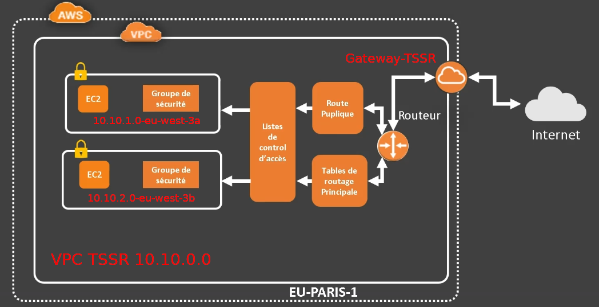

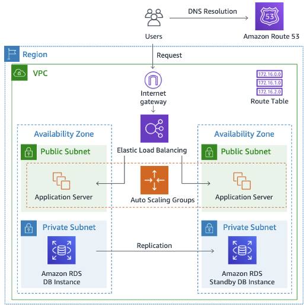

---

## 4. Amazon ElastiCache — Mise en cache distribuée

### 4.1 Pourquoi une couche cache ?

Imaginez une **base de données RDS** qui reçoit **1 000 requêtes par seconde** pour lire les **mêmes 10 utilisateurs**. Chaque requête demande 5–10 ms à la base. Résultat : **goulot d'étranglement**, latence élevée, coût RDS énorme.

**Solution** : placez un **cache rapide** devant la base. Les 1 000 requêtes frappent le cache (**< 1 ms**) au lieu de la base.

**Amazon ElastiCache** est le service managé AWS pour placer un **cache distribuée** haute performance devant vos applications.

---

### 4.2 Deux moteurs : Redis vs Memcached

#### Redis (Remote Dictionary Server)

```
Cas d'usage : Sessions utilisateur, panier e-commerce, rankings, pubsub
Structure : Chaînes, listes, ensembles, hashes, streams, géo-spatial
Persistance : RDB + AOF (journalisation)
Clustering : Oui, avec failover automatique
Transactions : MULTI/EXEC
TTL (durée de vie clé) : Oui
```

Redis peut perdre les données stockées en mémoire lors d'un redémarrage ou d'une panne — la **persistance** est le mécanisme qui les sauvegarde sur disque pour pouvoir les recharger ensuite. AWS ElastiCache pour Redis combine deux méthodes complémentaires : **RDB** (Redis Database, un instantané complet du contenu de la mémoire pris à intervalles réguliers, rapide à recharger mais qui peut perdre les toutes dernières écritures) et **AOF** (Append Only File, un journal qui enregistre chaque commande d'écriture au fil de l'eau, plus lourd mais qui permet de ne perdre quasiment aucune donnée en cas de panne).

**Analogie** : un **dictionnaire magique ultra-rapide** qui se souvient des modifications.

#### Memcached

```
Cas d'usage : Cache objet simple (résultats DB, pages HTML)
Structure : Chaînes et blobs uniquement
Persistance : Non (tout volatil)
Clustering : Oui, mais pas de failover
Transactions : Non
TTL : Oui
```

**Analogie** : un **panier à oublier** ultra-simple — parfait pour des données éphémères.

---

### 4.3 Cas d'usage typiques

| Cas d'usage | Moteur | Raison |
|---|---|---|
| **Session utilisateur** | Redis | Besoin de persistance, expiration TTL |
| **Panier e-commerce** | Redis | Structures complexes (hash), transactions |
| **Leaderboard** | Redis | Opérations set triées (`ZSET`) |
| **Cache HTML statique** | Memcached | Simple, volatil, très rapide |
| **Résultats requête DB** | Redis | Contrôle TTL par clé, publish/subscribe |
| **Real-time counters** | Redis | Opérations atomiques (`INCR`) |

---

### 4.4 Architecture ElastiCache

#### Cluster Mode Disabled (simple, old-school)

L'application (EC2, Lambda) envoie ses requêtes `GET cache_key` vers le nœud ElastiCache Redis primary (`eu-west-1a`), qui réplique de façon asynchrone vers un nœud Replica standby en lecture seule (`eu-west-1b`).

**Limitation** : une seule shard, donc un seul nœud — le CPU de ce nœud unique plafonne la capacité totale.

#### Cluster Mode Enabled (production, sharding)

L'application (EC2, Lambda) hache chaque clé pour la router vers l'une des trois shards : Shard 1 (clés 1-3), Shard 2 (clés 4-6) ou Shard 3 (clés 7-10). Chaque shard a son propre primary node, répliqué vers un Replica correspondant (`eu-west-1b`).

**Bénéfice** : parallélisation et scalabilité linéaire — ajouter des shards augmente la capacité totale, contrairement au mode Cluster Disabled.

---

### 4.5 Commandes Redis essentielles

```bash
# Installation (macOS via Homebrew)
brew install redis

# Lancer serveur Redis local (développement)
redis-server

# Client Redis (dans un autre terminal)
redis-cli

# ──── CHAÎNES (Strings) ────
SET nom "Alice"                    # Stocker
GET nom                            # Récupérer → "Alice"
APPEND nom " Dupont"               # Ajouter → "Alice Dupont"
STRLEN nom                         # Longueur → 12
INCR compteur                      # Incrémenter (atomique)
DECR compteur                      # Décrémenter

# ──── LISTES (Lists) ────
RPUSH queue "tache1"               # Ajouter à droite
RPUSH queue "tache2" "tache3"      # Multiple
LPOP queue                         # Retirer de gauche
LLEN queue                         # Longueur
LRANGE queue 0 -1                  # Tout afficher

# ──── HASHES (Objets) ────
HSET user:100 nom "Alice"          # Stocker champ
HSET user:100 email "alice@ex.com" age 28
HGET user:100 nom                  # Récupérer → "Alice"
HGETALL user:100                   # Tous les champs
HDEL user:100 age                  # Supprimer champ

# ──── ENSEMBLES TRIÉS (Sorted Sets, ZSET) ────
ZADD leaderboard 100 "Alice"       # Score 100 → Alice
ZADD leaderboard 150 "Bob" 200 "Charlie"
ZRANGE leaderboard 0 -1            # Ordre croissant
ZREVRANGE leaderboard 0 -1         # Ordre décroissant (top)
ZRANK leaderboard "Alice"          # Position → 0 (première)

# ──── EXPIRATION ────
SET session:user123 "data"
EXPIRE session:user123 3600        # Expirer dans 1 heure
TTL session:user123                # Temps restant → 3599

# ──── TRANSACTIONS ────
MULTI
SET clé1 "valeur1"
SET clé2 "valeur2"
EXEC                               # Atomique : tout ou rien

# ──── PUBLISH/SUBSCRIBE ────
SUBSCRIBE channel:notifications    # S'abonner
PUBLISH channel:notifications "Hello" # Diffuser
```

---

### 4.6 Créer un cluster Redis en CLI

:::info
Une activité pratique permet d’approfondir le déploiement d’un cache Redis.
:::

On crée ici le type de cluster le plus simple : un nœud Redis unique, sans réplication. En production, on ajouterait un groupe de réplication (`create-replication-group`) avec un nœud primaire et des replicas, mais ce modèle suffit pour comprendre les concepts.

```bash
# 1. Créer un cluster Redis (simple, mode Cluster Mode Disabled)
aws elasticache create-cache-cluster \
  --cache-cluster-id formation-redis-simple \
  --cache-node-type cache.t3.micro \
  --engine redis \
  --engine-version 7.0 \
  --num-cache-nodes 1 \
  --vpc-security-group-ids sg-12345678 \
  --cache-subnet-group-name my-subnet-group \
  --tags Key=Name,Value=FormationRedis Key=Env,Value=Dev

# 2. Attendre que le cluster soit disponible
aws elasticache wait cache-cluster-available \
  --cache-cluster-id formation-redis-simple

# 3. Récupérer l'endpoint (adresse:port)
aws elasticache describe-cache-clusters \
  --cache-cluster-id formation-redis-simple \
  --query 'CacheClusters[0].CacheNodes[0].Endpoint'
# Résultat exemple : formation-redis-simple.abc123.ng.0001.euw1.cache.amazonaws.com:6379
```

:::success
**Résultat attendu :**
```json
{
    "CacheClusters": [{
        "CacheClusterId": "formation-redis-simple",
        "CacheClusterStatus": "available",
        "Engine": "redis",
        "EngineVersion": "7.0.7",
        "CacheNodeType": "cache.t3.micro",
        "CacheNodes": [{
            "CacheNodeId": "0001",
            "CacheNodeStatus": "available",
            "Endpoint": {
                "Address": "formation-redis-simple.abc123.ng.0001.euw1.cache.amazonaws.com",
                "Port": 6379
            }
        }]
    }]
}
```
:::

```bash
# 4. Créer un Replication Group (Multi-AZ avec failover auto)
aws elasticache create-replication-group \
  --replication-group-id formation-redis-ha \
  --replication-group-description "Redis avec failover" \
  --engine redis \
  --engine-version 7.0 \
  --cache-node-type cache.t3.micro \
  --num-cache-clusters 2 \
  --automatic-failover-enabled \
  --multi-az-enabled \
  --vpc-security-group-ids sg-12345678 \
  --cache-subnet-group-name my-subnet-group

# 5. Décrire le replication group
aws elasticache describe-replication-groups \
  --replication-group-id formation-redis-ha

# 6. Créer un cluster Memcached (simple)
aws elasticache create-cache-cluster \
  --cache-cluster-id formation-memcached \
  --cache-node-type cache.t3.micro \
  --engine memcached \
  --engine-version 1.6.17 \
  --num-cache-nodes 3 \
  --vpc-security-group-ids sg-12345678 \
  --cache-subnet-group-name my-subnet-group

# 7. Supprimer un cluster (attention : perte de données)
aws elasticache delete-cache-cluster \
  --cache-cluster-id formation-redis-simple
```

---

### 4.7 Bonne pratique : Cache-Aside Pattern

Le pattern le plus courant pour intégrer un cache :

```
Requête application :

1. Cache.GET(clé) ?
   - Si HIT → retourner valeur (< 1 ms) ✅
   - Si MISS → aller à 2

2. Requête base de données
   RDS.SELECT(clé) → résultat

3. Stocker en cache
   Cache.SET(clé, résultat, TTL=3600) # Expire en 1 heure

4. Retourner résultat application

Avantage : logique simple, contrôle du cache
Risque : cache stale (données anciennes) pendant TTL
```

### 4.8 Combien coûte ElastiCache ?

ElastiCache se facture à l'heure d'instance active, comme EC2 et RDS — pas de coût "à la requête" contrairement à DynamoDB. Le prix dépend du type de nœud et du nombre de nœuds (primary + replicas).

| Type de nœud | RAM | Usage typique | Prix indicatif (région Paris) |
|---|---|---|---|
| cache.t3.micro | 0,5 Go | Dev/test, très petite charge | ~0,020 $/h (~15 $/mois) |
| cache.t3.medium | 3,09 Go | Sessions utilisateur, petite prod | ~0,080 $/h (~58 $/mois) |
| cache.r6g.large | 13,07 Go | Cache applicatif de production | ~0,226 $/h (~165 $/mois) |

**Ce qui fait varier la facture :**
- **Nombre de nœuds** : un cluster Redis en haute disponibilité (primary + replica) double le coût du nœud seul — exactement comme Multi-AZ sur RDS.
- **Cluster Mode Enabled** (sharding) : chaque shard supplémentaire est un nœud facturé en plus — utile pour la scalabilité, mais le coût grimpe linéairement avec le nombre de shards.
- **Transfert de données** : gratuit entre ElastiCache et EC2 dans la même AZ, facturé au-delà (inter-AZ, inter-région).

**Repère utile** : ElastiCache n'est rentable que si le cache réduit suffisamment la charge sur RDS pour permettre une instance RDS plus petite, ou évite d'ajouter des Read Replicas RDS payants. Sur une charge de lecture très répétitive (mêmes clés interrogées des milliers de fois), le calcul est presque toujours favorable ; sur des requêtes peu répétées, le cache n'apporte rien et n'est qu'un coût supplémentaire.

📎 [Amazon ElastiCache Pricing](https://aws.amazon.com/elasticache/pricing/)

---

## 5. Points importants et pièges fréquents

### 5.1 Pièges RDS et Bases de données

| Piège | Réalité | Conséquence | Solution |
|-------|---------|-----------|----------|
| **RDS n'est pas auto-scalable en stockage** | Faut augmenter manuellement (RDS) ou activer auto-scaling (Aurora) | Saturation disque → downtime | Vérifier "Storage autoscaling" dans RDS config |
| **Multi-AZ RDS ≠ haute disponibilité lue** | Multi-AZ = résilience (failover), pas scalabilité lecture | Bottleneck en lecture malgré Multi-AZ | Ajouter **Read Replicas** (asynchrones) |
| **Chiffrement RDS doit être activé à la création** | On ne peut pas l'activer après coup | Recréer l'instance = downtime | Checker "Encrypt at rest" lors création |
| **Read Replica ≠ Multi-AZ** | Replica = asynchrone, pour lectures. Multi-AZ = synchrone, failover | Confondre les deux gâche design | Multi-AZ pour haute dispo, Replicas pour scalabilité lecture |
| **Snapshot RDS = backup manuel** | Snapshots manuels ne s'auto-suppriment pas | Surcoûts stockage | Supprimer manuellement ou appliquer cycle vie |

### 5.2 Pièges VPC et Réseau

| Piège | Réalité | Conséquence | Solution |
|-------|---------|-----------|----------|
| **VPC Peering n'est pas transitif** | A ↔ B et B ↔ C ne signifie pas A ↔ C | Communication A-C bloquée | Créer peering A-C explicitement ou utiliser Transit Gateway |
| **Security Group ≠ Network ACL** | SG = stateful (instance), NACL = stateless (subnet) | Oublier une règle sortante NACL bloque tout | Vérifier ACL entrée ET sortie |
| **IGW coûte 0 €** | NAT Gateway coûte $0.032/h + transfert | Budget explosif avec gros trafic privé | Minimiser NAT, utiliser VPC Endpoints S3 |
| **Security Group par défaut refuse tout** | Sauf trafic **sortant** (autorisé par défaut) | Instances isolées jusqu'à ouverture ingress | Ajouter règles **ingress** explicites |
| **Security Group : ALLOW vs DENY** | SG = whitelist (ALLOW seulement), pas de DENY | Penser NACL pour bloquer IPs spécifiques | NACL pour explicite DENY |
| **Associer route table incorrect** | Associer table RT publique à subnet privé = accès internet non sécurisé | Instances "privées" exposées à Internet | Vérifier subnet <→ route table |
| **ENI : Source/Dest Check activé par défaut** | ENI refuse le trafic non-destiné à elle (sécurité) | Routeur/pare-feu ne peut pas forwarder | Désactiver `source-dest-check` pour routeurs |
| **Attach ENI = Device index critique** | Device index 0 = primary (obligatoire), 1+ = secondary | Erreur lors attach bloque l'instance | Vérifier device index disponible avant attach |
| **Transit Gateway ≠ gratuit** | $0.05/attachement/h + $0.02 par Go data | Coût pour 20 VPCs = ~$72/mois | Budget transit gateway si 10+ VPCs |
| **Transit Gateway routing par défaut = tous allowed** | TGW fait transiter tous les paquets par défaut | Communication imprévue entre VPCs | Restreindre via Route Tables TGW explicites |
| **VPC CIDR overlap interdit dans Transit Gateway** | Tous les VPCs attachés doivent avoir CIDR différents | Adresses en collision = paquets perdus | Planifier CIDR par VPC avant TGW |

### 5.3 Pièges Route 53 et DNS

| Piège | Réalité | Conséquence | Solution |
|-------|---------|-----------|----------|
| **DNS Route 53 a un TTL** | Les réponses sont cachées pendant le TTL | Changement DNS peut prendre 24h | Baisser TTL avant changement (300s) |
| **Health Check ≠ Failover automatique** | Health check détecte panne, failover redirection | Juste détecter ne suffit pas | Configurer failover + health check |
| **Alias Records ≠ CNAME** | Alias = pointeur AWS (gratuit, flexible), CNAME = alias DNS classique | Confondre risque problèmes CNAME root | Toujours Alias pour AWS resources (ALB, CloudFront) |

:::warning
**TTL Route 53 trop court = coût de requêtes élevé**

Un TTL de **30 secondes** sur un enregistrement très consulté (ex. : API avec 1 000 req/s) génère des **résolutions DNS répétées**. Route 53 facture **$0.40 par million de requêtes** pour les zones publiques.

Exemple : 1 000 req/s × 2 résolutions/min (TTL=30s) × 3 600 s/h = ~432 000 requêtes DNS/h → **~$4/jour** juste pour le DNS.

**Règle** :
- TTL **300s** (5 min) pour la plupart des enregistrements stables
- TTL **60s** maximum pendant une migration ou un failover planifié
- Remonter le TTL à **300-3600s** après stabilisation
:::

### 5.4 Pièges DynamoDB

| Piège | Réalité | Conséquence | Solution |
|-------|---------|-----------|----------|
| **DynamoDB provisionned vs on-demand** | Mode provisionné = moins cher si prévisible | Charge imprévisible = throttling ou surcoûts | Choisir on-demand si variable, provisionné si stable |
| **Partition key ≠ Sort key** | Partition = hash (required), Sort = range (optional) | Query sans sort key = full table scan | Bien concevoir partition + sort key |
| **DynamoDB TTL n'est pas immédiat** | TTL supprime dans 24-48h après expiration | Données restent visibles brièvement | Ne pas compter sur TTL pour sécurité |
| **Global Secondary Index (GSI) coûte** | GSI = throughput supplémentaire à provisionner | Surcoûts si GSI mal utilisés | Bien planifier projections, ne créer que GSI utiles |

### 5.5 Pièges ElastiCache

| Piège | Réalité | Conséquence | Solution |
|-------|---------|-----------|----------|
| **Redis vs Memcached** | Redis = persistance, structures complexes. Memcached = volatil, simple | Choisir Memcached pour données durables = perte | Redis pour sessions, Memcached pour cache éphémère |
| **Cache-Aside pattern = possibilité cache stale** | TTL peut garder données anciennes 1h | Utilisateurs voient données obsolètes | Réduire TTL ou implémenter invalidation manuelle |
| **ElastiCache dans VPC ≠ accessible depuis EC2 autre subnet** | Besoin Security Group + route table | EC2 ne peut pas accéder cache | Vérifier SG ElastiCache permet EC2, même VPC |
| **Cluster mode disabled : une seule shard** | Pas de sharding = un seul nœud max CPU | Bottleneck CPU même avec plusieurs replicas | Cluster mode enabled pour scalabilité |

### 5.6 Pièges Architecture Générale

| Piège | Réalité | Conséquence | Solution |
|-------|---------|-----------|----------|
| **Aurora Serverless = scaling pas instantané** | Scaling automatique peut durer 30-60s | Latence pics pendant scaling | Pas idéal real-time, mieux RDS provisionné |
| **VPC Endpoint S3 évite la NAT** | Mais doit configurer policies explicites | S3 accès reste privé mais règles complexes | Créer endpoint + bucket policy restrictive |
| **VPC Endpoint = interface privée (coût)** | Interface endpoint = ENI = $0.007/h | Nombreux endpoints = facture élevée | Gateway endpoint pour S3/DynamoDB (gratuit) |

---

## 6. Construire une VPC en CLI

:::info
Une activité pratique permet d’approfondir la construction d’un VPC complet.
:::

### 6.1 Créer une VPC complète avec AWS CLI

Cette séquence construit une VPC de zéro, pièce par pièce : VPC → subnets public/privé → Internet Gateway → NAT Gateway → tables de routage. C'est l'ordre obligatoire — chaque ressource dépend de la précédente.

```bash
# ═══════════════════════════════════════════════════════════
# ÉTAPE 1 : Créer la VPC avec CIDR /16
# ═══════════════════════════════════════════════════════════

aws ec2 create-vpc \
  --cidr-block 10.0.0.0/16 \
  --tag-specifications 'ResourceType=vpc,Tags=[{Key=Name,Value=FormationVPC},{Key=Env,Value=Training}]'

# Récupérer l'ID VPC depuis la sortie précédente
VPC_ID="vpc-12345678"

# Valider la VPC créée
aws ec2 describe-vpcs --vpc-ids $VPC_ID
```

:::success
**Résultat attendu :**
```json
{
    "Vpcs": [{
        "VpcId": "vpc-12345678",
        "CidrBlock": "10.0.0.0/16",
        "State": "available",
        "IsDefault": false,
        "Tags": [{"Key": "Name", "Value": "FormationVPC"}, {"Key": "Env", "Value": "Training"}]
    }]
}
```
:::

```bash
# ═══════════════════════════════════════════════════════════
# ÉTAPE 2 : Créer subnets PUBLICS (pour ALB, NAT Gateway)
# ═══════════════════════════════════════════════════════════

# Subnet public en AZ 1a (10.0.1.0/24 = 256 IPs)
aws ec2 create-subnet \
  --vpc-id $VPC_ID \
  --cidr-block 10.0.1.0/24 \
  --availability-zone eu-west-1a \
  --tag-specifications 'ResourceType=subnet,Tags=[{Key=Name,Value=SubnetPublic-AZa},{Key=Type,Value=Public}]'

SUBNET_PUBLIC_AZa="subnet-public-a"

# Subnet public en AZ 1b (10.0.2.0/24 = 256 IPs)
aws ec2 create-subnet \
  --vpc-id $VPC_ID \
  --cidr-block 10.0.2.0/24 \
  --availability-zone eu-west-1b \
  --tag-specifications 'ResourceType=subnet,Tags=[{Key=Name,Value=SubnetPublic-AZb},{Key=Type,Value=Public}]'

SUBNET_PUBLIC_AZb="subnet-public-b"

# ═══════════════════════════════════════════════════════════
# ÉTAPE 3 : Créer subnets PRIVÉS (pour EC2, RDS)
# ═══════════════════════════════════════════════════════════

# Subnet privé en AZ 1a (10.0.10.0/24)
aws ec2 create-subnet \
  --vpc-id $VPC_ID \
  --cidr-block 10.0.10.0/24 \
  --availability-zone eu-west-1a \
  --tag-specifications 'ResourceType=subnet,Tags=[{Key=Name,Value=SubnetPrivate-AZa},{Key=Type,Value=Private}]'

SUBNET_PRIVATE_AZa="subnet-private-a"

# Subnet privé en AZ 1b (10.0.20.0/24) pour haute dispo
aws ec2 create-subnet \
  --vpc-id $VPC_ID \
  --cidr-block 10.0.20.0/24 \
  --availability-zone eu-west-1b \
  --tag-specifications 'ResourceType=subnet,Tags=[{Key=Name,Value=SubnetPrivate-AZb},{Key=Type,Value=Private}]'

SUBNET_PRIVATE_AZb="subnet-private-b"

# Lister tous les subnets créés
aws ec2 describe-subnets --filters "Name=vpc-id,Values=$VPC_ID"
```

:::success
**Résultat attendu :**
```json
{
    "Subnets": [
        {"SubnetId": "subnet-public-a", "CidrBlock": "10.0.1.0/24", "AvailabilityZone": "eu-west-1a", "State": "available", "Tags": [{"Key": "Name", "Value": "SubnetPublic-AZa"}]},
        {"SubnetId": "subnet-public-b", "CidrBlock": "10.0.2.0/24", "AvailabilityZone": "eu-west-1b", "State": "available", "Tags": [{"Key": "Name", "Value": "SubnetPublic-AZb"}]},
        {"SubnetId": "subnet-private-a", "CidrBlock": "10.0.10.0/24", "AvailabilityZone": "eu-west-1a", "State": "available", "Tags": [{"Key": "Name", "Value": "SubnetPrivate-AZa"}]},
        {"SubnetId": "subnet-private-b", "CidrBlock": "10.0.20.0/24", "AvailabilityZone": "eu-west-1b", "State": "available", "Tags": [{"Key": "Name", "Value": "SubnetPrivate-AZb"}]}
    ]
}
```
:::

```bash
# ═══════════════════════════════════════════════════════════
# ÉTAPE 4 : Créer Internet Gateway (accès Internet pour VPC)
# ═══════════════════════════════════════════════════════════

aws ec2 create-internet-gateway \
  --tag-specifications 'ResourceType=internet-gateway,Tags=[{Key=Name,Value=FormationIGW}]'

IGW_ID="igw-12345678"

# Attacher IGW à la VPC
aws ec2 attach-internet-gateway \
  --internet-gateway-id $IGW_ID \
  --vpc-id $VPC_ID

# Valider l'attachement
aws ec2 describe-internet-gateways --internet-gateway-ids $IGW_ID
```

:::success
**Résultat attendu :**
```json
{
    "InternetGateways": [{
        "InternetGatewayId": "igw-12345678",
        "State": "available",
        "Attachments": [{"State": "available", "VpcId": "vpc-12345678"}],
        "Tags": [{"Key": "Name", "Value": "FormationIGW"}]
    }]
}
```
:::

```bash
# ═══════════════════════════════════════════════════════════
# ÉTAPE 5 : Créer Elastic IPs et NAT Gateways
# ═══════════════════════════════════════════════════════════

# Allouer une Elastic IP pour NAT Gateway AZ 1a
aws ec2 allocate-address \
  --domain vpc \
  --tag-specifications 'ResourceType=elastic-ip,Tags=[{Key=Name,Value=NAT-EIP-AZa}]'

ALLOCATION_ID_AZa="eipalloc-12345678"

# Allouer une Elastic IP pour NAT Gateway AZ 1b
aws ec2 allocate-address \
  --domain vpc \
  --tag-specifications 'ResourceType=elastic-ip,Tags=[{Key=Name,Value=NAT-EIP-AZb}]'

ALLOCATION_ID_AZb="eipalloc-87654321"

# Créer NAT Gateway en AZ 1a (place dans subnet PUBLIC)
aws ec2 create-nat-gateway \
  --subnet-id $SUBNET_PUBLIC_AZa \
  --allocation-id $ALLOCATION_ID_AZa \
  --tag-specifications 'ResourceType=nat-gateway,Tags=[{Key=Name,Value=NAT-GW-AZa}]'

NAT_GW_ID_AZa="nat-12345678"

# Créer NAT Gateway en AZ 1b (pour HA)
aws ec2 create-nat-gateway \
  --subnet-id $SUBNET_PUBLIC_AZb \
  --allocation-id $ALLOCATION_ID_AZb \
  --tag-specifications 'ResourceType=nat-gateway,Tags=[{Key=Name,Value=NAT-GW-AZb}]'

NAT_GW_ID_AZb="nat-87654321"

# Attendre que les NAT Gateways soient disponibles
aws ec2 wait nat-gateway-available --nat-gateway-ids $NAT_GW_ID_AZa $NAT_GW_ID_AZb

# ═══════════════════════════════════════════════════════════
# ÉTAPE 6 : Créer et configurer ROUTE TABLES PUBLIQUES
# ═══════════════════════════════════════════════════════════

# Créer route table pour subnets PUBLICS
aws ec2 create-route-table \
  --vpc-id $VPC_ID \
  --tag-specifications 'ResourceType=route-table,Tags=[{Key=Name,Value=RT-Public},{Key=Type,Value=Public}]'

RT_PUBLIC="rtb-public-12345"

# Ajouter route par défaut vers IGW (0.0.0.0/0 → IGW)
aws ec2 create-route \
  --route-table-id $RT_PUBLIC \
  --destination-cidr-block 0.0.0.0/0 \
  --gateway-id $IGW_ID

# Associer subnet PUBLIC AZa avec route table PUBLIC
aws ec2 associate-route-table \
  --subnet-id $SUBNET_PUBLIC_AZa \
  --route-table-id $RT_PUBLIC

# Associer subnet PUBLIC AZb avec route table PUBLIC
aws ec2 associate-route-table \
  --subnet-id $SUBNET_PUBLIC_AZb \
  --route-table-id $RT_PUBLIC

# ═══════════════════════════════════════════════════════════
# ÉTAPE 7 : Créer et configurer ROUTE TABLES PRIVÉES
# ═══════════════════════════════════════════════════════════

# Créer route table pour subnets PRIVÉS en AZ 1a
aws ec2 create-route-table \
  --vpc-id $VPC_ID \
  --tag-specifications 'ResourceType=route-table,Tags=[{Key=Name,Value=RT-Private-AZa},{Key=Type,Value=Private}]'

RT_PRIVATE_AZa="rtb-private-a"

# Ajouter route par défaut vers NAT Gateway AZ 1a
aws ec2 create-route \
  --route-table-id $RT_PRIVATE_AZa \
  --destination-cidr-block 0.0.0.0/0 \
  --nat-gateway-id $NAT_GW_ID_AZa

# Associer subnet PRIVÉ AZa avec sa route table
aws ec2 associate-route-table \
  --subnet-id $SUBNET_PRIVATE_AZa \
  --route-table-id $RT_PRIVATE_AZa

# Créer route table pour subnets PRIVÉS en AZ 1b
aws ec2 create-route-table \
  --vpc-id $VPC_ID \
  --tag-specifications 'ResourceType=route-table,Tags=[{Key=Name,Value=RT-Private-AZb},{Key=Type,Value=Private}]'

RT_PRIVATE_AZb="rtb-private-b"

# Ajouter route vers NAT Gateway AZ 1b
aws ec2 create-route \
  --route-table-id $RT_PRIVATE_AZb \
  --destination-cidr-block 0.0.0.0/0 \
  --nat-gateway-id $NAT_GW_ID_AZb

# Associer subnet PRIVÉ AZb
aws ec2 associate-route-table \
  --subnet-id $SUBNET_PRIVATE_AZb \
  --route-table-id $RT_PRIVATE_AZb

# ═══════════════════════════════════════════════════════════
# RÉSUMÉ : Vérifier la VPC complète
# ═══════════════════════════════════════════════════════════

echo "✅ VPC FormationVPC créée avec succès !"
echo "━━━━━━━━━━━━━━━━━━━━━━━━━━━━━━━━━━━━━━━━━━"
echo "VPC ID : $VPC_ID"
echo "Subnets publics : $SUBNET_PUBLIC_AZa, $SUBNET_PUBLIC_AZb"
echo "Subnets privés : $SUBNET_PRIVATE_AZa, $SUBNET_PRIVATE_AZb"
echo "Internet Gateway : $IGW_ID"
echo "NAT Gateways : $NAT_GW_ID_AZa (AZa), $NAT_GW_ID_AZb (AZb)"
echo "━━━━━━━━━━━━━━━━━━━━━━━━━━━━━━━━━━━━━━━━━━"

# Lister la configuration complète
aws ec2 describe-vpcs --vpc-ids $VPC_ID --query 'Vpcs[0]'
aws ec2 describe-route-tables --filters "Name=vpc-id,Values=$VPC_ID"
```

:::success
**Résultat attendu :**
```json
{
    "VpcId": "vpc-12345678",
    "CidrBlock": "10.0.0.0/16",
    "State": "available",
    "Tags": [{"Key": "Name", "Value": "FormationVPC"}]
}
```
:::

---

### 6.2 Créer et configurer un RDS Multi-AZ

Cette démo crée une instance RDS MySQL en production-ready : Multi-AZ activé (réplication synchrone vers une AZ de secours), chiffrement KMS, logs CloudWatch, et authentification IAM. Chaque option a son impact sur la résilience et la sécurité.

```bash
# 1. Créer une instance RDS MySQL avec Multi-AZ ET chiffrement
aws rds create-db-instance \
  --db-instance-identifier formation-db \
  --db-instance-class db.t3.micro \
  --engine mysql \
  --engine-version 8.0.35 \
  --master-username admin \
  --master-user-password 'MonMotDePasseSecurise123!' \
  --allocated-storage 20 \
  --storage-type gp3 \
  --storage-encrypted \
  --kms-key-id arn:aws:kms:eu-west-1:123456789012:key/12345678-1234-1234-1234-123456789012 \
  --vpc-security-group-ids sg-12345678 \
  --db-subnet-group-name my-db-subnet-group \
  --multi-az \
  --backup-retention-period 7 \
  --backup-window "03:00-04:00" \
  --maintenance-window "mon:04:00-mon:05:00" \
  --enable-cloudwatch-logs-exports '["error","general","slowquery"]' \
  --enable-iam-database-authentication \
  --tag-specifications 'ResourceType=db,Tags=[{Key=Name,Value=FormationDB},{Key=Env,Value=Training}]'

# 2. Attendre que l'instance soit disponible (peut prendre 5-10 min)
aws rds wait db-instance-available \
  --db-instance-identifier formation-db

# 3. Récupérer l'endpoint RDS (adresse pour connexion)
aws rds describe-db-instances \
  --db-instance-identifier formation-db \
  --query 'DBInstances[0].Endpoint.Address' \
  --output text
# Résultat : formation-db.abc123.eu-west-1.rds.amazonaws.com
```

:::success
**Résultat attendu :**
```
formation-db.abc123.eu-west-1.rds.amazonaws.com
```
:::

```bash
# 4. Vérifier la configuration Multi-AZ
aws rds describe-db-instances \
  --db-instance-identifier formation-db \
  --query 'DBInstances[0].[DBInstanceIdentifier,MultiAZ,AvailabilityZone,PreferredBackupWindow]'
```

:::success
**Résultat attendu :**
```json
[
    "formation-db",
    true,
    "eu-west-1a",
    "03:00-04:00"
]
```
:::

```bash
# 5. Modifier l'instance pour augmenter la classe (scaling vertical)
aws rds modify-db-instance \
  --db-instance-identifier formation-db \
  --db-instance-class db.t3.small \
  --apply-immediately

# 6. Créer un Read Replica pour analytics/reporting
aws rds create-db-instance-read-replica \
  --db-instance-identifier formation-db-analytics \
  --source-db-instance-identifier formation-db \
  --db-instance-class db.t3.micro \
  --availability-zone eu-west-1b \
  --storage-type gp3

# 7. Créer un Read Replica inter-région pour Disaster Recovery
aws rds create-db-instance-read-replica \
  --db-instance-identifier formation-db-dr \
  --source-db-instance-identifier formation-db \
  --source-region eu-west-1 \
  --region us-east-1 \
  --db-instance-class db.t3.micro \
  --tag-specifications 'ResourceType=db,Tags=[{Key=Name,Value=FormationDB-DR}]'

# 8. Promouvoir un Read Replica en base indépendante (cas failover manual)
# ⚠️ Une fois promu, il n'est plus répliqué = devient Master indépendant
aws rds promote-read-replica \
  --db-instance-identifier formation-db-analytics

# 9. Créer une sauvegarde manuelle (snapshot) avec timestamp
SNAPSHOT_ID="formation-db-backup-$(date +%Y%m%d-%H%M%S)"
aws rds create-db-snapshot \
  --db-instance-identifier formation-db \
  --db-snapshot-identifier $SNAPSHOT_ID \
  --tags Key=Name,Value="Manual backup" Key=Version,Value="pre-update"

# 10. Lister tous les snapshots
aws rds describe-db-snapshots \
  --db-instance-identifier formation-db \
  --query 'DBSnapshots[*].[DBSnapshotIdentifier,SnapshotCreateTime,DBInstanceIdentifier,AllocatedStorage]'
```

:::success
**Résultat attendu :**
```json
[
    ["formation-db-backup-20260315-143022", "2026-03-15T14:30:22.000Z", "formation-db", 20],
    ["formation-db-backup-20260316-031500", "2026-03-16T03:15:00.000Z", "formation-db", 20]
]
```
:::

```bash
# 11. Restaurer une base à partir d'un snapshot (crée une nouvelle instance)
aws rds restore-db-instance-from-db-snapshot \
  --db-instance-identifier formation-db-restored \
  --db-snapshot-identifier formation-db-backup-20240324 \
  --db-instance-class db.t3.micro

# 12. Copier un snapshot vers une autre région (pour DR)
aws rds copy-db-snapshot \
  --source-db-snapshot-identifier arn:aws:rds:eu-west-1:123456789012:snapshot:formation-db-backup \
  --target-db-snapshot-identifier formation-db-backup-us \
  --source-region eu-west-1 \
  --region us-east-1

# 13. Supprimer une instance RDS (avec snapshot final)
aws rds delete-db-instance \
  --db-instance-identifier formation-db \
  --final-db-snapshot-identifier formation-db-final-snapshot \
  --delete-automated-backups

# 14. Supprimer une instance SANS snapshot (⚠️ DANGER)
aws rds delete-db-instance \
  --db-instance-identifier formation-db-analytics \
  --skip-final-snapshot
```

---

### 6.3 Configurer Security Groups (pare-feu instance)

Les Security Groups fonctionnent en chaîne dans une architecture 3-tiers : l'ALB accepte le trafic public, les instances EC2 n'acceptent que le trafic de l'ALB, et RDS n'accepte que le trafic des instances EC2. Cette démo crée les 3 SG et configure leurs règles d'entrée dans cet ordre.

```bash
# ═══════════════════════════════════════════════════════════
# Créer Security Groups pour architecture 3-tiers
# ═══════════════════════════════════════════════════════════

# SG 1 : ALB (Application Load Balancer)
aws ec2 create-security-group \
  --group-name sg-alb \
  --description "Security Group pour Application Load Balancer" \
  --vpc-id $VPC_ID \
  --tag-specifications 'ResourceType=security-group,Tags=[{Key=Name,Value=SG-ALB}]'

SG_ALB="sg-alb-12345"

# SG 2 : EC2 Web (Applications)
aws ec2 create-security-group \
  --group-name sg-web \
  --description "Security Group pour serveurs web" \
  --vpc-id $VPC_ID \
  --tag-specifications 'ResourceType=security-group,Tags=[{Key=Name,Value=SG-Web}]'

SG_WEB="sg-web-12345"

# SG 3 : RDS Database
aws ec2 create-security-group \
  --group-name sg-db \
  --description "Security Group pour base de données RDS" \
  --vpc-id $VPC_ID \
  --tag-specifications 'ResourceType=security-group,Tags=[{Key=Name,Value=SG-DB}]'

SG_DB="sg-db-12345"

# ═══════════════════════════════════════════════════════════
# RÈGLES INGRESS SG-ALB : Accepter trafic Internet
# ═══════════════════════════════════════════════════════════

# HTTP (port 80) depuis Internet
aws ec2 authorize-security-group-ingress \
  --group-id $SG_ALB \
  --protocol tcp \
  --port 80 \
  --cidr 0.0.0.0/0

# HTTPS (port 443) depuis Internet
aws ec2 authorize-security-group-ingress \
  --group-id $SG_ALB \
  --protocol tcp \
  --port 443 \
  --cidr 0.0.0.0/0

# ═══════════════════════════════════════════════════════════
# RÈGLES INGRESS SG-Web : Accepter depuis ALB
# ═══════════════════════════════════════════════════════════

# Port 80 (HTTP) depuis SG-ALB uniquement
aws ec2 authorize-security-group-ingress \
  --group-id $SG_WEB \
  --protocol tcp \
  --port 80 \
  --source-security-group-id $SG_ALB

# Port 443 (HTTPS) depuis SG-ALB
aws ec2 authorize-security-group-ingress \
  --group-id $SG_WEB \
  --protocol tcp \
  --port 443 \
  --source-security-group-id $SG_ALB

# Port 22 (SSH) depuis IP admin (YOUR_IP remplacer)
aws ec2 authorize-security-group-ingress \
  --group-id $SG_WEB \
  --protocol tcp \
  --port 22 \
  --cidr YOUR_IP/32  # Exemple : 203.0.113.0/32

# ═══════════════════════════════════════════════════════════
# RÈGLES INGRESS SG-DB : Accepter depuis EC2 Web
# ═══════════════════════════════════════════════════════════

# Port 3306 (MySQL) depuis SG-WEB uniquement
aws ec2 authorize-security-group-ingress \
  --group-id $SG_DB \
  --protocol tcp \
  --port 3306 \
  --source-security-group-id $SG_WEB

# Port 3306 depuis autre subnet privé (si applicable)
aws ec2 authorize-security-group-ingress \
  --group-id $SG_DB \
  --protocol tcp \
  --port 3306 \
  --cidr 10.0.0.0/8

# ═══════════════════════════════════════════════════════════
# RÈGLES EGRESS (sortante) : Vérifier et modifier si nécessaire
# ═══════════════════════════════════════════════════════════

# Par défaut, tout trafic sortant est autorisé (EGRESS)
# Lister les règles de sortie
aws ec2 describe-security-groups \
  --group-ids $SG_WEB \
  --query 'SecurityGroups[0].IpPermissionsEgress'

# Révoquer trafic EGRESS par défaut (si vous voulez contrôle strict)
aws ec2 revoke-security-group-egress \
  --group-id $SG_WEB \
  --protocol -1 \
  --cidr 0.0.0.0/0

# Autoriser seulement EGRESS vers RDS DB
aws ec2 authorize-security-group-egress \
  --group-id $SG_WEB \
  --protocol tcp \
  --port 3306 \
  --destination-security-group-id $SG_DB

# Autoriser seulement EGRESS vers Internet (DNS, HTTPS)
aws ec2 authorize-security-group-egress \
  --group-id $SG_WEB \
  --protocol tcp \
  --port 443 \
  --cidr 0.0.0.0/0

aws ec2 authorize-security-group-egress \
  --group-id $SG_WEB \
  --protocol udp \
  --port 53 \
  --cidr 0.0.0.0/0

# ═══════════════════════════════════════════════════════════
# OPÉRATIONS : Modifier et supprimer règles
# ═══════════════════════════════════════════════════════════

# Lister toutes les règles d'un SG
aws ec2 describe-security-groups --group-ids $SG_WEB
```

:::success
**Résultat attendu :**
```json
{
    "SecurityGroups": [{
        "GroupId": "sg-web-12345",
        "GroupName": "sg-web",
        "Description": "Security Group pour serveurs web",
        "IpPermissions": [
            {"IpProtocol": "tcp", "FromPort": 80, "ToPort": 80, "UserIdGroupPairs": [{"GroupId": "sg-alb-12345"}]},
            {"IpProtocol": "tcp", "FromPort": 443, "ToPort": 443, "UserIdGroupPairs": [{"GroupId": "sg-alb-12345"}]},
            {"IpProtocol": "tcp", "FromPort": 22, "ToPort": 22, "IpRanges": [{"CidrIp": "203.0.113.0/32"}]}
        ]
    }]
}
```
:::

```bash
# Révoquer une règle ingress (exemple : SSH)
aws ec2 revoke-security-group-ingress \
  --group-id $SG_WEB \
  --protocol tcp \
  --port 22 \
  --cidr YOUR_IP/32

# Ajouter une règle avec description
aws ec2 authorize-security-group-ingress \
  --group-id $SG_WEB \
  --protocol tcp \
  --port 80 \
  --source-security-group-id $SG_ALB \
  --group-rule-description "HTTP from ALB"

# Supprimer un Security Group (doit d'abord être détaché)
# aws ec2 delete-security-group --group-id $SG_WEB

# ═══════════════════════════════════════════════════════════
# RÉSUMÉ : Architecture complète
# ═══════════════════════════════════════════════════════════

echo "✅ Security Groups configurés !"
echo "━━━━━━━━━━━━━━━━━━━━━━━━━━━━━━━━━━━━━━━━"
echo "SG-ALB  : $SG_ALB"
echo "  INGRESS  : 80 (HTTP), 443 (HTTPS) from 0.0.0.0/0"
echo "  EGRESS   : All (par défaut)"
echo ""
echo "SG-Web  : $SG_WEB"
echo "  INGRESS  : 80, 443 from SG-ALB; 22 from YOUR_IP"
echo "  EGRESS   : Restreint (DB, DNS, Internet)"
echo ""
echo "SG-DB   : $SG_DB"
echo "  INGRESS  : 3306 from SG-Web"
echo "  EGRESS   : Aucun (DB ne sort pas)"
echo "━━━━━━━━━━━━━━━━━━━━━━━━━━━━━━━━━━━━━━━━"
```

---

### 6.4 Créer une Zone Route 53 et des Enregistrements

Une Hosted Zone Route 53 est le conteneur DNS pour un domaine. On crée la zone, puis on y ajoute les enregistrements (A, CNAME, MX…) via des "change batches" JSON. Chaque modification est atomique — soit tout réussit, soit tout échoue.

```bash
# 1. Créer une zone Route 53
aws route53 create-hosted-zone \
  --name example.com \
  --caller-reference $(date +%s) \
  --hosted-zone-config PrivateZone=false
```

:::success
**Résultat attendu :**
```json
{
    "HostedZone": {
        "Id": "/hostedzone/Z1234567890ABC",
        "Name": "example.com.",
        "Config": {"PrivateZone": false},
        "ResourceRecordSetCount": 2
    },
    "DelegationSet": {
        "NameServers": [
            "ns-123.awsdns-15.com",
            "ns-456.awsdns-57.net",
            "ns-789.awsdns-31.co.uk",
            "ns-1012.awsdns-62.org"
        ]
    }
}
```
:::

```bash
ZONE_ID="Z1234567890ABC"

# 2. Créer un enregistrement A (IPv4)
aws route53 change-resource-record-sets \
  --hosted-zone-id $ZONE_ID \
  --change-batch '{
    "Changes": [{
      "Action": "CREATE",
      "ResourceRecordSet": {
        "Name": "www.example.com",
        "Type": "A",
        "TTL": 300,
        "ResourceRecords": [{"Value": "93.184.216.34"}]
      }
    }]
  }'

# 3. Créer un Health Check HTTP
aws route53 create-health-check \
  --health-check-config '{
    "Type": "HTTP",
    "IPAddress": "93.184.216.34",
    "Port": 80,
    "ResourcePath": "/health",
    "FullyQualifiedDomainName": "www.example.com",
    "RequestInterval": 30,
    "FailureThreshold": 3
  }'

# 4. Créer un enregistrement avec failover
aws route53 change-resource-record-sets \
  --hosted-zone-id $ZONE_ID \
  --change-batch '{
    "Changes": [
      {
        "Action": "CREATE",
        "ResourceRecordSet": {
          "Name": "app.example.com",
          "Type": "A",
          "SetIdentifier": "Primary",
          "Failover": "PRIMARY",
          "TTL": 60,
          "ResourceRecords": [{"Value": "93.184.216.34"}],
          "HealthCheckId": "health-check-id-12345"
        }
      },
      {
        "Action": "CREATE",
        "ResourceRecordSet": {
          "Name": "app.example.com",
          "Type": "A",
          "SetIdentifier": "Secondary",
          "Failover": "SECONDARY",
          "TTL": 60,
          "ResourceRecords": [{"Value": "93.184.216.35"}]
        }
      }
    ]
  }'
```

:::success
**Résultat attendu :**
```json
# change-resource-record-sets (enregistrement A) :
{
    "ChangeInfo": {
        "Id": "/change/C1234567890ABC",
        "Status": "PENDING",
        "SubmittedAt": "2026-03-15T14:30:00.000Z"
    }
}

# create-health-check :
{
    "HealthCheck": {
        "Id": "health-check-id-12345",
        "HealthCheckConfig": {
            "IPAddress": "93.184.216.34",
            "Port": 80,
            "Type": "HTTP",
            "ResourcePath": "/health",
            "FullyQualifiedDomainName": "www.example.com",
            "RequestInterval": 30,
            "FailureThreshold": 3
        },
        "HealthCheckVersion": 1
    }
}
```
Le statut `PENDING` est normal — Route 53 propage les changements DNS dans les 60 secondes en général. Une fois propagé, le statut passe à `INSYNC`. Les enregistrements A avec failover sont actifs : si le health check échoue sur le Primary, Route 53 bascule automatiquement vers le Secondary.
:::

---

## Ressources

### Documentation officielle AWS
- [Amazon RDS Documentation](https://docs.aws.amazon.com/rds/)
- [Amazon DynamoDB Documentation](https://docs.aws.amazon.com/dynamodb/)
- [Amazon VPC Documentation](https://docs.aws.amazon.com/vpc/)
- [Amazon Route 53 Documentation](https://docs.aws.amazon.com/route53/)
- [Amazon ElastiCache Documentation](https://docs.aws.amazon.com/elasticache/)
- [AWS Transit Gateway](https://docs.aws.amazon.com/vpc/latest/tgw/)

---

## Quiz interactif du chapitre

Choisissez une réponse : la correction expliquée apparaît immédiatement. Les propositions changent d’ordre à chaque nouvelle tentative.

<iframe class="quiz-frame" src="../08-quiz-interactifs/quiz-chapitre-4.html" title="Quiz interactif du chapitre 4" loading="lazy"></iframe>

<div style="page-break-before: always"></div>

# Chapitre 5 — Automatisation, CloudFormation et Well-Architected Framework

<nav class="chapter-map" aria-label="Sous-sections du chapitre">
  <a href="#1-rtorpo-et-récupération-de-sauvegarde">01 · Continuité et reprise</a>
  <a href="#2-pourquoi-automatiser-dans-le-cloud-">02 · Principes d’automatisation</a>
  <a href="#3-aws-cloudformation--infrastructure-as-code">03 · CloudFormation</a>
  <a href="#4-aws-systems-manager--automatisation-opérationnelle">04 · Systems Manager</a>
  <a href="#6-amazon-cloudwatch--supervision-et-alarmes">05 · Supervision</a>
  <a href="#7-aws-well-architected-framework--mise-en-pratique">06 · Well-Architected</a>
</nav>

---

:::info
Le réseau et les bases de données mis en place au chapitre précédent constituent une architecture fonctionnelle mais encore déployée manuellement ; ce dernier chapitre referme la formation en automatisant ce déploiement et en donnant les clés pour évaluer et faire évoluer une architecture AWS dans la durée.

**Objectifs du chapitre**

À l'issue de ce chapitre, les stagiaires seront capables de :

- **Définir** les notions de RTO/RPO et mettre en œuvre une stratégie de sauvegarde avec AWS Backup et les snapshots EBS/RDS
- **Expliquer** les limites du déploiement manuel et l'intérêt de l'Infrastructure as Code
- **Écrire** un template CloudFormation en YAML et le déployer via la CLI
- **Utiliser** AWS Systems Manager pour administrer des instances à distance sans SSH
- **Déployer** une application avec Elastic Beanstalk et la comparer à une architecture serverless (Lambda)
- **Créer** des alarmes et des tableaux de bord CloudWatch pour superviser une infrastructure
- **Appliquer** les six piliers du AWS Well-Architected Framework à une étude de cas concrète
- **Utiliser** AWS Compute Optimizer pour ajuster le dimensionnement des ressources
- **Découpler** des composants applicatifs avec Amazon SQS et Amazon SNS
- **Concevoir** une architecture microservices sans serveur avec API Gateway et Step Functions, et justifier les choix de découplage
- **Situer** les certifications AWS (Cloud Practitioner à Solutions Architect Professional) et les domaines couverts par la SAA-C03
:::

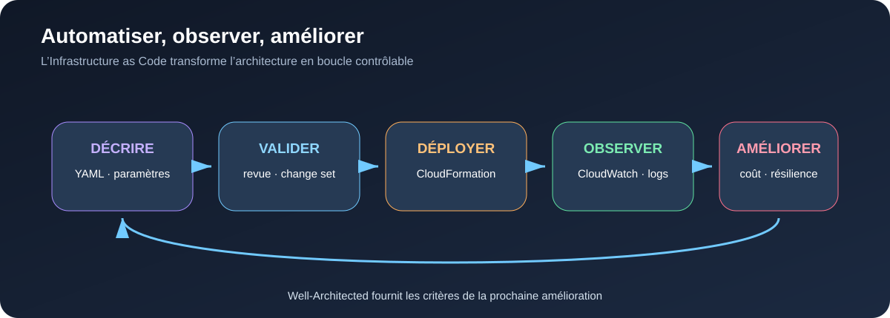

<div class="concept-check">
<strong>Réflexe d'automatisation — avant de poursuivre</strong>
<p>Un template CloudFormation déjà déployé est relancé sans aucune modification. Quel comportement recherche-t-on ?</p>
<details><summary>Afficher la réponse raisonnée</summary><p>Un résultat idempotent : l'état réel correspond déjà à l'état déclaré, donc aucune ressource supplémentaire ne doit être créée. Les changements futurs doivent être évalués avant application.</p></details>
</div>

---

## 1. RTO/RPO et Récupération de Sauvegarde

### 1.1 Définitions essentielles

Avant d'automatiser une infrastructure, il faut comprendre deux concepts critiques pour la **continuité de service** :

#### RTO (Recovery Time Objective) — Temps d'Indisponibilité Acceptable

**RTO** = **combien de temps maximum l'application peut-elle rester indisponible avant que l'impact métier devienne intolérable ?**

```
Exemples concrets :

Service                    | RTO typical | Raison
--------------------------|-------------|----------------------------------------
Site e-commerce (Amazon)   | 5 minutes   | Chaque minute sans vente = perte
Application interne (RH)   | 8 heures    | Métier critique mais moins urgent
Service vidéo (Netflix)    | 30 minutes  | Perte d'utilisateurs, mais pas urgent
Système bancaire           | 15 minutes  | Réglementation stricte
API partenaire (non-vital) | 4 heures    | Impact mineur sur le business
```

#### RPO (Recovery Point Objective) — Quantité de Données Perdable

**RPO** = **combien de données suis-je prêt à perdre en cas de sinistre ?**

```
Exemples concrets :

Application              | RPO        | Raison
------------------------|------------|----------------------------------------
E-commerce actif         | 5 minutes  | Transactions en temps réel = critique
Logs d'application       | 1 jour     | Données historiques, non urgentes
Données de client (CRM)  | 1 heure    | Important pour relancer les clients
Backups archivés         | 30 jours   | Archive long terme, peu critique
```

#### Relation RTO ↔ RPO

```
Scénario : Serveur RDS tombe en panne à 10:00

Stratégie 1 (RTO court, RPO court)
  - Sauvegarde automatique toutes les 10 minutes
  - Multi-AZ activé (failover < 2 minutes)
  - RTO = 2 minutes, RPO = 10 minutes
  - Coût : ⭐⭐⭐⭐ (cher)

Stratégie 2 (RTO moyen, RPO moyen)
  - Sauvegarde quotidienne (minuit)
  - Backup lisible rapidement (1 heure pour restaurer)
  - RTO = 1 heure, RPO = 24 heures
  - Coût : ⭐⭐ (raisonnable)

Stratégie 3 (RTO long, RPO long)
  - Sauvegarde hebdomadaire
  - Pas de failover automatique
  - RTO = 8 heures, RPO = 7 jours
  - Coût : ⭐ (très bon marché)
```

---

### 1.2 Stratégies AWS pour Atteindre RTO/RPO

| Technologie | RTO | RPO | Coût | Cas d'usage |
|-------------|-----|-----|------|-----------|
| **Multi-AZ** | < 2 min | ≈ 0 min | Moyen | Haute dispo critique |
| **Snapshots EBS** | 15-30 min | 1 jour | Faible | Backup régulier |
| **AWS Backup** | 1-4 heures | 1-24 heures | Faible-Moyen | Backup centralisé |
| **Read Replicas (RDS)** | 5-10 min | ≈ 0 min | Moyen | Failover rapide BD |
| **AWS Glacier** | 1-12 heures | Sans limite | Très faible | Archive long terme |
| **Lambda + S3** | 10-60 min | 1 heure | Très faible | Backup custom |

---

### 1.3 AWS Backup — Service Centralisé de Sauvegarde

**AWS Backup** est un **service managé** pour centraliser et automatiser les sauvegardes de ressources AWS.

#### Ressources sauvegardables par AWS Backup

```
Compute & Storage:
  ✓ Amazon EC2 instances
  ✓ Amazon EBS volumes
  ✓ Amazon EFS (Elastic File System)

Database:
  ✓ Amazon RDS databases (MySQL, PostgreSQL, Oracle, SQL Server)
  ✓ Amazon DynamoDB tables
  ✓ Amazon Aurora databases

Backup Store:
  ✓ AWS Storage Gateway
  ✓ VMware vSphere
```

#### Déployer AWS Backup via CLI

On crée d'abord un **Backup Vault** (le coffre où seront stockées les sauvegardes), puis un **Backup Plan** (la planification) avec ses règles de rétention, et enfin une **Backup Selection** (les ressources à sauvegarder). Ces trois objets forment un système complet.

```bash
# 1. Créer un Backup Vault (conteneur pour les sauvegardes)
aws backup create-backup-vault \
  --backup-vault-name mon-vault-production \
  --region eu-west-3

# Output : BackupVaultArn

# 2. Créer un Backup Plan (planification automatique)
# Sauvegarder toutes les instances EC2 chaque jour à minuit
cat > backup-plan.json << 'EOF'
{
  "BackupPlanName": "SauvegardeQuotidienne",
  "Rules": [
    {
      "RuleName": "Sauvegarde Quotidienne",
      "TargetBackupVaultName": "mon-vault-production",
      "ScheduleExpression": "cron(0 0 ? * * *)",
      "StartWindowMinutes": 60,
      "CompletionWindowMinutes": 120,
      "Lifecycle": {
        "DeleteAfterDays": 30,
        "MoveToColdStorageAfterDays": 7
      }
    }
  ]
}
EOF

# 3. Créer le plan
aws backup create-backup-plan \
  --backup-plan file://backup-plan.json \
  --region eu-west-3
```

:::success
**Résultat attendu :**
```
{
    "BackupPlanId": "a1b2c3d4-e5f6-7890-abcd-ef1234567890",
    "BackupPlanArn": "arn:aws:backup:eu-west-3:123456789012:backup-plan:a1b2c3d4-e5f6-7890-abcd-ef1234567890",
    "CreationDate": "2026-03-24T10:15:00.000Z",
    "VersionId": "NDEzMWVlNzgtMTk2My00NjMxLWJlOTYt"
}
```
:::

```bash
# 4. Assigner des ressources au plan
aws backup create-backup-selection \
  --backup-plan-id mon-plan-123 \
  --backup-selection file://selection.json \
  --region eu-west-3

# 5. Vérifier les backups créés
aws backup list-recovery-points-by-resource \
  --resource-arn "arn:aws:ec2:eu-west-3:123456789:instance/i-12345678" \
  --region eu-west-3

# 6. Restaurer une instance EC2 à partir d'un backup
aws backup start-restore-job \
  --recovery-point-arn "arn:aws:backup:eu-west-3:123456789:recovery-point:..." \
  --iam-role-arn "arn:aws:iam::123456789:role/AWSBackupDefaultRole" \
  --metadata key1=value1,key2=value2 \
  --region eu-west-3
```

:::success
**Résultat attendu :**
```
# list-recovery-points-by-resource :
{
    "RecoveryPoints": [
        {
            "RecoveryPointArn": "arn:aws:backup:eu-west-3:123456789012:recovery-point:abc123",
            "CreationDate": "2026-03-24T00:05:12.000Z",
            "Status": "COMPLETED",
            "BackupSizeInBytes": 8589934592,
            "BackupVaultName": "mon-vault-production"
        }
    ]
}

# start-restore-job :
{
    "RestoreJobId": "restore-job-0abc123def456"
}
```
:::

:::warning
**Coûts AWS Backup :** Le stockage des sauvegardes est facturé selon le volume stocké (~0,05 $/Go/mois en stockage chaud). Le déplacement vers Glacier (cold storage) réduit le coût à ~0,01 $/Go/mois après 7 jours. Vérifiez régulièrement les coûts dans **Cost Explorer** et ajustez les politiques de rétention.
:::

#### Bonnes pratiques AWS Backup

```
✓ Planifier les sauvegardes en dehors des heures de pic
✓ Utiliser des Backup Vaults séparés pour Prod/Staging/Dev
✓ Tester régulièrement les restaurations (RTO réel)
✓ Définir une rétention appropriée (30j prod, 7j dev)
✓ Combiner avec CloudWatch Events pour alertes
```

---

### 1.4 Snapshots EBS et RDS — Sauvegardes Point-in-Time

**Snapshot EBS** = photo point-in-time d'un volume EC2

Un snapshot EBS capture l'état d'un disque à un instant donné. Il est stocké dans S3 (géré par AWS) et peut servir à restaurer un volume ou à déplacer une instance vers une autre région.

```bash
# Créer un snapshot EBS manuel
aws ec2 create-snapshot \
  --volume-id vol-12345678 \
  --description "Sauvegarde avant migration" \
  --region eu-west-3

# Lister les snapshots
aws ec2 describe-snapshots \
  --owner-ids self \
  --region eu-west-3

# Créer un volume à partir du snapshot
aws ec2 create-volume \
  --snapshot-id snap-12345678 \
  --availability-zone eu-west-3a \
  --region eu-west-3
```

:::success
**Résultat attendu :**
```
# create-snapshot :
{
    "SnapshotId": "snap-0abc123def456789a",
    "VolumeId": "vol-12345678",
    "State": "pending",
    "StartTime": "2026-03-24T09:00:00.000Z",
    "Progress": "0%",
    "Description": "Sauvegarde avant migration"
}

# describe-snapshots (après quelques minutes) :
{
    "Snapshots": [
        {
            "SnapshotId": "snap-0abc123def456789a",
            "State": "completed",
            "Progress": "100%",
            "VolumeSize": 20
        }
    ]
}
```
:::

**Snapshot RDS** = sauvegarde complète de base de données

```bash
# Créer un snapshot RDS manuel
aws rds create-db-snapshot \
  --db-instance-identifier production-db \
  --db-snapshot-identifier prod-db-backup-2026-03-24 \
  --region eu-west-3

# Lister les snapshots
aws rds describe-db-snapshots \
  --region eu-west-3

# Restaurer une BD à partir d'un snapshot
aws rds restore-db-instance-from-db-snapshot \
  --db-instance-identifier production-db-restored \
  --db-snapshot-identifier prod-db-backup-2026-03-24 \
  --region eu-west-3
```

:::success
**Résultat attendu :**
```
# create-db-snapshot :
{
    "DBSnapshot": {
        "DBSnapshotIdentifier": "prod-db-backup-2026-03-24",
        "DBInstanceIdentifier": "production-db",
        "Status": "creating",
        "Engine": "mysql",
        "AllocatedStorage": 100,
        "SnapshotCreateTime": "2026-03-24T09:30:00.000Z"
    }
}

# describe-db-snapshots (après quelques minutes) :
{
    "DBSnapshots": [
        {
            "DBSnapshotIdentifier": "prod-db-backup-2026-03-24",
            "Status": "available",
            "PercentProgress": 100
        }
    ]
}
```
:::

> **Résultat attendu :** `create-db-snapshot` retourne un JSON avec le `DBSnapshotIdentifier` et le statut `creating`. Quelques minutes plus tard, `describe-db-snapshots` affiche le statut `available`. La restauration (`restore-db-instance-from-db-snapshot`) crée une **nouvelle instance** RDS — pas un remplacement de l'existante.

---

## 2. Pourquoi automatiser dans le Cloud ?

### 2.1 Le déploiement manuel : une source d'erreurs

Dans un environnement traditionnel, déployer une infrastructure peut prendre **des jours, voire des semaines**. Les équipes IT doivent :

- Commander du matériel physique
- Installer les systèmes d'exploitation
- Configurer le réseau et les accès
- Mettre à jour les pare-feu et les politiques de sécurité
- Documenter tous les changements (quand c'est fait...)

**Le problème** : chaque déploiement manuel génère des **incohérences**. Deux administrateurs ne font jamais exactement la même chose. Certains oublis passent inaperçus :

```
Infrastructure créée manuellement :
  Admin Alice crée un VPC le 10 janvier
  → Configure 2 subnets, 1 IGW, 1 NAT Gateway
  → Oublie de documenter les CIDR utilisés
  → Quitte l'entreprise 6 mois après

  Admin Bob doit dépliquer l'infrastructure
  → Cherche la documentation (introuvable)
  → Recrée un nouveau VPC similaire MAIS différent
  → Incompatibilité lors du peering : PERTE DE TEMPS

Résultat : deux "mêmes" infrastructures qui ne sont PAS identiques
```

---

### 2.2 L'automatisation dans le Cloud : standardisation et rapidité

Dans le cloud AWS, l'**automatisation** permet de :

- **Standardiser** les environnements → Prod et Dev sont identiques
- **Réduire** les délais de déploiement → Quelques minutes au lieu de semaines
- **Limiter** les erreurs humaines → Le code est testé avant déploiement
- **Faciliter** la montée en charge → Spawner 100 instances avec un clic

```
Infrastructure automatisée avec CloudFormation :
  Jour 1 : Écrire un template YAML (1-2 heures)
  Jour 2 : Déployer en Prod exactement identique au Dev (2 minutes)
  Jour 3 : Déployer en Test (2 minutes)
  Jour 4 : Dépliquer pour un client différent (2 minutes)

  Avantage : zéro divergence entre les environnements
            zéro oubli de configuration
            traçabilité complète (versionning Git du template)
```

---

### 2.3 Les outils AWS pour l'automatisation

| Outil | Fonction | Cas d'usage |
|-------|----------|-----------|
| **CloudFormation** | Déploiement d'infrastructures as code (IaC) | Créer VPC, EC2, RDS, S3 en une seule opération |
| **Quick Starts** | Templates CloudFormation préconfigurés par AWS | Déployer rapidement une architecture éprouvée (VPC + ELB + RDS) |
| **Systems Manager** | Gestion centralisée et automatisation opérationnelle | Exécuter des scripts, patcher les serveurs, inventorier les ressources |
| **Elastic Beanstalk** | Déploiement PaaS simplifié d'applications web | Déployer une app Node.js sans gérer l'infrastructure |
| **CLI / SDK** | Automatisation par scripts et développement | Orchestrer plusieurs services AWS via Python/Bash |

> **Référence** : [AWS Automation Overview](https://aws.amazon.com/automation/)
> **Référence** : [AWS CloudFormation Documentation](https://docs.aws.amazon.com/AWSCloudFormation/latest/UserGuide/Welcome.html)

---
### 2.4 AWS Quick Starts — Templates Éprouvés

**AWS Quick Starts** sont des **templates CloudFormation préconfigurés et validés par AWS** pour déployer des architectures complètes en quelques clics.

#### Qu'est-ce qu'un Quick Start ?

```
Quick Start = CloudFormation template complet + documentation + bonnes pratiques

Exemplar :
  - Déployer une architecture WordPress hautement disponible
    (VPC + ALB + Auto Scaling + RDS Multi-AZ + CloudFront)
  - Sans avoir à écrire 500 lignes YAML
  - Basé sur des best practices AWS
  - Testé et validé en production
```

#### Quick Starts courants (exemples)

| Quick Start | Qu'il déploie | Temps |
|-------------|---------------|-------|
| **WordPress on AWS** | VPC, ALB, Auto Scaling, RDS, CloudFront | 10-15 min |
| **Kubernetes on AWS** | EKS cluster complet avec worker nodes | 20-30 min |
| **SQL Server on EC2** | Instance EC2 + RDS SQL Server + backup | 15 min |
| **Jenkins on AWS** | Jenkins Master + Agent instances + monitoring | 10 min |
| **Hadoop on AWS** | Cluster EMR complet multi-node | 20 min |

**EKS** (Elastic Kubernetes Service, déjà présenté au Chapitre 1 section 5) est le service AWS de Kubernetes managé. **Hadoop** est un framework open source historique de traitement de données massives (Big Data) : il répartit le calcul et le stockage sur un grand nombre de machines pour traiter des volumes trop importants pour un seul serveur. **EMR** (Elastic MapReduce) est le service managé AWS qui déploie et exploite des clusters Hadoop (ainsi que des outils compatibles comme Spark) sans que vous ayez à installer et administrer vous-même les serveurs du cluster.

#### Accéder aux Quick Starts

Les Quick Starts sont accessibles depuis la console CloudFormation ou directement via CLI. Voici comment les trouver et les utiliser :

```bash
# 1. Via la console AWS → CloudFormation → Quick Starts
#    https://aws.amazon.com/quickstarts/

# 2. Chercher un Quick Start par domaine :
#    - VPC / Networking
#    - Databases & Analytics
#    - Business Applications
#    - DevOps Tools

# 3. Cliquer sur "Launch" → remplir les paramètres → Create Stack
```

#### Avantages des Quick Starts

```
✓ Gain de temps : architecture complète en 15 min au lieu de 3-4 heures
✓ Bonnes pratiques : design conforme au Well-Architected Framework
✓ Haute disponibilité : Multi-AZ, load balancing, failover automatique
✓ Maintenance : AWS met à jour les templates régulièrement
✓ Support : documentation et troubleshooting fournis
✓ Flexibilité : vous pouvez modifier les templates après déploiement
```

#### Exemple : Déployer WordPress via Quick Start

Plutôt que de créer manuellement VPC, ALB, RDS et Auto Scaling, on lance une seule commande CloudFormation qui déploie toute l'architecture WordPress en ~10 minutes :

```bash
# 2. Chercher "WordPress"
# 3. Cliquer sur "Launch Quick Start"
# 4. Remplir les paramètres (taille VPC, taille RDS, DNS, etc.)
# 5. Vérifier les options VPC et subnet
# 6. Cliquer "Create Stack"
# 7. Attendre ~10 minutes
# 8. CloudFormation affiche l'URL du site WordPress

# Vous pouvez aussi utiliser AWS CLI :
aws cloudformation create-stack \
  --stack-name wordpress-production \
  --template-url "https://s3.amazonaws.com/quickstart-reference/wordpress/latest/templates/wordpress.yaml" \
  --parameters \
    ParameterKey=KeyName,ParameterValue=ma-clé-ssh \
    ParameterKey=InstanceType,ParameterValue=t3.small \
    ParameterKey=DBInstanceClass,ParameterValue=db.t3.micro \
  --region eu-west-3
```

:::success
**Résultat attendu :**
```json
{
    "StackId": "arn:aws:cloudformation:eu-west-3:123456789012:stack/wordpress-production/a1b2c3d4-e5f6-7890-abcd-ef1234567890"
}
```
La stack `wordpress-production` est en cours de création. Suivez la progression dans la console CloudFormation → Events, ou via `aws cloudformation describe-stack-events --stack-name wordpress-production`. Après ~10 minutes, le statut passe à `CREATE_COMPLETE` et l'URL WordPress est disponible dans les outputs de la stack.
:::

---


## 3. AWS CloudFormation — Infrastructure as Code

### 3.1 Qu'est-ce que CloudFormation ?

**AWS CloudFormation** est un service qui permet de **modéliser et déployer des ressources AWS** sous forme de code.

Plutôt que de créer manuellement une VPC, des sous-réseaux, des groupes de sécurité ou des instances EC2 dans la console, on les **décrit dans un template JSON ou YAML** et CloudFormation s'occupe du reste.

```
Analogie : CloudFormation est comme une RECETTE DE CUISINE pour construire une infrastructure

Recette classique :
  Ingrédients : 1 VPC, 2 subnets, 1 IGW, 3 EC2
  Étapes :
    1. Créer la VPC avec CIDR 10.0.0.0/16
    2. Créer subnet public 10.0.1.0/24
    3. Créer subnet privé 10.0.2.0/24
    4. Ajouter une IGW et l'attacher à la VPC
    5. Créer 3 instances EC2 dans le subnet public
    6. Configurer les groupes de sécurité

Avantage : la recette peut être réutilisée 100 fois identiquement
          et versionnée dans Git
```

---

### 3.2 Fonctionnement simplifié de CloudFormation

1. **Rédiger un template** (JSON/YAML) décrivant les ressources à créer
2. **Créer une stack** dans CloudFormation (via console ou CLI)
3. **AWS provisionne** toutes les ressources **dans le bon ordre** (résout les dépendances automatiquement)
4. **Mettre à jour** la stack pour faire évoluer l'infrastructure (ajout, suppression, modification de ressources)
5. **Supprimer** la stack si plus besoin (CloudFormation supprime toutes les ressources associées)

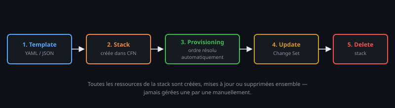

---

### 3.3 Exemple simple de template CloudFormation (YAML)

Voici un template minimaliste créant une VPC, un subnet, et une instance EC2 :

```yaml
# Version du format CloudFormation (toujours 2010-09-09)
AWSTemplateFormatVersion: '2010-09-09'

# Description brève du template
Description: |
  Infrastructure AWS simple pour débutants
  Crée une VPC, un subnet public, une IGW et une instance EC2

# Paramètres (permet de rendre le template réutilisable)
# Ici, on paramètre le type d'instance EC2 pour pouvoir changer facilement
Parameters:
  InstanceType:
    Type: String
    Default: t2.micro
    Description: Type d'instance EC2 (t2.micro, t2.small, etc.)
    AllowedValues:
      - t2.micro
      - t2.small
      - t3.micro

# Les ressources à créer
Resources:
  # Ressource 1 : Créer une VPC
  # Chaque ressource a un identifiant logique (MonVPC) et un type AWS
  MonVPC:
    # Type de ressource AWS
    Type: AWS::EC2::VPC
    # Propriétés spécifiques
    Properties:
      # CIDR block : plage d'adresses IP pour cette VPC
      CidrBlock: 10.0.0.0/16
      # Activer le hostname DNS
      EnableDnsHostnames: true
      # Tags pour identifier facilement
      Tags:
        - Key: Name
          Value: MonVPC-Formation

  # Ressource 2 : Créer un subnet public dans la VPC
  # !Ref est une fonction intrinsèque qui referéce une autre ressource
  MonSubnetPublic:
    Type: AWS::EC2::Subnet
    Properties:
      # !Ref MonVPC = ID logique de la VPC créée au-dessus
      VpcId: !Ref MonVPC
      # Plage d'adresses pour ce subnet (doit être dans le CIDR de la VPC)
      CidrBlock: 10.0.1.0/24
      # Zone de disponibilité (peut varier, AWS en assigne une par défaut)
      AvailabilityZone: eu-west-1a
      # Assigner automatiquement une IP publique aux instances
      MapPublicIpOnLaunch: true
      Tags:
        - Key: Name
          Value: MonSubnet-Public

  # Ressource 3 : Créer une Internet Gateway (permet l'accès à Internet)
  MonIGW:
    Type: AWS::EC2::InternetGateway
    Properties:
      Tags:
        - Key: Name
          Value: MonIGW

  # Ressource 4 : Attacher l'IGW à la VPC
  # CloudFormation comprend automatiquement que cette ressource dépend de MonVPC et MonIGW
  AttachIGW:
    Type: AWS::EC2::VPCGatewayAttachment
    Properties:
      # Référence à la VPC créée
      VpcId: !Ref MonVPC
      # Référence à l'IGW créé
      InternetGatewayId: !Ref MonIGW

  # Ressource 5 : Groupe de sécurité (pare-feu simplifié)
  MonSecurityGroup:
    Type: AWS::EC2::SecurityGroup
    Properties:
      # Description obligatoire
      GroupDescription: Autorise SSH et HTTP
      # Associer au VPC
      VpcId: !Ref MonVPC
      # Règles de trafic entrant
      SecurityGroupIngress:
        # Permettre SSH depuis n'importe quelle IP (⚠️ À ÉVITER EN PROD)
        - IpProtocol: tcp
          FromPort: 22
          ToPort: 22
          CidrIp: 0.0.0.0/0
          Description: SSH access
        # Permettre HTTP
        - IpProtocol: tcp
          FromPort: 80
          ToPort: 80
          CidrIp: 0.0.0.0/0
          Description: HTTP access
      Tags:
        - Key: Name
          Value: MonSG-Formation

  # Ressource 6 : Instance EC2
  MonInstance:
    Type: AWS::EC2::Instance
    Properties:
      # AMI ID (Ubuntu 24.04 LTS en eu-west-1)
      ImageId: ami-0d71ea30463e0ff8d
      # Type d'instance (utilise le paramètre défini au-dessus)
      InstanceType: !Ref InstanceType
      # Placer dans le subnet créé
      SubnetId: !Ref MonSubnetPublic
      # Associer le security group
      SecurityGroupIds:
        - !Ref MonSecurityGroup
      # Script à exécuter au démarrage (user data)
      UserData:
        Fn::Base64: |
          #!/bin/bash
          # Mises à jour système
          apt-get update
          apt-get install -y nginx curl
          # Démarrer Nginx
          systemctl start nginx
          systemctl enable nginx
          # Créer une page de test
          echo "<h1>Bonjour du serveur créé par CloudFormation</h1>" > /var/www/html/index.html
      Tags:
        - Key: Name
          Value: MonServeur-Formation

# Outputs : affiche les résultats après déploiement
# Utile pour récupérer les IP, URLs, etc.
Outputs:
  # Affiche l'ID de la VPC créée
  VPCId:
    Description: ID de la VPC
    # !Ref récupère l'ID physique de la ressource
    Value: !Ref MonVPC
    # Export permet à d'autres stacks de référencer cette valeur
    Export:
      Name: MonVPC-Id

  # Affiche l'IP publique de l'instance
  PublicIP:
    Description: Adresse IP publique de l'instance EC2
    # !GetAtt récupère un attribut spécifique d'une ressource
    Value: !GetAtt MonInstance.PublicIp
    Export:
      Name: MonServeur-PublicIP

  # Affiche l'URL HTTP pour accéder au serveur
  WebServerURL:
    Description: URL pour accéder au serveur web
    # !Sub remplace les variables ${...} par leurs valeurs
    Value: !Sub 'http://${MonInstance.PublicIp}'
```

---
##### 3.3 (suite) — Exemple Production : VPC + Serveur Web Apache

Voici un template **production-ready** déployant une **VPC complète avec serveur web Apache** et un Security Group. C'est le template utilisé dans les ateliers Dawan.

```yaml
AWSTemplateFormatVersion: '2010-09-09'
Description: |
  Déploiement d'une VPC + serveur web Apache via CloudFormation
  - VPC avec CIDR 10.0.0.0/16
  - 1 subnet public (10.0.1.0/24)
  - Internet Gateway + route vers l'extérieur
  - Security Group (SSH + HTTP)
  - Instance EC2 t3.micro avec Apache2 automatiquement installé
  - Output : URL publique du serveur web

# Paramètres pour rendre le template réutilisable
Parameters:
  KeyPairName:
    Type: AWS::EC2::KeyPair::KeyName
    Description: Nom de la paire de clés EC2 existante (pour SSH)
  
  InstanceType:
    Type: String
    Default: t3.micro
    AllowedValues:
      - t3.micro
      - t3.small
      - t2.micro
    Description: Type d'instance EC2

# Les ressources à créer
Resources:
  # VPC
  FormationVPC:
    Type: AWS::EC2::VPC
    Properties:
      CidrBlock: 10.0.0.0/16
      EnableDnsSupport: true
      EnableDnsHostnames: true
      Tags:
        - Key: Name
          Value: Formation-VPC-WebLab

  # Subnet public
  PublicSubnet:
    Type: AWS::EC2::Subnet
    Properties:
      VpcId: !Ref FormationVPC
      CidrBlock: 10.0.1.0/24
      AvailabilityZone: eu-west-3a
      MapPublicIpOnLaunch: true
      Tags:
        - Key: Name
          Value: Formation-Subnet-Public

  # Internet Gateway
  InternetGateway:
    Type: AWS::EC2::InternetGateway
    Properties:
      Tags:
        - Key: Name
          Value: Formation-IGW

  # Attacher IGW à la VPC
  AttachGateway:
    Type: AWS::EC2::VPCGatewayAttachment
    Properties:
      VpcId: !Ref FormationVPC
      InternetGatewayId: !Ref InternetGateway

  # Table de routage publique
  PublicRouteTable:
    Type: AWS::EC2::RouteTable
    Properties:
      VpcId: !Ref FormationVPC
      Tags:
        - Key: Name
          Value: Formation-PublicRouteTable

  # Route vers l'IGW (tout ce qui va en dehors du VPC)
  PublicRoute:
    Type: AWS::EC2::Route
    DependsOn: AttachGateway
    Properties:
      RouteTableId: !Ref PublicRouteTable
      DestinationCidrBlock: 0.0.0.0/0
      GatewayId: !Ref InternetGateway

  # Associer la route table au subnet
  SubnetRouteTableAssociation:
    Type: AWS::EC2::SubnetRouteTableAssociation
    Properties:
      SubnetId: !Ref PublicSubnet
      RouteTableId: !Ref PublicRouteTable

  # Security Group (pare-feu)
  WebServerSecurityGroup:
    Type: AWS::EC2::SecurityGroup
    Properties:
      GroupDescription: Permettre HTTP et SSH
      VpcId: !Ref FormationVPC
      SecurityGroupIngress:
        # SSH (port 22) - accès depuis n'importe où (⚠️ en production : limiter à votre IP)
        - IpProtocol: tcp
          FromPort: 22
          ToPort: 22
          CidrIp: 0.0.0.0/0
          Description: SSH access
        # HTTP (port 80) - serveur web public
        - IpProtocol: tcp
          FromPort: 80
          ToPort: 80
          CidrIp: 0.0.0.0/0
          Description: HTTP web server
      Tags:
        - Key: Name
          Value: Formation-WebServerSG

  # Instance EC2
  WebServerInstance:
    Type: AWS::EC2::Instance
    Properties:
      ImageId: ami-04a92520784b94538  # Amazon Linux 2023 (eu-west-3)
      InstanceType: !Ref InstanceType
      KeyName: !Ref KeyPairName
      SubnetId: !Ref PublicSubnet
      SecurityGroupIds:
        - !Ref WebServerSecurityGroup
      # Script pour configurer Apache2
      UserData:
        Fn::Base64: !Sub |
          #!/bin/bash
          # Mise à jour du système
          yum update -y
          
          # Installer Apache HTTP Server
          yum install -y httpd
          
          # Activer et démarrer Apache
          systemctl enable httpd
          systemctl start httpd
          
          # Créer une page HTML de test
          cat > /var/www/html/index.html << 'ENDHTML'
          <!DOCTYPE html>
          <html>
          <head>
              <title>CloudFormation - Formation AWS</title>
              <style>
                  body { font-family: Arial, sans-serif; margin: 40px; }
                  h1 { color: #FF9900; }
              </style>
          </head>
          <body>
              <h1>Bienvenue sur votre serveur web CloudFormation!</h1>
              <p>Cette instance EC2 a été déployée automatiquement via CloudFormation.</p>
              <p><strong>Informations serveur :</strong></p>
              <ul>
                  <li>Instance ID : ${AWS::StackId}</li>
                  <li>Région : ${AWS::Region}</li>
                  <li>Instance Type : ${InstanceType}</li>
              </ul>
          </body>
          </html>
          ENDHTML
      
      Tags:
        - Key: Name
          Value: Formation-WebServer

# Outputs - affiche les résultats utiles après déploiement
Outputs:
  WebServerURL:
    Description: URL publique du serveur web
    Value: !Sub 'http://${WebServerInstance.PublicDnsName}'
    Export:
      Name: !Sub '${AWS::StackName}-WebServerURL'
  
  WebServerPublicIP:
    Description: Adresse IP publique de l'instance
    Value: !Sub '${WebServerInstance.PublicIp}'
  
  SSHCommand:
    Description: Commande SSH pour se connecter au serveur
    Value: !Sub 'ssh -i /chemin/vers/cle.pem ec2-user@${WebServerInstance.PublicDnsName}'
  
  SecurityGroupId:
    Description: ID du Security Group
    Value: !Ref WebServerSecurityGroup
```

##### Déployer ce template

:::info
Une activité pratique permet d’approfondir le déploiement de ce template CloudFormation.
:::

```bash
# 1. Créer la stack depuis le fichier YAML local
aws cloudformation create-stack \
  --stack-name formation-webserver-lab \
  --template-body file://vpc-webserver.yaml \
  --parameters \
    ParameterKey=KeyPairName,ParameterValue=ma-clé-ssh \
    ParameterKey=InstanceType,ParameterValue=t3.micro \
  --region eu-west-3

# Attendre que la stack soit créée (statut CREATE_COMPLETE)
aws cloudformation wait stack-create-complete \
  --stack-name formation-webserver-lab \
  --region eu-west-3

# 2. Récupérer l'URL publique du serveur
aws cloudformation describe-stacks \
  --stack-name formation-webserver-lab \
  --query 'Stacks[0].Outputs[?OutputKey==`WebServerURL`].OutputValue' \
  --output text \
  --region eu-west-3

# Output : http://ec2-12-34-56-78.eu-west-3.compute.amazonaws.com
# → Ouvrir cette URL dans un navigateur pour voir le serveur Apache

# 3. Supprimer toute l'infrastructure quand vous avez terminé
aws cloudformation delete-stack \
  --stack-name formation-webserver-lab \
  --region eu-west-3

# Attendre la suppression complète
aws cloudformation wait stack-delete-complete \
  --stack-name formation-webserver-lab \
  --region eu-west-3
```

:::success
**Résultat attendu :**
```
# create-stack :
{
    "StackId": "arn:aws:cloudformation:eu-west-3:123456789012:stack/formation-webserver-lab/b2c3d4e5-f6a7-8901-bcde-f12345678901"
}

# (après wait stack-create-complete — ~3 à 5 minutes)
# describe-stacks → WebServerURL :
http://ec2-15-236-78-42.eu-west-3.compute.amazonaws.com

# Le navigateur affiche la page HTML avec "Bienvenue sur votre serveur web CloudFormation!"
```
:::

:::warning
**IAM requis pour CloudFormation :** Pour déployer ce template, l'utilisateur (ou le rôle IAM) doit avoir les permissions de créer des ressources EC2, VPC, Security Groups. En entreprise, créer un rôle IAM dédié `CloudFormationDeployRole` avec les permissions nécessaires, plutôt que d'utiliser un compte admin.
:::

:::danger
**`delete-stack` supprime toutes les ressources :** La commande `delete-stack` détruit la VPC, le subnet, l'IGW, le Security Group ET l'instance EC2 de manière irréversible. Toutes les données stockées sur l'instance EBS seront perdues. Toujours vérifier `--stack-name` avant d'exécuter.
:::

##### Points clés de ce template production

| Élément | Explication | Bonne pratique |
|---------|------------|----------------|
| **VPC CIDR 10.0.0.0/16** | Classe privée standard pour les VPC | Utiliser RFC 1918 (10.x, 172.16.x, 192.168.x) |
| **Subnet 10.0.1.0/24** | Plage de 251 adresses disponibles | Laisser de l'espace pour futurs subnets |
| **IGW + Route 0.0.0.0/0** | Rend le subnet public et accessible d'Internet | Nécessaire pour un serveur web public |
| **Security Group restrictif** | HTTP (80) + SSH (22) explicites | En prod : limiter SSH à des IPs spécifiques |
| **UserData script** | Configure Apache automatiquement au lancement | Évite la configuration manuelle post-lancement |
| **Outputs** | Affiche l'URL et l'IP après déploiement | Indispensable pour que l'utilisateur sache comment accéder |
| **Tags** | Identification et traçabilité | Permet le suivi des ressources pour la facturation |

---


### 3.4 Déployer le template avec AWS CLI

Une fois le template rédigé, on peut le déployer depuis la ligne de commande :

:::info
**Valider le template avant déploiement :** Avant de créer une stack, il est conseillé de valider la syntaxe YAML avec `aws cloudformation validate-template --template-body file://mon-fichier.yaml`. Cette commande vérifie la syntaxe mais pas la validité des valeurs (AMI ID, type d'instance, etc.).
:::

```bash
# 1. Créer la stack (remplacer mon-fichier.yaml par le chemin réel)
aws cloudformation create-stack \
  --stack-name ma-premiere-stack \
  --template-body file://mon-fichier.yaml \
  --parameters ParameterKey=InstanceType,ParameterValue=t2.micro \
  --region eu-west-1

# Résultat attendu : StackId
# Output : arn:aws:cloudformation:eu-west-1:123456789:stack/ma-premiere-stack/guid

# 2. Suivre la progression du déploiement
aws cloudformation describe-stack-events \
  --stack-name ma-premiere-stack \
  --region eu-west-1

# 3. Une fois CREATE_COMPLETE, afficher les outputs
aws cloudformation describe-stacks \
  --stack-name ma-premiere-stack \
  --query 'Stacks[0].Outputs' \
  --region eu-west-1

# 4. Pour mettre à jour la stack (ex. changer le type d'instance)
aws cloudformation update-stack \
  --stack-name ma-premiere-stack \
  --template-body file://mon-fichier.yaml \
  --parameters ParameterKey=InstanceType,ParameterValue=t2.small \
  --region eu-west-1

# 5. Supprimer la stack (attention : cela supprime TOUTES les ressources)
aws cloudformation delete-stack \
  --stack-name ma-premiere-stack \
  --region eu-west-1
```

:::success
**Résultat attendu :**
```
# create-stack :
{
    "StackId": "arn:aws:cloudformation:eu-west-1:123456789012:stack/ma-premiere-stack/a1b2c3d4-e5f6-7890-abcd-ef1234567890"
}

# describe-stack-events (extrait) :
{
    "StackEvents": [
        {
            "StackId": "arn:aws:cloudformation:eu-west-1:...",
            "EventId": "...",
            "ResourceStatus": "CREATE_COMPLETE",
            "ResourceType": "AWS::EC2::Instance",
            "LogicalResourceId": "MonInstance",
            "Timestamp": "2026-03-24T10:32:15.000Z"
        },
        {
            "ResourceStatus": "CREATE_COMPLETE",
            "ResourceType": "AWS::CloudFormation::Stack",
            "LogicalResourceId": "ma-premiere-stack"
        }
    ]
}

# describe-stacks (Outputs) :
[
    {
        "OutputKey": "PublicIP",
        "OutputValue": "54.12.34.56",
        "Description": "Adresse IP publique de l'instance EC2"
    },
    {
        "OutputKey": "WebServerURL",
        "OutputValue": "http://54.12.34.56",
        "Description": "URL pour accéder au serveur web"
    }
]
```
:::

:::danger
**Attention — `delete-stack` supprime TOUTES les ressources !** La commande `aws cloudformation delete-stack` détruit définitivement toutes les ressources créées par la stack (instances EC2, VPC, RDS, S3…). Il n'y a pas de corbeille. Assurez-vous d'avoir des sauvegardes et de cibler la bonne stack avant d'exécuter cette commande.
:::

---

### 3.5 Avantages de CloudFormation

| Avantage | Bénéfice pédagogique |
|----------|----------------------|
| **Automation complète** | Créer/détruire une infrastructure complexe en quelques minutes |
| **Gestion des dépendances** | CloudFormation sait que l'IGW doit être créée AVANT d'être attachée à la VPC |
| **Versionning** | Stocker les templates dans Git, tracer tous les changements |
| **Reproductibilité** | Déployer exactement la même infrastructure en 10 environnements différents |
| **Rollback** | Si une erreur survient, CloudFormation annule les changements automatiquement |
| **Coût** | CloudFormation est gratuit (on paie seulement les ressources créées) |

:::warning
**CloudFormation Drift — Divergence de configuration :** Si vous modifiez manuellement des ressources gérées par CloudFormation (via la console ou la CLI), elles entrent en état de **drift** — elles ne correspondent plus au template. CloudFormation ne détecte pas ces écarts automatiquement. Utilisez `aws cloudformation detect-stack-drift --stack-name <nom>` pour identifier les ressources divergentes. Règle d'or : **ne jamais modifier manuellement une ressource gérée par CloudFormation**.
:::

> **Référence** : [CloudFormation Template Reference](https://docs.aws.amazon.com/AWSCloudFormation/latest/UserGuide/template-reference.html)

---

## 4. AWS Systems Manager — Automatisation opérationnelle

### 4.1 Qu'est-ce que Systems Manager ?

**AWS Systems Manager (SSM)** est un service d'**administration centralisée** et d'**automatisation opérationnelle** pour les ressources AWS et hybrides.

Il remplace le service obsolète **OpsWorks** et fournit des outils modernes pour :

- Exécuter des **scripts à distance** sur des instances EC2 (**Run Command**)
- **Patcher** automatiquement les systèmes (**Patch Manager**)
- Stocker des **configurations centralisées** (**Parameter Store**)
- Automatiser des **tâches complexes** (**Automation Documents**)
- Collectionner un **inventaire** de toutes les ressources (**Inventory**)

```
Analogie : Systems Manager est comme un TABLEAU DE CONTRÔLE À DISTANCE

Avant (sans SSM) :
  Admin doit se connecter à chaque serveur manuellement :
    ssh ubuntu@10.0.1.100
    ssh ubuntu@10.0.1.101
    ssh ubuntu@10.0.1.102
    ... exécuter la même commande 100 fois

Avec Systems Manager Run Command :
  Admin exécute UNE SEULE commande :
    aws ssm send-command --document-name "AWS-RunShellScript" \
                          --parameters commands=["apt-get update"]
  → Appliquée automatiquement à 100 instances simultaneously
```

---

### 4.2 Fonctionnalités clés de Systems Manager

#### Run Command — Exécuter des scripts à distance

**Run Command** permet d'exécuter des scripts sans accès SSH direct.

**Prérequis** :
- Instance EC2 doit avoir le rôle IAM `AmazonSSMManagedInstanceCore`
- L'agent SSM est pré-installé sur les AMI récentes

```bash
# Exemple : Installer Apache HTTP Server sur 5 instances
aws ssm send-command \
  --instance-ids i-12345 i-67890 i-abcde i-fghij i-klmno \
  --document-name "AWS-RunShellScript" \
  --parameters 'commands=[
    "apt-get update",
    "apt-get install -y apache2",
    "systemctl start apache2",
    "systemctl enable apache2"
  ]'

# Résultat : les 5 instances exécutent les commandes EN PARALLÈLE
# Voir les résultats dans CloudWatch Logs ou via CLI :
aws ssm get-command-invocation \
  --command-id <command-id> \
  --instance-id i-12345
```

:::success
**Résultat attendu :**
```
# send-command :
{
    "Command": {
        "CommandId": "a1b2c3d4-e5f6-7890-abcd-ef1234567890",
        "DocumentName": "AWS-RunShellScript",
        "Status": "Pending",
        "TargetCount": 5,
        "CompletedCount": 0
    }
}

# get-command-invocation (après exécution) :
{
    "CommandId": "a1b2c3d4-e5f6-7890-abcd-ef1234567890",
    "InstanceId": "i-12345",
    "Status": "Success",
    "StatusDetails": "Success",
    "StandardOutputContent": "Reading package lists...\nBuilding dependency tree...\nThe following NEW packages will be installed: apache2\nSetting up apache2 (2.4.52-1ubuntu4)...\n",
    "StandardErrorContent": ""
}
```
:::

> **Résultat attendu :** `send-command` retourne un `CommandId`. `get-command-invocation` affiche le `Status` (`InProgress` → `Success`) et les `StandardOutputContent` avec la sortie de chaque commande exécutée sur l'instance.

---

#### Parameter Store — Stocker des configurations centralisées

**Parameter Store** permet de stocker des variables (secrets, chemins d'accès, configurations) de manière centralisée. L'avantage clé : vos applications lisent leurs secrets via l'API SSM, sans jamais avoir de valeur en clair dans le code ou un fichier `.env`.

```bash
# Stocker un secret (ex. mot de passe database)
aws ssm put-parameter \
  --name /prod/database/password \
  --value "SecurePassword123!" \
  --type "SecureString" \
  --description "Mot de passe RDS pour production"

# Récupérer la valeur dans une application
aws ssm get-parameter \
  --name /prod/database/password \
  --with-decryption

# Stocker une configuration simple
aws ssm put-parameter \
  --name /app/api-url \
  --value "https://api.example.com" \
  --type "String"
```

:::success
**Résultat attendu :**
```
# put-parameter :
{
    "Version": 1,
    "Tier": "Standard"
}

# get-parameter (avec --with-decryption) :
{
    "Parameter": {
        "Name": "/prod/database/password",
        "Type": "SecureString",
        "Value": "SecurePassword123!",
        "Version": 1,
        "LastModifiedDate": "2026-03-24T10:00:00.000Z",
        "ARN": "arn:aws:ssm:eu-west-3:123456789012:parameter/prod/database/password",
        "DataType": "text"
    }
}
```
:::

> **Résultat attendu :** `put-parameter` retourne un numéro de version (`"Version": 1`). `get-parameter` retourne le JSON avec `"Value"` déchiffré (grâce à `--with-decryption`). Sans ce flag, `SecureString` serait masqué.

---

#### Session Manager — Accès shell sécurisé sans SSH

**Session Manager** permet de se connecter à une instance EC2 **sans port SSH ouvert**, via la console AWS ou CLI. C'est la méthode recommandée pour accéder aux instances en production — zéro clé SSH à gérer, audit complet automatique.

```bash
# Démarrer une session interactive sur une instance
aws ssm start-session \
  --target i-12345

# AWS configure le tunnel securely et vous connecte au shell
```

:::success
**Résultat attendu :**
```
Starting session with SessionId: stagiaire-demo-0abc123def456789
sh-4.2$
```
Un shell bash s'ouvre directement sur l'instance sans passer par SSH. Toutes les commandes saisies sont journalisées dans CloudTrail. Si la commande échoue avec `TargetNotConnected`, vérifiez que l'agent SSM est actif (`systemctl status amazon-ssm-agent`) et que le rôle IAM `AmazonSSMManagedInstanceCore` est attaché à l'instance.
:::

> **Note :** Un shell bash s'ouvre sur l'instance (`sh-4.2$`). Toutes les commandes sont journalisées dans CloudTrail. Si la commande échoue avec `TargetNotConnected`, vérifiez que l'agent SSM est actif et que le rôle IAM `AmazonSSMManagedInstanceCore` est attaché à l'instance.

**Avantages** :
- Pas besoin d'ouvrir le port 22 → Sécurité renforcée
- Audit complet des sessions dans CloudTrail
- Gestion centralisée des accès via IAM

---

#### Patch Manager — Appliquer les mises à jour automatiquement

**Patch Manager** scanne les instances et applique les patchs de sécurité/OS. On définit d'abord une **Patch Baseline** (quels patchs approuver et dans quel délai), puis on associe cette baseline aux instances.

```bash
# Scanner les instances pour les mises à jour manquantes
aws ssm describe-instance-patches \
  --instance-id i-12345

# Créer un plan de patch automatique
aws ssm create-patch-baseline \
  --name "MonLieuxPatchLineMonthly" \
  --operating-system "UBUNTU" \
  --approval-rules 'PatchRules=[{PatchFilterGroup={PatchFilters=[{Key=CLASSIFICATION,Values=[SECURITY,BUGFIX]}]},ApproveAfterDays=7}]'
```

:::success
**Résultat attendu :**
```
# describe-instance-patches :
{
    "Patches": [
        {
            "Title": "linux-aws-headers-5.15.0-1056",
            "KBId": "USN-6819-1",
            "Classification": "SECURITY",
            "Severity": "Important",
            "State": "Missing",
            "InstalledTime": null
        },
        {
            "Title": "libssl3",
            "Classification": "SECURITY",
            "Severity": "Critical",
            "State": "Missing"
        }
    ]
}

# create-patch-baseline :
{
    "BaselineId": "pb-0abc123def456789a",
    "Name": "MonLieuxPatchLineMonthly",
    "OperatingSystem": "UBUNTU",
    "CreatedDate": "2026-03-24T10:00:00.000Z"
}
```
:::

> **Résultat attendu :** `describe-instance-patches` liste les patchs manquants avec leur sévérité (`Critical`, `Important`…). `create-patch-baseline` retourne un `BaselineId` (ex. `pb-0abc123`). Cette baseline s'applique ensuite via une **Maintenance Window** planifiée.

> **Référence** : [AWS Systems Manager Documentation](https://docs.aws.amazon.com/systems-manager/)

---
### 4.3 AWS OpsWorks — Gestion de configuration avec Chef et Puppet (Contexte Historique)

#### 🚫 Important : AWS OpsWorks en fin de vie

**AWS OpsWorks** était un service de **gestion de configuration** basé sur les outils open source **Chef** et **Puppet**. Depuis 2023, AWS recommande **fortement** de migrer vers **AWS Systems Manager** pour les nouvelles infrastructures.

**Statut actuel :**
- ❌ OpsWorks for Chef Automate : **fin de vie et désactivé depuis le 5 mai 2024**
- ❌ OpsWorks for Puppet Enterprise : **fin de vie et désactivé depuis le 5 mai 2024**
- ❌ OpsWorks Stacks : **fin de vie et désactivé depuis le 26 mai 2024**

#### Qu'était AWS OpsWorks ?

OpsWorks permettait de **déployer et configurer des applications** sur des instances EC2 en utilisant des **scripts de configuration déclaratifs** :


#### Migration depuis OpsWorks vers Systems Manager

Si vous héritez d'une infrastructure avec OpsWorks :

```bash
# 1. Exporter les recipes Chef / configurations Puppet
#    → Convertir en shell scripts / PowerShell pour Systems Manager

# 2. Utiliser Systems Manager Run Command pour exécuter les scripts
aws ssm send-command \
  --instance-ids i-12345678 \
  --document-name "AWS-RunShellScript" \
  --parameters 'commands=["yum install httpd -y","systemctl start httpd"]'

# 3. Utiliser Patch Manager pour appliquer les correctifs
aws ssm create-patch-baseline \
  --name "MonLignePatchMigree" \
  --operating-system "UBUNTU" \
  --approval-rules ...

# 4. Archiver les ressources OpsWorks
# Tous les stacks OpsWorks doivent être supprimés avant le 26 janvier 2024
```

:::success
**Résultat attendu :**
```
# send-command (migration depuis OpsWorks) :
{
    "Command": {
        "CommandId": "c3d4e5f6-a7b8-9012-cdef-a12345678901",
        "DocumentName": "AWS-RunShellScript",
        "Status": "Pending",
        "TargetCount": 1
    }
}
```
:::

#### Ressources de migration

```
📎 [AWS OpsWorks → Systems Manager Migration Guide](https://docs.aws.amazon.com/systems-manager/latest/userguide/opsworks-migration.html)
📎 [Pourquoi OpsWorks est obsolète](https://aws.amazon.com/fr/blogs/france/migration-opsworks-systems-manager/)
```

**Conclusion pour les stagiaires :** Vous ne créerez JAMAIS un nouvel OpsWorks stack. Si vous le rencontrez en production, c'est un signal pour moderniser vers Systems Manager.

---


## 5. AWS Elastic Beanstalk — Déploiement simplifié d'applications

### 5.1 Qu'est-ce que Elastic Beanstalk ?

**AWS Elastic Beanstalk** est une plateforme PaaS managée qui permet de **déployer des applications web** sans gérer l'infrastructure sous-jacente.

Contrairement à CloudFormation où vous décrivez **chaque ressource manuellement**, Beanstalk **abstrait** la complexité : vous uploadez simplement votre code, et Beanstalk s'occupe de :

- Créer/gérer les instances EC2
- Configurer l'Auto Scaling
- Mettre en place le Load Balancer
- Activer le monitoring CloudWatch
- Gérer les mises à jour de l'OS et du runtime

```
Analogie : Elastic Beanstalk vs CloudFormation

CloudFormation = "Je veux décrire exactement mon infrastructure"
  - Créer VPC, subnets, security groups, EC2, ALB, RDS, etc.
  - Contrôle total mais responsabilité complète

Elastic Beanstalk = "Je veux juste déployer mon app, pas m'embêter avec l'infra"
  - Upload le code (Node.js, Python, Java, .NET)
  - Beanstalk crée l'infrastructure automatiquement
  - Mise en échelle automatique en cas de charge
  - Moins de contrôle mais moins de friction
```

---

### 5.2 Runtimes et plateformes supportées

Elastic Beanstalk supporte plusieurs langages et frameworks :

| Langage | Framework | Exemple |
|---------|-----------|---------|
| **Node.js** | Express, Fastify | Application web Node.js classique |
| **Python** | Flask, Django | Application Flask avec routes |
| **Java** | Spring Boot | Application Spring Boot JAR |
| **.NET** | ASP.NET Core | Application web .NET |
| **PHP** | Laravel, Symfony | Brochure web PHP |
| **Go** | Gin, Echo | Microservice Go |
| **Docker** | N'importe quel container | Flexibilité maximale |

> **Référence** : [Elastic Beanstalk Platforms](https://docs.aws.amazon.com/elasticbeanstalk/latest/platforms/platforms-supported.html)

---

### 5.3 Déployer une app Node.js avec Elastic Beanstalk (CLI)

Elastic Beanstalk gère toute l'infrastructure à votre place : vous fournissez juste le code. La commande `eb create` provisionne automatiquement une instance EC2, un load balancer, un Auto Scaling Group et CloudWatch. Vous n'avez qu'à pousser votre code.

```bash
# 1. Créer une application Node.js simple (app.js)
cat > app.js << 'EOF'
const express = require('express');
const app = express();

app.get('/', (req, res) => {
  res.send('Bonjour depuis Elastic Beanstalk !');
});

const PORT = process.env.PORT || 3000;
app.listen(PORT, () => {
  console.log(`Server running on port ${PORT}`);
});
EOF

# 2. Créer un package.json
cat > package.json << 'EOF'
{
  "name": "monappbeanstalk",
  "version": "1.0.0",
  "description": "Petite app Express sur Beanstalk",
  "main": "app.js",
  "scripts": {
    "start": "node app.js"
  },
  "dependencies": {
    "express": "^4.18.2"
  }
}
EOF

# 3. Initialiser un environnement Elastic Beanstalk
eb init -p node.js-18 monappbeanstalk --region eu-west-1

# 4. Créer et déployer l'environnement
# AWS crée automatiquement :
#   - Une application Beanstalk
#   - Un environnement (Dev, Staging, Prod, etc.)
#   - 1+ instances EC2 (t2.micro par défaut)
#   - Un Load Balancer
#   - Auto Scaling Group
#   - Monitoring CloudWatch
eb create monappbeanstalk-env --instance-type t2.micro --envvars NODE_ENV=production

# 5. Vérifier l'état du déploiement
eb status

# 6. Voir l'URL publique de l'application
eb open

# 7. Voir les logs en temps réel
eb logs -f

# 8. Augmenter le nombre minimum d'instances
eb scale 3

# 9. Deployer une nouvelle version du code
# (après modifi app.js)
eb deploy

# 10. Supprimer l'application et l'environnement
eb terminate monappbeanstalk-env
```

:::success
**Résultat attendu :**
```
# eb create (extrait de la progression) :
Creating application version archive "app-v1".
Uploading monappbeanstalk/app-v1.zip to S3. This may take a while.
Upload Complete.
Environment details for: monappbeanstalk-env
  Application name: monappbeanstalk
  Region: eu-west-1
  Deployed Version: app-v1
  Environment ID: e-abc123defg
  Platform: arn:aws:elasticbeanstalk:eu-west-1::platform/Node.js 18 running on 64bit Amazon Linux 2023
  Tier: WebServer-Standard-1.0
  CNAME: monappbeanstalk-env.eu-west-1.elasticbeanstalk.com
  Updated: 2026-03-24 10:45:00.000000+00:00
  Status: Launching
  Health: Grey
...
INFO: Successfully launched environment: monappbeanstalk-env

# eb status :
Environment details for: monappbeanstalk-env
  Status: Ready
  Health: Green
  CNAME: monappbeanstalk-env.eu-west-1.elasticbeanstalk.com

# L'application répond "Bonjour depuis Elastic Beanstalk !" à http://monappbeanstalk-env.eu-west-1.elasticbeanstalk.com
```
:::

:::warning
**Cold start Elastic Beanstalk :** Le premier déploiement (`eb create`) prend généralement 5 à 10 minutes car AWS provisionne l'infrastructure complète (EC2, ELB, Auto Scaling Group). Les déploiements suivants (`eb deploy`) sont plus rapides (1 à 3 minutes). Si `eb status` reste sur `Launching` trop longtemps, consultez les logs avec `eb logs`.
:::

> **Résultat attendu :** `eb create` affiche la progression en temps réel (création VPC, EC2, Load Balancer…) et se termine avec l'URL publique de l'application. `eb open` ouvre cette URL dans votre navigateur — vous devez voir "Bonjour depuis Elastic Beanstalk !".

---

### 5.4 Avantages et limitations

| Avantage | Limitation |
|----------|-----------|
| Déploiement simple du code | Contrôle limité sur l'infrastructure |
| Scalabilité automatique | Moins flexible que CloudFormation |
| Monitoring intégré | Pas adapté aux architectures très complexes |
| Mises à jour OS automatiques | Coûts potentiellement plus élevés |

> **Référence** : [Elastic Beanstalk Documentation](https://docs.aws.amazon.com/elasticbeanstalk/)


### 5.5 Elastic Beanstalk vs Lambda — Quand choisir quoi ?

Ces deux services répondent à la même question — "comment déployer du code sans gérer de serveurs" — mais avec des philosophies radicalement différentes.

| | Beanstalk | Lambda |
|---|---|---|
| Exécution | EC2 toujours allumé, Load Balancer, Auto Scaling Group, CloudWatch | Conteneur éphémère, créé à la demande et détruit après exécution |
| Paradigme | Lift & Shift | Event-Driven |

#### Tableau de comparaison

| Critère | Elastic Beanstalk | Lambda |
|---------|------------------|--------|
| **Paradigme** | PaaS — application toujours en cours | FaaS — fonction déclenchée à la demande |
| **Infrastructure** | EC2 + ELB + ASG (gérés automatiquement) | Aucune instance visible |
| **Démarrage** | Toujours chaud | Cold start possible (ms à quelques s) |

:::warning
**Lambda Cold Starts :** Lors du premier appel d'une fonction Lambda (ou après une longue période d'inactivité), AWS doit initialiser le conteneur d'exécution — c'est le **cold start**. La latence peut aller de quelques dizaines de ms (Node.js/Python) à plusieurs secondes (Java). Solutions : **Provisioned Concurrency** (maintient N conteneurs chauds en permanence, payant), ou choisir un runtime léger (Node.js/Python) pour les APIs sensibles à la latence.
:::
| **Durée max d'exécution** | Illimitée | **15 minutes** |
| **Mémoire max** | Celle de l'instance (jusqu'à 384 Go) | **10 Go** |
| **Stockage local** | EBS persistent | **/tmp : 10 Go seulement** |
| **Langages supportés** | Java, Node.js, Python, Ruby, PHP, Go, .NET | Java, Node.js, Python, Ruby, Go, .NET, Rust + custom runtime |
| **Modèle de coût** | EC2 à la seconde (même si pas de requêtes) | À l'invocation (1M req gratuites/mois) |
| **Scaling** | Auto Scaling Group (minutes) | Instantané, jusqu'à 1 000 exécutions parallèles |
| **État** | Stateful possible (session, fichiers) | Stateless obligatoire |
| **Réseau** | VPC natif, Security Groups | VPC optionnel |
| **Déploiement** | ZIP, WAR, Docker, `eb deploy` | ZIP, container, `aws lambda update-function-code` |

#### Modèle de coût détaillé

**Elastic Beanstalk :**
```
Beanstalk en lui-même = GRATUIT
Vous payez les ressources qu'il crée :

Exemple : app Node.js standard
  1× EC2 t3.small      → 0,023 $/h  → ~17 $/mois
  1× ELB Application   → 0,008 $/h  → ~6 $/mois  + 0,008 $/LCU
  Stockage EBS 20 Go   →            → ~2,5 $/mois
  ─────────────────────────────────────────────────
  TOTAL (1 instance)   →            → ~26 $/mois
  (même si 0 utilisateur cette nuit-là)
```

**Lambda :**
```
Free Tier permanent : 1 000 000 requêtes/mois + 400 000 Go-secondes/mois

Au-delà :
  Requêtes : 0,20 $ / million
  Durée    : 0,0000000167 $ / Go-seconde

Exemple : API Lambda 128 Mo RAM, 200 ms d'exécution, 1M requêtes/mois
  Durée : 1 000 000 × 0,128 Go × 0,2 s = 25 600 Go-secondes → GRATUIT (< 400 000)
  Requêtes : 1 000 000 → GRATUIT (< 1M)
  TOTAL : 0 $ (dans le Free Tier)

Exemple : 10M requêtes/mois
  Durée : 256 000 Go-s supplémentaires → 256 000 × 0,0000000167 = ~0,004 $
  Requêtes : 9M supplémentaires → 9 × 0,20 = 1,80 $
  TOTAL : ~1,80 $/mois
```

#### Quand utiliser lequel ?

```
CHOISIR BEANSTALK si :
  ✅ Application web traditionnelle (Django, Express, Spring Boot, WordPress)
  ✅ Traitement long (> 15 minutes)
  ✅ Besoin de sessions persistantes côté serveur
  ✅ Migration d'une app existante ("lift & shift")
  ✅ Besoin d'accès à des fichiers locaux entre requêtes
  ✅ Équipe non familière avec l'architecture event-driven

CHOISIR LAMBDA si :
  ✅ API REST légère (avec API Gateway)
  ✅ Traitement d'événements (upload S3, message SQS, stream DynamoDB)
  ✅ Tâches planifiées (cron CloudWatch Events)
  ✅ Traitement de fichiers (redimensionnement images, parsing CSV)
  ✅ Webhooks, notifications, automatisations
  ✅ Trafic très variable (pics et creux importants)
  ✅ Budget serré avec faible volumétrie
```

> 💡 **En pratique** : beaucoup d'architectures modernes combinent les deux. Beanstalk pour le frontend/API principale, Lambda pour les traitements en arrière-plan (envoi d'emails, génération de rapports, nettoyage de données).

📎 [Elastic Beanstalk vs Lambda — AWS Blog](https://aws.amazon.com/compare/the-difference-between-aws-lambda-and-elastic-beanstalk/)

---

## 6. Amazon CloudWatch — Supervision et alarmes

### 6.1 Qu'est-ce que CloudWatch ?

**Amazon CloudWatch** est le service de **monitoring centralisé** d'AWS. Il collecte, stocke et affiche des métriques sur :

- **Instances EC2** : CPU, mémoire réseau, I/O disque
- **Bases RDS** : connexions actives, CPU, I/O
- **Load Balancers** : requêtes/seconde, latence
- **Applications custom** : envoi de métriques via API

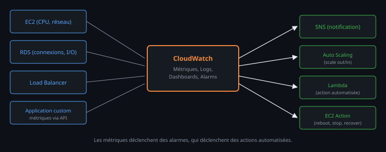

---

### 6.2 Créer une alarme CloudWatch (CLI)

```bash
# 1. Créer une alarme sur la métrique CPU d'une instance EC2
# L'alarme se déclenche si CPU > 80% pendant 2 périodes consécutives (10 min)
aws cloudwatch put-metric-alarm \
  --alarm-name "MonInstance-CPU-Élevé" \
  --alarm-description "Alerte CPU élevé instance EC2" \
  --metric-name CPUUtilization \
  --namespace AWS/EC2 \
  --statistic Average \
  --period 300 \
  --threshold 80 \
  --comparison-operator GreaterThanThreshold \
  --evaluation-periods 2 \
  --dimensions Name=InstanceId,Value=i-12345

# 2. Ajouter une action SNS (envoyer un email)
# D'abord, créer un sujet SNS
aws sns create-topic --name MonTopicAlarmes
# Output : TopicArn: arn:aws:sns:eu-west-1:123456789:MonTopicAlarmes

# S'abonner au sujet (recevoir les notifications)
aws sns subscribe \
  --topic-arn arn:aws:sns:eu-west-1:123456789:MonTopicAlarmes \
  --protocol email \
  --notification-endpoint admin@example.com

# 3. Modifier l'alarme pour envoyer une notification
aws cloudwatch put-metric-alarm \
  --alarm-name "MonInstance-CPU-Élevé" \
  --alarm-description "Alerte CPU élevé instance EC2" \
  --metric-name CPUUtilization \
  --namespace AWS/EC2 \
  --statistic Average \
  --period 300 \
  --threshold 80 \
  --comparison-operator GreaterThanThreshold \
  --evaluation-periods 2 \
  --dimensions Name=InstanceId,Value=i-12345 \
  --alarm-actions arn:aws:sns:eu-west-1:123456789:MonTopicAlarmes

# 4. Lister toutes les alarmes
aws cloudwatch describe-alarms

# 5. Supprimer une alarme
aws cloudwatch delete-alarms --alarm-names "MonInstance-CPU-Élevé"
```

:::success
**Résultat attendu :**
```
# sns create-topic :
{
    "TopicArn": "arn:aws:sns:eu-west-1:123456789012:MonTopicAlarmes"
}

# sns subscribe :
{
    "SubscriptionArn": "pending confirmation"
}
# → Un email est envoyé à admin@example.com avec un lien de confirmation

# put-metric-alarm : (pas de sortie si succès — code HTTP 200)

# describe-alarms (extrait) :
{
    "MetricAlarms": [
        {
            "AlarmName": "MonInstance-CPU-Élevé",
            "AlarmDescription": "Alerte CPU élevé instance EC2",
            "StateValue": "OK",
            "MetricName": "CPUUtilization",
            "Threshold": 80.0,
            "Period": 300,
            "EvaluationPeriods": 2
        }
    ]
}
```
:::

---

### 6.3 Envoyer des métriques custom depuis une application

Applications peuvent envoyer des métriques CloudWatch pour monitorer des KPI métier :

```bash
# Exemple : envoyer une métrique custom "OrdersPerMinute"
aws cloudwatch put-metric-data \
  --namespace "MonApplication" \
  --metric-name "OrdersPerMinute" \
  --value 42 \
  --unit Count \
  --timestamp 2025-03-24T14:30:00Z
```

:::success
**Résultat attendu :**
```
# put-metric-data : pas de sortie si succès (HTTP 200)
# La métrique est visible dans CloudWatch Console sous "MonApplication > OrdersPerMinute"
# après environ 1 minute de délai d'ingestion.
```
:::

```bash
# Ou dans un script Python :
import boto3

cloudwatch = boto3.client('cloudwatch')

# Envoyer une métrique custom
cloudwatch.put_metric_data(
    Namespace='MonApplication',
    MetricData=[
        {
            'MetricName': 'PedidosProcessados',
            'Value': 42,
            'Unit': 'Count',
            'Timestamp': datetime.utcnow()
        }
    ]
)
```

---

### 6.4 Tableaux de bord CloudWatch

CloudWatch permet de créer des **dashboards** personnalisés affichant plusieurs métriques :

```bash
# Créer un dashboard JSON
cat > dashboard.json << 'EOF'
{
  "widgets": [
    {
      "type": "metric",
      "properties": {
        "metrics": [
          [ "AWS/EC2", "CPUUtilization", { "stat": "Average" } ],
          [ ".", "NetworkIn", { "stat": "Sum" } ]
        ],
        "period": 300,
        "stat": "Average",
        "region": "eu-west-1",
        "title": "Métriques EC2"
      }
    }
  ]
}
EOF

# Créer le dashboard
aws cloudwatch put-dashboard \
  --dashboard-name "MonDashboard" \
  --dashboard-body file://dashboard.json
```

:::success
**Résultat attendu :**
```
# put-dashboard :
{
    "DashboardValidationMessages": []
}
# Le tableau de bord "MonDashboard" est maintenant visible dans la console CloudWatch.
# Accès : CloudWatch → Dashboards → MonDashboard
```
:::

> **Référence** : [CloudWatch Documentation](https://docs.aws.amazon.com/cloudwatch/)

---
### 6.5 AWS SDK pour Développeurs — Automatisation Programmatique

Jusque-là, nous avons utilisé la **CLI AWS** pour exécuter des commandes manuellement. Mais les **SDK AWS** permettent d'**intégrer AWS directement dans du code applicatif** (Python, Node.js, Java, Go, etc.).

#### Qu'est-ce que le SDK AWS ?

**SDK** = **kit de développement** fourni par AWS dans plusieurs langages pour interagir avec les services AWS par programmation.

```
Analogie : CLI vs SDK

CLI (AWS CLI)
  ↓
Outil en ligne de commande
Exécute des commandes manuellement ou dans des scripts bash
Exemple : aws ec2 describe-instances

SDK (boto3, SDK.js, SDK.java)
  ↓
Bibliothèque logicielle intégrée dans votre code
Votre application Python/Node/Java appelle AWS directement
Exemple : ec2_client.describe_instances()
```

#### SDK AWS Disponibles

| Langage | Nom SDK | Cas d'usage |
|---------|---------|-----------|
| **Python** | `boto3` | Data science, Lambda, backend | |
| **JavaScript/Node.js** | `AWS SDK for JavaScript` | Applications web, serverless | |
| **Java** | `AWS SDK for Java` | Entreprise, Spring Boot | |
| **Go** | `AWS SDK for Go` | CLI tools, microservices | |
| **C#/.NET** | `AWS SDK for .NET` | Windows, applications d'entreprise | |
| **PHP** | `AWS SDK for PHP** | Applications web, Laravel | |

#### Introduction à boto3 (Python)

**boto3** est la **SDK AWS officielle pour Python**. Elle est utilisée dans :
- Scripts d'automatisation
- Applications Lambda
- Tâches cron de maintenance
- Outils de gestion d'infrastructure

##### Installation de boto3

```bash
# Installer boto3
pip install boto3

# Vérifier l'installation
python3 -c "import boto3; print(boto3.__version__)"
```

:::success
**Résultat attendu :**
```
Collecting boto3
  Downloading boto3-1.34.69-py3-none-any.whl (139 kB)
Successfully installed boto3-1.34.69 botocore-1.34.69 s3transfer-0.10.1
1.34.69
```
:::

##### Exemple 1 : Lister les instances EC2

```python
import boto3

# Créer un client EC2
ec2_client = boto3.client('ec2', region_name='eu-west-3')

# Lister toutes les instances
response = ec2_client.describe_instances()

# Parcourir les instances
for reservation in response['Reservations']:
    for instance in reservation['Instances']:
        instance_id = instance['InstanceId']
        instance_type = instance['InstanceType']
        state = instance['State']['Name']
        
        # Afficher les informations
        print(f"Instance : {instance_id}")
        print(f"  Type : {instance_type}")
        print(f"  État : {state}")
        print()
```

**Résultat :**
```
Instance : i-0123456789abcdef0
  Type : t3.micro
  État : running

Instance : i-0987654321abcdef0
  Type : t3.small
  État : stopped
```

##### Exemple 2 : Créer une snapshot EBS

```python
import boto3

# Créer un client EC2
ec2_client = boto3.client('ec2', region_name='eu-west-3')

# Créer un snapshot du volume vol-12345678
response = ec2_client.create_snapshot(
    VolumeId='vol-12345678',
    Description='Sauvegarde avant migration',
    TagSpecifications=[
        {
            'ResourceType': 'snapshot',
            'Tags': [
                {'Key': 'Name', 'Value': 'backup-migration-2026-03-24'},
                {'Key': 'Environment', 'Value': 'production'}
            ]
        }
    ]
)

# Afficher l'ID du snapshot créé
snapshot_id = response['SnapshotId']
progress = response['Progress']

print(f"Snapshot créé : {snapshot_id}")
print(f"Progression : {progress}")
```

##### Exemple 3 : Arrêter une instance EC2

```python
import boto3

# Créer un client EC2
ec2_client = boto3.client('ec2', region_name='eu-west-3')

# Arrêter une instance
instance_id = 'i-0123456789abcdef0'

response = ec2_client.stop_instances(InstanceIds=[instance_id])

# Vérifier que l'arrêt est en cours
for instance in response['StoppingInstances']:
    print(f"Instance {instance['InstanceId']} est en cours d'arrêt")
    print(f"État précédent : {instance['PreviousState']['Name']}")
    print(f"État courant : {instance['CurrentState']['Name']}")
```

##### Exemple 4 : Créer une alarme CloudWatch

```python
import boto3

# Créer un client CloudWatch
cloudwatch_client = boto3.client('cloudwatch', region_name='eu-west-3')

# Créer une alarme si CPU > 80%
cloudwatch_client.put_metric_alarm(
    AlarmName='CPU-Haute-Production',
    ComparisonOperator='GreaterThanThreshold',
    EvaluationPeriods=2,
    MetricName='CPUUtilization',
    Namespace='AWS/EC2',
    Period=300,  # 5 minutes
    Statistic='Average',
    Threshold=80.0,
    ActionsEnabled=True,
    AlarmActions=['arn:aws:sns:eu-west-3:123456789:AlertesProduction'],
    Dimensions=[
        {
            'Name': 'InstanceId',
            'Value': 'i-0123456789abcdef0'
        }
    ]
)

print("Alarme CloudWatch créée avec succès")
```

#### Bonnes pratiques boto3

```
✓ Utiliser des variables d'environnement ou des profils AWS pour les credentials
✓ Gérer les erreurs avec try/except
✓ Utiliser des context managers ou des sessions boto3
✓ Documenter chaque appel API avec un commentaire
✓ Tester en environnement non-production d'abord
✓ Utiliser des rôles IAM appropriés (pas de clés d'accès root)
```

---


## 7. AWS Well-Architected Framework — Mise en pratique

Le Chapitre 1 a introduit les six piliers du **AWS Well-Architected Framework** (Operational Excellence, Security, Reliability, Performance Efficiency, Cost Optimization, Sustainability) avec leurs bonnes pratiques respectives. Maintenant que vous avez manipulé IAM, S3, EC2, Lambda, RDS, VPC et CloudFormation, vous disposez de tous les services nécessaires pour appliquer concrètement ce framework à un cas réel.

:::info
**Besoin d'un rappel des 6 piliers ?** Retournez au Chapitre 1, section 7 — définitions, questions clés et bonnes pratiques par pilier y sont détaillées.
:::

### 7.1 Cas d'étude : Application "CloudPizza"

Imaginons une application de commande de pizzas. Appliquons les 6 piliers :

| Pilier | Décision | Justification |
|--------|----------|---------------|
| **Operational Excellence** | Déployer via CloudFormation + CI/CD | Répétabilité, traçabilité |
| **Security** | IAM par service, KMS pour BDD, bucket S3 privé | Moindre privilège, conformité |
| **Reliability** | Multi-AZ, ALB, RDS Multi-AZ, snapshots EBS quotidiens | RTO 1h, RPO 1h |
| **Performance** | Lambda + DynamoDB au lieu de serveurs | Scalabilité illimitée automatique |
| **Cost Optimization** | Reserved Instances pour serveurs stables, Spot pour batch | Réduire 40% des coûts |
| **Sustainability** | Déployer en Irlande (énergies renouvelables), Lambda sans serveur | Réduire l'empreinte carbone |

---

### 7.2 Rappel — AWS Compute Optimizer et le pilier Cost Optimization

Le Chapitre 3 a détaillé le fonctionnement d'**AWS Compute Optimizer** (collecte CloudWatch, analyse ML, recommandations chiffrées) — c'est l'outil concret qui alimente le pilier **Cost Optimization** vu ci-dessus : dans le cas CloudPizza, c'est lui qui permettrait de vérifier a posteriori que les Reserved Instances choisies sont bien dimensionnées à l'usage réel.

:::info
**Besoin d'un rappel du fonctionnement de Compute Optimizer ?** Retournez au Chapitre 3, section 7 — commande CLI complète, exemple de sortie JSON et cas concret `t3.large → t3.small` y sont détaillés.
:::

---

## 8. Services complémentaires — Queues et événements

### 8.1 Amazon SQS — File d'attente de messages

**Amazon SQS** (Simple Queue Service) est une **file d'attente de messages** complètement gérée.

**Cas d'usage** : Découpler des composants d'une application.

```
Analogie : SQS est comme une BOÎTE AUX LETTRES

Sans SQS (couplage fort) :
  Producteur (app web) → appelle directement Consommateur (worker)
  Si worker est en panne → producteur attend → demande utilisateur bloquée

Avec SQS (découplage) :
  Producteur → envoie message dans SQS → retour immédiat
  Consommateur → consomme messages quand il est prêt (même en panne, pas de perte)
```

Voici la séquence complète : créer la queue, envoyer un message, le lire, puis le supprimer. La suppression explicite est obligatoire — SQS ne supprime pas automatiquement un message après lecture (pour éviter la perte en cas d'échec).

```bash
# Créer une queue SQS
aws sqs create-queue --queue-name MonQueue

# Envoyer un message
aws sqs send-message \
  --queue-url https://sqs.eu-west-1.amazonaws.com/123456789/MonQueue \
  --message-body "Bonjour depuis CloudFormation"

# Consommer un message (avec delete)
aws sqs receive-message \
  --queue-url https://sqs.eu-west-1.amazonaws.com/123456789/MonQueue \
  --max-number-of-messages 1

# Supprimer le message de la queue
aws sqs delete-message \
  --receipt-handle <receipt-handle>
```

:::success
**Résultat attendu :**
```
# create-queue :
{
    "QueueUrl": "https://sqs.eu-west-1.amazonaws.com/123456789012/MonQueue"
}

# send-message :
{
    "MD5OfMessageBody": "9c7c6f0f3f748bdfa5a5e6e7c8d9e0f1",
    "MessageId": "msg-0abc123def456789a"
}

# receive-message :
{
    "Messages": [
        {
            "MessageId": "msg-0abc123def456789a",
            "ReceiptHandle": "AQEB...longstring...",
            "MD5OfBody": "9c7c6f0f3f748bdfa5a5e6e7c8d9e0f1",
            "Body": "Bonjour depuis CloudFormation"
        }
    ]
}

# delete-message : pas de sortie si succès (HTTP 200)
```
:::

---

### 8.2 Amazon SNS — Notifications pubsub

**Amazon SNS** (Simple Notification Service) est un service de **notifications pub/sub**.

```
Différence SQS vs SNS :
  SQS : 1 producteur → 1 queue → 1 consommateur (FIFO ou parallèle)
  SNS : 1 producteur → N abonnés (email, SMS, SQS, Lambda, HTTP)
```

Voici comment créer un topic SNS, y abonner une adresse email, et publier un message qui sera envoyé à tous les abonnés simultanément :

```bash
# Créer un sujet SNS
aws sns create-topic --name MonTopicAlarmes

# Ajouter un abonnement email
aws sns subscribe \
  --topic-arn arn:aws:sns:eu-west-1:123456789:MonTopicAlarmes \
  --protocol email \
  --notification-endpoint admin@example.com

# Publier un message
aws sns publish \
  --topic-arn arn:aws:sns:eu-west-1:123456789:MonTopicAlarmes \
  --message "Alerte : CPU élevé détecté !"
```

:::success
**Résultat attendu :**
```
# create-topic :
{
    "TopicArn": "arn:aws:sns:eu-west-1:123456789012:MonTopicAlarmes"
}

# subscribe :
{
    "SubscriptionArn": "pending confirmation"
}
# → Un email est envoyé avec un lien de confirmation

# publish :
{
    "MessageId": "pub-0abc123def456789a"
}
# → Tous les abonnés (email, SQS, Lambda) reçoivent le message instantanément
```
:::

> **Référence** : [Amazon SQS](https://docs.aws.amazon.com/sqs/)
> **Référence** : [Amazon SNS](https://docs.aws.amazon.com/sns/)

---

### 8.3 Architectures découplées, microservices et sans serveur

Le schéma suivant rassemble les briques d'une architecture sans serveur orientée événements. L'objectif n'est pas de mémoriser une succession d'icônes : suivez le trajet d'une requête, puis identifiez les points où l'application absorbe un pic, conserve un état ou isole une panne.

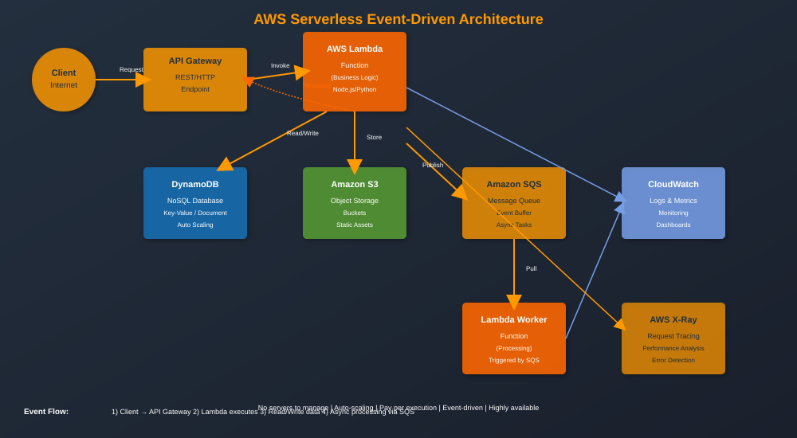

API Gateway reçoit les appels synchrones, tandis qu'une file ou un bus d'événements permet de différer certains traitements. Lambda exécute le code sans serveur à administrer, mais le client reste responsable des permissions IAM, des dépendances, de l'idempotence, des erreurs partielles et du cycle de vie des données.

SQS et SNS résolvent le découplage entre deux composants pris isolément. Une architecture applicative complète va plus loin : elle assemble plusieurs services managés pour qu'aucun composant ne dépende directement de la disponibilité d'un autre, et que chaque brique puisse évoluer, tomber en panne ou être remplacée sans effet domino sur le reste du système. C'est le principe des **microservices** : découper une application monolithique en plusieurs services indépendants, chacun responsable d'une capacité métier précise (paiement, catalogue, notifications), communiquant entre eux par API ou par messages plutôt que par appels de fonction directs en mémoire.

**Couplage fort vs couplage faible — le test décisif**

```
Couplage fort (monolithe classique) :
  Service A appelle directement Service B (HTTP synchrone ou appel de fonction)
  → Si B est lent ou en panne, A attend, se bloque, ou échoue en cascade
  → Faire évoluer B (changer sa techno, sa capacité) impose de coordonner A

Couplage faible (architecture découplée) :
  Service A publie un événement/message, sans savoir qui le consommera
  → B (et C, D…) consomment à leur rythme, indépendamment de la disponibilité de A
  → B peut tomber, redémarrer, ou être remplacé sans qu'A ne le sache
```

Le test décisif pour repérer un couplage fort évitable : si le service producteur doit attendre une réponse synchrone du consommateur pour continuer son propre travail, alors qu'il n'a besoin d'aucune information en retour, c'est un candidat naturel au découplage via SQS ou SNS.

**Amazon API Gateway — le point d'entrée unifié**

Dans une architecture microservices, chaque service pourrait exposer sa propre adresse réseau — mais cela oblige les clients (applications mobiles, sites web, partenaires) à connaître et gérer N adresses différentes, et complique la sécurisation (authentification à répliquer partout). **Amazon API Gateway** résout ce problème en offrant un point d'entrée HTTP unique, qui route chaque requête vers le bon service backend (Lambda, conteneur, serveur EC2) selon l'URL et la méthode appelées.

```
Client mobile/web
       │
       ▼
┌─────────────────┐
│  API Gateway     │  ← authentification centralisée, throttling, cache
│  /users   → Lambda A
│  /orders  → Lambda B
│  /catalog → ECS Fargate
└─────────────────┘
```

API Gateway prend en charge, sans code supplémentaire à écrire dans chaque microservice : l'authentification (intégration IAM, Cognito, ou clé API), la limitation de débit (*throttling*) pour protéger les backends d'un pic de trafic, la mise en cache des réponses, et la transformation de requêtes/réponses (mapping de formats).

```bash
# Créer une API REST
aws apigateway create-rest-api --name "MonAPI-Catalogue"

# Créer une ressource sous la racine
aws apigateway create-resource \
  --rest-api-id <api-id> \
  --parent-id <root-resource-id> \
  --path-part "produits"

# Associer une méthode GET à une fonction Lambda (intégration proxy)
aws apigateway put-integration \
  --rest-api-id <api-id> \
  --resource-id <resource-id> \
  --http-method GET \
  --type AWS_PROXY \
  --integration-http-method POST \
  --uri arn:aws:apigateway:eu-west-1:lambda:path/2015-03-31/functions/arn:aws:lambda:eu-west-1:123456789:function:lister-produits/invocations
```

:::success
**Résultat attendu (create-rest-api) :**
```
{
    "id": "a1b2c3d4e5",
    "name": "MonAPI-Catalogue",
    "createdDate": "2026-07-27T10:00:00Z",
    "apiKeySource": "HEADER",
    "endpointConfiguration": {
        "types": ["EDGE"]
    }
}
```
:::

**AWS Step Functions — orchestrer plusieurs services dans un workflow**

Certains traitements ne se résument pas à un simple message transmis d'un service à l'autre : ils enchaînent plusieurs étapes avec de la logique conditionnelle (si le paiement échoue, annuler la réservation), des étapes parallèles (vérifier le stock et calculer les frais de port en même temps), et des reprises sur erreur. **AWS Step Functions** modélise ce type de workflow sous forme de machine à états (*state machine*), où chaque état est typiquement une fonction Lambda, un appel à un autre service AWS, ou une branche de décision.

```json
{
  "Comment": "Traitement d'une commande e-commerce",
  "StartAt": "VerifierStock",
  "States": {
    "VerifierStock": {
      "Type": "Task",
      "Resource": "arn:aws:lambda:eu-west-1:123456789:function:verifier-stock",
      "Next": "StockDisponible"
    },
    "StockDisponible": {
      "Type": "Choice",
      "Choices": [
        {
          "Variable": "$.stock_ok",
          "BooleanEquals": true,
          "Next": "TraiterPaiement"
        }
      ],
      "Default": "AnnulerCommande"
    },
    "TraiterPaiement": {
      "Type": "Task",
      "Resource": "arn:aws:lambda:eu-west-1:123456789:function:traiter-paiement",
      "Catch": [
        {
          "ErrorEquals": ["PaiementRefuse"],
          "Next": "AnnulerCommande"
        }
      ],
      "Next": "ConfirmerCommande"
    },
    "ConfirmerCommande": {
      "Type": "Task",
      "Resource": "arn:aws:lambda:eu-west-1:123456789:function:confirmer-commande",
      "End": true
    },
    "AnnulerCommande": {
      "Type": "Task",
      "Resource": "arn:aws:lambda:eu-west-1:123456789:function:annuler-commande",
      "End": true
    }
  }
}
```

L'intérêt par rapport à enchaîner ces appels directement dans le code d'une seule fonction Lambda : chaque état est visible, monitorable et rejouable indépendamment dans la console AWS (Step Functions affiche un diagramme visuel de l'exécution, avec l'état exact atteint en cas d'échec) — un débogage bien plus direct qu'une pile d'appels imbriqués dans les logs CloudWatch d'une fonction monolithique.

**Architecture microservices sans serveur complète — exemple**

L'illustration ci-dessous assemble les briques vues dans ce chapitre et les précédents en une architecture microservices sans serveur cohérente pour une application de commande en ligne :

```
                        ┌──────────────┐
   Client (web/mobile) ─▶ API Gateway   │
                        └──────┬───────┘
                               │
              ┌────────────────┼────────────────┐
              ▼                ▼                ▼
        Lambda: Catalogue  Lambda: Commande  Lambda: Compte
              │                │                │
              ▼                ▼                ▼
        DynamoDB          Step Functions    Cognito
        (produits)        (workflow         (utilisateurs)
                            commande)
                               │
                    ┌──────────┴──────────┐
                    ▼                     ▼
                SQS (paiement)      SNS (notifications)
                    │                     │
                    ▼                     ▼
              Lambda: Paiement     Email / SMS client
```

Aucun composant de ce schéma ne connaît directement l'adresse réseau d'un autre composant en amont : le client ne connaît que l'URL d'API Gateway, les Lambdas ne connaissent que les ARN des ressources qu'elles invoquent, et la communication asynchrone (SQS/SNS) élimine toute dépendance temporelle stricte entre le traitement de la commande et l'envoi de la notification. C'est cette absence de dépendance directe qui permet à chaque brique d'être mise à l'échelle, remplacée ou de tomber en panne sans effet domino sur le reste de l'architecture — le principe même du découplage appliqué à l'échelle d'un système complet.

:::warning
**Piège fréquent :** multiplier les microservices sans réel besoin métier augmente la complexité opérationnelle (plus de composants à surveiller, plus de latence réseau entre services, plus de scénarios d'échec partiel à gérer) sans bénéfice proportionnel. Le découpage en microservices se justifie quand des équipes différentes doivent déployer indépendamment, quand des composants ont des besoins de mise à l'échelle très différents (le service de paiement encaisse un pic le vendredi soir, le catalogue reste stable), ou quand la résilience d'un composant ne doit jamais bloquer les autres. Un monolithe bien structuré reste souvent le bon choix pour une application simple ou une petite équipe.
:::

> **Référence** : [Amazon API Gateway](https://docs.aws.amazon.com/apigateway/)
> **Référence** : [AWS Step Functions](https://docs.aws.amazon.com/step-functions/)

---

## 9. Certifications AWS — Objectif SAA-C03

Le Chapitre 1 a présenté les quatre niveaux de certification AWS (Fondamental, Associate, Professional, Specialty) et pourquoi cette formation cible la **Solutions Architect Associate (SAA-C03)**. Maintenant que vous avez vu l'ensemble des services du programme, voici ce qui compte vraiment pour préparer concrètement cet examen : la pondération réelle des domaines testés.

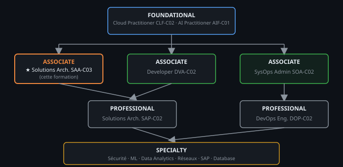

:::info
**Besoin d'un rappel des 4 niveaux de certification ?** Retournez au Chapitre 1, section 1.3.
:::

---

### 9.3 Domaines couverts par la SAA-C03

| Domaine | Pondération |
|---------|-------------|
| Design d'architectures résilientes | 26 % |
| Design d'architectures haute performance | 24 % |
| Design d'architectures sécurisées | 30 % |
| Design d'architectures optimisées en coût | 20 % |

> Les quatre piliers de cette formation correspondent exactement à ces quatre domaines.

---

### 9.4 Certifications spécialisées

Les certifications **Specialty** valident une expertise approfondie sur un domaine précis. Elles nécessitent généralement une expérience pratique significative.

| Specialty | Code | Domaine |
|-----------|------|---------|
| Security | SCS-C02 | IAM, chiffrement, conformité, détection des menaces |
| Machine Learning | MLS-C01 | SageMaker, data pipelines, modèles ML |
| Advanced Networking | ANS-C01 | VPC avancé, Direct Connect, Transit Gateway |
| Data Analytics | DAS-C01 | Redshift, Athena, EMR, Glue, QuickSight |
| Database | DBS-C01 | RDS, DynamoDB, Neptune, ElastiCache |
| SAP on AWS | PAS-C01 | Déploiement SAP sur infrastructure AWS |

Ces codes suivent une logique simple : les deux ou trois premières lettres identifient le domaine (SCS = Security, MLS = Machine Learning, ANS = Advanced Networking, DAS = Data Analytics, DBS = Database, PAS = SAP), et le suffixe `-C0x` numérote la version de l'examen — comme pour SAA-C03 vu plus haut, un chiffre plus élevé signale une version plus récente qui remplace la précédente. Deux services mentionnés dans la colonne Domaine n'ont pas encore été détaillés dans cette formation : **QuickSight** est le service AWS de tableaux de bord et de visualisation de données (BI) qui se branche directement sur Redshift, Athena ou S3 pour construire des graphiques interactifs sans infrastructure à gérer ; **Neptune** est une base de données de graphes managée, pensée pour les données fortement connectées entre elles (réseaux sociaux, moteurs de recommandation, détection de fraude) là où RDS ou DynamoDB modélisent plutôt des tables ou des documents indépendants.

> Pour aller plus loin : [Parcours de certifications AWS](https://aws.amazon.com/certification/) — programme officiel AWS (Solution Architect, Developer, SysOps, DevOps…)

---

## Ressources

### Documentation officielle AWS
- [AWS CloudFormation Documentation](https://docs.aws.amazon.com/cloudformation/)
- [AWS Systems Manager Documentation](https://docs.aws.amazon.com/systems-manager/)
- [AWS Elastic Beanstalk Documentation](https://docs.aws.amazon.com/elasticbeanstalk/)
- [Amazon CloudWatch Documentation](https://docs.aws.amazon.com/cloudwatch/)
- [AWS Well-Architected Framework](https://aws.amazon.com/architecture/well-architected/)
- [AWS Certification](https://aws.amazon.com/certification/)

---

## Quiz interactif du chapitre

Choisissez une ou plusieurs réponses selon la question. La correction expliquée apparaît immédiatement et les propositions changent d’ordre à chaque nouvelle tentative.

<iframe class="quiz-frame" src="../08-quiz-interactifs/quiz-chapitre-5.html" title="Quiz interactif du chapitre 5" loading="lazy"></iframe>
